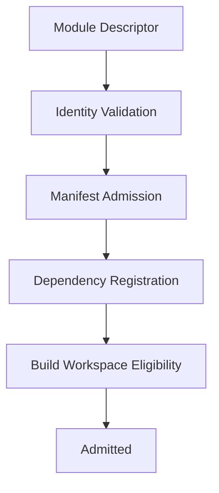
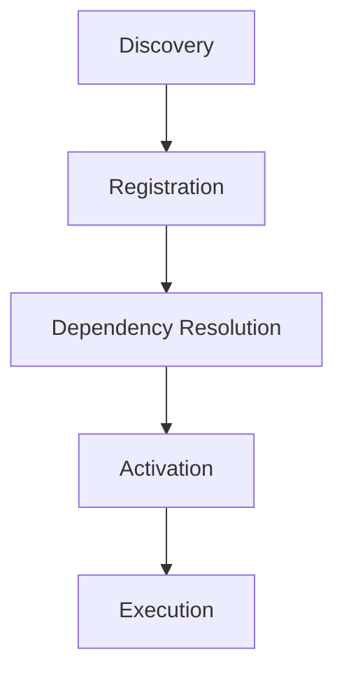
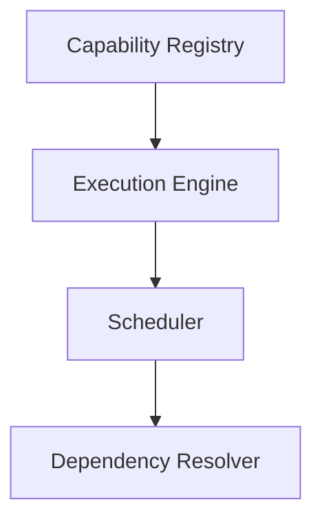
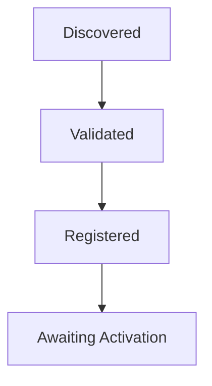

<!--
File: docs/engineering/guides/meg-006-module-platform/04-registration.md
Document: MEG-006
Status: Draft
-->

# Registration

> *Manifest admission happens before build. Runtime registration happens through the SDK registry at startup.*

---

# Purpose

Discovery locates Module manifests, but registration has two distinct meanings in Mosaic. Before build, manifest admission determines whether a selected Module may enter the Build Pipeline; at Runtime startup, Go initialisation calls the Module's registration function and admits it into the SDK registry. Between them, registration establishes identity, ownership, Runtime visibility and lifecycle participation.

These phases must not be confused, because manifest admission is metadata only whereas Runtime registration is code registration only.

---

# Philosophy

Within Mosaic:

> **Modules register through the SDK. Registration must never perform work.**

Registration should establish the Module's metadata and capability declarations, and it should never execute capability logic, start work or perform I/O. The Platform should complete registration before activating capability behaviour.

---

# Build-Time Admission Pipeline

Every selected Module follows the same build-time admission pipeline.



Executable code has still not run, so all the Supervisor now knows is whether the Module may participate in the Build Pipeline.

---

# Runtime Registration Pipeline

The Platform Binary contains the selected Modules as statically linked Go libraries, and because Go only includes packages that are imported, the Build Pipeline generates a single imports file.

```text
generated/
    imports.go
```

Conceptually:

```go
package generated

import (
    _ "github.com/mosaic/module-anilist"
    _ "github.com/mosaic/module-playback"
    _ "github.com/mosaic/module-jellyfin"
)
```

Blank imports trigger each Module package's `init()`, and each Module registers itself with the SDK.

```go
func init() {
    sdk.Register(NewModule())
}
```

The only permitted responsibility of `init()` is registration. The Module definition should expose metadata and capability declarations, for example:

```go
func NewModule() sdk.Module {
    return sdk.Module{
        ID: "anilist",
        Capabilities: ...
    }
}
```

The SDK stores this definition in its runtime registry, where the definition should describe the Module rather than activate it.

---

# Generated Code Boundary

The Build Pipeline should generate exactly one Go integration file.

```text
generated/
    imports.go
```

That file exists only to blank-import selected Modules so Go package initialisation can register them. The Build Pipeline should not generate:

- Module adapters
- Capability Manager code
- provider routing code
- event handlers
- GraphQL resolvers
- business logic

All integration after registration should occur through SDK contracts and Platform-owned managers.

---

# Registration Before Activation

Registration intentionally precedes activation.



A registered Module may still fail dependency resolution, permission validation or compatibility checks, because registration simply makes the Module visible to the SDK registry.

---

# Runtime Admission

Runtime registration admits the Module into the SDK registry: Go `init()` calls `sdk.Register(...)`, and the SDK Registry holds the result. Once registered, the Platform may reason about dependencies, contracts, lifecycle and compatibility without executing the capability.

---

# Identity Registration

Every registered capability must possess a unique identifier, a version and a manifest version.

```yaml
id: metadata
version: 2.1.0
manifest: 1
```

Registration should fail immediately if identity conflicts exist, and identity becomes immutable once registration succeeds.

---

# Registry Population

Registration populates the Capability Registry. Typical information includes:

- identity
- metadata
- dependencies
- permissions
- lifecycle
- configuration schema
- provided contracts
- consumed contracts

The Registry becomes the Runtime's authoritative source of capability information, which is why capability information must not be maintained anywhere else.

---

# Init Is Registration Only

Module `init()` functions must remain registration only. They must not:

- start goroutines
- make HTTP requests
- read configuration
- perform filesystem I/O
- perform network I/O
- start background work

They should only call SDK registration APIs, because activation remains a separate Platform-controlled lifecycle phase.

---

# Duplicate Registration

The Runtime must reject duplicate capability identifiers, because only one capability may own one identifier and two capabilities both registering `metadata` would leave that ownership undecided. Version does not change identity, so identifiers remain globally unique.

---

# Runtime Visibility

Once registered, the capability becomes visible to Runtime Services. Examples include:



Visibility does not imply availability, because activation has not yet occurred.

---

# Registration State

Every capability progresses through a registration lifecycle.



The Capability Registry should expose this state so that operators understand precisely where each capability currently resides.

---

# Dependency Recording

Registration records dependency information.

```yaml
dependencies:
  - playback
  - library
```

The Runtime stores these declarations and resolution occurs later: registration records, resolution evaluates, and the two responsibilities remain intentionally separate.

---

# Contract Registration

Capabilities should register the contracts they provide, and likewise the contracts they consume.

```yaml
provides:
  - MetadataProvider
  - ArtworkProvider
```

```yaml
consumes:
  - BlobStore
  - Scheduler
```

The Runtime now understands both provided services and required services before activation begins.

---

# Event Registration

Capabilities should register Runtime event metadata, declaring both what they publish and what they subscribe to.

```yaml
publishes:
  - MetadataFetched
```

```yaml
subscribes:
  - MediaImported
```

Registration records these relationships, and the Runtime later builds subscription graphs, diagnostics and architecture visualisations from them. No executable code is required.

---

# Permission Registration

Requested permissions should be recorded.

```yaml
permissions:
  - blob.read
  - scheduler.use
```

Permission approval occurs later, so registration simply records requested capabilities. This separation keeps admission distinct from authorisation.

---

# Configuration Registration

Configuration schemas should be registered.

```yaml
configuration:
  refreshInterval:
    type: duration
```

Tooling may immediately use these schemas to validate configuration, generate user interfaces and produce documentation. Again, no executable code is required.

---

# Registration Events

The Runtime may publish Runtime Events describing registration, such as `CapabilityRegistered`, `CapabilityRejected` and `CapabilityUpdated`. These remain Runtime Events and do not represent business behaviour.

---

# Registration Persistence

The Runtime may persist registration metadata. Persisted information might include:

- capability inventory
- versions
- dependency graph
- manifest hashes

Persisted registration accelerates diagnostics and upgrade planning, but it should never replace manifest validation, because the manifest remains authoritative.

---

# Registration Diagnostics

Operators should be able to answer:

- Which capabilities registered?
- Which failed?
- Why?
- Which version?
- Which dependencies?

Registration should therefore remain fully observable, because hidden registration behaviour complicates platform operations.

---

# Registration Independence

Registration should remain independent from dependency resolution, activation, execution and lifecycle callbacks. Each stage owns one concern, and combining them increases Runtime complexity unnecessarily.

---

# Security

Registration should assume that every capability remains untrusted. Registration records metadata; it does not grant execution rights. Execution should occur only after dependency validation, compatibility checks and permission evaluation complete successfully.

---

# Anti-Patterns

The following practices are prohibited.

## Executable Registration

Running capability code during registration. Registration must never perform work, so no capability logic may run before activation.

---

## Implicit Registration

Automatically registering capabilities without validation. A registered Module may still fail dependency resolution, permission validation or compatibility checks.

---

## Registration Side Effects

Registration modifying Runtime behaviour immediately. Registration records metadata and does not grant execution rights.

---

## Duplicate Registries

Maintaining capability information outside the Capability Registry, which is the Runtime's authoritative source of capability information.

---

## Runtime Mutation

Registration changing Runtime Services directly. Registration should establish metadata and capability declarations, never perform I/O or start work.

---

## Coupled Registration

Combining registration, activation and execution into one Runtime phase. Each stage owns one concern, and combining them increases Runtime complexity unnecessarily.

---

# Mosaic Guidelines

Within Mosaic:

- Registration must remain metadata driven.
- Registration must populate the Capability Registry.
- Registration must not execute capability code.
- Capability identifiers must remain globally unique.
- Registration should record dependencies, permissions and contracts.
- Registration should remain observable.
- Registration must precede activation.
- Registration must treat capabilities as untrusted until later validation stages.

---

# Relationship to MEG

Discovery answers:

> **What capabilities exist?**

Registration answers:

> **Which capabilities belong to this Runtime?**

The next chapter introduces **Dependency Resolution**, where the Runtime transforms registered capabilities into a validated capability graph ready for activation.

---

# Summary

Registration is the Runtime's admission process, and it transforms discovered metadata into recognised Runtime participants without executing a single line of capability code. By separating discovery, registration, dependency resolution, activation and execution, the Mosaic Runtime gains a predictable, observable and secure capability lifecycle that scales naturally as the platform grows.
