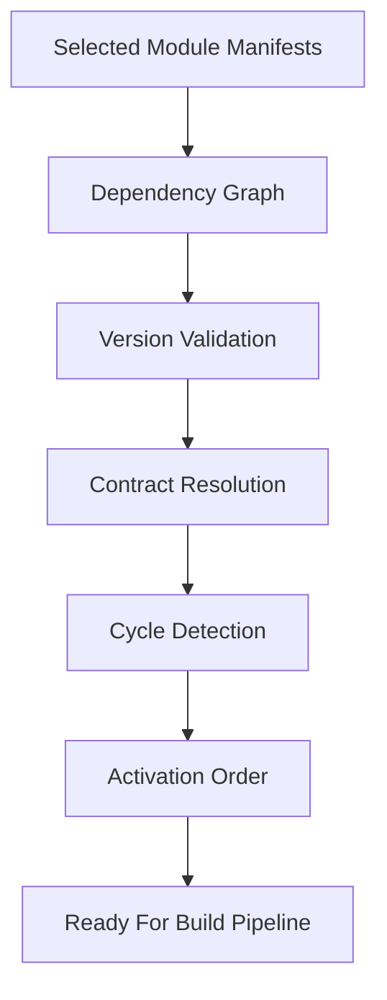
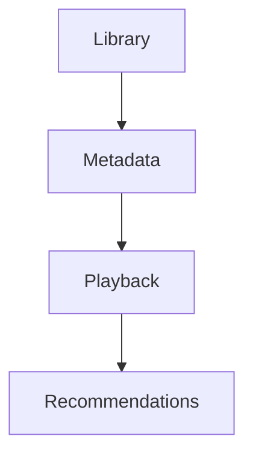
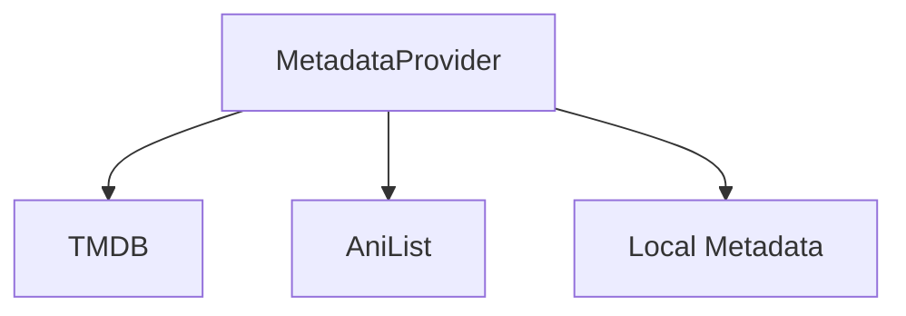
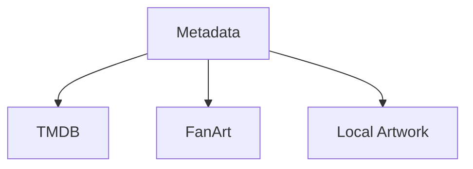
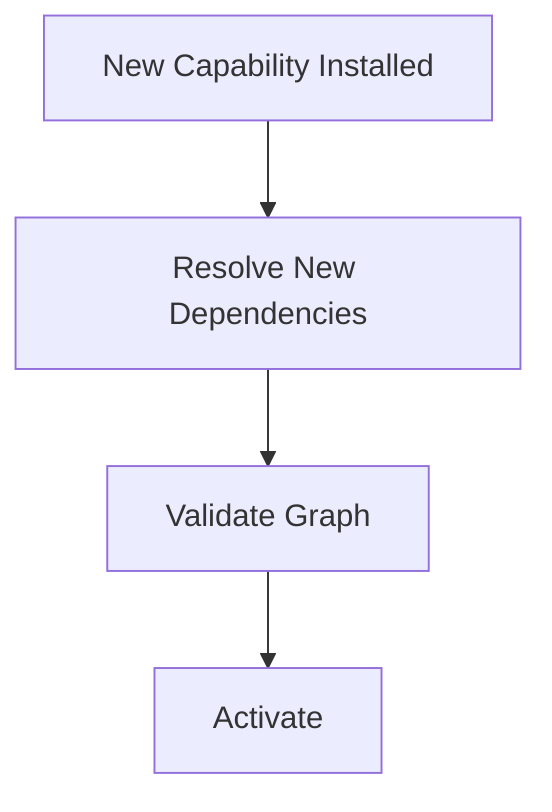

<!--
File: docs/engineering/guides/meg-006-module-platform/05-dependency-resolution.md
Document: MEG-006
Status: Draft
-->

# Dependency Resolution

> *Registration records dependencies. Dependency Resolution determines whether the platform can actually exist.*

---

# Purpose

After manifest discovery and build-time admission the Supervisor possesses a complete catalogue of selected Modules, but knowing which capabilities exist is not the same as knowing that they can run together. The Supervisor must still determine whether:

- required capabilities exist
- versions are compatible
- contracts are satisfied
- dependency cycles are absent
- activation is possible

This process is known as **Dependency Resolution**. It transforms a collection of selected Module manifests into a coherent Platform package plan, which is the artefact the Build Pipeline is given.

---

# Philosophy

Within Mosaic:

> **The Supervisor should reject an invalid Module set before invoking the Build Pipeline.**

Capability execution should never begin while dependency uncertainty exists. Validation belongs before activation rather than during it, which is why an invalid Module set is rejected while it is still only a set of manifests.

---

# Dependency Resolution Pipeline

Every Generation preparation follows the same dependency pipeline. It carries the selected Module manifests through graph construction, version validation, contract resolution, cycle detection and activation ordering before anything is handed to the Build Pipeline.



Executable Module code has still not run at any point in this pipeline. By the end of it the Supervisor nevertheless knows whether the selected Module set is architecturally valid, which is the whole purpose of performing the work from metadata alone.

---

# Why Dependency Resolution Exists

Suppose Recommendations depends upon Playback, and Playback in turn depends upon Metadata. If Metadata is missing, the Runtime should reject the platform outright rather than admit Recommendations and allow the gap to surface later as a Runtime Failure. Dependency failures should be detected during startup, not during execution, because a failure discovered at startup costs an aborted launch whereas the same failure discovered later costs a running platform.

---

# Required Dependencies

Every required dependency must exist, so a manifest that declares one commits the Supervisor to finding a compatible provider for it:

```yaml
dependencies:

  playback: ">=2.0.0"

  metadata: "^1.5.0"
```

Missing required dependencies must prevent activation. The Runtime should fail fast rather than begin assembling a platform it cannot complete.

---

# Optional Dependencies

Optional dependencies are declared separately precisely because they do not prevent activation:

```yaml
optionalDependencies:

  machine-learning: "^1.0.0"
```

If the optional dependency is present, additional functionality becomes available; if it is absent, the capability continues operating in a reduced form. The Runtime should therefore distinguish clearly between required and optional dependencies, since only the first kind can block a platform from existing.

---

# Version Resolution

The Runtime must validate version compatibility, not merely the presence of a name. If Metadata requires Playback `>=2.0.0` and the installed Playback is `1.8.0`, activation fails. Version incompatibility should never be discovered during execution.

---

# Contract Resolution

Capabilities declare the contracts they provide:

```yaml
provides:

  - MetadataProvider
```

and the contracts they consume:

```yaml
consumes:

  - MetadataProvider
```

The Runtime resolves these declarations against one another, and every required contract must be satisfied before activation. Capabilities should therefore depend upon contracts rather than upon implementations, which is what allows the provider behind a contract to change without disturbing its consumers.

---

# Capability Graph

Dependency Resolution constructs a Capability Graph from the resolved declarations.



This graph becomes the authoritative model for:

- activation
- startup
- shutdown
- diagnostics

It is distinct from the Runtime Dependency Graph defined in [MEG-005](../meg-005-runtime-architecture/index.md). The Runtime Graph describes Runtime Services, whereas the Capability Graph describes platform capabilities.

---

# Cycle Detection

The Capability Graph must remain acyclic. A valid graph runs from Library through Metadata to Recommendations and terminates, whereas an invalid one lets Metadata reach Recommendations and Recommendations lead back to Metadata, leaving no capability that can be activated first. Circular capability dependencies should therefore prevent activation.

Dependency resolution commonly relies on topological sorting with cycle detection to ensure modules load only after their dependencies are satisfied.  [Hexdocs](https://hexdocs.pm/raxol_core/Raxol.Core.Runtime.Plugins.DependencyResolver.html)

---

# Topological Ordering

Once the graph is validated, the Runtime performs a topological sort over it and activation follows the resulting ordering automatically. No manually maintained activation order should exist, because the dependency graph is authoritative and a hand-written list would only be a second copy of it that could drift.

---

# Dependency States

Each dependency relationship should resolve to exactly one state, and that state decides whether resolution can proceed:

- Satisfied
- Optional Missing
- Missing
- Version Conflict
- Cycle Detected

Only Satisfied and Optional Missing allow activation to continue.

---

# Multiple Providers

A contract may have more than one provider, as when MetadataProvider is offered simultaneously by TMDB, AniList and Local Metadata.



Selection policy belongs to Runtime configuration, so Dependency Resolution simply verifies that at least one compatible provider exists. Resolution should remain deterministic.

---

# Conflicts

Capabilities may declare conflicts as well as dependencies, which lets a manifest state what it cannot coexist with:

```yaml
conflicts:

  - legacy-metadata
```

Conflicting capabilities should not activate simultaneously. The Runtime should therefore reject incompatible platform configurations before execution begins, on the same grounds that it rejects unsatisfied dependencies.

Modern module systems often validate both dependency and conflict declarations before computing load order.  [Hexdocs](https://hexdocs.pm/raxol_core/Raxol.Core.Runtime.Plugins.DependencyResolver.html)

---

# Capability Groups

The Runtime may support grouped capabilities, so that Metadata can present TMDB, FanArt and Local Artwork as a single unit.



The group activates only if all required internal dependencies are satisfied. Grouping remains a Runtime convenience rather than a versioning boundary, and the individual capabilities within a group remain independently versioned.

---

# Incremental Resolution

The Runtime should support incremental dependency resolution, so that installing a new capability resolves only that capability's dependencies before the graph is revalidated and activation proceeds.



The Runtime should avoid rebuilding the entire platform graph unnecessarily. Only the affected portions of the graph require re-evaluation, and the validation rules applied to them are the same ones applied at startup.

Incremental dependency resolution is a common optimisation for module platforms that support runtime installation.  [Hexdocs](https://hexdocs.pm/raxol_core/Raxol.Core.Runtime.Plugins.DependencyResolver.html)

---

# Failure Reporting

Dependency failures should be explicit about what was expected and what was found. A missing dependency should name the requirement that could not be met, such as `metadata >=2.0.0`, and a version conflict should name both the constraint and the version present, such as `playback ^3.0.0` against `installed 2.7.0`. Operators should immediately understand:

- what failed
- why
- which capability caused it

Hidden dependency failures complicate operations. An operator who cannot see which capability caused a rejection cannot correct the Module set that produced it.

---

# Diagnostics

The Runtime should expose:

- resolved dependency graph
- activation order
- optional dependencies
- missing dependencies
- version conflicts
- contract providers

Dependency Resolution should become a first-class diagnostic capability rather than an internal step whose conclusions the operator has to infer.

---

# Runtime Behaviour

Dependency Resolution belongs exclusively to startup and capability installation, which are the only points at which the platform composition is still open to change. Capabilities should never:

- resolve dependencies
- locate providers
- negotiate versions

Those responsibilities belong entirely to the Runtime. A capability that performed any of them would be making composition decisions after the Supervisor had already validated the platform, which is precisely the uncertainty Dependency Resolution exists to remove.

---

# Security

Dependency Resolution should occur before permission evaluation, so the two questions are answered in sequence rather than together. The Runtime should first determine:

> **Can this platform exist?**

Only afterwards should it determine:

> **May these capabilities execute?**

Each stage owns one concern.

---

# Anti-Patterns

The following practices are prohibited.

## Runtime Discovery

Capabilities searching for dependencies during execution. This defers to run time a question the Supervisor should have settled before the Build Pipeline was invoked.

---

## Manual Activation Order

Hard-coded capability startup ordering. This duplicates the ordering the graph already determines, and the copy drifts as capabilities change.

---

## Silent Version Downgrade

Automatically accepting incompatible versions. This turns a startup failure into an execution failure without informing the operator.

---

## Circular Dependencies

Capability dependency cycles. A cycle leaves no valid activation order for the Runtime to derive from the graph.

---

## Hidden Contracts

Capabilities depending upon undeclared Runtime contracts. An undeclared contract is invisible to resolution and therefore cannot be validated before activation.

---

## Runtime Guessing

The Runtime selecting arbitrary providers without deterministic rules. Provider choice belongs to Runtime configuration, so an arbitrary selection makes the resulting platform unpredictable.

---

# Mosaic Guidelines

Within Mosaic:

- Every required dependency must be satisfied before activation.
- Version compatibility must be validated.
- Contract providers must be resolved explicitly.
- Capability graphs must remain acyclic.
- Activation order must be derived from the graph.
- Optional dependencies must remain explicitly identified.
- Dependency failures must remain observable.
- Dependency Resolution must complete before activation begins.

---

# Relationship to MEG

Registration answers:

> **Which capabilities belong to this Runtime?**

Dependency Resolution answers:

> **Can those capabilities operate together?**

The next chapter introduces **Activation**, where a validated capability graph becomes a living part of the Runtime and begins participating in platform execution.

---

# Summary

Dependency Resolution is the Runtime's architectural gatekeeper. It ensures that every capability entering execution does so within a platform that is:

- complete
- compatible
- deterministic
- internally consistent

By validating the platform before executing it, the Mosaic Runtime avoids an entire class of operational failures and preserves one of its governing principles:

> **The Runtime should understand the platform completely before it begins executing it.**
