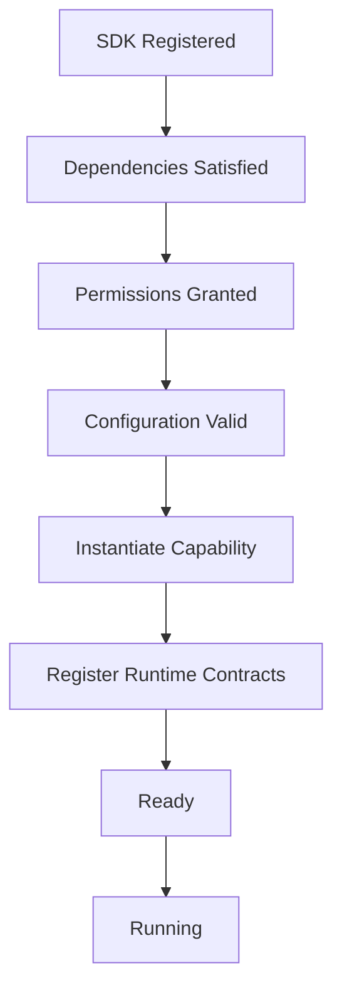
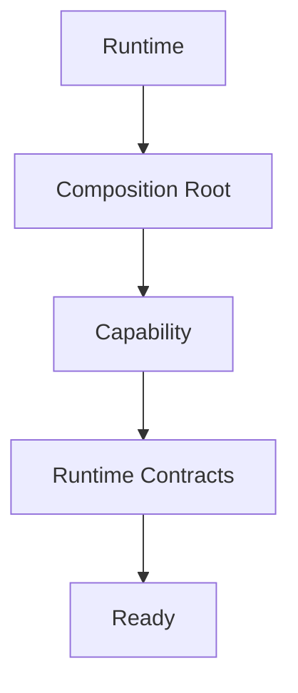
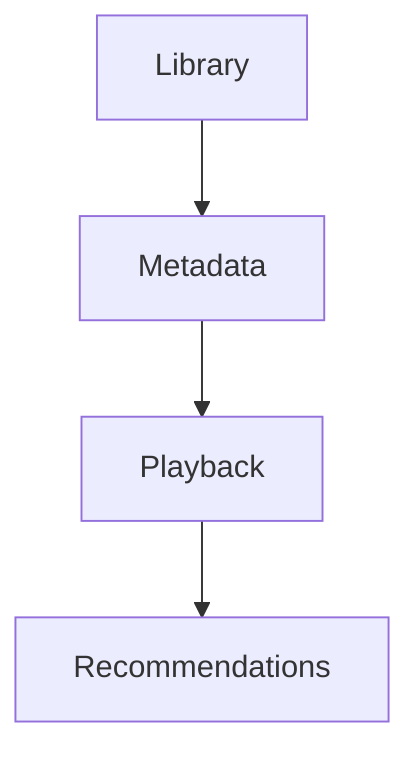
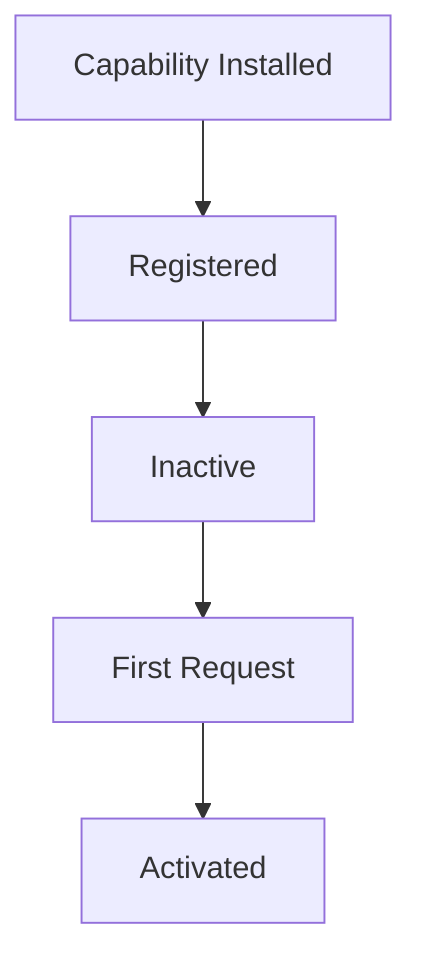
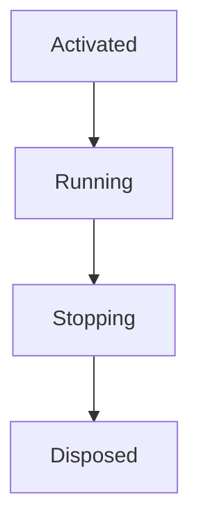

<!--
File: docs/engineering/guides/meg-006-module-platform/06-activation.md
Document: MEG-006
Status: Draft
-->

# Activation

> *A registered capability exists. An activated capability participates.*

---

# Purpose

By the time a capability reaches activation it has already passed through:

- discovery
- build-time admission
- dependency resolution
- Platform package build
- Runtime registration

so the Runtime possesses a validated capability graph. What it does not yet possess is a running platform, because no executable capability has joined the Runtime. Activation is the controlled transition from a Registered Module Capability to an Operational Capability, and it is therefore the moment a capability becomes part of the live platform.

---

# Philosophy

Within Mosaic:

> **Activation is deliberate. It is never implicit.**

Capabilities should activate only when:

- dependencies are satisfied
- permissions are approved
- configuration is valid
- Runtime resources are available

Activation should never occur simply because Module code was statically linked. Linking establishes that code is present, not that the platform is ready to run it.

---

# Activation Pipeline

Every capability follows the same activation sequence, from its registration through the SDK to the point at which it is running.



Activation is the first stage where executable code participates. Everything beforehand is metadata driven, so activation is also the first point at which a capability can fail for reasons the manifest could not have shown.

---

# Why Activation Exists

Without activation a capability would simply execute immediately, and the Runtime would lose the opportunity to:

- validate
- observe
- reject
- coordinate

Instead a capability reaches the operational Runtime only by passing through activation. That single controlled entry point is what keeps the Runtime in control of platform composition.

---

# Activation Is Runtime Controlled

Capabilities should never activate themselves. The poor form is a capability that starts work from package initialisation:

```go
func init() {

    start()

}
```

The preferred form leaves the decision with the Runtime, which activates the capability and only then treats it as ready. Lifecycle ownership belongs entirely to the Runtime: capabilities participate in that lifecycle, but they do not control it.

---

# Activation Prerequisites

Before activation begins, the Runtime must verify:

- registration completed
- dependency graph resolved
- version compatibility satisfied
- permissions approved
- configuration validated

If any prerequisite fails, activation must not begin at all. Failing capabilities should remain inactive rather than partially operational, because a partially operational capability is one the Runtime can neither rely upon nor cleanly remove.

---

# Capability Construction

Activation is responsible for constructing the capability instance, which the Runtime does through the Composition Root before injecting Runtime Contracts and marking the capability ready.



Construction should occur only once. Repeated activation should create a new capability instance only after a complete deactivation cycle.

---

# Runtime Contracts

During activation the Runtime provides:

- scheduler access
- execution services
- configuration
- observability
- lifecycle notifications

Capabilities receive these Runtime contracts through dependency injection. They should never discover Runtime Services dynamically.

---

# Lifecycle Hooks

Capabilities may expose lifecycle hooks.

```text
Initialise()

Start()

Stop()

Dispose()
```

These hooks belong to capability lifecycle, so they should not perform registration or dependency resolution. The Runtime already completed those phases, which leaves the capability free simply to prepare itself to execute.

---

# Readiness

Activation should distinguish between a capability that is Initialised and one that is Ready. A capability becomes Ready only after:

- resources allocated
- Runtime contracts injected
- internal initialisation completed

Only then may the Runtime dispatch work to it.

Separating activation from readiness avoids dispatching work before a capability has completed its own initialisation.  [DeepWiki](https://deepwiki.com/antfu/vscode-open-in-github-button/2.1-module-lifecycle-and-activation)

---

# Activation Order

Activation follows the validated Capability Graph rather than any independently maintained sequence.



Given that graph the Runtime should never activate Recommendations before Playback, because dependency order remains authoritative.

---

# Parallel Activation

Independent capabilities should activate concurrently, so Playback and Authentication may activate simultaneously where no dependency exists between them. Parallel activation should never violate dependency ordering.

---

# Activation Failure

Suppose a capability fails during activation. The Runtime should:

- report the failure
- release allocated resources
- mark capability unavailable
- continue only if platform integrity remains intact

Activation should never leave partially initialised capabilities inside the Runtime, since the resources they hold and the contracts they registered would outlive the failure that stopped them.

---

# Partial Platform Activation

The Runtime may continue operating when optional capabilities fail activation. If the Recommendation Capability meets an activation failure, for example, the platform may continue providing:

- playback
- metadata
- libraries

Critical capability failures, however, should prevent Runtime startup, and capability criticality should be declared within the manifest so the Runtime can tell the two cases apart.

---

# Activation Events

The Runtime may publish Runtime Events as capabilities activate, including CapabilityActivating, CapabilityActivated and CapabilityActivationFailed. These events improve observability, but they do not represent business behaviour.

---

# Runtime Visibility

Operators should be able to answer:

- Which capabilities are active?
- Which failed activation?
- Why?
- Which dependencies blocked activation?

Activation should remain completely observable, because hidden activation behaviour complicates operations.

---

# Lazy Activation

The Runtime may support lazy activation, leaving an installed and registered capability inactive until a first request arrives.



Lazy activation should remain an explicit Runtime policy, and capabilities should not determine their own activation strategy.

---

# Activation And Modules

Built-in and third-party capabilities activate identically, so a Built-In Capability and a Module Capability follow the same path into activation. The Runtime should not distinguish between them, because architectural equality remains one of the defining principles of the platform.

---

# Deactivation

Activation always implies the possibility of deactivation, and an activated capability moves on through running, stopping and disposal.



Every activated capability should support a graceful lifecycle, and future chapters define that lifecycle behaviour in greater detail.

---

# Security

Activation should occur only after:

- permission approval
- dependency validation
- configuration validation

Execution should never begin before these Runtime guarantees have been satisfied, because trust should be established before activation rather than afterwards.

---

# Anti-Patterns

The following practices are prohibited.

## Self Activation

Capabilities activating themselves, which removes the Runtime's control over platform composition.

---

## Hidden Initialisation

Background work beginning during object construction, which starts execution before the Runtime has marked the capability ready.

---

## Activation Before Validation

Executing capability code before dependency or permission checks, which reverses the order the prerequisites exist to enforce.

---

## Partial Activation

Leaving half-initialised capabilities registered, so the Runtime holds a capability it can neither dispatch work to nor account for.

---

## Runtime Discovery During Activation

Capabilities dynamically searching for Runtime Services rather than receiving them by injection.

---

## Business Behaviour During Activation

Executing business workflows as part of capability startup. Activation prepares the capability; it does not perform business work.

---

# Mosaic Guidelines

Within Mosaic:

- Activation must remain Runtime controlled.
- Activation must follow successful dependency resolution.
- Runtime contracts must be injected during activation.
- Capabilities must become ready before receiving work.
- Activation should remain observable.
- Independent capabilities should activate concurrently where safe.
- Activation failures must leave the Runtime in a consistent state.
- Built-in and module-delivered capabilities must activate identically.

---

# Relationship to MEG

Dependency Resolution answers:

> **Can this capability participate?**

Activation answers:

> **Make this capability operational.**

The next chapter introduces the **Module Lifecycle**, describing how capabilities evolve through installation, activation, execution, upgrade, deactivation and eventual removal while remaining first-class Runtime participants.

---

# Summary

Activation is the bridge between architecture and execution. It transforms a validated capability into a live participant within the Runtime while preserving:

- dependency correctness
- Runtime stability
- operational visibility
- architectural consistency

Within Mosaic, activation should never be surprising. Every capability should become operational through the same deterministic, observable process regardless of whether it originated from the Platform distribution or from a third-party module.
