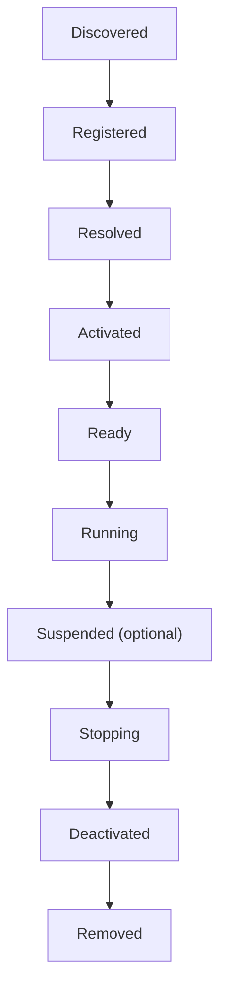
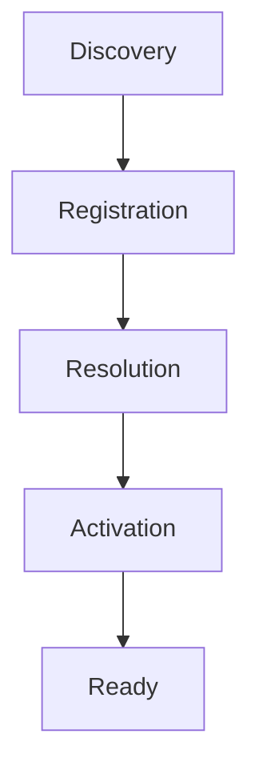
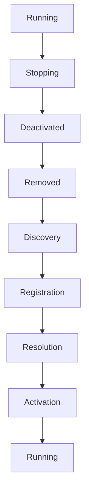

<!--
File: docs/engineering/guides/meg-006-module-platform/07-module-lifecycle.md
Document: MEG-006
Status: Draft
-->

# Module Lifecycle

> *A module is not simply linked. It participates in the lifecycle of the platform.*

---

# Purpose

A module does not merely exist. Throughout its lifetime it is discovered, registered, activated, executed, upgraded, deactivated and removed, and the Runtime must coordinate those transitions consistently. Every module, whether supplied by the Platform distribution or by a third party, should follow exactly the same lifecycle, because a capability whose lifecycle depends on its origin cannot be operated predictably. This document defines the canonical Module Lifecycle within the Mosaic platform.

---

# Philosophy

Within Mosaic:

> **Modules participate in the Runtime. They never control it.**

The Runtime owns lifecycle, ordering, activation and deactivation. Modules respond to those decisions, and they never initiate lifecycle transitions themselves.

---

# Module Lifecycle States

Every module progresses through the same lifecycle, and every stage within it carries exactly one responsibility.

Because the set of stages is fixed, the Runtime should never invent module-specific lifecycle stages.

---

# Discovery

The Supervisor discovers manifests, metadata and contracts. No executable code has been included in a Platform package at this point, so the module remains unknown except for its manifest. Discovery therefore answers a single question:

> **What exists?**

---

# Registration

Registration admits the statically linked module into the SDK registry, after which the Platform knows its identity, version, dependencies, permissions and contracts. The module still performs no work, because registration decides membership rather than execution:

> **Should this capability become part of this Runtime?**

---

# Resolution

Dependency Resolution validates required capabilities, optional capabilities, contracts, versions and the dependency graph, and only modules whose requirements are fully satisfied may proceed. Resolution answers:

> **Can this capability execute safely?**

---

# Activation

Activation constructs the module through dependency injection, Runtime contracts, configuration and lifecycle callbacks. It prepares the module, but it does not yet process Runtime work.

---

# Ready

A Ready module has completed construction, initialisation and dependency injection, which means the Runtime may now dispatch work to it. Readiness is intentionally distinct from activation, because a module may activate successfully yet still require asynchronous preparation before becoming operational. Separating activation from readiness is a common lifecycle pattern in extensible platforms because it prevents work from being dispatched before initialisation has completed.  [Visual Studio Code](https://code.visualstudio.com/api/references/activation-events)

---

# Running

Running is the steady operational state, in which the module receives Runtime Events, executes capability operations, participates in scheduling, exposes health and publishes metrics. Most modules remain in this state for the majority of their lifetime.

---

# Suspension

The Runtime may support suspension, moving a module out of Running into a Suspended state and later back to Running again. Suspension differs from deactivation: the module remains registered and activated, but temporarily receives no Runtime work. Possible reasons include administrator action, maintenance, resource conservation and dependency degradation. Because registration and activation both survive it, suspension should remain reversible.

---

# Stopping

Stopping begins graceful shutdown, and the Runtime notifies the module that it should take no new work and finish the work it already holds. Modules should therefore release temporary resources, complete active work and stop accepting new Runtime requests. Business correctness should remain the highest priority throughout.

---

# Deactivation

Once all work has completed the module moves from Running to Deactivated, and the Runtime removes Runtime contracts, unregisters handlers and disposes internal resources. From that point the module should no longer participate in execution.

---

# Removal

Removal occurs only after deactivation, taking the module from Deactivated to Removed and deleting it from the Runtime, and the Capability Registry should update accordingly. Removed modules no longer participate in discovery, execution or scheduling, so future participation requires rediscovery.

---

# Runtime Ownership

The Runtime owns every lifecycle transition, which means modules should never activate themselves, suspend themselves, remove themselves or restart themselves. The Runtime remains the sole lifecycle authority.

---

# Lifecycle Events

The Runtime may publish lifecycle events such as `ModuleActivated`, `ModuleReady`, `ModuleSuspended`, `ModuleStopped` and `ModuleRemoved`. These are Runtime Events: they improve observability, but they do not represent business behaviour.

---

# Runtime Visibility

Operators should always be able to determine the current lifecycle stage, activation duration, readiness status, shutdown progress and failure reason. Lifecycle should therefore remain fully observable, because hidden lifecycle transitions complicate platform operations.

---

# Activation Failure

Suppose activation fails. The Runtime should then dispose partially constructed state, release resources, mark the module unavailable and report diagnostics, because partial activation must never remain inside the Runtime.

---

# Runtime Restart

Following a Runtime restart the sequence replays in full from the beginning.

Modules should therefore never assume previous process state, cached objects or surviving goroutines, because every Runtime start should produce a clean lifecycle.

---

# Upgrade Lifecycle

Capability upgrades should remain lifecycle driven, which means the running capability is stopped, deactivated and removed before its replacement is discovered, registered, resolved and activated in turn.

The Runtime should never hot-swap executable capability code inside a running capability instance, so replacing a capability should always occur through a controlled lifecycle transition.

---

# Failure Isolation

Suppose the Metadata Module reaches a failure state. The Runtime should ensure that Playback carries on Running regardless, because module lifecycle failures should never destabilise unrelated capabilities. Isolation therefore remains a Runtime responsibility rather than a module one.

---

# Resource Ownership

Modules own their internal resources, temporary allocations and internal caches, whereas the Runtime owns lifecycle, execution, scheduling and workers. Ownership determines cleanup responsibility.

---

# Testing

Module lifecycle behaviour should be tested across activation, readiness, suspension, shutdown, restart and removal. Lifecycle behaviour should remain deterministic, so testing should verify transitions rather than implementation.

---

# Anti-Patterns

The following practices are prohibited.

## Self Activation

Modules activating themselves, taking lifecycle authority from the Runtime.

---

## Background Startup

Beginning Runtime work before Ready, and therefore before initialisation has completed.

---

## Ignoring Shutdown

Continuing execution after Stopping.

---

## Partial Removal

Leaving Runtime registrations after removal, so the Capability Registry no longer reflects what the Runtime contains.

---

## Hidden Lifecycle

Lifecycle transitions occurring without Runtime visibility.

---

## Business Behaviour During Activation

Executing business workflows before the Runtime declares the module Ready.

---

# Mosaic Guidelines

Within Mosaic:

- Every module must follow the canonical lifecycle.
- The Runtime must own lifecycle transitions.
- Activation must precede readiness.
- Readiness must precede execution.
- Suspension should remain reversible.
- Shutdown must remain graceful.
- Removal must follow deactivation.
- Lifecycle must remain observable.
- Module failures must remain isolated.

---

# Relationship to MEG

Activation answers:

> **How does a capability become operational?**

The Module Lifecycle answers:

> **How does that capability participate throughout its lifetime?**

The next chapter introduces the **Module SDK**, defining the contracts, APIs and development model through which module authors build capabilities for the Mosaic platform.

---

# Summary

A module should never simply:

> **Load.**

It should instead become a recognised participant within the Runtime through a deterministic lifecycle owned entirely by the platform. Within Mosaic, lifecycle consistency ensures that every capability, regardless of its origin, behaves predictably throughout installation, execution, upgrade and removal, and that consistency is one of the defining characteristics of a mature capability platform.
