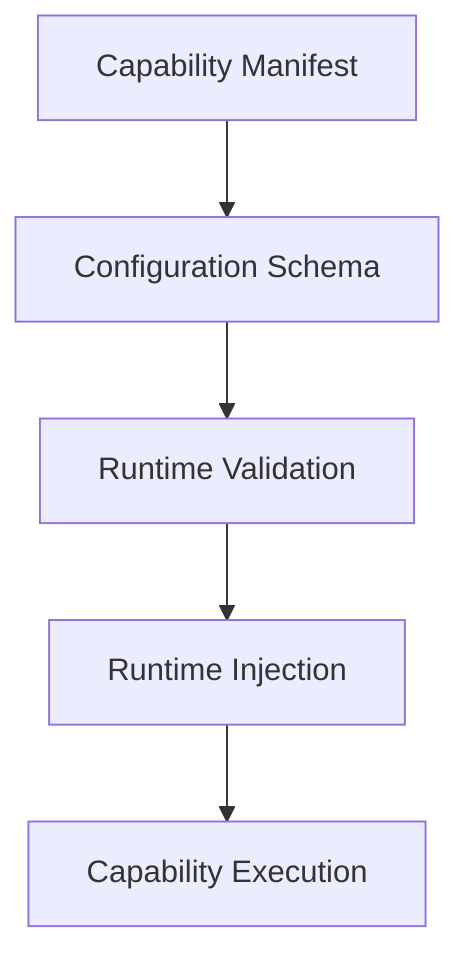
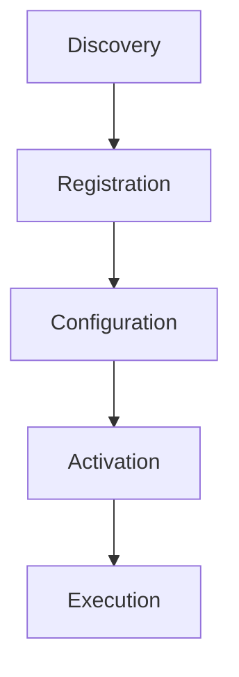
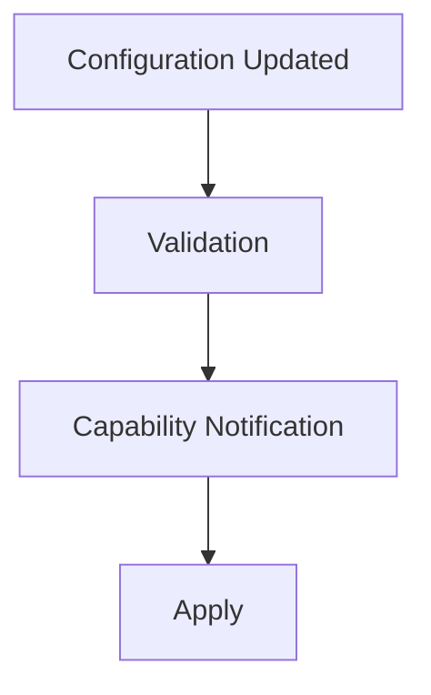

<!--
File: docs/engineering/guides/meg-006-module-platform/10-configuration.md
Document: MEG-006
Status: Draft
-->

# Configuration

> *Capabilities should declare what they need. The Runtime should decide how that configuration is provided.*

---

# Purpose

Every capability requires configuration: API credentials, refresh intervals, feature flags, provider selection, storage locations and execution limits. None of that obliges the capability to concern itself with configuration files, environment variables, databases or secrets management, because those are Runtime responsibilities. This document defines how capabilities declare, receive and consume configuration within the Mosaic platform.

---

# Philosophy

Within Mosaic:

> **Capabilities define configuration. The Runtime supplies configuration.**

The capability declares:

> **What configuration exists.**

The Runtime determines:

> **Where it comes from.**

This separation protects capabilities from deployment concerns.

---

# Configuration Model

Configuration follows a simple lifecycle that begins in the manifest and ends at execution. Because the Runtime performs validation and injection between those two points, the capability never reads configuration directly from external sources.



---

# Configuration Before Execution

Configuration must be validated before activation, so a capability should never begin execution with invalid configuration. Validation sits between registration and activation, which means an invalid value fails fast rather than later.



---

# Configuration Schema

Every capability should define its configuration schema, as in the following example.

```yaml
configuration:
  provider:
    type: string
    required: true
  refreshInterval:
    type: duration
    default: 24h
  language:
    type: string
    default: en
```

The schema becomes part of the capability manifest, which makes it contract rather than implementation. Schema-first configuration is a common approach because it allows validation before components begin execution. ([json-schema.org](https://json-schema.org/))

---

# Configuration Ownership

Configuration ownership is intentionally divided. The capability owns the schema, the defaults and the meaning of each value, whereas the Runtime owns storage, validation, injection and lifecycle. Neither should assume the responsibilities of the other.

---

# Configuration Sources

The Runtime may assemble configuration from multiple sources, layered in order: system defaults, capability defaults, a configuration file, environment variables, a secrets manager and administrative overrides. The Runtime owns precedence between them, and capabilities simply consume the final validated configuration.

---

# Runtime Injection

Capabilities receive configuration through the SDK.

```go
cfg := ctx.Configuration()
```

The capability should not know whether that configuration originated from YAML, JSON, PostgreSQL, Vault, Kubernetes or Docker, because configuration origin remains an infrastructure concern.

---

# Typed Configuration

Configuration should be strongly typed. Rather than indexing an untyped map, which is the poor form:

```go
cfg["refreshInterval"]
```

a capability should read a named field, which is preferred:

```go
cfg.RefreshInterval
```

Strong typing improves readability, validation, tooling and refactoring, so the Runtime should transform raw configuration into typed capability configuration before injection.

---

# Default Values

Capabilities may declare defaults within the schema.

```yaml
refreshInterval:
  default: 24h
```

The Runtime applies defaults before validation completes, and a default should represent sensible operational behaviour rather than a placeholder.

---

# Required Configuration

Capabilities should explicitly identify required configuration.

```yaml
tmdbApiKey:
  required: true
```

If required configuration is missing then activation must fail, because capabilities should never attempt to execute without mandatory configuration.

---

# Secrets

Sensitive configuration — API keys, OAuth secrets, database credentials and tokens — should remain Runtime managed. A capability receives the secret value it needs and nothing else, while the Runtime owns retrieval, storage, rotation and protection. Capabilities should never discover secrets independently.

---

# Validation

The Runtime validates configuration before activation, checking required values, types, ranges, enums and formats. Capabilities should therefore assume that the configuration they receive is valid, which draws the line cleanly: configuration validation remains inside the Runtime and business validation remains inside the capability.

---

# Configuration Versioning

Configuration schemas should evolve alongside capabilities, so that Metadata 1.0 is paired with Schema V1 and, later, Metadata 2.0 with Schema V2. The Runtime should understand which schema version belongs to which capability version, and schema evolution should remain explicit.

---

# Live Configuration

The Runtime may support live configuration updates. Once configuration is updated the new value goes through validation, the capability receives notification of it, and only then is the change applied.



Capabilities should decide whether configuration can be applied dynamically, because some configuration may require restart, and the Runtime should support both models.

---

# Immutable Configuration

Configuration should remain immutable during execution unless explicitly refreshed by the Runtime, so capabilities should avoid modifying configuration internally. Configuration belongs to the Runtime, whereas business state belongs to the capability.

---

# Configuration Scope

Configuration exists at several scopes: Platform, then Capability, then Instance. Capabilities should consume only their own configuration, because Platform configuration remains a Runtime concern.

---

# Configuration Diagnostics

The Runtime should expose the loaded configuration, its schema version, any validation failures and the configuration source, while sensitive values must remain redacted. Operators should be able to understand configuration without exposing secrets.

---

# Marketplace

Marketplace tooling should expose configuration requirements before installation, so that an operator can see that a Metadata capability requires a TMDB API key before activating it rather than afterwards. Installation should not become trial and error.

---

# Runtime Independence

Capabilities should never depend upon YAML parsers, JSON parsers, environment variables or secret managers. The SDK provides configuration and nothing more, which keeps capabilities completely deployment agnostic.

---

# Anti-Patterns

The following practices are prohibited.

## Environment Variables

Capabilities reading configuration through calls such as:

```go
os.Getenv(...)
```

---

## Configuration Files

Capabilities parsing YAML or JSON directly.

---

## Runtime Discovery

Capabilities searching for configuration sources.

---

## Mutable Configuration

Capabilities modifying Runtime configuration.

---

## Secrets In Code

Embedding API keys or credentials inside capability implementations.

---

## Duplicate Validation

Performing schema validation inside both the Runtime and the capability, when schema validation belongs to the Runtime and business validation belongs to the capability.

---

# Mosaic Guidelines

Within Mosaic:

- Capabilities must declare configuration schemas.
- The Runtime must validate configuration before activation.
- Configuration must be injected through the SDK.
- Secrets must remain Runtime managed.
- Configuration should remain strongly typed.
- Required configuration must prevent activation when absent.
- Configuration diagnostics should remain observable.
- Capabilities must remain independent of configuration storage.

---

# Relationship to MEG

Permissions define:

> **What a capability may do.**

Configuration defines:

> **How that capability should operate.**

The next chapter introduces **Versioning**, defining how capabilities, manifests and SDK contracts evolve together while preserving Runtime compatibility.

---

# Summary

Configuration is an agreement between a capability and the Runtime: the capability declares what it requires, what defaults exist and what validation applies, while the Runtime determines where values come from, whether they are valid and how they are delivered. By separating configuration from configuration storage, the Mosaic platform allows capabilities to remain completely independent of deployment environments while preserving a consistent operational experience across every Runtime.
