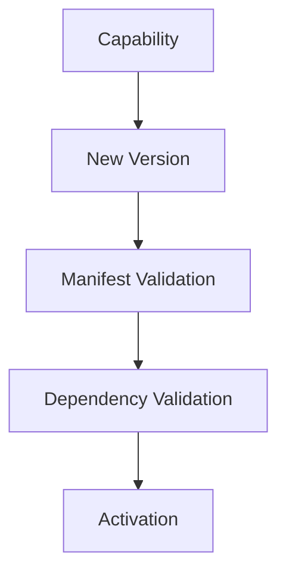

<!--
File: docs/engineering/guides/meg-006-module-platform/11-versioning.md
Document: MEG-006
Status: Draft
-->

# Versioning

> *The purpose of versioning is not to describe change. It is to describe compatibility.*

---

# Purpose

The Mosaic platform evolves continuously: capabilities improve, SDKs evolve, manifests gain features and Runtime contracts expand. Without a clear versioning strategy, module compatibility quickly becomes unpredictable, because nothing tells an operator whether a given capability can run against a given Runtime. This document defines how versioning is managed throughout the Mosaic Module Platform.

---

# Philosophy

Within Mosaic:

> **Version numbers communicate compatibility, not progress.**

A version should answer whether a capability can run, which Runtime supports it, which SDK it requires and whether its dependencies are compatible. It should never merely answer:

> **Which release is newer?**

Semantic Versioning exists primarily to communicate compatibility between independently evolving components.  [Semantic Versioning](https://semver.org/)

---

# Versioned Components

The Module Platform versions several independent artefacts — the Capability, the Manifest, the SDK, the Runtime and the Runtime Contracts — and each of them evolves on its own schedule. They should not all share the same version number, since a single shared number would impose compatibility constraints between artefacts that have not in fact changed together.

---

# Capability Version

Every capability must declare its own version.

```yaml
version: 2.4.1
```

Capability versions describe changes to behaviour, features and compatibility. They do not describe Runtime versions, which evolve independently of the capabilities running on them.

---

# Manifest Version

The manifest schema evolves independently of the capability it describes, and carries a version of its own.

```yaml
manifestVersion: 2
```

From that number the Runtime should determine whether it understands the schema and whether migration is required. Manifest versions therefore describe metadata compatibility, not capability behaviour.

---

# SDK Version

Capabilities should declare the SDK version they require, because the Runtime validates SDK compatibility during startup.

```yaml
sdk:

  version: "^2.0.0"
```

Capabilities should never guess which SDK is available.

---

# Runtime Version

The Runtime itself possesses its own version, such as 3.2.0. Capabilities should not depend directly upon that version, however; they depend instead upon the SDK version and the Runtime contracts, which reduces unnecessary compatibility constraints.

---

# Runtime Contract Version

Individual Runtime contracts may evolve independently, so a Scheduler contract may stand at v2 while BlobStore remains at v1. Breaking changes to one Runtime contract should not require versioning the entire Runtime, and contract-level versioning therefore provides finer compatibility control. This approach is increasingly used in extensible platforms to reduce unnecessary ecosystem breakage.  [Microsoft Learn](https://learn.microsoft.com/en-us/visualstudio/extensibility/migration/module-compatibility?view=visualstudio)

---

# Semantic Versioning

Capability versions should follow Semantic Versioning, expressed as `MAJOR.MINOR.PATCH`. A MAJOR increment signals a breaking change, a MINOR increment a backward compatible feature, and a PATCH increment a backward compatible fix. This provides predictable upgrade behaviour for module authors.

 [Semantic Versioning](https://semver.org/)

---

# Compatibility

Compatibility should be explicit rather than inferred.

```yaml
runtime:

  sdk: "^2.0.0"

  manifest: 3
```

The Runtime determines compatibility before activation, which means capabilities should never attempt compatibility negotiation during execution.

---

# Dependency Versioning

Dependencies should include version constraints.

```yaml
dependencies:

  playback: "^2.4.0"

  metadata: ">=1.8.0"
```

The Runtime validates these constraints during dependency resolution, and execution begins only after compatibility has been established.

---

# Breaking Changes

Breaking changes should require a major version increment. A removed Runtime contract, an incompatible configuration schema and changed public SDK behaviour are all examples. Breaking changes should remain deliberate, and they should never occur accidentally.

---

# Non-Breaking Changes

Additive change generally warrants a minor version increment instead. Examples include a new optional capability, an additional Runtime contract, new optional configuration and new events. Existing capabilities should continue functioning without modification.

---

# Patch Releases

Patch releases should contain bug fixes, documentation improvements and performance improvements. They should not change Runtime contracts, which is what allows capabilities to upgrade safely without behavioural surprises.

---

# Manifest Evolution

Manifest schemas should remain backwards compatible where practical, as when Manifest v2 evolves into Manifest v3. The Runtime may support multiple manifest versions simultaneously during migration, so schema evolution should remain deliberate rather than incidental.

---

# SDK Compatibility

The Runtime should support multiple SDK versions where practical, so that Capability A may continue running against SDK v2 while Capability B runs against SDK v3. The SDK compatibility matrix should remain explicit, because capabilities should not require simultaneous upgrades merely because the Runtime evolved.

---

# Deprecation

Features should be deprecated before removal, moving from supported, to deprecated, to removed. Deprecation warnings should appear in documentation, in diagnostics and in tooling, so that capability authors receive adequate migration time.

---

# Upgrade Path

Capability upgrades should remain predictable, and conceptually every upgrade follows the same sequence.



Upgrade should reuse the same Runtime lifecycle as installation, so there should be no "special" upgrade path.

---

# Compatibility Matrix

The Runtime should expose a compatibility matrix.

| Runtime | SDK | Manifest |
|----------|-----|----------|
| 3.x | 2.x | 3 |
| 4.x | 3.x | 4 |

Module authors should immediately understand:

> **Will this capability execute on this Runtime?**

Compatibility should not require experimentation.

---

# Marketplace

Marketplace tooling should display the capability version, the SDK requirement, Runtime compatibility and the manifest version, because operators should understand compatibility before installation. Installation should never become trial and error.

---

# Diagnostics

The Runtime should expose incompatible capabilities, deprecated SDK usage, manifest migration requirements and unsupported Runtime contracts, so that version-related failures remain explicit.

---

# Anti-Patterns

The following practices are prohibited.

## Runtime Guessing

Attempting to execute incompatible capabilities.

---

## Hidden Breaking Changes

Changing SDK behaviour without incrementing major version.

---

## Manifest Drift

Changing manifest semantics without changing manifest version.

---

## Runtime Coupling

Capabilities depending directly upon Runtime implementation versions.

---

## Forced Ecosystem Upgrades

Requiring every capability to upgrade because one Runtime Service changed.

---

## Silent Compatibility Failure

Ignoring version mismatches during activation.

---

# Mosaic Guidelines

Within Mosaic:

- Capabilities should follow Semantic Versioning.
- Manifest schemas must be versioned independently.
- SDK versions must remain explicit.
- Runtime contracts may evolve independently.
- Compatibility must be validated before activation.
- Breaking changes should require major versions.
- Deprecation should precede removal.
- Version compatibility must remain observable.
- Marketplace tooling should expose compatibility information.

---

# Relationship to MEG

Configuration defines:

> **How a capability operates.**

Versioning defines:

> **Whether a capability can operate.**

The next chapter introduces **Isolation**, describing how the Runtime ensures independently developed capabilities remain operationally isolated while sharing one execution platform.

---

# Summary

Versioning exists to communicate compatibility, not chronology. Within Mosaic manifests version metadata, SDKs version contracts, capabilities version behaviour, and the Runtime validates compatibility before anything runs. By separating these concerns, the platform can evolve continuously without forcing unnecessary upgrades across the entire ecosystem.
