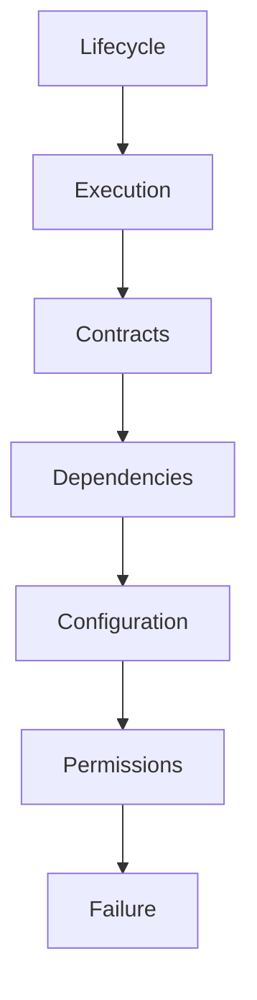

<!--
File: docs/engineering/guides/meg-006-module-platform/12-isolation.md
Document: MEG-006
Status: Draft
-->

# Isolation

> *Capabilities should collaborate. They should never become dependent upon one another's implementation.*

---

# Purpose

The Mosaic Runtime is designed to execute many independent capabilities.

Examples include:

- Playback
- Library
- Metadata
- Recommendations
- Books
- Music
- Anime
- IPTV

Each of these should remain independently developed, deployed, upgraded, tested and replaced. Without effective isolation none of that holds: failures propagate, upgrades become risky, Runtime stability degrades and platform evolution slows as a result. Isolation is therefore one of the defining architectural principles of the Module Platform.

---

# Philosophy

Within Mosaic:

> **Capabilities may communicate. They must never become coupled.**

Isolation does **not** mean capabilities never interact. It means that interactions occur only through Runtime contracts, and that implementation remains private.

---

# Isolation Layers

Capability isolation exists across several dimensions, each of which protects one aspect of platform independence.

The sections that follow take each layer in turn.

---

# Lifecycle Isolation

Every capability owns its own lifecycle, which means Metadata reaching Activated does not imply that Recommendations has been activated too. The Runtime coordinates lifecycle while capabilities participate in it independently, so one capability should never activate another.

---

# Execution Isolation

Every capability executes independently, so Metadata may run on Worker A while Playback runs on Worker B. Execution failure within one capability should not directly affect unrelated capability execution, and the Worker Manager and Execution Engine cooperate to preserve this separation.

---

# Failure Isolation

Suppose the Metadata Capability experiences a failure. The Runtime should ensure that Playback continues, that Library continues and that Authentication continues; failure should remain local, and system-wide failure should be exceptional. This principle of fault isolation is a cornerstone of resilient module and microkernel architectures. ([docs.aws.amazon.com](https://docs.aws.amazon.com/prescriptive-guidance/latest/cloud-design-patterns/bulkhead.html))

---

# Dependency Isolation

Capabilities should depend only upon:

- Runtime contracts
- declared capability contracts
- SDK contracts

They should never depend upon:

- implementation packages
- internal data structures
- private APIs
- other Module packages

Dependencies should remain explicit and manifest-driven. Modules never communicate directly with one another; they register capabilities, and the Platform owns capability orchestration.

---

# Contract Isolation

Capabilities communicate through contracts, so the Playback Capability depends upon the `MetadataProvider` contract exposed by the Metadata Capability rather than upon the `TMDB Implementation` sitting behind it. Contract isolation allows implementations to evolve independently.

---

# Event Isolation

Events reinforce capability isolation, because a capability raising `PlaybackCompleted` hands it to the Runtime without learning that a Recommendation Capability consumed it. Playback knows neither who subscribed nor what happened afterwards. Events communicate business facts, the Runtime provides delivery, and capabilities remain autonomous.

---

# State Isolation

Each capability owns its own business state: Playback owns Watch Progress, while Metadata owns Artwork. Playback should therefore never modify Metadata storage directly, since communication occurs through contracts and events rather than shared persistence. This aligns with the ownership principles established in [MEG-003](../meg-003-domain-driven-design/index.md).

---

# Storage Isolation

Capabilities should not share persistence implementation. It is poor practice for Playback to update the Metadata table itself; instead Playback raises `PlaybackCompleted`, the Runtime delivers it, and Metadata reacts. Storage ownership follows capability ownership.

---

# Configuration Isolation

Capabilities consume only their own configuration. It is poor practice for Metadata to read Playback configuration, and preferable for Metadata to read its own, because shared configuration creates hidden dependencies. The Runtime should inject configuration independently.

---

# Permission Isolation

Permissions are capability specific, so granting Metadata the `blob.read` permission does not imply that Playback also holds `blob.read`. Authority should remain local to the capability requesting it, which makes permission isolation a complement to execution isolation.

---

# Runtime Isolation

Capabilities should remain unaware of worker identity, scheduler implementation, queue topology and the execution engine. The Runtime remains infrastructure: capabilities consume Runtime services, and they never manage them.

---

# SDK Isolation

Modules interact only with the SDK, and should never import Runtime internals, Kernel implementation or Runtime Services. The SDK forms the isolation boundary between Runtime evolution and module stability.

---

# Resource Isolation

Capabilities consume Runtime resources such as workers, memory, scheduling and connections, but they do not own them. The Runtime may limit, prioritise or reclaim those resources independently of capability implementation, so no capability should monopolise shared Runtime resources.

---

# Upgrade Isolation

Capabilities should upgrade independently, which means moving Metadata to Version 2.1 should not require Playback to upgrade unless an explicit dependency requires it. Version coupling should remain intentional rather than accidental.

---

# Module Isolation

Third-party modules should remain isolated from Platform implementation, from other modules and from Runtime internals. Architecturally the Runtime exposes the SDK and the Module consumes it, so modules communicate with the platform and never with one another's private implementation.

---

# Security Isolation

Isolation contributes directly to Runtime security. Even if a module behaves incorrectly it should remain constrained by permissions, by contracts and by Runtime boundaries, which reduces both accidental and malicious platform impact.

---

# Operational Isolation

Operational behaviour should also remain isolated, including logging, metrics, tracing and health. Each capability reports independently, and the Runtime aggregates operational information without coupling implementations.

---

# Marketplace Isolation

Marketplace installation should preserve isolation, so installing a Books Capability should not modify an existing Playback Capability. Existing capabilities remain unchanged and the platform simply gains additional functionality, which is one of the defining characteristics of a capability-oriented platform.

---

# Diagnostics

The Runtime should expose:

- capability dependencies
- resource consumption
- failure boundaries
- permission grants
- execution isolation

Operators should understand:

> **Which capability affected which part of the platform?**

Isolation should remain observable.

---

# Anti-Patterns

The following practices are prohibited.

## Shared Business State

Multiple capabilities directly modifying the same business data.

---

## Private API Usage

Capabilities importing implementation packages from other capabilities.

---

## Runtime Bypass

Capabilities communicating directly without Runtime contracts.

---

## Shared Configuration

Capabilities reading one another's configuration.

---

## Shared Permissions

Granting one capability authority because another requires it.

---

## Cross-Capability Lifecycle

Capabilities activating, stopping or restarting one another.

---

# Mosaic Guidelines

Within Mosaic:

- Capabilities must remain operationally isolated.
- Business state must remain capability owned.
- Communication must occur through Runtime contracts or events.
- Runtime Services must preserve execution isolation.
- Permissions must remain capability specific.
- Configuration must remain capability specific.
- Modules must remain independent of Runtime implementation.
- Failure should remain local wherever practical.

---

# Relationship to MEG

Versioning defines:

> **Whether capabilities are compatible.**

Isolation defines:

> **How compatible capabilities safely coexist inside one Runtime.**

The next chapter introduces **Platform Guidelines**, bringing together the principles of the Module Platform into practical guidance for engineers designing new capabilities.

---

# Summary

Isolation is one of the defining architectural properties of the Mosaic platform, because it allows Platform capabilities, first-party modules and third-party modules to coexist within one Runtime while remaining independently evolvable. By isolating lifecycle, execution, state, permissions, configuration and failures, the Runtime becomes a stable platform rather than a tightly coupled application.
