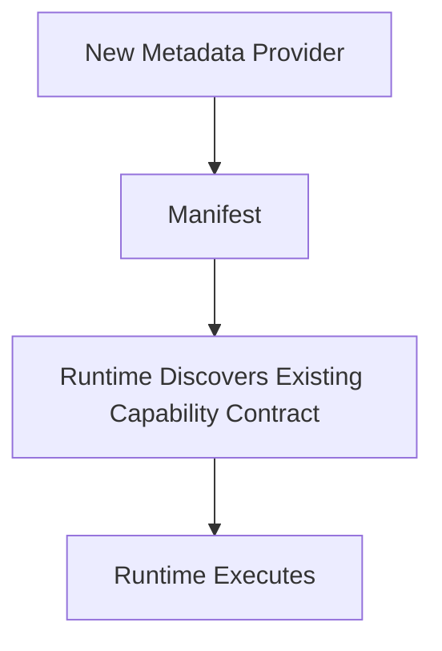

<!--
File: docs/engineering/guides/meg-006-module-platform/13-platform-guidelines.md
Document: MEG-006
Status: Draft
-->

# Platform Guidelines

> *The platform should become larger by adding capabilities, not by increasing the complexity of the Runtime.*

---

# Purpose

The previous chapters introduced the building blocks of the Module Platform: Capability Manifests, Discovery, Registration, Dependency Resolution, Activation, Lifecycle, SDK, Permissions, Configuration, Versioning and Isolation. This chapter brings those concepts together into practical engineering guidance, and everything that follows exists to answer one question.

> **"How should I design a new capability for the Mosaic platform?"**

---

# Philosophy

Within Mosaic:

> **Think like a platform engineer, not an application developer.**

Capabilities should be designed to be independent, replaceable, discoverable and observable, which means the Runtime should require no modification to support them.

---

# Start With The Capability

Before writing code, establish what the capability is for by asking:

- What business capability exists?
- What problem does it solve?
- Does this belong in an existing capability?
- Should this become a new capability?

Capabilities should model business value rather than infrastructure, so avoid creating capabilities around technical implementation, frameworks or storage technologies.

---

# Design Around Contracts

Every capability should expose its contracts, events, configuration and permissions before implementation begins, because the Runtime should understand what the capability is before it understands how the capability is implemented.

---

# Manifest First

Every capability begins with a `capability.yaml` manifest, so before implementation ask which permissions are required, which contracts are provided, which contracts are consumed and which Runtime services are needed. If the manifest cannot describe the capability clearly, the design probably requires refinement.

---

# Prefer Small Capabilities

Capabilities should own one coherent business concern, which makes `Metadata`, `Books` and `Playback` good capability boundaries and a `MediaEverythingCapability` a poor one. Large capabilities become miniature monoliths.

---

# Avoid Runtime Knowledge

Capabilities should never know the worker count, the scheduler implementation, the dependency graph, the execution engine or the Runtime Kernel. They should know only the SDK, the contracts and the business behaviour, because the Runtime exists to hide operational complexity.

---

# Runtime Contracts

When consuming Runtime functionality ask:

> **Does a Runtime contract already exist?**

Avoid introducing new Runtime APIs unnecessarily. The SDK should remain small, stable and expressive, and the Runtime should evolve underneath it.

---

# Events Before Coupling

Suppose one capability needs another. Wiring `Playback` directly to a `Recommendation Implementation` is poor, whereas the preferred shape has Playback emit `PlaybackCompleted` and lets the Runtime carry it to `Recommendations`. Capabilities should collaborate through contracts and events, never through implementation.

---

# Configuration

Capabilities should declare their configuration schema, defaults and validation requirements, but they should never read files, parse YAML or inspect environment variables, because configuration belongs to the Runtime.

---

# Permissions

Capabilities should request only the permissions they require. Avoid a broad grant:

```yaml
permissions:
  - runtime.*
```

Prefer narrow ones:

```yaml
permissions:
  - scheduler.use
  - blob.read
```

The principle of least privilege should guide every capability.

---

# Versioning

Before releasing a capability, ask whether a Runtime contract has changed, whether configuration has changed, whether behaviour has changed and whether the result is backwards compatible. Version numbers communicate compatibility, not development effort.

---

# Dependencies

Declare every dependency explicitly, and never assume that a Platform capability, an SDK feature or a Runtime contract exists. The Runtime validates dependency graphs, so capabilities should not discover missing dependencies during execution.

---

# Build For Replacement

Ask:

> **Could another capability replace this one?**

Substituting `AniList Metadata` for `TMDB Metadata` should require only a different manifest and a different capability, with everything else remaining unchanged. Replaceability is one of the defining characteristics of a healthy capability platform.

---

# Build For Discovery

Capabilities should be understandable through their manifest, so an operator should be able to answer what the capability provides, which permissions it requires, which contracts it exposes and which events it publishes, all without reading source code. Discovery should become a platform feature rather than a documentation exercise.

---

# Design For Tooling

The Runtime is not the only consumer of manifests. Tooling may use them for marketplace listings, dependency graphs, architecture diagrams, configuration UIs and compatibility reports, so the manifest should remain sufficiently rich to support these tools.

---

# Design For Testing

Every capability should be testable using a fake Runtime context, fake contracts and fake configuration, because the full Runtime should not be required and capabilities should remain independently testable.

Development tooling should also support testing against a real development Platform. The Development Supervisor may orchestrate automatic compilation of a local Module into a temporary development Platform through the Build Pipeline, which gives Module authors integration feedback without changing the production build model.

---

# Development Workflow

The Mosaic CLI should make Module development routine, and a typical workflow runs:

```text
mosaic new module anilist
mosaic dev
mosaic test
mosaic build
mosaic publish
```

During development, the CLI and Development Supervisor should:

- create or locate the Module manifest,
- validate SDK compatibility,
- generate manifests from SDK Module definitions when requested,
- prepare a temporary build workspace,
- compile the local Module into a development Platform,
- expose diagnostics from discovery, registration and activation.

Development convenience must not introduce a separate runtime plugin model, so local development should exercise the same static composition architecture used by production builds. The CLI owns workflow and the SDK owns contracts, and Chapter 14 defines the authoritative Developer Platform architecture for this workflow.

---

# Test Harness Modules

Development environments may install Test Harness Modules automatically, and those Modules provide fake implementations of common capabilities such as Metadata, Media, Artwork, Authentication and Events. Module tests should therefore prefer a real Platform with test providers over bespoke mocking frameworks. The test harness should remain explicit and replaceable, and it should not become hidden production behaviour.

---

# Design For Isolation

Ask:

> **If this capability fails, what else fails?**

The ideal answer is nothing, because failures should remain local and capability isolation should always outweigh implementation convenience.

---

# Platform Evolution Boundary

New providers should not require Runtime modification, whereas a genuinely new capability may require Platform and SDK evolution because the Platform owns capability contracts. A design in which a New Metadata Provider forces someone to modify the Runtime is therefore poor, and the preferred path leads from the provider through its manifest into contracts the Runtime already understands:



Provider growth should occur through Module addition, whereas capability growth should occur deliberately through Platform and SDK design. Do not hide a new architectural capability inside a Module-specific contract.

---

# Marketplace Readiness

A capability should be installable by someone who has never seen its source code, which requires a good manifest, documentation, a configuration schema, permissions and compatibility information. Marketplace readiness should become a natural consequence of good platform design.

---

# Platform Review Checklist

Before implementing a capability confirm:

- [ ] The capability models one business concern.
- [ ] A manifest exists before implementation.
- [ ] Runtime contracts are explicit.
- [ ] Permissions follow least privilege.
- [ ] Configuration schema is complete.
- [ ] Dependencies are declared.
- [ ] Events reinforce loose coupling.
- [ ] New providers use existing Platform contracts.
- [ ] New capabilities are proposed as Platform and SDK changes.
- [ ] Local development uses the Development Supervisor rather than runtime plugin loading.
- [ ] Tests can run against Test Harness Modules where integration behaviour matters.
- [ ] The capability is independently testable.
- [ ] The Runtime requires no modification for provider-only additions.

---

# Common Platform Mistakes

The following decisions usually weaken the platform long before they become visible, and should be avoided:

- extending the Runtime for business features
- hidden dependencies
- Runtime implementation imports
- oversized capabilities
- broad permissions
- undocumented contracts
- implicit configuration

---

# Mosaic Guidelines

Within Mosaic:

- Every new feature should begin as a capability.
- New providers should not require Runtime modification.
- New capability contracts should require deliberate Platform and SDK review.
- Development tooling should compile local Modules through the same static composition model as production.
- Test Harness Modules should provide fake providers for integration testing.
- Capabilities must remain independently deployable.
- Runtime contracts should remain explicit.
- Platform growth should occur through composition.
- Manifests should remain the primary architectural contract.
- Capability isolation should remain a design priority.
- Platform simplicity should always outweigh convenience.

---

# Relationship to MEG

This chapter completes the practical implementation guidance of MEG-006, and the remaining documents describe architectural reasoning (ADRs), contributor expectations, terminology and references. Together, [MEG-001](../meg-001-go-engineering-standards/index.md) through MEG-006 now define engineering, execution, business modelling, architecture, runtime and platform evolution, so the remaining MEGs build upon these foundations rather than redefining them.

---

# Summary

The Module Platform succeeds when new capabilities feel ordinary. Installing Books, Music, Anime, Comics or IPTV should require no Runtime redesign, only discovery, registration and activation. Within Mosaic, the Runtime should remain stable for years while capabilities continue to evolve indefinitely, and that is the defining characteristic of a true platform.
