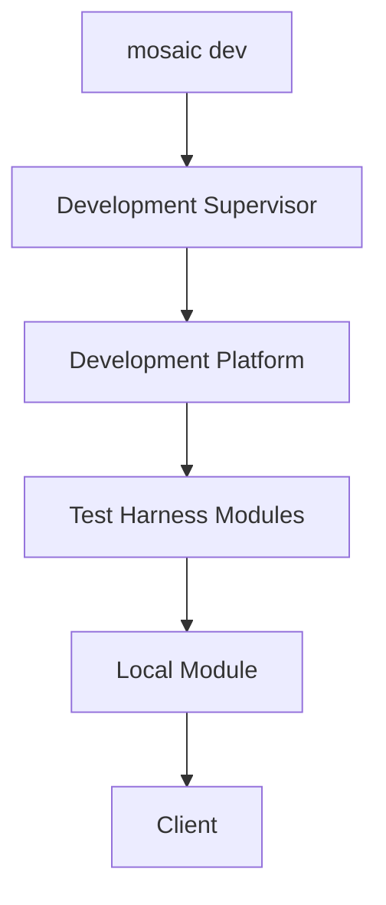
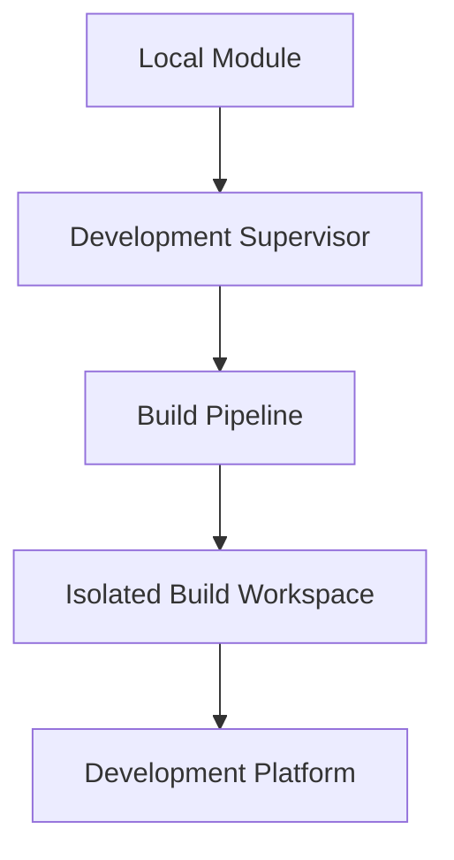
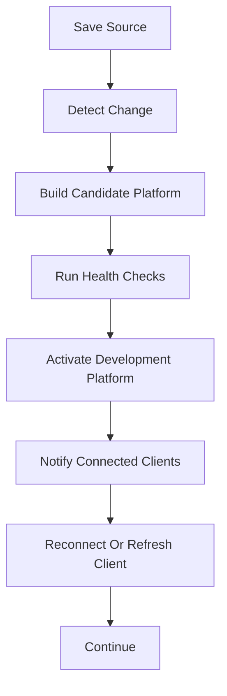
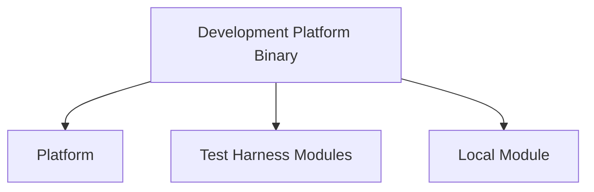
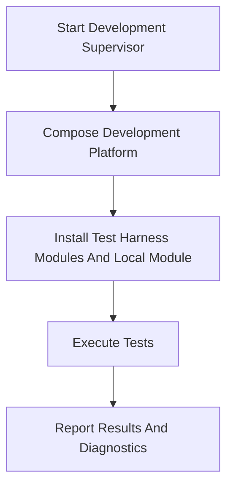
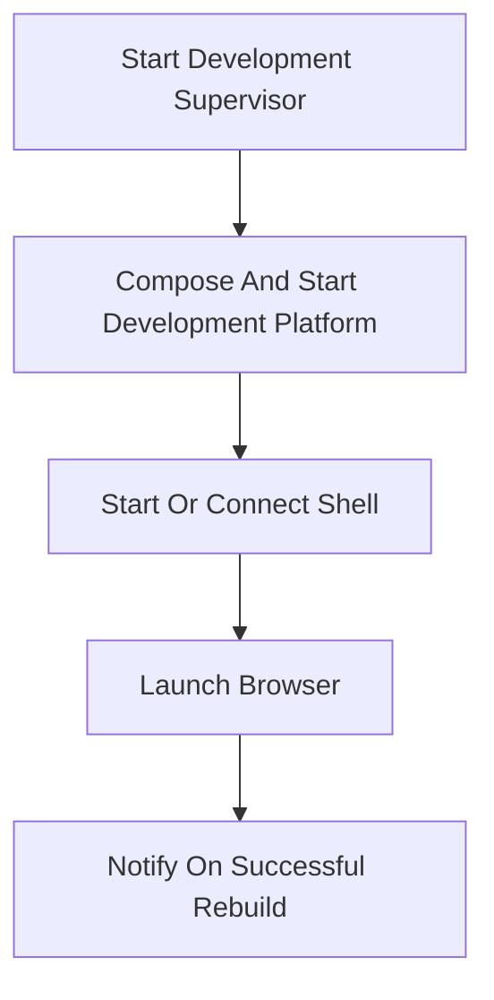
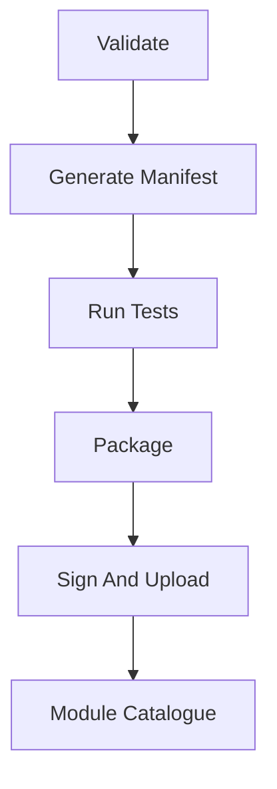

<!--
File: docs/engineering/guides/meg-006-module-platform/14-developer-platform.md
Document: MEG-006
Status: Draft
-->

# Developer Platform

> *The SDK defines the contract. The Developer Platform makes that contract productive.*

---

# Purpose

The Mosaic Developer Platform is the complete toolchain through which developers create, run, test, validate, package and publish Modules. It is larger than the Mosaic SDK, and the SDK is one component within it.

The Developer Platform should make Module development feel like ordinary Go development while hiding Mosaic runtime composition, Build Workspace and packaging mechanics, which means a Module developer should be able to move from a new project to a running development Platform through the Mosaic CLI without manually managing the Supervisor or Platform assembly.

---

# Philosophy

Within Mosaic:

> **Module authors write ordinary Go against the SDK. The Developer Platform handles the environment around it.**

Module authors should therefore not need to understand:

- production Supervisor internals
- Build Workspace layout
- generated imports
- Platform composition
- runtime assembly
- package publication internals

Those concepts remain observable for diagnosis, but they should not be routine developer tasks, because the Developer Platform exists to keep composition mechanics out of the ordinary edit-and-run loop.

---

# Architecture

The Developer Platform contains cooperating components with separate responsibilities. The SDK defines what a Module may depend on, the CLI provides the developer workflow, and the Development Supervisor orchestrates local composition and rebuilds. Beneath them the Development Platform is the real Platform configured for development, Test Harness Modules provide deterministic capability implementations, and the Local Module is the Module currently under development.

A Developer reaches all of these components through the Mosaic CLI rather than through any of them directly.

---

# Mosaic SDK

The Mosaic SDK is the public Platform contract, and it owns:

- capability interfaces and Ports
- canonical models
- Event Envelope and Event Bus contracts
- Module registration APIs
- permission and configuration contracts
- small helper methods
- contract-focused test utilities

The SDK should contain almost no business logic, and it must not own the development workflow, Platform composition or build orchestration. Chapter 08 defines the authoritative SDK boundary.

---

# Mosaic CLI

The Mosaic CLI is the primary developer interface to the Mosaic ecosystem, and its command surface may include:

```text
mosaic new module
mosaic dev
mosaic build
mosaic test
mosaic doctor
mosaic validate
mosaic package
mosaic publish
mosaic docs
```

The exact command syntax may evolve, but responsibility remains stable: the CLI orchestrates developer workflows around SDK contracts, and it may invoke Go tooling, the Development Supervisor, the Build Pipeline, validation tooling, documentation tooling and publication services on the developer's behalf. Developers may still use normal Go tools directly when useful, but Mosaic-specific composition should not require them to do so.

---

# Project Scaffolding

Creating a Module should produce an immediately buildable Go project. Conceptually, the developer names the new Module on the command line.

```text
mosaic new module anilist
```

That may produce:

```text
anilist/

    go.mod
    module.go
    metadata.go
    README.md
    tests/
    examples/
```

Scaffolding should establish:

- SDK dependency
- Module registration
- manifest source declarations
- baseline tests
- documentation structure
- examples

Generated projects should remain ordinary Go projects rather than proprietary project containers, so that the normal Go tools a developer already uses continue to work on them unchanged.

---

# Development Mode

`mosaic dev` should launch a complete local Mosaic environment, conceptually carrying the developer from a single command to a client connected to a running Platform.



The Local Module runs against a real Platform, so Development Mode should not replace Platform behaviour with a mock runtime.

---

# Development Supervisor

The Development Supervisor is a development-only Supervisor implementation optimised for rapid feedback. It should share production Supervisor orchestration, validation, build invocation, health-check and activation behaviour wherever practical, and the Mosaic CLI starts and controls it for the developer.

It may:

- watch local source files
- invoke automatic rebuilds
- include local Modules in the desired composition
- maintain development configuration
- request Test Harness Module inclusion
- restart the Development Platform after successful builds
- notify connected clients when the active development build changes
- launch and connect the Web Shell when requested
- use development-oriented health-check timing
- expose verbose diagnostics
- use a local Module Catalogue
- preserve build and activation logs

It prioritises feedback speed over production deployment conservatism, but it must still preserve the production architecture. The Development Supervisor must not:

- dynamically inject code into a running Platform
- introduce runtime plugin loading
- bypass manifest validation
- mutate Platform or Module source repositories
- replace the Build Pipeline with development-only composition logic

The term `inject local Modules` means adding local Module paths to an isolated development build; it does not mean runtime code injection.

The Development Supervisor owns the local development lifecycle and the mapping from working directories to desired Module composition, whereas the Build Pipeline owns creation and mutation of the Local Build Workspace.

---

# Development Platform

The Development Platform is the real Mosaic Platform running in a development configuration, and it is not a fork, mock or reduced implementation. Conceptually, development is a configured mode rather than a separate build.

```yaml
mode: development
modules:
  local:
    - ../module
```

Development configuration may enable:

- verbose logging
- deterministic test providers
- shorter rebuild cycles
- development diagnostics
- local-only data

Platform contracts, capability orchestration, Event Bus behaviour, registration and lifecycle should remain production-equivalent. The Development Platform therefore contains the same architectural services as production, including:

- Event Bus
- Capability Managers
- GraphQL
- storage
- Scheduler
- permission enforcement
- Runtime SDUI

Development convenience may change surrounding configuration and diagnostics, but it must not replace those services with development-only equivalents.

---

# Local Module Composition

Local Module development should not require publication to a remote catalogue. Conceptually, the Module under development reaches the running Platform through the ordinary build path.



The Development Supervisor supplies local Module paths as build inputs, and the developer's working directory is the source of truth for the Local Module during development. The Build Pipeline still owns workspace preparation, temporary `go.mod` updates, generated `imports.go`, dependency resolution and compilation mechanics, so local composition must produce a statically linked Platform Binary using the same architecture as production. No registry publication is required for this loop.

Production composition resolves Module inputs from configured catalogue sources, whereas development composition may resolve the Local Module from the filesystem while resolving all other Modules through normal sources. This difference in origin must not alter manifest admission, SDK registration, static linking or Platform lifecycle.

---

# Automatic Build Loop

Development should support a short, observable rebuild loop. The Development Supervisor should monitor relevant inputs, including:

- Go source
- Module declarations and manifests
- generated source inputs
- Module-owned assets where applicable

Generated outputs should not trigger an unbounded rebuild loop. A detected change therefore travels through a build, a health check and an activation before any connected client sees it.



Failed builds should leave diagnostics available and must not be mistaken for successful activation. The implementation may preserve the previous healthy development Platform when that improves feedback, but it must clearly identify which source revision is running, and only a candidate that passes development health checks may replace the active Development Platform.

---

# Development Composition

The Development Supervisor should automatically request a composition containing the Local Module and configured Test Harness Modules. Conceptually, one Development Platform Binary contains the Platform alongside both kinds of Module.



Test Harness Modules and the Local Module are peers inside the composed Platform, and neither contains or wraps the other. The CLI should provide useful defaults so a normal `mosaic dev` workflow does not require manual Platform configuration, while explicit configuration should remain available when a developer needs different providers or multiple Local Modules.

---

# Test Harness Modules

Test Harness functionality should be delivered through ordinary Modules. Test Harness Modules may provide deterministic implementations of capabilities such as:

- Metadata
- Media
- Artwork
- Authentication
- Search
- Event Sources

The Local Module therefore interacts with genuine Platform contracts and Capability Managers while its external dependencies are controlled. Test Harness Modules should be:

- explicit
- replaceable
- deterministic
- unavailable to production composition by default

They must not introduce hidden test behaviour into the Platform. Using ordinary Modules for these fakes continuously exercises manifest discovery, dependency validation, SDK registration, Capability Manager routing and Module lifecycle, so the development loop keeps testing the mechanisms production depends upon. Chapter 15 defines the authoritative Test Harness capability, data, scenario and event-simulation model.

---

# Testing Modes

The Developer Platform supports two complementary testing levels: SDK test utilities support fast isolated contract tests without a complete Platform, whereas the Development Platform and Test Harness Modules support integration tests against real Platform behaviour.

`mosaic test` may orchestrate the second of those by assembling the environment before the tests run.



The CLI should remove manual environment setup from normal integration testing, but it should not force every unit test to start a Platform.

---

# Browser And Shell Integration

For Web development, `mosaic dev` should be able to complete the normal local startup path, conceptually taking the developer from a cold start to a browser attached to the running Platform.



The developer should remain inside the running application while candidate builds are prepared, and after successful activation the Shell should reconnect or refresh the affected runtime state automatically. Browser launch should be configurable for headless, automated and non-Web development workflows.

---

# Development Diagnostics

The Development Supervisor should expose diagnostics that explain both Module and Platform behaviour. Useful diagnostics include:

- initial build and rebuild duration
- rebuild count
- active source revision
- active Modules
- registered capabilities
- Capability Manager routing tables
- event traffic
- SDK compatibility results
- build and health-check status
- Platform restart history
- connected client state

Diagnostics should be observable through the CLI and may also be exposed through development UI surfaces, but verbose diagnostics must not change Platform behaviour.

---

# Validation

The CLI should validate a Module before packaging or publication, so that problems surface while the developer is still working on them. Validation may include:

- SDK compatibility
- manifest generation and schema validation
- capability registration
- dependency declarations
- public and private event declarations
- permission declarations
- configuration declarations
- documentation presence
- test results
- package reproducibility

Validation should produce actionable diagnostics before a package reaches the Module Catalogue. The Supervisor nevertheless remains responsible for validating manifests and compatibility when a Module is selected for composition, which means developer validation does not replace runtime admission.

---

# Manifest Generation

Go declarations should be the authoring source for Module metadata when the SDK can express that metadata completely. Conceptually, a Module declares its identity, capabilities, events and permissions in source.

```go
sdk.Module{
    ID: "anilist",
    Capabilities: capabilities,
    Events: events,
    Permissions: permissions,
}
```

The CLI may generate `module.yaml` from that declaration, and the generated manifest is the declarative artefact consumed by the Supervisor and Module Catalogue. Generation should reduce duplicate maintenance without allowing executable source inspection during Supervisor discovery, so generated manifests must still pass [MIP-002](../../protocols/mip-002-module-manifest-protocol/index.md) validation.

---

# Packaging And Publishing

`mosaic publish` should orchestrate a controlled publication pipeline, in which validation, manifest generation and tests all complete before anything reaches the Module Catalogue.



Publication tooling should hide repository implementation details while preserving visible validation, package identity and provenance. Package and catalogue protocols require their own specifications before these commands become stable public interfaces, so this chapter defines workflow ownership, not those future wire formats.

---

# Documentation Tooling

The Mosaic CLI may expose documentation workflows such as:

```text
mosaic docs validate
mosaic docs build
mosaic docs nav
mosaic docs new
```

These commands should invoke the documentation rules governed by [MDG-001](../../documentation/mdg-001-documentation-authority-guide/index.md), and the CLI must not define a second documentation standard. Documentation remains a first-class engineering artefact and authored Markdown remains canonical.

---

# Developer Experience Boundary

The Developer Platform should expose simple workflows while retaining access to underlying diagnostics, which means it should hide routine mechanics rather than hide failures. Developers should be able to inspect:

- generated manifests
- Build Specifications
- Build Pipeline stages
- compiler output
- Platform health checks
- registration and activation diagnostics
- test results

This keeps automation understandable and debuggable.

---

# Production Fidelity

Development should exercise the same architecture used after publication, so the intended development differences are limited to:

- Local Modules may originate from filesystem paths instead of a remote Module Catalogue
- Test Harness Modules may be included automatically
- rebuild timing and health checks may be tuned for rapid feedback
- development diagnostics may be more detailed
- local-only configuration and data may be used

The following must remain production-equivalent:

- SDK contracts
- manifest validation
- static Module composition
- generated registration imports
- Platform startup and Module registration
- Capability Manager orchestration
- Event Bus behaviour
- permission enforcement
- Runtime SDUI contracts

Development therefore acts as continuous validation of the production composition architecture.

---

# Anti-Patterns

## SDK As Developer Platform

Putting scaffolding, build orchestration and publication behaviour inside the SDK library.

## Development Runtime Fork

Maintaining a special Platform implementation whose behaviour differs from production.

## Runtime Hot Loading

Loading changed Module code into a running Platform instead of rebuilding a statically composed candidate.

## Hidden Test Behaviour

Embedding mocks or test-only branches into production Platform code.

## Publication Before Validation

Uploading packages before manifest, compatibility, documentation and test checks complete.

## Opaque Automation

Hiding build failures or active source revisions behind a simplified CLI experience.

---

# Mosaic Guidelines

Within Mosaic:

- The Developer Platform must preserve ordinary Go Module projects.
- The SDK must define developer contracts and must not own developer workflow.
- The Mosaic CLI should be the primary interface for Mosaic-specific development workflows.
- `mosaic dev` should run the real Platform in development configuration.
- The Development Supervisor must use the same static composition model as production.
- The Development Supervisor should share production Supervisor orchestration and activation behaviour wherever practical.
- The Development Supervisor may resolve Local Modules from filesystem working directories.
- The Development Supervisor should watch relevant Module inputs and notify clients after successful activation.
- Local Module composition must not require publication to a remote catalogue.
- Local Module composition must not introduce runtime plugin loading.
- The Build Pipeline must retain ownership of build mechanics.
- Test Harness behaviour should be supplied through explicit Modules.
- Test Harness Modules and Local Modules must participate as peer Modules in the composed Development Platform.
- SDK utilities should support isolated contract tests.
- Development Platform tests should support real integration behaviour.
- CLI validation must not replace Supervisor admission validation.
- Manifest generation must produce a declarative artefact that conforms to [MIP-002](../../protocols/mip-002-module-manifest-protocol/index.md).
- Documentation commands must follow [MDG-001](../../documentation/mdg-001-documentation-authority-guide/index.md) rather than define separate rules.
- Developer automation should expose sufficient diagnostics to explain failures.

---

# Relationship To MEG

This chapter extends:

- Chapter 08, which defines the SDK contract boundary.
- Chapter 13, which defines practical Module design guidance.
- [MEG-005](../meg-005-runtime-architecture/index.md), which defines Supervisor and Build Pipeline responsibilities.
- [MIP-002](../../protocols/mip-002-module-manifest-protocol/index.md), which defines the generated Module Manifest contract.
- [MDG-001](../../documentation/mdg-001-documentation-authority-guide/index.md), which governs documentation tooling behaviour.

The governing decision is recorded in:

- MEG-006 ADR-003 — Developer Platform As Integrated Toolchain.

---

# Summary

The Developer Platform combines contracts, workflow, real Platform execution, deterministic test capabilities and publication tooling into one coherent development experience. The intended path runs from `mosaic new module my-provider` through `mosaic dev` to a Running Development Platform, with nothing between those two commands that the developer has to assemble by hand.

The SDK defines the contract, the CLI provides the experience, and the Development Supervisor and Build Pipeline preserve production-equivalent composition.
