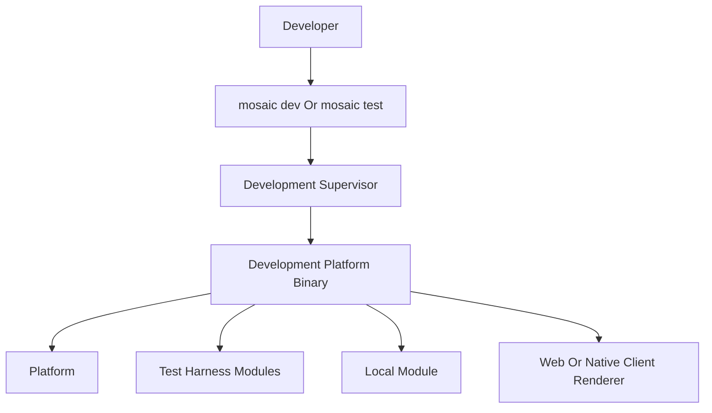

<!--
File: docs/engineering/guides/meg-006-module-platform/15-test-harness.md
Document: MEG-006
Status: Draft
-->

# Test Harness

> *The Test Harness does not simulate Mosaic. It participates in Mosaic.*

---

# Purpose

The Mosaic Test Harness is the official deterministic capability suite used by the Developer Platform for Module development and integration testing. It is implemented as one or more ordinary Mosaic Modules, which means developers exercise the real Platform and real SDK while replacing only selected external capabilities with deterministic development providers.

The Test Harness is not the whole Developer Platform. It is the development capability environment installed and orchestrated by that platform.

---

# Philosophy

Within Mosaic:

> **Fake capabilities should participate through real Platform contracts rather than replacing Platform infrastructure with mocks.**

Because the fakes participate rather than substitute, the Test Harness should exercise the whole integration path:

- Module manifest discovery
- dependency and compatibility validation
- Build Pipeline composition
- SDK registration
- Module lifecycle
- Capability Managers
- Event Bus delivery
- permissions
- Runtime SDUI

That coverage only holds if the Platform behaves the same way whether or not tests are running, so the Platform must not contain hidden branches that behave differently only because tests are running.

---

# Architecture

The Test Harness runs inside the same statically composed Development Platform as the Local Module.



Test Harness Modules and Local Modules are peers, which means the Test Harness does not wrap the Local Module or intercept Platform internals.

---

# Installation

The Development Supervisor should include the default Test Harness composition automatically when development mode starts, because normal workflows should not require developers to select every fake provider manually. The CLI should nevertheless allow explicit replacement or removal of Test Harness Modules when a developer needs:

- a real external provider
- a different deterministic provider
- multiple provider routing
- a narrower test environment
- headless automation

Test Harness Modules must be excluded from production composition by default, and their manifests should identify them as development-only inputs. The exact manifest field for development-only eligibility belongs in [MIP-002](../../protocols/mip-002-module-manifest-protocol/index.md) before it becomes a stable protocol requirement.

---

# Capability Providers

The Test Harness may provide deterministic implementations of common Platform capability contracts, and each fake should be an ordinary provider registered through the SDK.

## Metadata

A Metadata provider may return deterministic records for media domains such as Movies, TV, Anime and Music. It should not require network access.

## Media

A Media provider may expose fixture libraries and playable development entries without requiring Jellyfin, TorBox or another production integration.

## Artwork

An Artwork provider may return local fixture posters, fan art and placeholders with stable identifiers and dimensions.

## Authentication

An Authentication provider may expose deterministic personas such as Administrator, Parent, Child and Guest, and those personas should exercise normal permission and policy flows.

## Search

A Search provider may return stable result sets for known queries, empty results and error cases.

## Recommendations

A Recommendations provider may return deterministic recommendation sets without depending on live metadata or behavioural services.

## Event Sources

Event-source Modules may publish declared development events through the normal Event Bus path, so they must follow the same envelope, naming, permission and delivery contracts as production publishers.

---

# Deterministic Data

Test Harness data should be deterministic and portable. Given the same Test Harness version, scenario, Platform version, configuration and random seed, when randomness is required, the resulting development environment should be reproducible.

Useful baseline datasets include:

- empty library
- small media library
- large media library
- anime collection
- mixed-content library
- family household
- degraded provider state

Fixtures should avoid unnecessary network access and mutable third-party data, because stable fixture identity is what allows UI development, debugging and automated tests to share expected results.

---

# Scenario Profiles

Scenario Profiles are a deferred extension to the Test Harness. They would package deterministic capability configuration and fixture selection under a reusable name, held conceptually as one file per profile.

```text
scenarios/

    empty-library.yaml
    anime-heavy.yaml
    family-home.yaml
    enterprise.yaml
    streaming-provider.yaml
```

A future CLI workflow may then select one by name.

```text
mosaic dev --scenario anime-heavy
```

A Scenario Profile may select:

- fixture datasets
- authentication personas
- provider availability
- capability responses
- deterministic errors
- event-source schedules

Scenario Profiles should be versioned inputs so developers and automated tests can reproduce the same environment. The scenario schema and compatibility policy require a separate protocol decision before the CLI flag becomes a stable public contract.

---

# Event Simulation

The Test Harness should support deliberate event-driven testing without bypassing Event Bus behaviour. The CLI may eventually expose a workflow that fires a named harness event.

```text
mosaic test fire test-harness.media.added
```

The command should invoke a declared Test Harness event-source capability, and that capability publishes through the normal SDK and Event Bus path. The resulting event should therefore exercise:

- Event Envelope construction
- publisher permissions
- routing
- subscriber delivery
- correlation and diagnostics
- retry and idempotency behaviour where configured

Test tooling must not silently impersonate another Module or publish inside another Module's namespace. To simulate a public event owned by another Module, tooling should instead either:

- invoke a fake provider action that causes the owning Test Harness Module to publish its declared equivalent
- use a fixture package supplied by the event-owning Module
- use a future explicit event simulation protocol that preserves source identity and ownership

Arbitrary production-event impersonation is deferred until that protocol exists, and [MEG-002](../meg-002-event-driven-runtime/index.md) and [MIP-001](../../protocols/mip-001-event-protocol/index.md) remain authoritative for event ownership and transport.

---

# Failure Simulation

Test Harness providers should be able to expose deterministic failure states through normal capability behaviour. Examples include:

- provider unavailable
- authentication denied
- empty response
- malformed upstream data represented as a provider error
- slow response
- partial capability degradation
- transient event publication failure

Failure behaviour should be selected explicitly by scenario or test configuration, because the harness should not introduce nondeterministic instability by default. Failure simulation must also not bypass Capability Manager policy, retry, timeout or permission enforcement.

---

# Testing API

The SDK may expose lightweight test helpers for isolated contract tests, conceptually of the following shape.

```go
sdktest.NewPlatform()
sdktest.FireEvent(...)
sdktest.Assert(...)
```

These helpers should reduce test setup without becoming a second implementation of the Platform, which is why two testing modes remain distinct.

| Mode | Environment | Purpose |
|------|-------------|---------|
| SDK contract test | Lightweight SDK utilities | Fast isolated Module behaviour |
| Test Harness integration test | Real Development Platform | Platform composition and integration behaviour |

`sdktest.FireEvent` must follow the same event-ownership rules as CLI event simulation.

---

# Client Development

The Test Harness should provide enough deterministic Runtime SDUI and capability data for Web and native client development, and client renderers may connect to the same Development Platform. Examples include the Web Renderer, the Flutter Renderer and future native renderers.

The Test Harness supplies semantic capability results. It must not supply client-specific presentation, CSS or native widget definitions.

---

# Development Supervisor Relationship

The Development Supervisor orchestrates the environment around the Test Harness. It should:

- include configured Test Harness Modules in desired composition
- rebuild when relevant Local Module or harness inputs change
- invoke the Build Pipeline
- run health checks
- activate the healthy Development Platform
- expose logs and diagnostics
- notify connected clients

The Development Supervisor does not implement fake capabilities itself, because those capabilities belong to Test Harness Modules.

---

# Production Fidelity

The Test Harness should differ from production through installed capability implementations and deterministic data, not through Platform architecture. The following therefore remain real:

- Platform
- SDK
- Build Pipeline
- static Module composition
- registration
- Capability Managers
- Event Bus
- GraphQL
- storage contracts
- Scheduler
- permissions
- Runtime SDUI

This makes development a continuous integration test of Mosaic's extension architecture. Passing against the Test Harness does not, however, prove compatibility with every external provider, so Modules should still test provider-specific contracts and production integration where required.

---

# Anti-Patterns

## Mock Platform

Replacing the Platform with a lightweight test implementation. It would not exercise production Platform composition and behaviour, which is why ADR-004 rejected it.

## Hidden Test Mode

Adding Platform branches that bypass normal contracts when tests run. Hidden test behaviour weakens production fidelity.

## Namespace Impersonation

Publishing events as though they originated from another Module. It violates Module event ownership and weakens diagnostic identity.

## Client-Specific Fixtures

Encoding CSS, browser widgets or native presentation into Test Harness capability data. The Test Harness supplies semantic capability results, so presentation belongs to the renderer.

## Mutable Remote Fixtures

Depending on live third-party data for deterministic baseline scenarios. Baseline scenarios must be reproducible, and mutable third-party data cannot be.

## Production Admission

Allowing Test Harness Modules into production composition without an explicit future policy decision. Exclusion from production composition is the default the harness relies on.

---

# Mosaic Guidelines

Within Mosaic:

- Test Harness functionality must be implemented through ordinary Modules.
- Test Harness Modules must register through the SDK and participate in normal Module lifecycle.
- The Development Supervisor should install the default Test Harness composition automatically.
- Test Harness Modules must be excluded from production composition by default.
- Fake capabilities should provide deterministic, portable data.
- Test Harness and Local Modules must remain peer Modules in the Development Platform.
- Test Harness providers must exercise normal Capability Manager, Event Bus and permission behaviour.
- Event simulation must use declared publishers and must not impersonate another Module namespace.
- Failure simulation should be explicit and deterministic.
- Scenario Profiles remain deferred until their schema and compatibility policy are specified.
- Test Harness data must remain semantic and client independent.
- SDK test helpers must not become a second Platform implementation.

---

# Relationship To MEG

This chapter extends:

- Chapter 14, which defines the Developer Platform and Development Supervisor.
- Chapter 08, which defines SDK testing utilities.
- [MEG-002](../meg-002-event-driven-runtime/index.md), which defines Event Bus behaviour and event ownership.
- [MIP-001](../../protocols/mip-001-event-protocol/index.md), which defines Event Envelope and transport contracts.
- [MIP-002](../../protocols/mip-002-module-manifest-protocol/index.md), which will define any future development-only Module eligibility metadata.

The governing decision is recorded in MEG-006 ADR-004 — Test Harness As Development Modules.

---

# Summary

The Test Harness is Mosaic using its own Module architecture to provide a deterministic development environment. It replaces external capability implementations; it does not replace the Platform.
