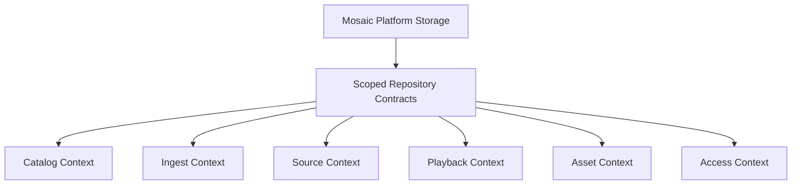

<!--
File: docs/engineering/guides/meg-007-storage-architecture/15-v2-storage-architecture.md
Document: MEG-007
Chapter: 15
Title: v2 Storage Architecture
Status: Draft
Version: 0.4
-->

# v2 Storage Architecture

> **Current direction:** PostgreSQL is Mosaic's authoritative state store. Modules use Platform-owned storage contracts and do not create independent databases.

This chapter records the v2 storage design supplied for the Mosaic Platform Foundation. It refines the existing storage taxonomy around one consistency domain, a shared object graph and logical bounded contexts.

## Ownership Rule

The Platform owns the storage authority, connection lifecycle, migrations, transactions, access policy, backup boundary and repository contracts.

Modules contribute domain behaviour and use scoped repositories or services exposed by the Platform. They do not own storage engines, bypass Platform policy or query another context's tables directly.

Bounded contexts own logical aggregates and persistence responsibility within the shared database. Logical ownership is not permission to create a fragmented storage system.



## Object Graph

Mosaic represents media through three related concepts:

- **Node** — a recursive Work, Container or Item tree;
- **Part** — a playable, readable or otherwise selectable edition/source belonging to an Item; and
- **Relation** — a graph edge for relationships that are not containment.

This supports variable-depth structures without media-specific table trees:

| Example | Node structure |
|---------|----------------|
| Movie | Work → Item |
| TV or anime series | Work → Season → Episode |
| Manga with volumes | Work → Volume → Chapter |
| Ongoing chapter-only manga | Work → Chapter |
| Album | Work → Disc → Track |
| Book | Work → Item or Chapter |

An edition or cut remains a Part, not a second media Node. Anime and its source manga remain separate Works connected by a Relation.

## PostgreSQL State Store

PostgreSQL is the single authoritative database for transactional and queryable Mosaic state. It stores the object graph, access state, source bindings, jobs, domain events, projections and control-plane records in one consistency domain.

The v2 design does not place PostgreSQL and DuckDB on competing critical paths. Analytical exports may be produced later, but a separate analytical database is not required for the Platform Foundation.

The core object tables are conceptually:

```text
nodes
parts
relations
source_bindings
users and access records
registered_devices and sessions
domain_events
jobs
```

## Logical Bounded Contexts

The contexts share PostgreSQL but preserve aggregate boundaries in code and through repository contracts:

| Context | Aggregate root | Primary responsibility |
|---------|----------------|------------------------|
| Catalog | Node | Identity, tree structure, relations and source bindings |
| Ingest | ImportJob | Discovery, staging, quarantine and import completion |
| Source | Source | Source registration, health and resolver state |
| Playback | PlaybackSession | Part selection, resume and playback policy |
| Asset | Asset | Artwork candidates, selection and blob lifecycle |
| Access | User | Accounts, permissions, device sessions and per-user state |

Cross-context work communicates through application services and domain events. Context code must not reach across another context's tables to bypass those boundaries.

## Transactional Event Outbox

Domain state changes and their corresponding events commit atomically:

```text
state change + domain_events row
        → one PostgreSQL transaction
        → commit
        → dispatcher wakes
        → in-process Event Bus fan-out
        → GraphQL subscriptions and workers
```

An undispatched event remains recoverable after restart. Background work uses the same PostgreSQL job queue with retry, dead-letter and `SKIP LOCKED` claiming semantics.

## Filesystem And `.mos` Canon

`.mos` files and `.mosaic` packages contain metadata, intent and references. They never contain primary media bytes.

Packages should be human-browsable and written at container granularity, such as one manifest per season or manga volume. Primary media remains in its native format: MKV, MP4, FLAC, EPUB, CBZ and similar formats.

## Blob Plane

Artwork, thumbnails, subtitles and generated assets use content-addressed blob storage. The database stores stable blob identifiers and metadata; it does not make physical paths part of Module or client contracts.

Primary media remains source-owned and is served through the Playback context without being wrapped in a custom Mosaic media container.

## GraphQL And Playback

GraphQL is a projection layer over Platform domain services. It contains no storage logic and may expose subscriptions backed by the Event Bus.

Playback resolves the best Part for the user and client, then serves local or remote bytes through a range-capable path. Import, enrichment and event processing must not block direct playback unnecessarily.

## Consequences

This design provides:

- one transaction and backup boundary;
- one source of truth for catalog, access and operational state;
- shared storage infrastructure without Module-owned database fragmentation;
- logical context ownership without synchronisation between separate engines;
- replayable domain events and recoverable background work; and
- a clear path from local deployment to larger PostgreSQL-backed installations.

The trade-off is that PostgreSQL is a Platform dependency rather than an optional implementation detail for the first deployment profile. A future embedded packaging strategy may improve installation UX without changing the storage contracts.
