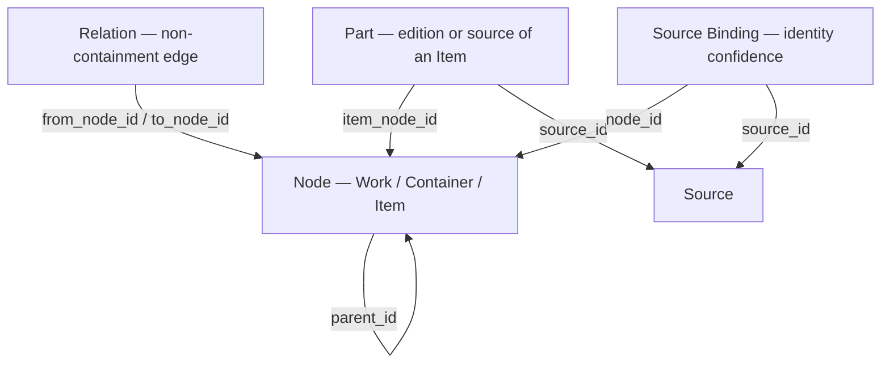

<!--
File: docs/engineering/guides/meg-007-storage-architecture/16-object-model.md
Document: MEG-007
Status: Draft
Version: 0.4
-->

# 16 — Object Model

> *One recursive tree and one relation graph express every media type, so the schema grows by data, not by tables.*

---

# Purpose

This chapter defines the Platform-owned **content object model** at field level. It is the schema realisation of the object graph introduced in [15 — v2 Storage Architecture](15-v2-storage-architecture.md), and it is the content-agnostic model that lets Modules store what they need without owning schema, per [MAD-002 — Module Storage and Delivery Model](../../architecture/mad-002-module-storage-and-delivery-model/index.md).

A flat, media-specific model accumulates a table tree per media type and an edge case per format. Mosaic instead uses one recursive tree for containment (**Node**), one graph layer for relationships that are not containment (**Relation**), a playable/readable unit (**Part**), and an identity-confidence record (**Source Binding**). Every media type maps onto these four concepts.

Arrows point from the record that holds the reference to the record it references.

---

# Node — The Tree

A Node is one position in a recursive, variable-depth tree. Depth is whatever a given Work's real structure needs, not a global constant.

| Field | Type | Purpose |
|-------|------|---------|
| `id` | time-sortable identifier | Stable node identity; time-sortable for index locality |
| `work_id` | node reference | Root Work the node belongs to; equals `id` for Work rows |
| `parent_id` | node reference, nullable | Parent in the tree; null only for Work-kind rows |
| `node_kind` | enum | `work`, `container` or `item` |
| `media_type` | enum | `movie`, `tv_series`, `anime_series`, `album`, `artist`, `book`, `audiobook`, `manga_series`, `comic_series`, `podcast`, `iptv_channel`, `collection`, … |
| `container_type` | enum, nullable | `season`, `volume`, `arc`, `disc`, `box_set` — set only when `node_kind = container` |
| `item_type` | enum, nullable | `episode`, `track`, `chapter`, `issue`, `feature`, `extra` — set only when `node_kind = item` |
| `title`, `sort_title` | text | Display and sort titles |
| `display_number` | text | Human label such as "Episode 5", "Vol. 3", "#12" |
| `natural_order` | fractional sort key | Order among siblings; fractional so "5.5" inserts without renumbering |
| `external_ids` | attribute map | Provider identifiers: `tmdb`, `tvdb`, `anilist`, `mal`, `isbn`, `musicbrainz`, … |
| `attributes` | attribute map | Per-type attributes: `runtime_minutes`, `page_count`, `explicit`, … |
| `overview` | text | Synopsis |
| `release_date`, `release_precision` | date + enum | Release date and its precision (`day`, `month`, `year`, `unknown`) |
| `canon_path` | text, nullable | Owning `.mosaic` path; null if never materialised |
| `state` | enum | `active`, `orphaned` or `quarantined` |
| `created_at`, `updated_at` | timestamps | Audit |

A movie is `Work → Item`. A television series is `Work → Container(season) → Item(episode)`. A chapter-only manga is `Work → Item` today and can grow a `Container(volume)` layer later by inserting a layer and re-parenting — the model does not change, only the rows do.

---

# Part — Editions And Sources

A Part is a playable, readable or otherwise selectable representation of an Item. Editions and cuts are Parts, not additional Nodes.

| Field | Type | Purpose |
|-------|------|---------|
| `id` | identifier | Part identity |
| `item_node_id` | node reference | The Item node this Part belongs to (`node_kind = item`) |
| `source_id` | source reference | Source that provides the bytes |
| `part_role` | enum | `primary`, `segment`, `edition` or `extra` |
| `edition_label` | text, nullable | "Director's Cut", "Theatrical" |
| `segment_index` | integer, nullable | Disc or part ordering for multi-part media |
| technical metadata | mixed | `container_format`, video/audio codec, channels, resolution, HDR format, bit depth, framerate, `duration_ms`, `file_size_bytes`, `bitrate_kbps`, derived `quality_tag` |
| `local_path` | text, nullable | Local file path when present |
| `remote_ref` | attribute map, nullable | Resolver key or provider stream identifier for remote sources |
| `attributes` | attribute map | Print or ebook attributes such as `page_count`, `color_profile` |
| `health_state`, `last_verified_at` | enum + timestamp | Availability tracking |

One Item can have many Parts: a theatrical and a director's cut of the same film are two Parts (`part_role = edition`) of one Item, not two Items. Multi-disc media uses `part_role = segment` ordered by `segment_index`, so playback source selection has one mechanism rather than two.

---

# Relation — The Graph Layer

Relations express relationships that are not containment. They are the graph layer over the Node tree.

| Field | Type | Purpose |
|-------|------|---------|
| `id` | identifier | Relation identity |
| `from_node_id`, `to_node_id` | node references | Edge endpoints |
| `relation_type` | enum | `adaptation`, `sequel`, `prequel`, `spinoff`, `collection_member`, `alternate_edition_of`, `same_franchise` |
| `confidence` | 0.0–1.0 | Confidence in the relationship |
| `origin` | enum | `system_inferred`, `provider_supplied` or `user_confirmed` |
| `created_at` | timestamp | Audit |

A Collection is a Node (`node_kind = work`, `media_type = collection`) with no Items of its own, connected to its members by `relation_type = collection_member`. Computing such a grouping is a background job that writes Relation rows; reading it back is an indexed join in the same store — no second engine, no synchronisation between two systems that could disagree about membership.

---

# Source Binding — Identity Confidence

A Source Binding records how confidently a Source is bound to a Node. It is where identity resolution lives.

| Field | Type | Purpose |
|-------|------|---------|
| `id` | identifier | Binding identity |
| `node_id` | node reference | Bound node |
| `source_id` | source reference | Bound source |
| `match_confidence` | 0.0–1.0 | Confidence of the match |
| `match_method` | enum | `external_id_exact`, `fingerprint`, `fuzzy_title` or `user_selected` |
| `status` | enum | `confirmed`, `pending_review` or `rejected` |
| `created_at` | timestamp | Audit |

- A **merge** is a binding with high confidence and `status = confirmed`.
- A **low-confidence match** lands as `pending_review` and is surfaced to the user rather than silently merging two different works that happen to share a title.
- A **split** moves a binding to a new `node_id`; the Source itself is never re-fingerprinted and nothing else in the graph has to know it happened.
- **Orphan handling** follows the same instinct: when a Node's last binding is removed it moves to `state = orphaned`, not deleted. Deletion is a user-confirmed decision surfaced through a maintenance read-model, never a silent cascade.

---

# Media Type Mapping

Every media type maps onto Work, Container and Item without a media-specific table tree.

| Type | Work | Container | Item |
|------|------|-----------|------|
| Movie | Film | — | Feature (extras as sibling Items) |
| TV or anime series | Series | Season | Episode |
| Manga (volumed) | Series | Volume | Chapter |
| Manga (ongoing, no volumes yet) | Series | — | Chapter |
| Comic run | Series | — (Arc optional) | Issue |
| Album | Album | Disc (if multi-disc) | Track |
| Book | Book | — | Full text, or Chapter Items |
| Audiobook | Book | — | Chapter |
| IPTV channel | Channel | — | *(EPG entries, not Nodes — see below)* |

Some deliberate non-uniformities, because forcing everything through one shape is its own defect:

- **Artists are not containers of albums.** Box sets, collaborations and various-artist compilations break single-parent containment. Artist is its own Work, joined to Album Works by Relation, not a parent.
- **Collected editions** (trade paperbacks, omnibuses) are their own Work, related to what they collect by `collection_member` — the same mechanism as any other collection.
- **Anime and its source manga** are two independent Works joined by `relation_type = adaptation`; they have separate Part structures and often diverge in canon.
- **IPTV EPG listings do not become Nodes.** A channel generates thousands of ephemeral programme entries a month; running identity, merge and relation machinery over guide data is waste. Those entries live in a lightweight `epg_entries` table keyed to the Channel node, refreshed and pruned on their own schedule.

---

# Identity And Ordering

- **Identity** is an engine-neutral, time-sortable identifier. Time-sortability gives natural index locality for insert-ordered data. The concrete scheme (for example UUIDv7 or ULID) is an implementation choice and does not change the model.
- **Ordering** among siblings uses `natural_order`, a fractional sort key. A fractional key lets a new item slot between two existing ones (for example "5.5") without renumbering siblings. The exact fractional scheme at very large scale is an open question, recorded below.

---

# PostgreSQL Realisation

The object model is logical; PostgreSQL is its first adapter, consistent with [15 — v2 Storage Architecture](15-v2-storage-architecture.md).

- `external_ids` and `attributes` are `JSONB`, indexed with `GIN`, so per-type fields need no per-type columns.
- `btree(parent_id, natural_order)` serves the single most common query in any media browser — "children of this node, in order" — as a plain indexed scan with no read-time recursion.
- Nodes, Parts, Relations and Source Bindings live in one consistency domain, so grouping jobs, projections and reads never cross an engine boundary.

These are the PostgreSQL realisation of the model, not the model itself; another adapter satisfying the storage contracts would make its own indexing choices.

---

# How Modules Use The Model

A content Module maps its data onto Node, Part, Relation and the `external_ids` / `attributes` maps. It does not add tables or change schema.

Adding a new media type is a new `media_type` value, an attribute shape and a mapping row — data and configuration, not a migration authored by a Module. A Module that appears to need a genuinely new data-owning domain, rather than new data within this model, is proposing Platform and SDK evolution, decided deliberately through the [Capability Model](../../architecture/mac-001-platform-architecture/03-capability-model.md), per [MIP-005 — Module Adapter Contract Protocol](../../protocols/mip-005-module-adapter-contract-protocol/index.md) and [MAD-002](../../architecture/mad-002-module-storage-and-delivery-model/index.md).

The `.mosaic` on-disk canon, blob plane and playback path that consume this model are defined in [06 — MOS Archives](06-mos-archives.md), [05 — Blob Storage](05-blob-storage.md) and [15 — v2 Storage Architecture](15-v2-storage-architecture.md); this chapter defines only the object model itself.

---

# Open Questions

- The concrete identifier scheme (for example UUIDv7 versus ULID).
- The fractional-ordering scheme for `natural_order` at large scale.
- Relation confidence: decay, or periodic reverification policy.
- A single shared schema versus per-context schema separation for the bounded contexts in [15 — v2 Storage Architecture](15-v2-storage-architecture.md).

---

# Summary

Four concepts — Node, Part, Relation and Source Binding — express every Mosaic media type in one consistency domain. New content is new rows and new attribute data, never a new table tree, which is exactly what allows Modules to use Platform storage rather than own it.
