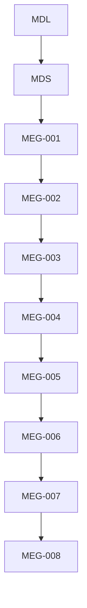
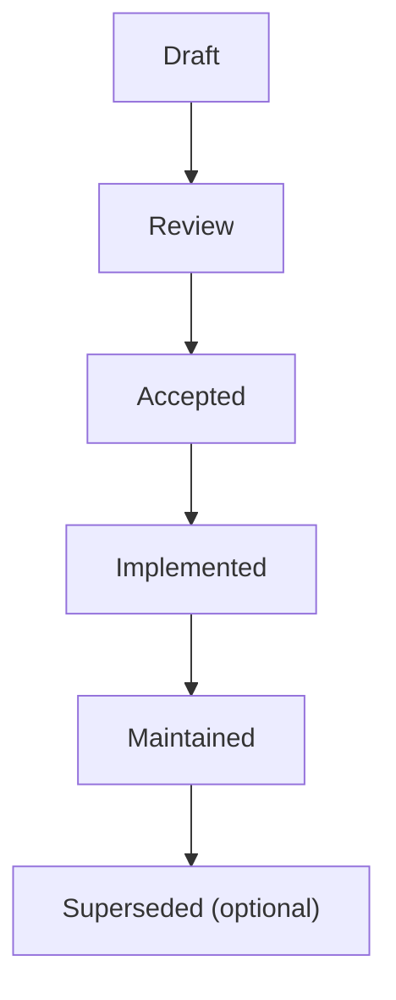

<!--
File: docs/engineering/guides/meg-008-observability/00-document-control.md
Document: MEG-008
Status: Draft
-->

# Document Control

---

# Document Information

| Field | Value |
|---------|--------|
| Document ID | MEG-008 |
| Title | Observability |
| File | 00-document-control.md |
| Status | Draft |
| Owner | AdamNi-7080 |
| Classification | Internal Architecture Specification |

---

# Purpose

This document establishes the governance, authority and lifecycle of the Mosaic Observability specification.

MEG-008 defines how the Mosaic platform exposes operational insight into every architectural layer.

Unlike previous specifications, which define:

- engineering
- runtime
- storage
- capabilities

this specification defines:

> **How those systems become observable.**

Observability is treated as a first-class architectural concern rather than an operational afterthought.

---

# Authority

MEG-008 is the authoritative specification governing observability throughout the Mosaic platform.

This specification applies to:

- Runtime Kernel
- Runtime Services
- Capabilities
- Storage Systems
- Module Platform
- SDK
- Operational Tooling

Every subsystem SHOULD expose operational information in accordance with this specification.

---

# Relationship to Other Specifications

MEG specifications intentionally build upon one another.

Specifically:

- **[MEG-001](../meg-001-go-engineering-standards/index.md)** defines engineering.
- **[MEG-002](../meg-002-event-driven-runtime/index.md)** defines Runtime behaviour.
- **[MEG-003](../meg-003-domain-driven-design/index.md)** defines business modelling.
- **[MEG-004](../meg-004-hexagonal-architecture/index.md)** defines architectural boundaries.
- **[MEG-005](../meg-005-runtime-architecture/index.md)** defines Runtime Architecture.
- **[MEG-006](../meg-006-module-platform/index.md)** defines the Module Platform.
- **[MEG-007](../meg-007-storage-architecture/index.md)** defines Storage Architecture.
- **MEG-008** defines how every previous architectural layer becomes operationally visible.

Together they describe both how the platform works and how operators understand it.

---

# Normative Language

Unless explicitly stated otherwise, the following keywords are interpreted according to RFC 2119.

| Keyword | Meaning |
|----------|---------|
| **MUST** | Mandatory requirement. |
| **MUST NOT** | Prohibited behaviour. |
| **SHOULD** | Strong recommendation. Deviation requires architectural justification. |
| **SHOULD NOT** | Discouraged except where clearly justified. |
| **MAY** | Optional behaviour based upon engineering judgement. |

Examples and diagrams are informative unless explicitly identified as normative.

---

# Observability Principles

The Mosaic Observability Architecture is built upon several foundational principles.

- Every Runtime decision should be observable.
- Every capability should report its operational health.
- Logs describe events.
- Metrics describe trends.
- Traces describe journeys.
- Health describes readiness.
- Diagnostics describe architecture.
- Business behaviour remains separate from operational telemetry.

Every subsequent chapter expands one or more of these principles.

---

# Document Lifecycle

MEG specifications evolve alongside the platform.

Each document progresses through the following lifecycle.

Accepted specifications become part of the canonical Mosaic architecture.

Historical revisions SHOULD remain available for future reference.

---

# Observability Evolution

Observability is expected to evolve.

However, changes affecting:

- logging strategy
- metrics taxonomy
- tracing model
- health model
- diagnostic interfaces
- telemetry contracts

SHOULD be accompanied by an Architectural Decision Record (ADR).

Observability should evolve intentionally.

Not reactively.

---

# Compliance

All Runtime components SHOULD comply with MEG-008.

Where deviation becomes necessary, contributors SHOULD document:

- architectural reason
- affected telemetry
- operational impact
- migration strategy

Observability gaps should remain temporary wherever possible.

---

# Design Philosophy

MEG-008 intentionally favours:

- structured telemetry
- explicit ownership
- low operational ambiguity
- deterministic diagnostics
- platform-wide consistency
- implementation independence

The platform should explain itself through architecture.

Operators should not require source code to understand:

- Runtime behaviour
- capability interactions
- storage health
- platform state

---

# Scope of Authority

MEG-008 governs observability architecture.

It does **not** define:

- business behaviour
- Runtime execution
- storage implementation
- deployment infrastructure

Those concerns belong to previous engineering specifications.

Observability describes those systems.

It does not implement them.
