<!--
File: docs/engineering/guides/meg-008-observability/01-observability-philosophy.md
Document: MEG-008
Status: Draft
Version: 0.4
-->

# Observability Philosophy

> *Monitoring tells you something is wrong. Observability explains why.*

---

# Purpose

Modern software platforms execute enormous amounts of work.

Within Mosaic this includes:

- Runtime scheduling
- capability execution
- event delivery
- storage operations
- metadata processing
- streaming
- module execution

Understanding this behaviour requires more than logs.

The platform must expose enough information to answer previously unknown operational questions.

This is the purpose of Observability.

Observability is not another Runtime feature.

It is a property of good architecture.

---

# Philosophy

Within Mosaic:

> **Every significant architectural decision should produce observable evidence.**

If the Runtime performs work, operators should be able to answer:

- What happened?
- Why did it happen?
- How long did it take?
- What depended upon it?
- What failed?
- What recovered?

Without attaching debuggers.

Without reading source code.

Without reproducing production failures.

---

# Observability Is Architecture

Observability is frequently misunderstood as:

- logging
- dashboards
- monitoring

These are outputs.

Observability begins much earlier.

It begins when architectural boundaries produce meaningful operational information.

Every previous MEG contributes to Observability.

Examples.

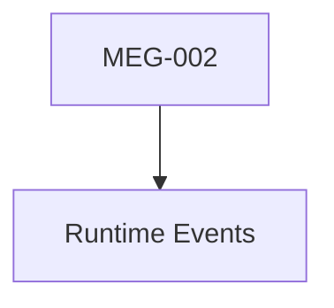

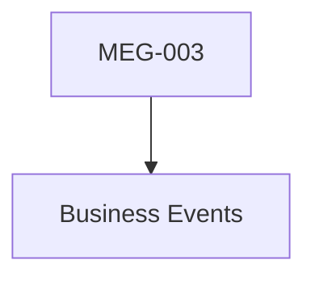

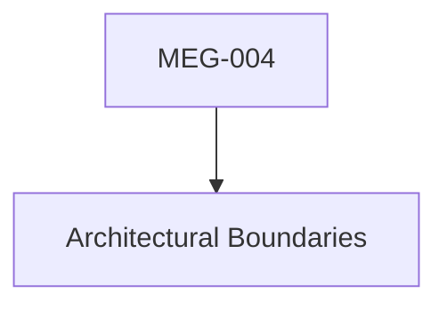

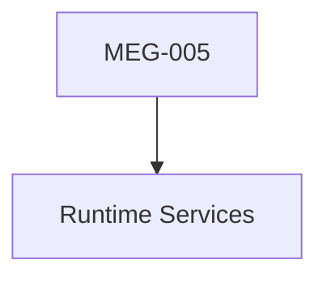

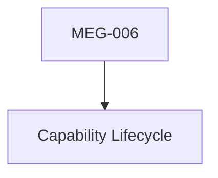

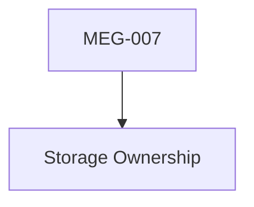

The architecture itself creates the telemetry.

---

# Observability Answers Questions

Traditional monitoring answers:

> **Is the system healthy?**

Observability answers:

> **Why is the system behaving this way?**

Examples.

```

Why did startup take 14 seconds?
```

```

Why is Recommendation slow?
```

```

Why is Artwork rebuilding continuously?
```

```

Which Runtime Event caused this execution?
```

The platform should already possess these answers.

Observability simply exposes them.

---

# Three Views Of The Platform

Every Runtime operation can be viewed through three complementary perspectives.

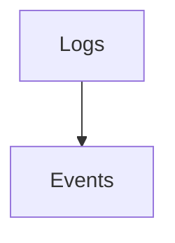

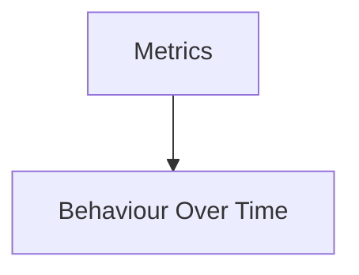

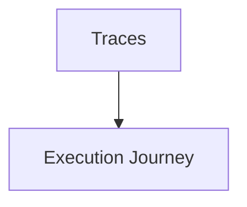

Each answers different operational questions.

None replaces another.

---

# Logs Describe Events

Logs answer:

> **What happened?**

Examples.

```

Capability Activated
```

```

Worker Failed
```

```

Storage Rebuilt
```

Logs should describe meaningful architectural events.

Not individual implementation details.

---

# Metrics Describe Trends

Metrics answer:

> **How is the platform behaving over time?**

Examples include:

- queue depth
- worker utilisation
- cache hit ratio
- storage growth
- startup duration

Metrics describe patterns.

Not individual occurrences.

---

# Traces Describe Journeys

Traces answer:

> **How did this particular piece of work move through the platform?**

Example.

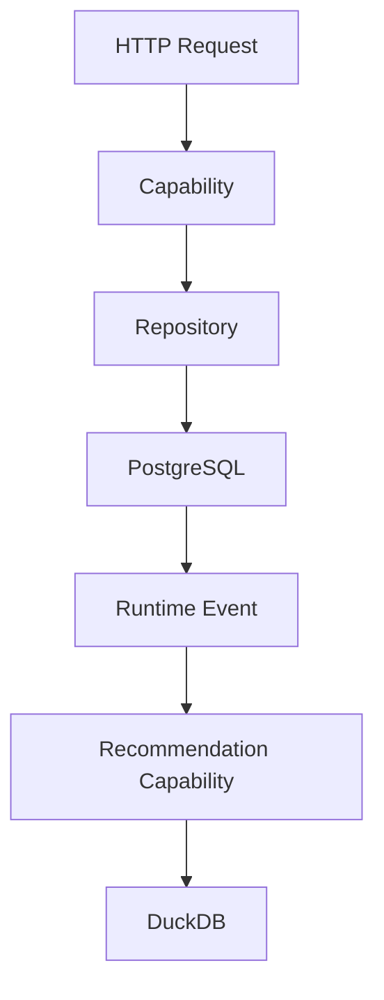

A trace explains one execution path.

It should cross every architectural boundary naturally.

Distributed tracing has become the standard approach for understanding request flow across complex systems because it captures the end-to-end execution journey rather than isolated events.

---

# Health Is Different

Health does not describe behaviour.

Health answers:

> **Can this component currently perform its responsibility?**

Examples.

```

Ready
```

```

Healthy
```

```

Degraded
```

```

Unavailable
```

Health should remain independent from:

- logging
- metrics
- tracing

Each solves a different operational problem.

---

# Diagnostics Explain Architecture

Diagnostics expose Runtime structure.

Examples include:

- capability graph
- dependency graph
- worker pools
- scheduler state
- storage ownership

Diagnostics should answer:

> **How is the platform currently assembled?**

This differs fundamentally from observing execution.

---

# Every Layer Is Observable

Every architectural layer should expose telemetry.

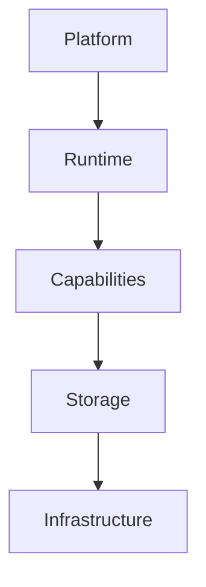

Each layer exposes:

- logs
- metrics
- traces
- health

No architectural layer should become opaque.

---

# Business Versus Operations

One of the most important distinctions within Mosaic is:

Business Events.

```

Playback Completed
```

Operational Events.

```

Worker Allocated
```

Business Events describe:

The product.

Operational telemetry describes:

The platform.

These concepts should never be confused.

---

# Architecture First

A useful principle is:

> **If a Runtime Service owns a responsibility, it owns the telemetry describing that responsibility.**

Examples.

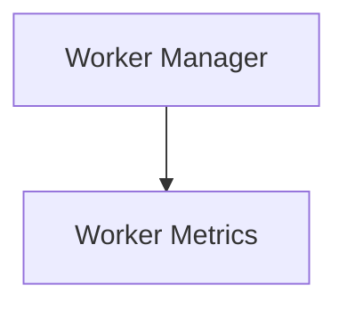

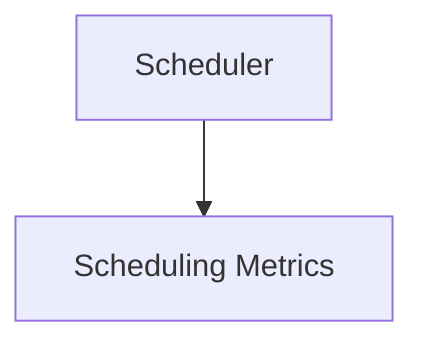

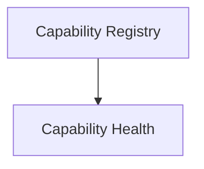

Telemetry ownership follows architectural ownership.

---

# Observability Should Be Boring

Good observability should feel unsurprising.

Operators should instinctively know:

- where to look
- which metrics exist
- which logs exist
- which traces exist

Consistency is more valuable than novelty.

---

# Structured By Architecture

Observability should mirror the Runtime Architecture.

Example.

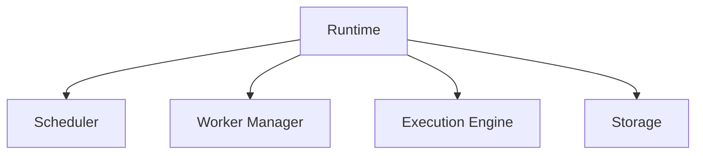

Telemetry should naturally follow the same hierarchy.

Operators should recognise the architecture simply by examining the telemetry.

---

# Unknown Unknowns

The defining characteristic of observability is:

Answering questions that were not anticipated when the software was written.

This requires:

- rich context
- architectural ownership
- consistent telemetry

Rather than:

- ad hoc logging
- temporary debug statements

Observability should be designed.

Not improvised.

---

# Cost Matters

Observability is not free.

Every:

- log
- metric
- trace

has:

- storage cost
- CPU cost
- bandwidth cost

Telemetry should therefore remain:

- intentional
- structured
- valuable

Not exhaustive.

Collecting everything generally produces noise rather than insight.

---

# Privacy

Operational telemetry should avoid exposing:

- secrets
- credentials
- personal information
- protected content

Observability should improve understanding without compromising privacy.

Sensitive information belongs in Security Architecture ([MEG-009](../meg-009-security-architecture/index.md)).

---

# Mosaic Principles

Within Mosaic:

- Every Runtime responsibility should produce telemetry.
- Telemetry ownership follows architectural ownership.
- Business Events remain distinct from operational telemetry.
- Logs describe events.
- Metrics describe trends.
- Traces describe journeys.
- Diagnostics describe architecture.
- Health describes readiness.
- Observability should remain implementation independent.

These principles define the observability philosophy of the Mosaic platform.

---

# Relationship to MEG

Previous specifications answered:

- How work executes.
- How storage behaves.
- How capabilities evolve.

MEG-008 now begins answering:

> **How do we understand everything that has already been built?**

The remaining chapters define the specific observability mechanisms beginning with **Structured Logging**, the Runtime's primary record of operational events.

---

# Summary

Observability is not another subsystem.

It is the architectural language through which the platform explains itself.

Within Mosaic:

- Runtime Services describe execution.
- Capabilities describe business behaviour.
- Storage describes persistence.
- Observability ties them together.

A healthy platform should never leave operators asking:

> **What just happened?**

It should already have the answer.
