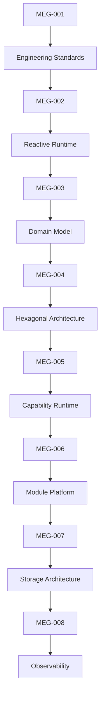
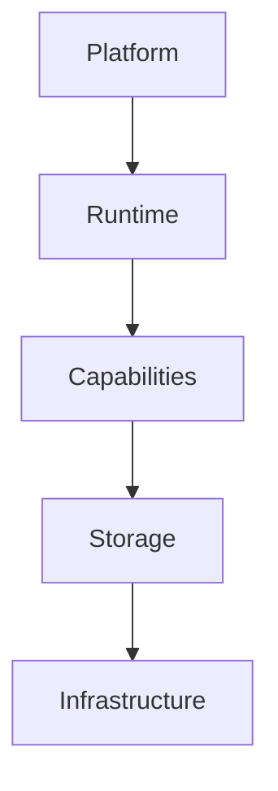

<!--
File: docs/engineering/guides/meg-008-observability/index.md
Document: MEG-008
Status: Draft
-->

# MEG-008 — Observability

> *If the Runtime cannot explain what it is doing, it cannot be trusted to do it.*

---

# Purpose

Previous engineering specifications established:

- how software is written
- how work executes
- how the business is modelled
- how architecture is structured
- how the Runtime operates
- how the platform evolves
- how information is stored

MEG-008 answers the next operational question.

> **How do we understand what the platform is doing while it is running?**

Observability is considerably more than logging.

Within Mosaic it encompasses:

- logging
- metrics
- tracing
- health
- diagnostics
- runtime inspection
- capability visibility
- storage visibility

Observability should be designed into the platform.

Not added afterwards.

---

# Relationship to MEG



Previous specifications define:

> **How the platform behaves.**

MEG-008 defines:

> **How the platform explains that behaviour.**

---

# Scope

This specification defines:

- Observability philosophy
- Logging architecture
- Metrics architecture
- Distributed tracing
- Runtime health
- Capability health
- Storage observability
- Runtime diagnostics
- Performance telemetry
- Audit events
- Alerting
- Debugging interfaces
- OpenTelemetry integration
- Operational dashboards

This specification intentionally does **not** define:

- business behaviour
- runtime execution
- storage implementation
- deployment topology

Those concerns belong to previous MEG specifications.

---

# Guiding Question

MEG-008 exists to answer one question.

> **How should Mosaic expose enough operational information to understand, diagnose and improve the platform without leaking implementation complexity into business code?**

---

# Observability Statement

Within Mosaic:

> **Every Runtime decision should be explainable.**

Operators should always be able to answer questions such as:

- What is executing?
- Which capability is slow?
- Why did activation fail?
- Which dependency is blocking startup?
- Why is storage growing?
- Which worker is overloaded?
- Which event triggered this behaviour?

The Runtime should already know these answers.

Observability simply exposes them.

---

# Observability Hierarchy

Observability intentionally follows the platform architecture.



Every layer exposes:

- logs
- metrics
- traces
- health

The platform should explain itself at every architectural boundary.

---

# Expected Outcome

After reading MEG-008 contributors should understand:

- how Runtime behaviour is observed
- how capabilities report health
- how traces flow through the platform
- how metrics are structured
- how logs remain useful
- how diagnostics expose architecture
- how observability integrates with every previous MEG

without changing business behaviour.

---

# Repository Structure

```text
engineering/

└── meg/

    └── meg-008-observability/

        index.md

        00-document-control.md

        01-observability-philosophy.md

        02-logging.md

        03-metrics.md

        04-distributed-tracing.md

        05-health-model.md

        06-runtime-diagnostics.md

        07-storage-observability.md

        08-performance-telemetry.md

        09-alerting.md

        10-debugging.md

        11-opentelemetry.md

        12-observability-guidelines.md

        13-adrs.md

        14-contributor-guidance.md

        references.md

        glossary.md
```

---

# Dependencies

Required reading:

- [MEG-001 — Go Engineering Standards](../meg-001-go-engineering-standards/index.md)
- [MEG-002 — Event-Driven Runtime](../meg-002-event-driven-runtime/index.md)
- [MEG-003 — Domain-Driven Design](../meg-003-domain-driven-design/index.md)
- [MEG-004 — Hexagonal Architecture](../meg-004-hexagonal-architecture/index.md)
- [MEG-005 — Runtime Architecture](../meg-005-runtime-architecture/index.md)
- [MEG-006 — Module Platform](../meg-006-module-platform/index.md)
- [MEG-007 — Storage Architecture](../meg-007-storage-architecture/index.md)

Future companion specifications:

- [MEG-009 — Security Architecture](../meg-009-security-architecture/index.md)
- [MEG-010 — Performance Engineering](../meg-010-performance-engineering/index.md)
- MEG-011 Deployment Architecture *(planned; not yet published)*

---

# Design Goals

The Observability Architecture is intended to produce a platform that is:

- Explainable
- Observable
- Measurable
- Traceable
- Diagnosable
- Deterministic
- Operationally transparent
- Production ready

The platform should answer operational questions through architecture rather than manual debugging.
