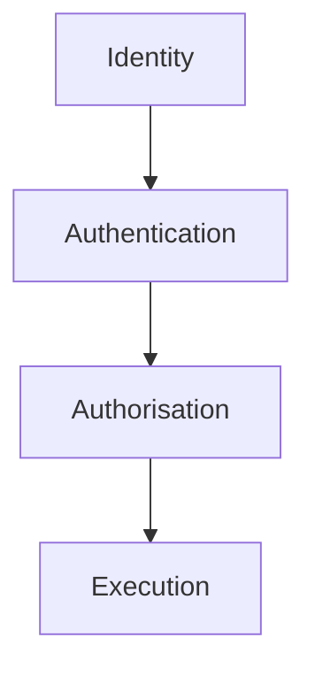
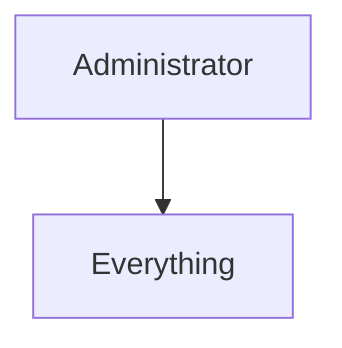
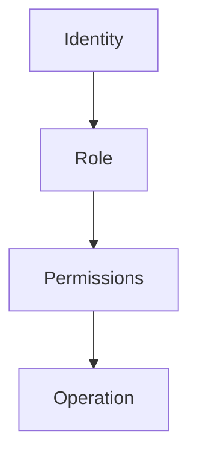
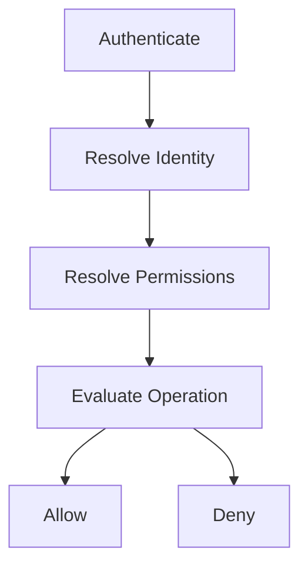
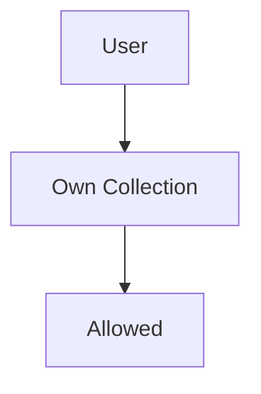
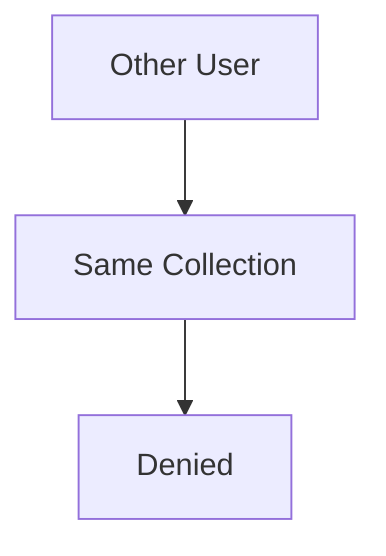
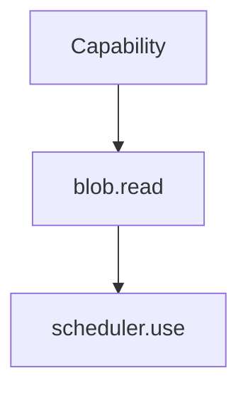
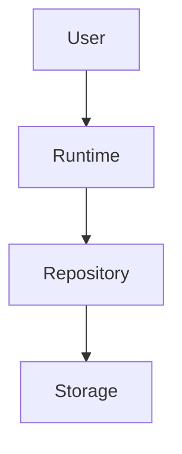
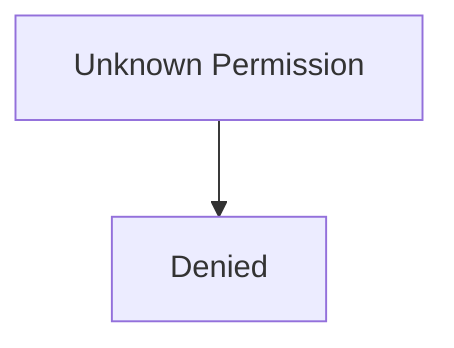

<!--
File: docs/engineering/guides/meg-009-security-architecture/04-authorisation.md
Document: MEG-009
Status: Draft
Version: 0.4
-->

# Authorisation

> *Authentication proves identity. Authorisation determines authority.*

---

# Purpose

Authentication establishes:

> **Who is making the request?**

Authorisation determines:

> **May they perform this operation?**

Every operation performed within Mosaic should be authorised according to:

- identity
- permissions
- ownership
- Runtime policies

Authorisation protects both:

- the platform
- the information managed by the platform

Identity without authorisation is insufficient.

---

# Philosophy

Within Mosaic:

> **Authority should always be explicit, minimal and reviewable.**

The Runtime should never infer authority from:

- identity
- capability
- implementation
- installation

Authority must be granted deliberately.

Every permission should be explainable.

---

# Authentication Before Authorisation

Every protected operation follows the same sequence.



Capabilities should never receive requests that have not already passed authorisation.

The Runtime owns access control.

Capabilities own business behaviour.

---

# What Is Authorisation?

Authorisation answers one question.

> **Is this identity permitted to perform this operation?**

It does **not** answer:

- who the identity is
- whether the request is valid
- how the operation executes

Those responsibilities belong elsewhere.

---

# Authorisation Scope

Authorisation applies to:

- API operations
- administrative interfaces
- capability operations
- storage operations
- diagnostic interfaces

The Runtime should evaluate authority consistently across every entry point.

---

# Least Privilege

Every identity begins with:

```text
No Authority
```

Authority is granted only as required.

Good.

```text
View Library
```

Poor.



The platform should continually minimise authority.

Not maximise convenience.

---

# Permission Model

Authorisation evaluates:



Every successful operation should be traceable back to one explicit permission.

Authority should never be accidental.

---

# Roles

Mosaic uses a hybrid authorisation model combining Role-Based Access Control, Relationship-Based Access Control and Attribute-Based Access Control.

Roles provide a small, understandable baseline. Relationships express ownership and sharing. Attributes express context that can change between requests.

The Runtime MUST resolve all three through one Platform-owned Policy Decision Point.

## Role-Based Access Control

The Runtime MAY group permissions into roles.

Examples include:

```text
Viewer
```

```text
Member
```

```text
Administrator
```

```text
Service Account
```

Roles simplify administration.

Permissions remain the true source of authority.

Mosaic should begin with a deliberately small role set:

- Owner
- Administrator
- Member
- Viewer
- Service Account

Roles are permission bundles, not the complete authorisation model.

## Relationship-Based Access Control

Resource relationships express authority that roles cannot describe safely.

Examples include:

- user owns a library,
- user belongs to a household,
- user is granted access to a collection,
- device belongs to a user,
- Module provides a capability.

Relationships MUST be evaluated against the requested resource. A user’s `Library.Read` permission does not automatically grant access to every library.

## Attribute-Based Access Control

ABAC attributes provide request context without creating a new role for every situation.

Supported attributes may include:

- authentication method and strength,
- session age,
- registered-device state,
- device category,
- network or trust zone,
- resource classification,
- policy state and time bounds.

Attributes are inputs to policy evaluation. They are not authority by themselves.

## Policy Decision Point

Every protected decision evaluates:

```text
Subject + Action + Resource + Context
```

For example:

```yaml
subject:
  user: adam
  roles: [Member]
  relationship: library_member
action: playback.start
resource:
  library: Anime
  media: attack-on-titan
context:
  device: living-room-tv
  authentication_strength: passkey
  device_revoked: false
```

The Policy Decision Point MUST:

- default to deny,
- apply explicit deny before allow,
- return an explainable decision,
- emit an auditable decision record, and
- invalidate or constrain cached decisions when relevant policy changes.

Clients and Modules request decisions through Platform contracts. They must not implement parallel policy engines.

## Device And Session Intersection

A device session receives no more authority than the authenticated user and the device policy permit:

```text
Effective Authority = User Authority ∩ Device Policy ∩ Session State
```

Phone-assisted TV sign-in authenticates and authorises the TV session; it does not copy the phone’s unrestricted session. A revoked device or expired session immediately removes its effective authority.

---

# Permission Evaluation

Every protected request follows the same process.



Permission evaluation should remain deterministic.

The same request should always produce the same result.

---

# Capability Operations

Capabilities SHOULD declare protected operations.

Examples include:

```text
Library.Read
```

```text
Playback.Start
```

```text
Collection.Edit
```

The Runtime evaluates authority before the capability executes.

Capabilities should not perform platform-level authorisation checks.

---

# Administrative Operations

Administrative operations require elevated authority.

Examples include:

- install capability
- remove capability
- modify Runtime configuration
- access diagnostics
- manage users

Administrative authority should remain explicit.

Operational convenience should never weaken platform security.

---

# Ownership

Business ownership may influence authorisation.

Example.





Ownership remains a business concept.

The Runtime provides the authorisation framework.

Capabilities evaluate business ownership where appropriate.

---

# Resource Authorisation

Different resources require different permissions.

Examples.

```text
Library.Read
```

```text
Playback.Control
```

```text
Metadata.Refresh
```

```text
Capability.Install
```

Permissions should describe business intent.

Not implementation.

---

# Capability Permissions

Capabilities themselves also operate under permissions.

Example.



User permissions and capability permissions remain independent.

One protects users.

The other protects the Runtime.

---

# Storage Authorisation

Repositories should never bypass Runtime authorisation.

Flow.



Storage systems should trust the Runtime.

Not individual callers.

---

# Diagnostics Authorisation

Runtime diagnostics expose sensitive operational information.

Examples include:

- dependency graph
- worker state
- configuration
- traces

Diagnostic access SHOULD require explicit administrative permissions.

Operational visibility should remain protected.

---

# Default Deny

When authorisation cannot determine whether an operation should be allowed:

The Runtime MUST deny it.

Example.



Explicit denial is considerably safer than implicit access.

---

# Permission Revocation

Permissions SHOULD be revocable immediately.

Examples include:

- administrator removed
- capability disabled
- token revoked
- session revoked

Future requests should immediately reflect updated authority.

Revocation should not require Runtime restart.

---

# Auditability

Every authorisation decision SHOULD be auditable.

Examples include:

- permission granted
- permission denied
- administrator override
- role assignment

Operators should answer:

> **Why was this operation allowed?**

Authorisation should remain explainable.

---

# Runtime Independence

Capabilities should remain independent from authorisation implementation.

Capabilities consume:

```text
Authorised Request
```

They should never inspect:

- JWT claims
- OAuth scopes
- session cookies

The Runtime translates identity into authority.

Capabilities receive business requests.

---

# Performance

Authorisation SHOULD remain inexpensive.

Permission evaluation occurs frequently.

Avoid:

- expensive database lookups
- repeated permission resolution
- unnecessary recomputation

Authority should be resolved efficiently while remaining correct.

---

# Security Observability

Authorisation decisions SHOULD generate:

- structured logs
- metrics
- traces
- audit events

Denied operations are frequently more valuable operational signals than successful ones.

Security telemetry is expanded later in this specification.

---

# Testing

Authorisation SHOULD be tested explicitly.

Typical tests verify:

- permission grants
- permission denial
- role changes
- ownership checks
- revocation

Authorisation should remain deterministic.

Security behaviour should never depend upon implementation accidents.

---

# Anti-Patterns

The following practices are prohibited.

## Authentication Equals Authorisation

Granting access solely because authentication succeeded.

---

## Capability-Level Security

Capabilities implementing platform-wide permission systems.

---

## Implicit Roles

Roles possessing undocumented permissions.

---

## Runtime Bypass

Repositories or storage bypassing Runtime authorisation.

---

## Hard-Coded Administrators

Embedding privileged identities inside implementation.

---

## Default Allow

Permitting operations because permission evaluation failed.

---

# Mosaic Guidelines

Within Mosaic:

- Authentication MUST precede authorisation.
- Authority MUST remain explicit.
- Least privilege MUST remain the default.
- Capabilities MUST remain independent of Runtime authorisation.
- Administrative operations MUST require explicit authority.
- Unknown permissions MUST be denied.
- Permission revocation SHOULD take effect immediately.
- Authorisation decisions SHOULD remain observable and auditable.

---

# Relationship to MEG

Authentication answers:

> **Who is making the request?**

Authorisation answers:

> **What are they allowed to do?**

The next chapter introduces **Capability Permissions**, defining how the Runtime grants authority to capabilities themselves, ensuring modules and Platform capabilities execute with only the permissions explicitly declared in their manifests.

---

# Summary

Authorisation is the Runtime's decision engine for authority.

It transforms:

- authenticated identities
- explicit permissions
- architectural ownership

into one deterministic outcome:

> **Allow** or **Deny**

Within Mosaic, every successful operation should be explainable by one explicit authorisation decision.

If the Runtime cannot explain why access was granted, then access should not have been granted at all.
