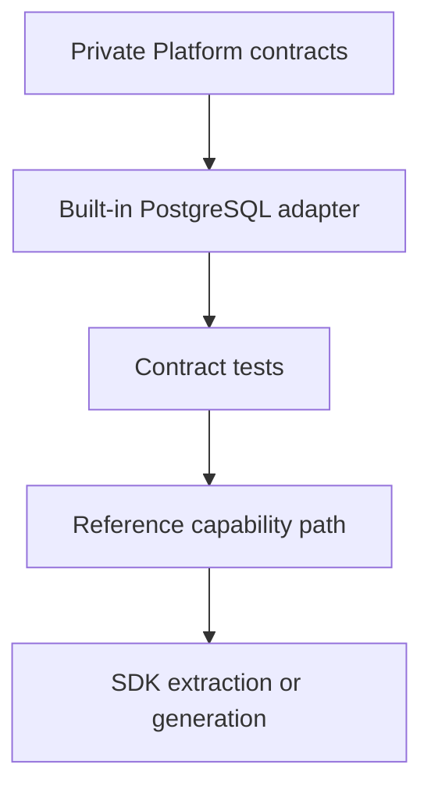

<!--
File: docs/engineering/guides/meg-015-platform-foundation-implementation/01-build-scope.md
Document: MEG-015
Status: Draft
-->

# 01 — Build Scope

---

# In Scope

The first Platform implementation includes the minimum runtime required for local, durable, extensible Mosaic operation:

| Area | First implementation requirement |
|------|----------------------------------|
| Runtime | Boot, shutdown, lifecycle, health and dependency wiring |
| Identity | Local users, passkeys-ready account model, passwords if enabled, sessions and remote sign-in tokens |
| Policy | Permission checks at application service boundaries |
| Storage | PostgreSQL adapter, migrations, repositories, transaction handling and outbox persistence |
| Events | In-process Event Bus backed by the transactional outbox |
| Configuration | Admin-editable configuration, activation versions and safe reload classification |
| Secrets | Secret broker with OS keychain preference and encrypted vault fallback |
| GraphQL | Command and read projection boundary, not direct database access |
| Diagnostics | Component health, local logs and redacted support bundle foundation |
| Supervisor handoff | Health endpoint and Generation metadata required for activation |

---

# Out of Scope

The first Platform implementation must not attempt to build:

- optional third-party Modules;
- the full public SDK;
- media-specific product behaviour;
- Mosaic Shell visual implementation;
- remote cloud identity providers;
- white-label branding;
- multiple database providers; or
- distributed runtime execution.

The implementation should leave clean boundaries for those later systems without implementing them early.

---

# Platform First Principle

The Platform should be built as a working private application before it is published as an ecosystem surface.

This avoids freezing SDK names before the first adapter proves the contracts.
