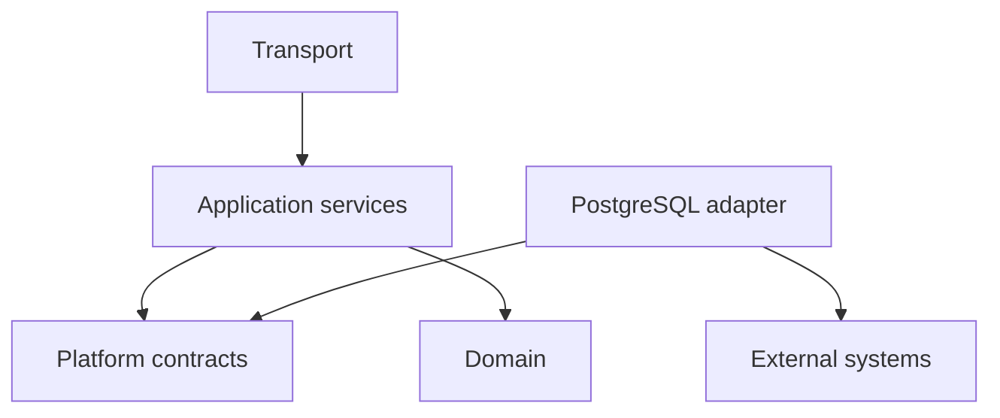

<!--
File: docs/engineering/guides/meg-015-platform-foundation-implementation/02-repository-layout.md
Document: MEG-015
Status: Draft
Version: 0.1
-->

# 02 — Repository Layout

---

# Initial Layout

The initial Go repository should separate public entry points, internal Platform code and future generated contracts.

```text
cmd/
  mosaic-platform/
    main.go
internal/
  platform/
    app/
    contracts/
    domain/
    runtime/
    policy/
    sessions/
    config/
    secrets/
    diagnostics/
  adapters/
    postgres/
    filesystem/
    crypto/
  transport/
    graphql/
    health/
  composition/
    builtin/
contracts/
  platform/
    v1/
test/
  contract/
  integration/
  fixtures/
```

The exact names may change during implementation, but the dependency rules must not.

---

# Package Responsibilities

| Package area | Responsibility |
|--------------|----------------|
| `cmd/mosaic-platform` | Process entry point and dependency bootstrap only |
| `internal/platform/app` | Application services, transaction orchestration and command handling |
| `internal/platform/contracts` | Private contract definitions used before SDK extraction |
| `internal/platform/domain` | Platform domain types and invariants |
| `internal/platform/runtime` | Lifecycle, registry, startup and shutdown |
| `internal/platform/policy` | Permission decision and enforcement helpers |
| `internal/platform/sessions` | Session issuance, validation and revocation |
| `internal/platform/config` | Configuration schema, validation and activation |
| `internal/platform/secrets` | Secret access through broker interfaces |
| `internal/platform/diagnostics` | Health model, logs and redaction |
| `internal/adapters/postgres` | PostgreSQL implementation of storage, migrations and outbox |
| `internal/transport/graphql` | GraphQL projection and command transport |
| `internal/transport/health` | Supervisor-facing health endpoints |
| `internal/composition/builtin` | Built-in Module and adapter registration |
| `contracts/platform/v1` | Candidate source for generated SDK contracts |
| `test/contract` | Adapter contract tests reused across implementations |

---

# Dependency Direction

Implementation dependencies must point inward.



The domain must not import transport, adapter or database packages. Application services may depend on contracts, but not on concrete PostgreSQL types.

---

# Public Surface Control

Only `contracts/platform/v1` may be treated as a candidate public contract source. Everything under `internal/` is private and must not be imported by Modules.

Before SDK generation exists, tests should enforce this with import checks.
