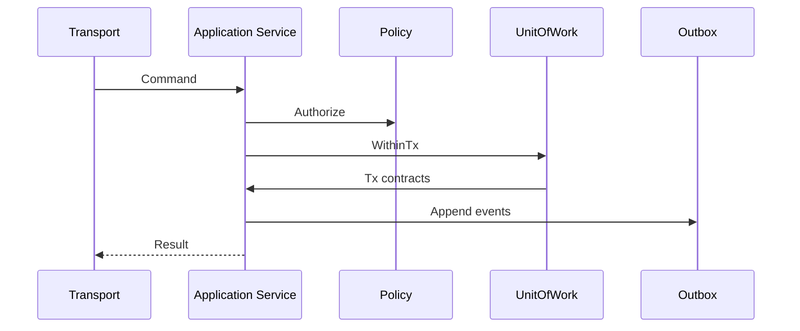

<!--
File: docs/engineering/guides/meg-015-platform-foundation-implementation/04-application-boundaries.md
Document: MEG-015
Status: Draft
Version: 0.1
-->

# 04 — Application Boundaries

---

# Application Service Rule

All state-changing Platform operations must enter through application services.

Transports decode requests and encode responses. They must not own transactions, policy checks or persistence decisions.

---

# Command Boundary

Each command handler should follow the same order:

1. validate command shape;
2. authenticate caller;
3. authorize action through policy;
4. open a `UnitOfWork`;
5. load state through contracts;
6. apply domain rules;
7. persist state and outbox events in the same transaction; and
8. return a Platform result type.

---

# Query Boundary

Queries may use optimized read contracts, but they must still pass through policy.

GraphQL resolvers must not query PostgreSQL directly. A resolver calls an application query service, which chooses the appropriate read contract or projection.

---

# Transaction Boundary

Only application services decide whether a transaction is required.

Adapters provide transaction mechanics; they do not decide business transaction scope.

---

# Policy Boundary

Policy checks must be explicit in application services.

The first implementation may use a simple local policy engine, but it must keep the ABAC-ready shape from [MEG-009 — Security Architecture](../meg-009-security-architecture/index.md): subject, action, resource and context.
