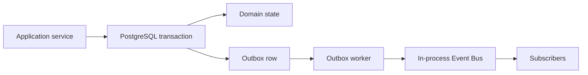

<!--
File: docs/engineering/guides/meg-015-platform-foundation-implementation/06-event-backbone.md
Document: MEG-015
Status: Draft
Version: 0.1
-->

# 06 — Event Backbone

---

# First Event Model

The first Platform Event Bus should be local, durable and observable.

It should not require a distributed broker. Application services append events to the outbox inside the same transaction as the state change. A worker drains committed outbox rows and publishes them to in-process subscribers.

---

# Event Envelope

Every event should carry:

| Field | Purpose |
|-------|---------|
| `event_id` | Stable event identity |
| `event_type` | Versioned event name |
| `occurred_at` | Domain occurrence time |
| `recorded_at` | Platform persistence time |
| `actor` | Authenticated subject or system actor |
| `tenant_scope` | Local server or workspace scope |
| `correlation_id` | Request or job correlation |
| `causation_id` | Prior event or command identity |
| `payload` | Event-specific data |
| `redaction_class` | Diagnostics and support bundle behaviour |

---

# Delivery Semantics

The first implementation should provide at-least-once local delivery.

Subscribers must be idempotent. Event handlers that mutate state must use application services or explicit handler services with their own `UnitOfWork`.

---

# Failure Behaviour

Failed deliveries should remain visible through diagnostics.

The outbox worker should track:

- attempt count;
- last error category;
- next retry time;
- dead-letter status; and
- owning component.

Critical Platform events may use stricter retry and health degradation rules than low-priority diagnostic events.
