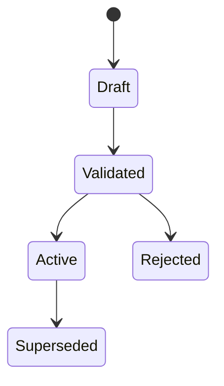

<!--
File: docs/engineering/guides/meg-015-platform-foundation-implementation/08-configuration-and-secrets.md
Document: MEG-015
Status: Draft
Version: 0.1
-->

# 08 — Configuration and Secrets

---

# Configuration Activation

Configuration changes should create a versioned configuration record before activation.



The admin UI is the normal control surface, but the Platform should expose application services that can be used by GraphQL or recovery tooling.

---

# Reload Classes

Every configuration field should declare its reload class.

| Class | Behaviour |
|-------|-----------|
| Hot | Applies without restart |
| Restart | Requires process restart |
| Generation | Requires Supervisor to activate a new Generation |
| Recovery | Applies only through recovery flow |

Safe changes may activate immediately. Structural changes should be handed to the Supervisor so it can prepare another Generation or restart path.

---

# Secret Broker

Platform code must access secrets through a broker contract.

The first implementation should prefer the operating-system keychain. If unavailable, it may use an encrypted local vault protected by a separate recovery key.

Application services and Modules must not read secret files directly.

---

# Secret References

Configuration should store secret references, not secret values.

```text
storage.postgres.password = secret://platform/postgres/password
```

This allows configuration versions to be audited and support-bundled without leaking credentials.
