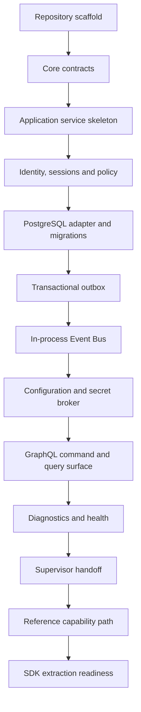

<!--
File: docs/engineering/guides/meg-015-platform-foundation-implementation/12-build-sequence.md
Document: MEG-015
Status: Draft
Version: 0.1
-->

# 12 — Build Sequence

---

# Sequence

The Platform should be built in the following order.

---

# Slice Definitions

| Slice | Exit criteria |
|-------|---------------|
| Repository scaffold | Process boots, config loads and core packages compile |
| Core contracts | First contract set exists with compile-time tests |
| Application skeleton | One command and one query pass through service boundaries |
| Identity and policy | Local user, session and permission denial path work |
| PostgreSQL | Migrations run and adapter passes contract tests |
| Outbox | Command persists state and event atomically |
| Event Bus | Outbox worker publishes to an idempotent local subscriber |
| Configuration | Versioned config validates and activates |
| Secret broker | Secret references resolve without direct file reads |
| GraphQL | Auth, config, health and jobs surfaces call application services |
| Diagnostics | Component health and redacted support bundle exist |
| Supervisor handoff | Readiness, liveness, shutdown and metadata are available |
| Reference capability | One non-media capability proves registration path |
| SDK readiness | Candidate public contracts are isolated under `contracts/platform/v1` |

---

# Stop Point Before SDK

The Platform is ready for SDK work when the reference capability uses only candidate contract packages and no private Platform internals.

If the reference capability requires private imports, the Platform contracts are not ready to generate or publish.
