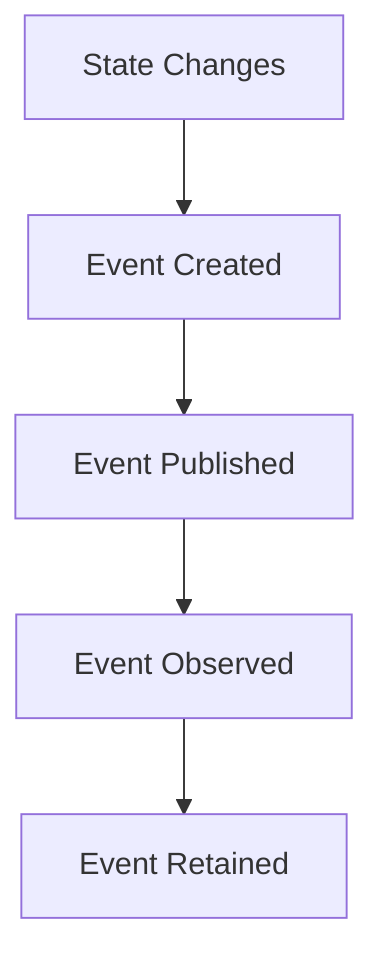
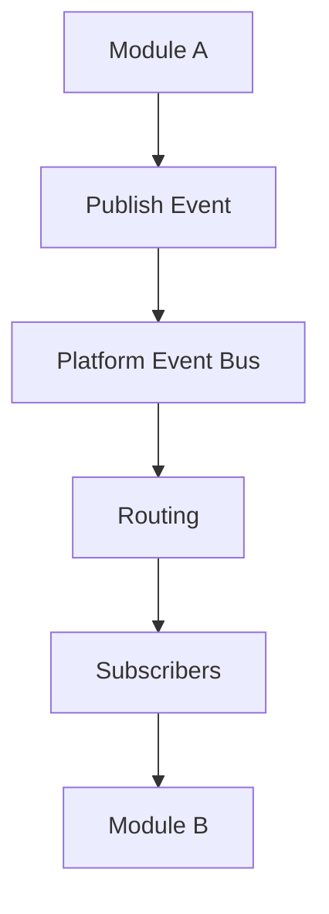

<!--
File: docs/engineering/protocols/mip-001-event-protocol/01-event-model.md
Document: MIP-001
Status: Draft
Version: 0.4
-->

# 01 — Event Model

---

# Definition

An event is an immutable record of a fact that has already occurred.

An event answers:

> **What happened?**

It does not request work, describe intent or represent mutable state.

---

# Event Lifecycle

Events follow a simple lifecycle:

Each stage preserves history rather than rewriting it.

---

# Event Ownership

The Platform owns event infrastructure.

The Platform owns:

- Event Bus
- Event Envelope
- routing
- subscription
- delivery
- reliability
- tracing
- compatibility metadata

Modules own domain events.

Modules own:

- event definitions
- event payloads
- publishers
- subscribers
- event documentation
- event versioning

The publishing Module owns the business meaning of an event.

The Platform transports events.

Modules give those events meaning.

Subscribers should treat events as historical facts and publish new events when new facts occur.

---

# Event Flow

Conceptually.

The Platform does not inspect business logic.

It delivers events to interested subscribers.

---

# Platform Events

The Platform defines a deliberately small set of lifecycle events.

Examples include:

- `platform.started`
- `platform.stopping`
- `platform.module.installed`
- `platform.module.removed`
- `platform.configuration.changed`

Platform events are part of the Platform contract and belong in the SDK.

---

# Module Events

All domain-specific events belong to the owning Module.

Examples include:

- `anime.episode.released`
- `anime.metadata.updated`
- `anime.watchlist.imported`
- `playback.started`
- `playback.buffering`
- `playback.codec.changed`
- `jellyfin.library.scanned`
- `jellyfin.user.synced`

The Platform does not need to understand what these events mean.

It only needs to transport them.

---

# Event Visibility

Module events may be public or private.

Public events are part of the Module's documented integration contract.

Other Modules may subscribe to public events according to the Module manifest.

Private events are internal implementation details.

They may change freely between Module versions unless the Module chooses to promote them to public events.

The Event Bus may transport both public and private events.

Visibility determines contract stability, documentation and external subscription expectations.

---

# Events And Capabilities

Capabilities and events are separate communication models.

Capabilities answer:

> **Can somebody do this?**

Examples include:

- Metadata
- Search
- Authentication

Capabilities are synchronous and return results.

Events announce:

> **Something happened.**

Examples include:

- `playback.started`
- `metadata.updated`
- `anime.episode.released`

Events are asynchronous and notify interested subscribers.

Capability Managers handle synchronous capability requests.

The Event Bus handles asynchronous facts.
