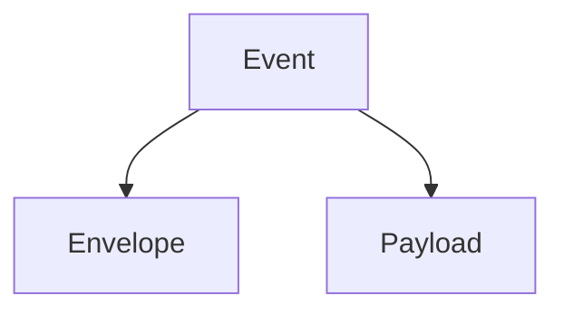
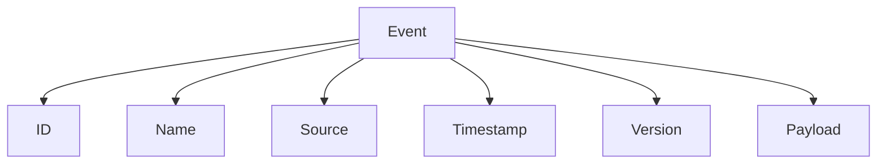

<!--
File: docs/engineering/protocols/mip-001-event-protocol/02-event-envelope.md
Document: MIP-001
Status: Draft
-->

# 02 — Event Envelope

---

# Envelope Model

Every Mosaic event contains:

The envelope is stable across event families.

The payload is owned by the publishing capability.

The SDK defines the standard Event Envelope.

The SDK does not define every event payload.

Conceptually.

Implementations may expose typed envelopes such as `Event[T]`, but the protocol boundary remains the same.

---

# Envelope Fields

The envelope should provide enough metadata for Platform responsibilities:

- event identifier
- event name
- event version
- occurrence timestamp
- correlation identifier
- causation identifier
- producer identity
- event visibility
- trace context

These fields support routing, diagnostics, replay, idempotency and observability.

---

# Payload Boundary

The payload describes the business fact.

The Platform should not inspect payload structure except where validation or routing explicitly requires it.
