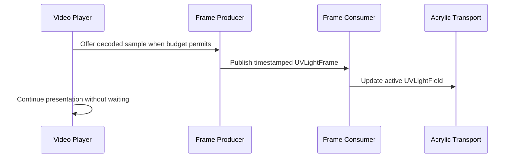

<!--
File: docs/engineering/protocols/mip-003-uv-light-frame-protocol/06-stream-and-runtime-behaviour.md
Document: MIP-003
Status: Draft
-->

# 06 — Stream And Runtime Behaviour

---

# Static Lifecycle

A static-artwork producer SHOULD generate one frame for each `sourceRevision`.

The same frame MAY be reused across:

- renderer sessions
- screen resolutions
- Composition transforms
- multiple Acrylic receivers

A changed Acrylic position MUST NOT invalidate the source frame.

---

# Moving-Source Lifecycle

A video-sidecar producer samples the decoded source independently from presentation cadence.

The producer MAY skip a poll.

The consumer MUST NOT require one `UVLightFrame` per presented video frame.

---

# Latest-Useful-Frame Policy

When analysis falls behind, the pipeline MUST prefer the most recent useful source sample.

It SHOULD discard stale queued analysis work rather than building a backlog.

A consumer MAY interpolate between compatible neighbouring frames.

It MUST NOT extrapolate unbounded brightness beyond observed frame values.

When no newer valid frame is ready, the consumer MUST retain the last stable `UVLightField`.

---

# Playback Protection

Video presentation MUST NOT wait for:

- frame analysis
- KTX encoding or decoding
- MOS Cache access
- mip upload
- temporal reconstruction
- Acrylic transport updates

The runtime profile MAY remain entirely GPU-resident and MAY bypass serialisation.

Equivalent logical metadata and channel semantics remain mandatory.
