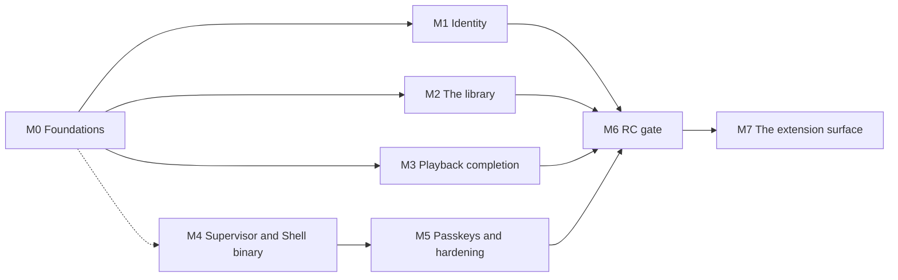

# Roadmap

Derived from the real state of the code, not from a plan written ahead of it.

It is organised by **milestone** — what a person can do when one lands — rather
than by the threads of decisions that produced the build. The threads were
faithful to how the work happened and useless as a plan: six of them, each
correctly deferring to the others, with no shared finish line. What replaces
them is one target, [the first release candidate](#what-the-first-release-must-do),
and the milestones between here and it.

**Built here means the capability landed. It does not always mean a user can
reach it.** Permissions management, configuration versioning and user
administration are all built, all correct, and none of them has a client
surface. [Unreachable capability](unreachable-capability.md) is the register of
that gap, kept separately because nothing in the build or the test suite will
ever report it. Read the two together before concluding Mosaic can do something.

---

## What the first release must do

> Four people in one household, on a clean box, install one thing. The first
> person to open it claims the server and creates the others. Each signs in on
> their own device and stays signed in. An administrator defines the library
> from a few rules that a job keeps current. Anyone searches, plays a remote
> source in about a second, resumes it on another device, and browses by genre
> or by streaming service. When the Platform dies, the Supervisor says so.

Two scope statements, because both have been read the other way. **Debrid
streaming is reached through an aggregator** — AIOStreams resolves the debrid
side and returns a `url`, so no Real-Debrid module is needed and none is
planned; what has been verified live is AIOStreams against TorBox, and
Real-Debrid through the same path is unverified rather than known-good. And
**"without involved setup" applies to browsing, not to streaming**: metadata and
catalogs work on a fresh install with no credential at all (Cinemeta), while any
remote source requires the user to name one.

| # | The release must | State today | Lands in |
|---|---|---|---|
| 1 | Stream remote debrid sources with complete metadata | Built and verified live | — |
| 2 | Support several users, sharing one library | Built — four accounts on one box, created through the People panel | — |
| 2a | Each with their own progress, history and home screen | Built — progress, watch history, and now which home rows a viewer sees and in what order ([ADR 0103](adr/0103-one-library-many-viewers.md)) | — |
| 3 | A Supervisor managing the Platform and the Shell, and fronting both | Built — one process tree, both children owned, restarted and stopped in order, behind TLS on one port; no real certificate and no Recovery SDUI | M4 |
| 4 | Sign in with a username and password | Built — the doorway carries the form, and nothing signs in from a build-time credential | — |
| 5 | Sign in with a passkey | A domain type and two store methods; no ceremony, no surface | M5 |
| 6 | Stay signed in after a long absence | Built — a bearer pair, rotated, with per-device revocation ([ADR 0102](adr/0102-the-session-credential-is-a-bearer-pair.md)) | — |
| 7 | A single-page Shell that never looks like it reloaded | Built | — |
| 8 | Ask-and-receive, plus unprompted server push | Built — the two-lane transport | — |
| 9 | Run asynchronous work to maintain itself | Built — runner, interval scheduler and system principal; two of six queued callers wired | — |
| 10 | A library an administrator builds from queries and collections | Collections built, with a scheduled pass keeping them current ([ADR 0104](adr/0104-the-library-is-built-from-rules.md)); the query kind is stored, validated and run by the same code and has no surface to create one from | M2 |
| 11 | Search across every provider and the library at once | Built | — |
| 12 | Add an item, or play it without adding | Add built; play-without-adding deferred | M3 |
| 13 | Playing something unowned adds it, so it can be tracked | Not built | M3 |
| 14 | A device declaring what it can physically play | Built — `ClientProfile` on Attach | — |
| 15 | Remote playback that feels instant | Built — 3.75 s cold, 11 ms warm | — |
| 16 | Browse by streaming service or genre without involved setup | Genre is reachable on both surfaces — a facet over the shelf and a filter on a source's catalogue; streaming service is browsable as a source's catalogue asked live, and the union with what the library already holds is unbuilt | M2 |
| 17 | Similar and related titles that are not limited to the library | Built on the detail screen; official builds carry the project credential it needs ([ADR 0105](adr/0105-project-credentials-in-official-builds.md)) | — |
| 18 | A Shell that is its own binary, decoupled from the Platform | Built — `mosaic-shell` embeds the bundle and is told the endpoint at runtime; never served to a person | M4 |

Five requirements were not in that list because they were not asked for and the
release is not credible without them. **Signing out** landed in M1 — it is on
the account cluster of every screen, it revokes the refresh chain and it ends
the live session, so a shared device can be handed over. The other four stand:
**seek and resume on a remuxed stream** (impossible today — see M3),
**subtitles** (a module fills the role and nothing consumes it) and **backup and
restore**. The fourth, **a durable metadata cache**, landed in M2a
([ADR 0107](adr/0107-the-platform-keeps-what-a-source-told-it.md)): a library
detail now renders from the object graph rather than asking the provider again.

---

## Where the build is

Thirteen repositories: `architecture`, `platform`, `supervisor`, `sdk`,
`contracts`, `web`, `registry`, and six modules — three **core**, compiled
into the binary (`module-tmdb`, `module-cinemeta`, `module-remote-playback`),
and three **extension**, installed at runtime and no dependency of the
Platform anywhere (`module-stremio-addons`, `module-aiostreams`,
`module-fanart-tv`). `supervisor` was extracted from `platform`, where it was
parked before it had a repository of its own — its history moved with it via
`git subtree split`, and it now carries its own gate. The Platform is AGPL-3.0
with a module-linking exception, the Supervisor plain AGPL-3.0 with no
exception (it links no Module), the SDK Apache-2.0, optional modules their
authors' choice, this documentation CC-BY-4.0
([ADR 0022](adr/0022-licensing.md)).

**The content model and the extension thesis.** `nodes`, `parts`, `relations`
and `source_bindings` ([ADR 0013](adr/0013-object-graph.md),
[ADR 0014](adr/0014-storage-authority-and-transaction-scope.md)) under nine
application services that validate, authenticate, authorise and — for writes —
commit state and an outbox event in one transaction. The published surface left
the repository as [`github.com/mosaic-media/sdk`](https://github.com/mosaic-media/sdk)
([ADR 0016](adr/0016-published-contract-surface.md)), and a reference capability
built against it alone proved a third party can extend Mosaic without touching
Platform internals. Boundary tests keep it honest: an external probe module
cannot compile if a public signature leaks an `internal/` type.

**The client transport.** One transport, two lanes
([ADR 0041](adr/0041-cross-client-transport-two-lane-rpc.md),
[ADR 0061](adr/0061-one-client-transport.md)): unary intents
(`Navigate`/`Invoke`/`SubmitInput`/`Attach`) and one server-streaming
`Subscribe` per session, over h2c. A per-session outbound mailbox, a monotonic
`seq` with a bounded replay buffer for resume, and the full `RegionUpdate`
op-set. `AuthService` mints the session; GraphQL was deleted outright. The
Shell reconnects with backoff and jitter, re-declares its route, and has
browser history and deep links. Eighteen actions are the complete list of what
any client can invoke: `importContent`, `configureModule`, `installExtension`,
`uninstallExtension`, `revokeSession`, `signOut`, `createAccount`,
`setUserStatus`, `grantPreset`, `setPreference`, `playPart`, `reportProgress`,
`recordImpression`, `createLibraryRule`, `setLibraryRuleEnabled`,
`deleteLibraryRule`, `runLibraryMaintenance`, `setWatched`. The count had been
stale since M1; `setPreference` now carries a viewer's home arrangement as well
as the expert-mode flag, which is why no nineteenth was needed. Every call on the session
service now authenticates at the transport, and a session's live state is keyed
by session id rather than by the credential, which rotates
([ADR 0102](adr/0102-the-session-credential-is-a-bearer-pair.md)).

**The SDUI vocabulary.** All thirteen slices of the vocabulary overhaul landed
([ADR 0083](adr/0083-one-generated-sdui-vocabulary.md)–[ADR 0095](adr/0095-the-generated-vocabulary-reference.md)):
one `ui.spec.json` generating the Go and TypeScript authoring layers, the
registries and a conformance fixture; negotiation and deliberate degradation;
namespaced module types; bindable props; state scopes; fields, forms and the
retirement of `$value`; validation with a symmetric field-error envelope;
accessibility and focus props; lazy lists; a 76-case cross-client conformance
corpus; and a generated 525-line vocabulary reference.

One addition since: `visibleWhen` on `Box` took it to **3.1.0**. The prop already
existed on the six field primitives with the same type and meaning; on a
container it hides a branch, which is what makes a multi-step form expressible
at all — without it a wizard is one long page or a round trip per step, and a
round trip per step sends the password the second step collects back down inside
the third step's tree. Three definitions were also found unable to be form
fields: `TextField`, `Select` and `Toggle` each bound the props their label
needs and none of them bound `name`, so the input inside each wrote to local
state nothing collects. Components are authored
**only** in the contract and the client bundles none
([ADR 0082](adr/0082-components-are-authored-only-in-the-contract.md)); the skin
is served too — 124 token values, both themes, changed without a client build
([ADR 0040](adr/0040-server-delivered-definitions-and-skin.md)).

**The screens.** `home`, `search`, `library`, `collections`, `catalog`, `detail`,
`settings`, `extensions`, `history`, the expert-mode diagnostics screens — logs,
traces and now the background-work queue behind its own `job.read` — the
pre-session doorway with its setup wizard and its sign-in form, the People
panels behind `user.read`, a device list on the account panel, a real 404, and
the Shell's one remaining hand-written state (a Platform that could not describe its own door;
the other became the doorway). Home rotates a full-viewport hero over rails
that ride its floor, with continue-watching carrying resume progress and time
remaining. **It renders cache-first** ([ADR 0052](adr/0052-cache-first-rendering-and-source-health.md)):
the rows come from a durable snapshot of what each source last said, the live
answer arrives behind them as a `RegionUpdate`, and a source that is not
answering earns a standing notice rather than an empty screen blaming the
install. **Which rows appear, and in what order, is each viewer's own**
([ADR 0103](adr/0103-one-library-many-viewers.md)), stored as the decisions they
made so a row nobody has decided about still appears. Detail emits hero,
episodes, cast, a technical-facts grid and
related rails. Settings is one frame with a Platform-owned nav that a module's
own form renders inside ([ADR 0038](adr/0038-module-contributed-settings-ui.md)),
with a drill-down arrangement on a phone carried in the same payload. `library`
is the one screen over the object graph rather than over a provider, so it is
the only one that can state a real total rather than "128+".

**What the library should contain** ([ADR 0104](adr/0104-the-library-is-built-from-rules.md)).
Rules are Platform state — a table, a contract and its own contract-suite rows —
and a scheduled pass reconciles the library against them as the system principal,
bounded and best-effort, recording created, refreshed, skipped and failed on each
rule. Rules add and never remove: deleting a rule deletes nothing it added, and a
rule outlives its module being uninstalled, degraded and visibly so.

**Modules and the two tiers.** Roles, not verbs
([ADR 0027](adr/0027-modules-as-typed-capability-providers.md)): metadata,
search, catalog, stream, subtitles, playback, settings UI and artwork, resolved
through a registry that requires a role be both declared in a signed manifest
and implemented. Stream resolution is decoupled from metadata provenance
([ADR 0073](adr/0073-stream-resolution-is-decoupled-from-metadata-provenance.md)),
so a TMDB import gets Stremio Parts. Artwork is a candidate set
([ADR 0074](adr/0074-artwork-is-a-candidate-set.md)). The extension tier runs
out of process end to end: the gRPC wire, `sdk/host`, the extension host, an
invocation-scoped `Caller` handle, supervised lifecycle with backoff, a
per-module egress proxy that closes the loopback hole `ProxyFromEnvironment`
leaves open, signature and digest verification before a binary runs, a signed
repository index on GitHub Pages the Platform trusts at boot, runtime
install/uninstall with a registry mutable while serving, boot re-adoption from
the on-disk cache, a consent step in front of every install, and a local signed
registry for development ([ADR 0062](adr/0062-two-module-tiers.md)–[ADR 0065](adr/0065-module-distribution-and-trust.md),
[ADR 0077](adr/0077-go-plugin-as-the-extension-harness.md)–[ADR 0081](adr/0081-extension-installation-is-user-initiated-and-persistent.md),
[ADR 0099](adr/0099-the-development-module-repository.md)).

**Playback.** A resolution is `Direct` or `Served`
([ADR 0045](adr/0045-playback-consumer-and-media-origin.md)); the module never
speaks HTTP and the Platform mints a signed, session-bound ticket and serves
`/playback/{ticket}` itself. Import writes the whole candidate set as Parts, and
selection ranks them against the client's declared profile
([ADR 0048](adr/0048-stream-selection-against-a-client-profile.md)) rather than
transcoding a bad pick. ffprobe settles what a release actually is, and the
decision is **per stream** — copy the video, re-encode only the audio the
browser cannot decode ([ADR 0050](adr/0050-probing-and-the-per-stream-playback-decision.md)).
The probe and the resolved URL are both persisted, keyed by capability class,
which is what took a repeat play from 3.75 s to 11 ms
([ADR 0049](adr/0049-resolution-cache-and-capability-classes.md)). Position is
Platform-owned, keyed by (user, node) ([ADR 0046](adr/0046-playback-state-is-platform-owned.md)),
and surfaced as resume, a continue-watching rail, watched marks and a next-episode
control.

**Telemetry.** Ambient in `context.Context`, correlated by the W3C trace id the
Shell mints where the user clicks, instrumented at nine seams, redacted at
construction by class, stored to both a file and PostgreSQL, and readable inside
Mosaic as logs and a trace waterfall behind `telemetry.read`
([ADR 0053](adr/0053-telemetry-is-ambient-in-context.md)–[ADR 0060](adr/0060-the-supervisor-observes-independently.md)).
Modules observe through a dependency-free SDK interface the Platform attributes
and quota-bounds. Retention is a scheduled job as of M0.1 rather than a
goroutine that only existed while the process did — a Platform down for a month
used to come back with a month of records it had intended to drop.

**Authorization.** Argon2id password verification, ABAC roles, an `authorized`
value only the boundary can construct with a reflection-enforced conformance
suite ([ADR 0066](adr/0066-authorization-is-carried-in-the-type.md)), and
delegation that intersects with what the granter holds so `role.create` is no
longer "hold every permission" ([ADR 0069](adr/0069-privilege-cannot-escalate.md)).
Suspension enforces itself as of M1 — it wrote a column nothing read, so a
suspended account could sign in and one already signed in stayed so for ninety
days — and a session carries the caller's flattened authority at issue time, for
a client to omit affordances from rather than to check against.

**The acceptance baseline** — the standing gate every slice passes before the
next begins:

- `go build ./...`, `go vet ./...` and `go test -race ./...` pass
- adapter contract tests pass against real PostgreSQL; migrations run from empty
- import boundary checks pass (the external probe module builds; `capabilities/reference` is parsed)
- the boundary conformance suite passes — every caller-bearing method answers `Unauthenticated` then `PermissionDenied`
- the end-to-end test signs in over `AuthService`, subscribes and navigates over `SessionService`, and asserts the pushed content region
- health probes answer against a running process
- **and the screen was opened in a browser** — see [Findings](#findings-worth-keeping)

---

## The milestones

M4 depends on M0 only for the session model it fronts, so it can run beside
M1–M3. M5 must follow M4: a passkey is bound to an origin, and the origin is
M4's to decide. M7 follows the release candidate because the MVP does not need
it, and precedes any invitation to the community because the surface that exists
on the day the first outside module is written is the surface the ecosystem
hardens around.

### Reference implementations

Seven projects were read from source and mapped against these milestones. They
are read for design, never copied; each entry names the milestone it serves and
the subsystem worth opening.

| Project | Serves | What to read |
|---|---|---|
| [seanime](https://github.com/5rahim/seanime) (Go) | **M3.4**, M7 | `internal/mediastream/transcoder/` — keyframe indexing, the `sc_threshold` note in `hwaccel.go`, session lifecycle. `internal/extension_repo/` for a role-typed extension host |
| [remux](https://github.com/lostb1t/remux) (Rust) | **M3.4**, M7 | `crates/remux-server/src/api/hls.rs` and `transcode/engine.rs` — the shape slice 4 took; `SIGSTOP` at 300 s ahead and deletion 30 s behind |
| [jellyfin](https://github.com/jellyfin/jellyfin) (C#) | M3.2, M3.6, M7 | `MediaBrowser.Model/Session/TranscodeReason.cs` — the reason set as a bitfield; `Dlna/StreamBuilder.cs`; the plugin interface list as a decade of community demand |
| [harbor](https://github.com/harborstremio/harbor) (TS/Rust) | M3.2, beyond-RC | `harbor-core/src/trust.rs` — the stage that drops candidates before ranking, which Mosaic has no equivalent of |
| [supervisor](https://github.com/home-assistant/supervisor) (Python) | **M4** | `supervisor/resolution/` — checks, evaluations and fixups; `jobs/const.py` for job conditions; `backups/` for M5.2 |
| [stremio-addon-sdk](https://github.com/Stremio/stremio-addon-sdk) | M7 | `docs/api/` — the addon protocol normatively, when an addon's behaviour is in question |
| [stremio-core](https://github.com/Stremio/stremio-core) (Rust) | M7 | `src/models/` as a list of the surfaces a Stremio-shaped product needs |

Two hazards when reading them. **They assume a local seekable file**; Mosaic's
sources are remote, which is what ADR 0108's measurement settled. And *transport*
in the Stremio protocol and in stremio-core's `addon_transport/` means the addon
protocol's HTTP binding — the word is theirs, and the [controlled
vocabulary](index.md#controlled-vocabulary) reserves it here.

### M0 — Foundations — **landed**

Three things that nothing else lands cleanly without. Each was already waited on
by more than one caller, which is why they came first rather than when the
feature that wants them was scheduled. All three are built; what each left out
is named below.

1. ~~**The jobs runner, a scheduler, and the system principal — one slice.**~~
   **Built.** `internal/platform/jobs` claims with `SELECT … FOR UPDATE SKIP
   LOCKED`, retries with a capped exponential backoff, dead-letters and keeps
   the row, and reclaims a job whose runner died once its lease lapses. The
   scheduler holds no state between ticks: the occurrence a moment belongs to is
   the moment truncated to the interval, and that is the key a partial unique
   index makes the enqueue idempotent on — so every tick, every process and
   every boot enqueue the same row and a restart needs no recovery step. The
   **system principal** is a caller like any other: a per-process reference
   drawn from `crypto/rand`, resolved before any session read, and allowed by
   the policy engine through the one unconditional rule it now carries. That
   also fixed the live wrong outcome — the playback transport records a probe as
   the system principal, so a read-only viewer warms the cache instead of
   re-probing every play.

   **Left out:** it is an *interval* scheduler, not cron — module-declared cron
   is still its own piece of work. Three of the six queued callers are wired
   (telemetry retention, the expired-credential sweep M0.3 added, and library
   maintenance as of M2a); the resolution-cache refresh, the watch-provider
   refresh and torrent eviction are not. `JobStore` is deliberately not on `Tx`, so a job
   enqueued from inside a command would not commit with it; nothing enqueues
   from a command today and the honest fix when one does is an `Enqueue` on
   `Tx`, not one that pretends.
2. ~~**The pre-session bootstrap**~~ ([ADR 0101](adr/0101-the-pre-session-bootstrap.md),
   superseding [ADR 0097](adr/0097-the-pre-session-tree.md)). **Built.**
   `AuthService.Bootstrap` answers with the token set, the definition subset and
   the tree in one response. The subset is transitively closed over the tree and
   nothing more — three definitions for today's doorway out of forty-three — and
   the request carries `mosaic.session.v1.VocabularyProfile` itself, so
   [ADR 0084](adr/0084-vocabulary-negotiation-and-deliberate-degradation.md)'s
   negotiation applies unchanged rather than through a second declaration that
   could drift. The server picks the tree and nothing on the wire says which.
   The Shell renders it in place of a hand-written state, so the client's only
   self-drawn UI is now the one case that is genuinely its own: a Platform that
   could not describe its own door.

   **Left out: the form.** This slice delivered the doorway's *vocabulary*, not
   the doorway. Each state says what it is and offers nothing it cannot do,
   because a control wired to nothing is the dead end
   [ADR 0036](adr/0036-capability-gated-affordances.md) names; sign-in and claim
   are M1. The payload is deliberately not cached, per the ADR.
3. ~~**Sessions that survive being away**~~ ([ADR 0102](adr/0102-the-session-credential-is-a-bearer-pair.md)).
   **Built.** A ten-minute opaque access token on every call and a ninety-day
   refresh token bound to the device, rotated on every use, with reuse detection
   revoking the chain; thirty-day idle expiry sitting inside the absolute
   lifetime; only hashes stored. The Shell holds the pair in `localStorage`,
   refreshes ahead of an expiry and once after an `Unauthenticated`, and a
   device list on the account panel ends any of them. `refreshSession` stops
   being *never worked*.

   **Two defects only the browser found, both recorded because the shape
   recurs.** An expired credential used to reach the screen builders and come
   back as an error *rendered into the content region* — a successful call
   carrying a picture of a failure, with nothing for a client to retry on; the
   transport authenticates now, and live sessions are keyed by session id rather
   than by the rotating value a client presents. And reuse detection revoked the
   chain *inside* the transaction that detected it, which the rollback then
   undid, so a replayed token was refused and the thief's chain survived — found
   by the wire test the first defect motivated, and invisible to any in-memory
   store.

   **Left out:** native keystore storage (there is no native client yet), and
   passkeys, which change what *mints* the pair and not what it is (M5).

### M1 — Identity, and the doors on multi-user — **landed**

Mosaic had never had a second account. `bootstrap.EnsureAdmin` seeded exactly
one administrator from environment variables and that was the entire user story;
this was the largest single block in the register and no other row gated as
much. Four accounts now exist on a box that was claimed through a browser, with
no environment variable set anywhere.

1. ~~**Claiming and onboarding**~~ ([ADR 0098](adr/0098-claiming-an-unclaimed-server.md),
   decided, withdrawn with the pre-session tree, **rebuilt here**). **Built.**
   `ClaimServer` is the one write no caller authorises, and the only one that
   can be: emptiness stands in for authorisation, checked again inside the
   transaction so two people arriving together produce one owner and one
   Conflict. It creates the owner, its Superuser role, the grant and its first
   session together — claiming signs you in — and then does two things allowed
   to fail without failing the claim: writing the server's name, and installing
   the stream source that was chosen. **Four steps rather than the one ADR 0098
   could support:** the jobs runner has landed since, and a server-name field
   and a stream-source connection turned out to be buildable, so three of the
   five steps that record dropped came back. **Instance identity is a durable
   file outside PostgreSQL**, so a server's name outlives its database — which
   is the moment somebody most needs it. The environment-variable bootstrap
   stays for automated deployments and the dev stack no longer sets it, so first
   boot shows the doorway exactly as a household's would.

   **Left out:** the claim audit record and the claim window, both named in
   ADR 0098 as later increments and both still unbuilt — the accepted threat is
   unchanged, and the mitigations for it remain operational. The steps are one
   tree with one State scope, stepped by `visibleWhen`, which costs the
   client-side validation of off-screen fields: a hidden `Box` unmounts its
   inputs and their rules leave the scope, so a multi-step form is validated by
   the server and its rejections have to stand alone in the form-level message.
   That is the price of not sending the password back down inside the next
   step's tree.
2. ~~**Sign in, sign out, switch account.**~~ **Built.** The doorway carries
   both forms, on a pre-session action lane of its own
   ([ADR 0106](adr/0106-the-pre-session-action-lane.md)) — a doorway's controls
   emit ordinary SDUI actions and there is no push lane for the outcome, so it
   rides the unary response as one of three: a minted session, a replacement
   door, or the fields that were refused. **The client interprets none of them**,
   which is what let a four-step wizard be added without a line in the Shell.
   Signing out is on the account cluster of every screen, revokes the refresh
   chain, and ends the live session — without that last part it took ten minutes
   to notice, because the push stream makes no call to be refused. Switching
   account is the same path: sign out, and the door comes back.

   **Left out:** the Shell no longer signs in from `VITE_DEV_USERNAME` /
   `VITE_DEV_PASSWORD`, which is the removal that mattered, and a third doorway
   state was added that ADR 0098 did not name — a server that cannot read its
   own accounts says the lock is broken rather than drawing a form that refuses
   every attempt with "invalid credentials".
3. ~~**User and role administration.**~~ **Built.** Settings › People lists the
   accounts, leads into each one, and adds a viewer or an administrator; a
   person's panel shows their roles, their flattened authority and the two
   things that can be done to them. **The offer is computed from what the caller
   holds** ([ADR 0069](adr/0069-privilege-cannot-escalate.md)) — an
   administrator creating another administrator sees which permissions are
   withheld because they do not hold them. Presets are snapshotted, and
   **a role's name is unique across the install**, so a preset role is an
   install-wide named role that several people hold rather than a copy per
   account; the snapshot belongs to the role.

   **Left out:** `GetGrantsForUser` is the one command in the block still
   without a door — roles and effective permissions answer "what may they do"
   and the grant rows surface nowhere. Creating an account is three commands and
   they do not share a transaction, so a failure between them leaves an account
   holding no role; it cannot sign in, its panel says so, and it offers the step
   that was missed. Nothing edits a role after it is created, so narrowing
   somebody's authority means suspending the account.
4. ~~**The capability set on the session.**~~ **Built.**
   `domain.Session.Capabilities` is populated at issue time and re-resolved on
   every refresh, so a grant changed during a ninety-day session reaches the
   client's gate within a rotation rather than never, and
   `mosaic.auth.v1.Session` carries it. It is a *drawing* decision and never a
   check: every call re-authorises against the grants as they are then.

   **Left out:** the playback thread's "consumer absent" gate. What landed
   instead is the gating the second account made urgent — the settings nav, the
   People affordances and the detail screen's library controls are each drawn
   only for a caller who could use them.
5. ~~**The per-user pass**~~ ([ADR 0103](adr/0103-one-library-many-viewers.md)).
   **Built, for its M1 share.** Watch history is a Platform query and
   deliberately **not** on the SDK's `ContentService`: no module needs to read a
   person's viewing back, and the one list ADR 0103 is most emphatic is private
   should not sit on the surface every installed extension holds. It takes no
   user parameter, so there is no version of the screen that shows somebody
   else's.

   **Left out at the time:** home composition, which was M2's because it is a
   browse surface, and which landed there (M2.8).

*Exit, met: four accounts on one box, each signing in on their own device with
no environment variable anywhere, each with their own history over one shared
library, and an administrator who is not the owner suspending another account.*

**Discharges:** the register's whole permissions-and-users block except
`GetGrantsForUser`, plus "there is no sign-in UI" and "`SignOut` has no caller".

**What discharging it cost, because this is the argument for the register.**
Every service behind those doors was complete, tested and transactional, and
putting doors on them found seven defects that no gate could have. An ordinary
account could not sign in (`session.create` was administrator-only), could not
sign itself out (`user.session.revoke` was required of everybody and held by
administrators), and could not read its own name (`GetCurrentUser` required
`user.read`, so the account cluster drew a question mark for every viewer).
Settings would not open for one at all, because the nav reads the module list
and the error took the whole screen. "Add to library" was drawn for people who
cannot import. Creating four accounts produced three with no authority, because
a role name is unique and the fakes had no such index. And a claimed server
never reconciled its owner's role, because that only ran under the
environment-variable bootstrap. Each one is a service that worked perfectly and
a product that did not; each one was found by clicking.

Two more of the same kind, worth naming because the shape recurs: the claim
resolved its stream source's repository *after* committing, from a catalogue
read gated on the server still being claimable, so it answered "Mosaic no longer
offers aiostreams" on the very claim that chose it. And the People list's rows
carried an `action` that `SettingsRow` reads nothing of, so the list could not be
clicked — while a test asserting the prop passed. A test that asserts a prop is
set proves nothing about whether anything reads it.

### M2 — The library becomes a managed thing — **landed**

Home renders provider catalogs and a continue-watching rail; `collections` and
`catalog` browse a *module's* collections; search unions the library with
providers. Until M2a, nothing browsed what the install owns and nothing anywhere
stated what it should contain — the library was whatever individual users
happened to press Add on. **M2 has landed in full** — M2a (1–3), M2b (4, 5, 9)
and M2c (6, 8) — with 7 pulled forward into M2a. What each slice left out is
named in its own entry, and the one exit demonstrated in a test rather than in a
browser is named at the end.

1. ~~**A Library screen over the materialised graph**, paged, with an item count
   and the real name of what is being shown.~~ **Built.** `screenLibrary` is the
   first screen that reads the object graph rather than a provider, on a nav row
   of its own beside Collections — the install's shelf and a module's catalogue
   are adjacent and are not the same room. **The count is real**, which is the
   thing a provider-backed screen cannot do: `NodeStore` gained `Count` and
   `NodeQuery` gained `Offset`, so the screen says "81 titles" over rows it can
   count, where the catalog screen has to say "128+". Cards open **by node id,
   not by ref**, so a title still opens when the source that provided it is down.

   **It scrolls rather than pages**, on the lazy-list mechanism
   ([ADR 0093](adr/0093-lazy-lists.md)): the grid states
   `hasMore` and `loadMore`, and the client asks for the next window as the end
   comes into view. `hasMore` is computed from the total rather than from the
   page being full, which is the property that mechanism exists for. Because a
   `query` action *replaces* the content region, each further window re-renders
   everything above it, so the scroll stops at 600 titles and **says so** rather
   than going quiet — a lazy list that silently stops is indistinguishable from
   one that reached the end.

   **Left out, and it is a departure from the plan:** the paged read is a new
   Platform query (`ListLibrary`) and deliberately **not** `SearchContent`. One
   answers "do I already have this?" for a capability about to source something;
   the other is a browse. Paging and a total are what a browse needs and what
   nothing sourcing content has ever asked for, so they did not grow the SDK
   surface every installed extension holds — the same reasoning that kept watch
   history off `ContentService`. `SearchContent` itself therefore still has no
   client path. There is no media-type or genre narrowing on the screen: that is
   faceting, and it is 4.

   **A vocabulary defect this slice found and did not fix.** The screen was
   first built on the vocabulary's `Pagination` definition, which had shipped,
   been drift-guarded and conformance-tested, and been emitted by **nothing**.
   Both its controls are permanently disabled and always have been: the template
   writes `"disabled": {"$ifNot": {"$bind": "hasNext"}}`, but `$if`/`$ifNot` are
   *node guards* that drop a subtree, not value expressions — so the client's
   binding resolver walks the object, resolves the `$bind` inside it, and hands
   `Pressable` the object `{$ifNot: true}`, which is truthy. It is the mirror of
   the failure that has bitten this project twice already: not a prop nothing
   reads, but a prop shape nothing evaluates, and equally silent. Found by
   clicking Next and watching nothing happen. Fixing it is a `contracts` change
   and a release, and nothing emits `Pagination` now.
2. ~~**Library rules**~~ ([ADR 0104](adr/0104-the-library-is-built-from-rules.md)).
   **Built.** A Platform-owned store — its own table, contract and contract-suite
   rows — of rules an administrator manages from Settings › Library. **Rules add
   and never remove** is enforced in three places rather than asserted in one:
   reconciliation only materialises, deleting a rule deletes nothing it added,
   and a rule whose module has been uninstalled is kept and marked degraded on
   its own row and in a banner above the list.

   **Nothing is created before its consequence is shown.** Following a collection
   opens a confirmation that has *evaluated* the rule — matched, already here,
   what the first run will add, the first few titles by name, and the bound as
   chips that re-evaluate — because ADR 0104 calls the first run the one most
   likely to surprise its author. Preview and reconcile walk one implementation,
   so a preview cannot disagree with the run it previews.

   **Left out: the query kind has no client path.** A saved provider search is
   stored, validated, evaluated and run by exactly the same code as a collection
   rule; what is missing is a surface to create one from, because the natural
   place is a "save this search" affordance on the search screen and that is a
   different screen's work. Also left out: editing a rule after it is created —
   the bound and the name are fixed at creation, and changing either means
   deleting and following the collection again.
3. ~~**The maintenance job**~~ (M0.1 landed, so this was only the rule-running
   half). **Built.** `library.maintenance` on the M0.1 runner, six-hourly by
   default. It **acts as the system principal whoever triggered it**: the outer
   boundary authorises the person who pressed the button and every write beneath
   it attributes to the install, so a maintenance write cannot fail because that
   person's authority changed. Bounded per run and per rule, both configuration
   (`library.maintenance.interval_hours` is Restart-class, `items_per_run` is
   Hot). Best-effort per item. Every run records created, refreshed, skipped and
   failed **on the rule itself**, where the administrator managing the rules
   reads it, and a line per rule beside the job, where the trace is.

   **A series that gains a season now grows**, which it did not when this slice
   first landed — see 7 below, where the repair is recorded with the metadata
   cache it shares a decision with.

   **Left out:** "Run maintenance now" is **synchronous**, so the caller waits
   for the pass. Enqueuing the same job kind instead needs an `Enqueue` reachable
   from inside a command, which `JobStore` deliberately does not offer (M0.1
   named the seam rather than pretending), and the schedule is what makes the
   button unnecessary.
4. ~~**Facets: genre and streaming service.**~~ **Built**, both halves, and it
   is the widest cross-repo change in M2: SDK `v0.25.0`, `contracts v0.57.0`,
   `sdk/host v0.7.0` and all three catalog modules, before the Platform saw a
   line of it.

   **Provider-side, the design question was where the *values* come from.**
   `CatalogItemsRequest` grew `Filters`, and `Catalog` grew the declaration a
   consumer builds its control from — `CatalogFilter` with `CatalogFilterOption`
   values. **Declared rather than free text**, so a value sent back is one the
   source named: the same discipline that stops a catalog id being mistyped into
   a rule that matches nothing, and without it a facet produces empty pages
   indistinguishable from an empty catalog. Value and label are separate fields
   because sources address a genre by numeric id and name it in words. A
   provider **declines** a filter it did not declare rather than returning the
   unfiltered page — quietly widening answers a question nobody asked, and the
   answer looks right.

   **Only the catalogs that can honour it declare it.** TMDB's list endpoints do
   not filter at all, so a narrowed catalog is served by a `/discover` query
   reproducing the same ranking; Popular and Top Rated are exactly a discover
   sort and a custom catalog already is one. **Trending declares nothing**,
   because TMDB's trending is a computed popularity-over-time ranking `/discover`
   cannot express and a "Trending · Action" row served by raw popularity would be
   confidently wrong in the way a user cannot see. In Cinemas and On The Air are
   date windows TMDB does not publish the bounds of, and decline for the same
   reason. Cinemeta reads its genre options from its own manifest, and the
   Stremio module reads `extra.options` — an extra declaring *no* options is free
   text and backs no control, and a catalog with a **required** extra is now
   dropped from the catalog list entirely, because it could never be listed by id
   alone.

   **Library-side, genre is a `text[]` column on `nodes` with a partial GIN
   index**, and the reason is ADR 0071's plus one it did not have. Artwork moved
   because it is *rendered* in bulk; genre moves because it is *filtered* in
   bulk, and there is no number of round trips that answers one question asked
   across the whole library. The sharper reason: a facet must be **complete**, and
   a chip that silently omits half the library is an omission from a filtered
   list, which unlike a missing poster nobody can see. The index is partial on
   works — in a library of 37,000 episode nodes under 800 works that is the
   difference between an index over the library and one over a rounding error.

   `NodeStore.Facets` is the honest half: **the chips are read from the library
   rather than from a vocabulary**, so every chip offered returns something and a
   genre nothing carries is never drawn. It ignores its own narrowing and applies
   every other criterion, so pressing a chip cannot empty the row that offered
   it.

   **Left out, and it is a real limit:** genres are stored as each source named
   them and nothing reconciles them, so a library fed by TMDB and Cinemeta offers
   both "Science Fiction" and "Sci-Fi". That is a true statement about the
   library where a synonym table would be a tidy invented one — but it is two
   chips for one idea, and the honest fix is a user-facing merge rather than a
   table shipped in the Platform. Also left out: **one value per facet at a
   time**. The store filter is conjunctive and takes several; a chip row that
   could combine them needs a way to say which are lit and a way to take one
   back, which is a control rather than a param.

   **A definition the vocabulary gained**: `FilterChip`, composed from Pressable
   and Text, so it cost no client release. Its selected and unselected branches
   are two nodes under a `$if`/`$ifNot` Fragment rather than one node with a
   conditional prop — deliberately, because those are node guards and the one
   place this project used them as values was `Pagination`'s disabled prop, which
   shipped two permanently dead controls.
5. ~~**The watch-provider refresh**~~, which is what makes grouping by streaming
   service correct rather than confidently wrong. **Built**, refresh first and
   surface second, which is the order the register asked for.

   **It departed from the plan in one place, and the departure is the slice.**
   The plan was a `Schedule` and a handler over the halves that already existed —
   `module-tmdb` writing availability into the node's *attributes* at import, and
   `SearchContentQuery.AttributesContain` filtering it. Refreshing that would
   have needed the Platform to write into a module's own document, which ADR 0013
   forbids, or a refresh verb on the SDK's `Capability` and a release of every
   module, which is the same change 7 named and left out.

   What landed instead reads the value the **SDK already models**:
   `ContentMetadata.Watch` is a typed contract field that ADR 0107's enrichment
   pass already fetches on every refresh, and the Platform projects it into its
   own indexed `node_watch_availability`. That is not the Platform learning a
   module's key — it is the Platform storing a field the contract defines, as it
   already stores `Artwork` from the same answer. **The facet now works for any
   metadata provider that fills `Watch`** rather than for one named module, and
   `tmdbWatch` stays that module's business with nothing reading it.

   The refresh walks the **library**, oldest answer first, daily and budgeted, as
   the system principal. That is the difference from the maintenance pass beside
   it, which walks the *rules*: anything added by hand from search was never
   revisited at all. **It re-asks using the ref out of the stored document**,
   which answers a problem ADR 0071 wrote down as open — a materialised node
   cannot be turned back into a provider-bearing ref, and ADR 0107 storing the
   provider's whole answer, `Ref` included, is what changed that.

   Two behaviours carry the correctness and both are tested. **An empty answer is
   still an answer**: a title that has left every service must stop matching, and
   the only way it can is for the empty answer to overwrite the old one —
   skipping it freezes the last positive answer forever. **A failed fetch is not
   a check**: counting an unreachable provider as successful would stamp the row
   with a fresh timestamp and a stale answer, which is the confidently-wrong
   outcome arriving through the machinery built to prevent it.

   **The surface it earned was then taken back out, and that is the finding.**
   A streaming-service facet went onto the Library screen, drew correctly against
   a real library, and was wrong on sight: availability answers "what could I
   watch on this service", and that spans what the library holds *and* what it
   does not. Over the shelf alone it hands a user the small half of the answer
   while looking like the whole. Genre stays on that screen because a genre *is*
   a property of what you own; availability is a property of the world.

   The cross-source affordance is 4's work rather than this slice's:
   `module-tmdb` declares a `with_watch_providers` filter on its discover-backed
   catalogs, so "what's on Netflix" is browsed as a source's catalogue with
   library items marked — and it needs none of the stored availability, because
   it asks live.

   **So the refresh maintains something nothing reads.** What would use it is a
   *union* — an "on Netflix" surface showing the source's catalogue and the
   titles you already own on that service together, where the stored projection
   answers the second half without a provider round trip per title. That is the
   one thing a live query cannot do, and it is unbuilt. The register carries the
   row.

   **Also left out:** the region is stored per record but no screen states it,
   and the `checkedAt` the refresh sorts by is not rendered, so a user could not
   tell a fresh answer from one eleven days old if they were shown either.
6. ~~**Cache-first rendering**~~
   ([ADR 0052](adr/0052-cache-first-rendering-and-source-health.md)). **Built.**
   The defect reproduced exactly as written: the Platform restarted with its
   upstreams blackholed rendered *"Nothing to show yet — try adding an addon in
   Settings"* over a library of 152 titles and a configured source.

   Source-backed reads serve the last good answer and revalidate behind it.
   `source_snapshots` holds **items, never trees**, which is the design and not
   an optimisation — a cached tree comes back after a restart full of URLs signed
   by a process-scoped key that no longer exists, so the images fail and the page
   *looks* right. **The catalog list is snapshotted as well as its contents**,
   which the ADR did not name and the reproduction did: an addon's catalogs come
   out of a manifest fetched over the network, so a cold source has no catalogs at
   all and a home with no catalogs renders the same lie one level up.
   **In-library is re-derived, never restored** — it is a fact about this
   install's graph rather than about the source's answer, and the read is local.

   **The empty state is split in two**, which is the whole slice in one sentence:
   "nothing configured" is advice and "your sources are not answering" is a
   report, and only the first is the user's to act on.

   **The `RegionUpdate` op-set is exercised for the first time.** Every region
   update before this was the answer to a navigate; a revalidation is the first
   genuinely unsolicited push. It runs in the requesting session's context, so
   ADR 0017's reserved system-principal gap stays reserved, and it re-reads the
   route *after* rendering — a fan-out takes seconds, and replacing the content
   region of a screen somebody has already left is worse than not refreshing.
   The plumbing held; the surprise was elsewhere (below).

   **The persistent notice is a `Toast` with a lifetime**, not a second surface
   (`contracts v0.59.0`: `id`, `persistent`, `cleared`). One place to look for
   "something is wrong", because the surface that appears less often is the one
   people stop checking. It is named so a repeat updates the standing notice
   rather than stacking a fifth copy, and so recovery clears the exact one it
   fixed. The notice set is per **session** rather than per process: a source's
   health is global and "has this viewer been told" is not.

   **Two defects the browser found and no test did.** The **degraded home cropped
   its own first rail** — with no hero, the sheet's negative `overlap` pulled it
   under the brand bar. That branch had been unreachable, because every catalog
   failing short-circuited to the empty state before it, and this slice makes it
   the ordinary degraded screen. And a **concurrent-refresh race in the Shell**
   signed the user out on the very restart this slice exists to survive: the
   refresh token is rotated by the exchange that spends it, so the reconnect and
   an in-flight intent refreshing together meant the second presented a burned
   token, which the Platform correctly reads as a replay. Concurrent callers now
   share one exchange.

   **Left out:** the freshness window (five minutes, past which a served snapshot
   asks to be revalidated) is a constant rather than configuration; the
   drill-down catalog screen still asks live, because a snapshot exists for the
   screen a session lands on rather than for every page of every narrowing; a
   revalidation that fails does not retry, the next navigation does; and the
   client's own pending indicator is not reused for an in-flight revalidation,
   because that flag is driven by the client's own intents and a server-scheduled
   refresh is not one — the notice carries the statement instead, with its age.
7. ~~**A durable metadata cache.**~~ **Built**
   ([ADR 0107](adr/0107-the-platform-keeps-what-a-source-told-it.md)), pulled
   forward into M2a because M2.1 made it urgent: a Library card opens its node by
   **id** and ADR 0034's detail is keyed by a **ref**, so the two never met and
   a library detail rendered a title, a media type and a grid of blank cards.

   What a metadata provider says about a materialised title is stored in
   `node_metadata`, refreshed by the maintenance pass and read back to render, so
   **a library detail opens with no provider installed, no credential and no
   network**. A third enrichment pass beside streams and artwork, so it cost no
   SDK change and no change in any module. A table rather than a column on
   `nodes`: artwork is on the node because it is read on every card of every
   list, and this is read one screen at a time and has a lifecycle — a
   fetched-at, and therefore a staleness question — that the node does not.

   **The same pass grows the tree**, which is the repair for 3's gap. It reads
   the episode preview it was already given and adds the seasons and episodes
   the tree is missing — building a tree, which ADR 0028 gave to the module, on
   ADR 0073's ground that season and episode are facts about television the
   Platform already models. It composes no provider's addressing: it reads two
   integers the SDK carries neutrally. It adds and never removes, so an episode
   that leaves a source's listing stays.

   **A library detail reads one season at a time**, and that is load-bearing
   rather than an optimisation. Following five TMDB catalogs produced 37,365
   episode nodes — which is 16 MB and nothing PostgreSQL minds — but a daily
   news programme among them has 75 seasons and 21,428 episodes, and reading its
   tree whole to draw seven rows measured **1054 ms**. The query takes the season
   and reads the work's children and that season's children: ~360 rows, both
   indexed scans. The season selector is built from the season *containers*, so
   it offers all seventy-five having read one.

   **Left out:** a module rebuilding its own tree, which is the better answer and
   needs a refresh verb on the SDK's `Capability` and a release of every module —
   this reconciles from a projection where a module could reconcile precisely.
   The document is marshalled with Go field names, because a hand-written DTO of
   nineteen fields would be a second copy of `ContentMetadata` that drifts; a
   field renamed in the SDK therefore reads empty until the next run rewrites it,
   which is a cache degrading rather than data lost. And **`module-tmdb` files an
   episode still under `Poster` rather than `Landscape`** — the read takes either,
   and the module filing it correctly is a change in that repository.
8. ~~**Home composition, per user**~~ ([ADR 0103](adr/0103-one-library-many-viewers.md)).
   **Built.** Which rows appear, in what order, and which are hidden — a
   **preference, not a scope**: a hidden row stays reachable by search, by the
   Library screen and by link, and anything that must not be reachable is the
   content scope, which stays unbuilt.

   **The stored document holds decisions and nothing else** — the rows this
   viewer hid, and the leading run they arranged. A row in neither is one nobody
   has decided about, so it appears. `Order` is a *prefix* rather than a total
   order for exactly that reason: a total order is a snapshot, fixing the
   position of rows the viewer never touched and leaving a new one nowhere to go.
   It is the leading run **up to and including** the pair that moved, so the
   screen keeps the shape the viewer was looking at when they pressed the
   control — recording only the two rows involved is a smaller decision and a
   worse one, because moving the bottom row up one place would send it and its
   neighbour to the top.

   **One read, in the pass that builds home**, and applied *before* the items are
   fetched — a row this viewer turned off must not cost a provider round trip to
   draw nothing with. Capability omission composes ahead of preference
   ([ADR 0036](adr/0036-capability-gated-affordances.md)). The hero and the
   "Trending now" rail follow the arrangement rather than being arranged
   separately, because both are drawn from the first catalog that has items: one
   decision, not three.

   **It needed no new action.** The panel computes the document each control
   would produce, where the row list is already in hand, and the control carries
   it as `setPreference`'s value — so the client echoes a decision rather than
   authoring one, and no command has to re-derive the row list with a provider
   fan-out per press.

   **The defect this slice contributed, found on sight in a browser:** every
   settings row was labelled with the row above it, and one catalog vanished.
   `Arrange` returned its caller's slice when there was nothing to arrange, and
   `Swap` arranges and then reorders in place — so building the first row's move
   control silently reversed the list every other row was read from. It compiled
   and every unit test passed.

   **Left out:** the move controls are worded Up and Down rather than chevrons,
   because the client's glyph set has `chevron-down` and no `chevron-up` and an
   unknown icon name renders as *nothing* — an invisible control that still
   works, which is a defect shape this project has shipped before. And the
   `Switch` primitive has no accessible name in the contract
   ([ADR 0091](adr/0091-accessibility-in-the-contract.md)), so the text beside a
   switch is a sibling rather than a label; this screen surfaces that gap rather
   than causing it, and closing it is a vocabulary change.
9. ~~**The project-credential chain, end to end**~~
   ([ADR 0105](adr/0105-project-credentials-in-official-builds.md)). **Built for
   the chain; the demonstration is not done** — see below, and it is the half
   this slice was written to force.

   The defect was exactly as described. `module-fanart-tv` carried the symbol,
   the three-state settings screen, the single-reader function and a doc comment
   stating the whole policy — and the comment named `./cmd/mosaic-platform`,
   which ADR 0081 stopped building this module into. No workflow injected the
   key, nothing checked, every released binary shipped an empty one.

   `release.yml`'s `binaries` job now applies the `-X` from a
   `FANART_PROJECT_KEY` secret, in **that** repository because that is the
   workflow building the artefact carrying it (ADR 0105 rule 2) — the inverse of
   `module-tmdb`, whose own workflow says in as many words that `TMDB_RAC` does
   not belong in its secrets. `linkercheck_test.go` is the mandatory guard (rule
   3), asserting the symbol arrives *and* that `resolveKeys` and
   `usingBundledKey` both read it, so the settings screen's middle state is
   covered too; the container gate runs it as a second tagged pass against the
   same symbol path the release uses. **Mistyping that path was checked to fail**
   — the build still succeeds and the test goes red, which is the whole point.
   The dev stack gained the local counterpart: `registry-build` links
   `FANART_PROJECT_KEY` from `platform/.env` into the extension binary it
   publishes to the local signed index.

   **The demonstration this slice asked for was dropped, and the reason is a
   correction to the slice rather than a skipped step.** "Put a fanart clearlogo
   on a hero and look at it" assumed fanart is what puts a clearlogo on a hero.
   It is not: on a real library of 152 works, **130 already carry a logo, 151 a
   backdrop and 152 a poster**, every one of them an `image.tmdb.org` URL. A hero
   renders a clearlogo today and has for as long as TMDB has been the metadata
   provider. Looking at one would have demonstrated TMDB.

   So what remains unproven about this module is narrower and more honest than
   "nobody looked": **no fanart-sourced image has ever reached a screen**, and the
   module is not installed on any box that has been looked at. What its key
   unblocks is not "artwork" — that works — but *better* artwork and, more to the
   point, **artwork a user can choose between**: fanart returns forty variants
   where TMDB returns one, which is [ADR 0074](adr/0074-artwork-is-a-candidate-set.md)'s
   candidate set and the picker that
   [does not exist](unreachable-capability.md#also-owed-though-never-removed).
   That is where this credential earns its keep, and it is scheduled behind the
   picker rather than here.

   **What is proven** is the part that was actually broken: the symbol resolves,
   the workflow injects it, the guard fails when the path breaks, and a
   deployment that sets `FANART_PROJECT_KEY` gets a keyed module instead of one
   answering "API key not set".

*Exit: an administrator builds the library from two rules, a job keeps it
current, and each user browses by genre and by streaming service, on a home
screen they arranged, having configured nothing beyond their stream source.*

*Exit for M2a, met: an administrator creates two rules, the job runs on its
schedule, new matches appear on the Library screen without anyone pressing Add,
a second run adds no duplicates, and the run log says what happened.*

*Exit for M2b, partly met, and two of its three exits moved rather than being
missed.*

***Browsing by genre is demonstrated***, on both surfaces: a library-scoped facet
over what the shelf actually carries — "Sci-Fi & Fantasy" beside "Action &
Adventure", because two sources say so — and a cross-source one on a provider's
catalogue.

***Browsing by streaming service is not*,** and the exit was wrong rather than
unmet. A library facet was built, shown, and removed: availability spans what the
library holds and what it does not, so answering it over the shelf alone gives
the small half while looking like the whole. The cross-source affordance exists
(4's `with_watch_providers` filter, asked live); what does not is the **union**
that would use the stored projection. See 5.

***Fanart artwork on a screen is not***, and that exit was also wrong: TMDB
already supplies the clearlogo it named. What is unproven is fanart specifically,
and it lands with the artwork picker. See 9.

*Exit for M2c (6, 8, and the confirmation of 7), met in two of three parts and
demonstrated in a browser rather than asserted.*

***A restart with every upstream unreachable renders the library it had***, with
the banner "Showing what was saved 3 hours ago. Your sources are not answering,
so this may be out of date." and a standing notice reading "tmdb is not
responding, so some rows may be out of date." The notice outlived the toast
timer, appeared once across several renders, and was retracted by name when the
sources came back — at which point the live result arrived as a `RegionUpdate`
and the hero returned.

***A library detail opens with the provider unreachable***, complete: title,
rating, year, certification, runtime, genres, synopsis, director and cast, drawn
from `node_metadata`. This is 7 confirmed rather than built — it landed in M2a,
and the exit had never been demonstrated against a blackholed upstream. Only the
artwork is missing, which is the artwork proxy being unable to reach the CDN
rather than anything about the metadata path.

***Two accounts seeing two different homes was proven in a test, not in two
browsers.*** One account's home was rearranged live — a row hidden, another
moved up, and the hero following the arrangement onto the row that became first
— and `TestTwoViewersGetTwoDifferentHomes` renders home for two callers and
asserts they differ. The second browser was not available: the install's other
account was created by a previous session and its credential is lost. That is a
gap in the demonstration and not in the mechanism, and it is written here rather
than smoothed over.

### M3 — Playback completion — **six slices landed; slice 4 is written and never played**

Playing works. What is missing is everything around a play that does not go
perfectly, and one thing the release was asked for outright.

Slices 1, 2, 3, 5, 6 and 7 are built and were opened in a browser. **Slice 4 is
built on both sides and has never had a release watched through it**, which by
the [working rule](#working-rules) below is not done: a milestone item is done
when a human clicked it in a running Mosaic, and a passing test is never the
evidence. Three earlier designs for this origin passed every unit test and fell
over in front of a real decoder. The [register](unreachable-capability.md#the-segmented-playback-origin)
carries the row.

1. ~~**Playing something unowned adds it.**~~ **Built**
   ([ADR 0118](adr/0118-playing-something-unowned-adds-it.md)). `playPart` takes
   the same ref envelope `importContent` takes and materialises before resolving
   anything, so a virtual item now offers Play beside Add rather than only Add,
   then find it again, then play.

   Materialising at play *start* dissolves the collision that deferred this
   rather than solving it: by the time anything reports a position there is a
   node to key it against, so [ADR 0046](adr/0046-playback-state-is-platform-owned.md)
   needs no change and [ADR 0028](adr/0028-virtual-and-materialized-content.md)'s
   two crossings are untouched. Materialise-on-*commitment* would still need
   somewhere to hold progress for a node that does not exist.

   **It authorises as the import it is.** A viewer without `content.import` is
   refused here exactly as at the Add button, so Play is not a way around the
   authority that curates the library — the same correction ADR 0069 made when
   the first ordinary account pressed Add and got nothing.

   A film starts; a series does not. One playable item is unambiguous, and
   guessing an episode is worse than having added the series and drawn the
   episodes that now exist — so an ambiguous work returns cleanly and the screen
   re-renders. An added work with no releases takes the same path and is equally
   not an error.

   The cost is honest and accepted: the library gains things people bounced off
   after ninety seconds. Removing those, if it is ever wanted, belongs with the
   library-rule maintenance pass rather than here.
2. ~~**A source picker and an honest no-candidate state.**~~ **Built**
   ([ADR 0116](adr/0116-a-preference-is-a-default-an-override-is-a-sitting.md)).
   `PlaybackSources` returns the ranked candidate list rather than its length,
   each release saying what would have to happen to play it — a video re-encode,
   a tone-map, an audio re-encode, or nothing. The phrasing is about the client
   and not the file: a release is not bad, it is undecodable by the thing asking,
   and the same release on a television may be the best answer there is.

   **`SourcePicker` had been in the contract the whole time and nothing emitted
   one**, which is why selection's answer was only ever a number in a log. So
   this is a definition finally reaching a screen rather than a vocabulary
   growth. Picking a release is an ordinary play of that Part, so it needed no
   new action kind either.

   The empty case gets the same screen and says plainly that an item can be in
   the library with no file behind it — a metadata-only import, or a source that
   stopped — with the way to Extensions. It was an *error* before, which was
   never true and read as a defect in playback.

   Two things deliberately not done. It **ranks and does not resolve**: resolving
   twenty candidates to draw a list would spend a play's whole latency budget on
   a screen somebody may be glancing at, and a release that turns out dead when
   picked is invalidate-on-read's job. And the order is tie-broken by the
   source's own order, because without a stable tiebreak the list moves under a
   viewer reaching for the third row.
3. ~~**Invalidate-on-read**~~ **Built**
   ([ADR 0049](adr/0049-resolution-cache-and-capability-classes.md)). The ticket
   now carries the release and the capability class, sealed, so the origin can
   ask the source again when a cached address stops working — which it does on
   all three serving paths, each before a byte reaches the client, so the retry
   is invisible. This is the half of the cache that makes it safe rather than
   merely fast: a debrid link dies whenever its torrent leaves the provider's
   cache, so a TTL was never going to be the mechanism.

   Three bounds are worth naming because each is a way this could have been
   worse than the problem. A working link never re-resolves, since a liveness
   pre-check spends a round trip on every play to catch a rare failure — the
   exact latency the cache exists to remove. A source that hands back the *same*
   address has said the link is not what failed, so that counts as no answer
   rather than as grounds for an identical second attempt. And it retries once,
   never in a loop.

   Left out: the background refresh job, still blocked on the jobs runner, the
   scheduler and the system principal, exactly as ADR 0049 anticipated.
4. ~~**Segmented output (HLS).**~~ **Built.** The narrative below is kept in full
   because it is the most instructive thing in this release: two designs were
   built and disproved live before the third worked, and the disproofs are worth
   more than the answer. The one thing still unconfirmed against a browser is
   named at its end.

   The starting premise was that the origin emits fragmented MP4 off a pipe: no
   index, no length, `Accept-Ranges: none`. **A remuxed stream therefore cannot
   be seeked or resumed** — and remuxing is the normal case, because MSE takes
   only fMP4 and WebM so Matroska cannot pass through a browser whatever codec
   is inside it. Resume is exact only on a directly relayed stream. This is the
   heaviest remaining engineering item in the whole release, and it is **in** the
   release: resume that works only on some releases is not resume.

   **Measured. The premise above is wrong in two places, and the slice is
   smaller than it looks.**

   *The upstream honours Range.* Measured live against two AIOStreams
   resolutions of the same 4K release through a TorBox profile
   (`platform/tools/rangeprobe`): both answered `206` with a correct
   `Content-Range` and mid-file bytes that differ from the head, over a 61 GB and
   a 48 GB file. One of the two refuses `HEAD` with `405` and ranges perfectly
   well anyway. So a directly relayed stream **is** seekable, and the origin
   already forwards `Range` and relays the `206` — that half of the slice needs
   nothing built, and `ffmpeg -ss` can seek the source over HTTP for the cost of
   one ranged fetch, which decides the segmenter's architecture in favour of the
   cheap one.

   *Matroska is not the irreducible case, because the player is not MSE.* The
   Shell plays a bare `<video src>`, whose native demuxer handles Matroska — the
   client profile declares `containers: []` deliberately and says why. Nothing in
   the decision consults the container at all: `Plan.DirectPlay` is
   `Video == Copy && Audio == Copy`, and **`ShouldRemux` is dead code, called
   from nowhere in production**. The remux path is entered on *codec and HDR*
   grounds only. "MSE takes only fMP4 and WebM so Matroska cannot pass through"
   is true of MSE and describes a player Mosaic does not have.

   So what actually needs segmenting is not a container subset but the set of
   releases that go through ffmpeg at all: an undecodable video codec, or HDR
   needing a tone-map, or audio the client cannot decode. That is still a real
   and common set — the 4K HDR release tested here is in it — and it is still
   unseekable, which `TestRemuxedResponseIsNotSeekable` now pins.

   *Two defects found on the way, both fixed.* Playing that release produced
   "format not supported" in the browser and `status=200` in the log. The
   decision copied an 8-channel FLAC track — decodable by Chrome, refused by the
   MP4 muxer — so ffmpeg died at header-write; and `serveRemuxed` wrote its `200`
   before reading a byte, so a dead ffmpeg was indistinguishable from a working
   one that had nothing to say. **The container is a second constraint on the
   audio decision and only the client's decoder was being asked.**

   **A seekable origin was built and disproved live, which is the most useful
   thing this slice has produced.** The origin advertised a length from the
   probed duration, mapped a byte offset to a timestamp, and restarted ffmpeg
   there with `-ss` before `-i` and `-copyts`. It got as far as a real
   `Content-Length` (8.25 GB for a 66-minute episode) and a **non-empty
   `video.seekable`** — the browser accepted the contract.

   Then it would not decode. A media element does not read a byte stream
   sequentially; it issues overlapping, opportunistic ranges, and each one was
   answered by *a fresh transcode from a different timestamp*. One playback ran
   two ffmpeg processes at `-ss 0.156` and `-ss 6.031` whose output the browser
   concatenated into what it believed was one file: disjoint buffered slivers and
   `MEDIA_ERR_DECODE`. **Six unit tests passed throughout**, including ones
   asserting on ffmpeg's own argument list, because every request in isolation
   was correct. Only a real decoder assembling the responses could show it.

   **The spool architecture replaced it and fixed that failure**: one ffmpeg per
   region of a playback writing to one spool, ranges served from it, so every
   reader sees the same bytes. Verified live — `MEDIA_ERR_DECODE` gone,
   `error: null`, `readyState: 4`, a non-empty `seekable`. Seeks forward and back
   are accepted and land on the clock (120 s → 30 s → 150 s, each firing
   `seeked`).

   **The bound on the process fleet is three per ticket, not one, and one was
   wrong.** A media element reads several regions at once — the head for the
   header and, for a progressive MP4, the tail where a `moov` would live — so
   keeping a single session and killing it whenever a request fell outside it
   meant the client's second region destroyed its first. Live, one playback wrote
   7.4 GB across two spools and the player never reached `readyState` 1. Three is
   a head, a tail and a seek in flight; the least recently used is evicted and a
   session with a live reader never is.

   **What still does not work is playing from a seek.** Zero frames decode after
   one and the clock does not advance. The cause is an agreement failure, not a
   plumbing one: the client derives byte-to-time from the length the origin
   advertises divided by the duration it infers from the fragments, and the
   origin inverts the same length against the *probed* duration. A flat 2 MB/s
   estimate put those two mappings a factor of twenty-two apart on a 4K release,
   so a seek resolved to a timestamp nobody asked for. Advertising the source's
   own probed size instead is committed and unit-tested; it is **not yet
   confirmed live**, and it is the next thing to check.

   A downstream symptom worth keeping: progress is recorded against the inferred
   duration, so 150 s of a 66-minute episode showed as 83% watched on the
   continue-watching rail.

   The superseded path is unwired and the honest pipe restored;
   [ADR 0108](adr/0108-the-origin-is-a-pipe-only-where-it-must-be.md)'s status
   line records which half of it was wrong. **The superseding record is
   [ADR 0109](adr/0109-the-transcoded-stream-is-segmented.md), and it is
   decided: the transcoded stream is segmented rather than byte-addressed.**
   The reasoning is in the record; the finding that forced it is three
   paragraphs below.

   **Nothing was ending an abandoned transcode, and no test could have said so.**
   `Reap` and `Close` were written, tested and called from nowhere: `Handler`
   builds its own session registry and drops the handle, so
   `HandlerWithSessions` was reachable by tests and by nothing else. Two other
   properties compounded it — `startSession` detaches ffmpeg from the request
   with `context.WithoutCancel`, deliberately, and `fill` copies its output into
   the spool with no backpressure and no cap. An audio-only remux runs at
   near-copy speed, so one click on Play started a process that raced to the end
   of the release at wire speed, writing all of it to a temp file, and closing
   the tab stopped none of it. Now wired: the composition root holds the
   registry, reaps on a ticker and stops every transcode on shutdown, pinned by a
   check that parses the composition root rather than the package.

   **A dropped upstream ended the film with no error anywhere.** The remux path
   holds one HTTP connection for the length of a film and passed no reconnect
   flags, so a debrid CDN closing it partway through ended the transcode: the
   spool stopped growing, readers saw a clean EOF, and the stream stopped
   mid-scene. The relay path already survived this, because a media element
   re-requests a range. Fixed with `-reconnect`, `-reconnect_streamed` and
   `-reconnect_delay_max`, guarded to http and https because ffmpeg exits when
   nothing consumes the option; `-reconnect_at_eof` is deliberately excluded,
   since these inputs are finite and it would retry a legitimate end.

   **The advertised length is an estimate that cannot be made exact, and that is
   the decision the superseding record owes.** `serveSeekableRemux` advertises
   `SourceBytes` and then writes whatever ffmpeg produces. For an audio-only
   remux the two are close; for a re-encode they are not — a 61 GB source
   becoming a 1080p output differs by an order of magnitude, so the response is
   truncated against its own `Content-Length` and the tail of the timeline is
   unreachable. Byte-addressing a live transcode can be made good and not exact,
   which is why neither reference server does it: **`remux` and `seanime` both
   serve HLS.** `remux` generates a VOD playlist listing every segment at a
   uniform length so a client can seek anywhere immediately, restarts ffmpeg at
   the requested segment's cumulative offset, and bounds its own footprint two
   ways Mosaic does not — SIGSTOP when the encoder runs 300 s ahead of the
   playhead, and deleting segments 30 s behind it. `seanime` builds an exact
   playlist from a real keyframe index, which is **not available here**: reading
   every video packet's timestamp over a 61 GB remote URL means downloading the
   file, and its own uniform-2 s fallback is the tell. **So slice 4 is now
   `remux`'s shape and not `seanime`'s** — a computed uniform playlist rather
   than an exact one off a keyframe index — which
   [ADR 0109](adr/0109-the-transcoded-stream-is-segmented.md) records. It also
   settles the client: this is
   [ADR 0070](adr/0070-the-web-player-is-the-browser.md)'s stated condition
   firing rather than ADR 0070 being reversed. Segmenting is additionally what
   gives eviction a unit, and so what lets the spool live in memory — `Spool` is
   already a port with a substitutable factory, and only the unbounded working
   set stops it being one today.

   **A segment index is a seek instruction, not a description**
   ([ADR 0111](adr/0111-the-playlist-is-a-nominal-grid.md), superseding
   [ADR 0110](adr/0110-the-segment-length-is-measured.md) wholly). It is true
   that a copied stream cuts at the source's keyframes and nowhere else, so
   asking for 6 s of a release with 10 s keyframes yields six 10-second
   segments. ADR 0110 concluded from that the origin must measure the interval,
   and was wrong twice.

   The probe it rests on does not exist: `-read_intervals` bounds what ffprobe
   *reports*, not what it *reads*, and measured against a byte-counting HTTP
   server a 20-second window and a 60-second window both transferred 100% of a
   faststart MP4 and of a Matroska, and 200% of an MP4 with its `moov` at the
   end. The 93 ms in that record was wall-clock on a small local file.

   And matching the interval is unnecessary, because **the origin restarts
   ffmpeg where the client asked**. Segment *N* is what ffmpeg produces started
   at *N* × the length, so a restart at 60 s emitted a segment whose first PTS
   was 60.000000 and one at 42 s emitted 40.000000 — off by the keyframe a copy
   can begin at, and **not accumulating**, because each seek anchors to the
   playlist's arithmetic rather than to the segment before it. That is how
   `remux` resumes from anywhere, and the machinery is ADR 0108's `-ss`/`-copyts`
   already.

   **The server half is built.** A release that must go through ffmpeg is three
   resources under its ticket — `index.m3u8`, `init.mp4` and a numbered segment.
   The playlist is complete and closed before anything is produced; a segment
   request that no running transcode reaches restarts ffmpeg at that position
   with `-ss`, `-copyts` and `-start_number`; `-hls_flags temp_file` makes a
   file at its final name mean a finished segment, which is the readiness
   signal. `-force_key_frames` is added only where the video is re-encoded,
   because that is the only case where the boundaries are the origin's to place.
   The footprint is a window: the encoder is `SIGSTOP`ped ten segments ahead of
   the viewer and segments five behind are deleted. Windows gets no throttle and
   the code says so.

   Deleted with it: `contentLength`, `offsetAt`, `parseByteRangeStart`,
   `serveSeekableRemux`, the byte spool and its registry, and `ShouldRemux` —
   dead since ADR 0108 named it. The unseekable pipe survives for a source that
   reports no duration, and its test pins that fallback rather than the only
   behaviour.

   **The client half is built too** (`@mosaic-media/sdui-react` `0.22.0`). The
   `Player` primitive reads a playlist: natively where the browser does — Safari,
   asked with `canPlayType` rather than inferred from a user-agent table — and
   through hls.js everywhere else, behind a dynamic import so it stays out of the
   bundle every other playback loads. A relayed stream keeps a plain `src` and no
   library in the path. This is
   [ADR 0070](adr/0070-the-web-player-is-the-browser.md)'s own stated condition
   firing rather than a reversal of it.

   **What is left is the demonstration, and it is not a formality.** No release
   has been watched through the segmented path. Three previous designs for this
   origin passed every unit test and fell over in front of a real decoder, and
   the fourth is not entitled to more trust than they got. Until a release is
   played, seeked and resumed against a running instance, slice 4 is written and
   unproven — which is why the row in the
   [register](unreachable-capability.md#the-segmented-playback-origin) stays
   until someone watches something.

   **The honest test is a release needing only an audio encode.** The 4K HDR
   release used for the earlier demonstrations decodes 10-bit HEVC in software at
   about 30× slower than realtime on a 3-core box, so it cannot show whether
   seeking works — no amount of segmenting changes that floor. An audio-only
   remux runs at near-copy speed and is the case that can be watched.

   **The order it is built in is deliberate: selection first.** A transcode is
   the last resort, not the normal path — a title usually resolves to many
   candidates and one of them is ordinarily playable as it stands. `playbackScore`
   already ranks on video codec, audio codec, container, HDR and height, with
   compatibility dominating resolution; it had been **reading nothing**, because
   every one of those fields was empty on every Part the fan-out attached until
   item 7 landed. Two are still empty — `Height`, because `StreamLink.Quality`
   carries "2160p" and has nowhere to land, and `HDRFormat`, which no module
   parses and which decides the tone-map that is the most expensive outcome
   selection can produce. Filling them makes the segmenter rare, which is worth
   more than making it fast.

   *The origin has two paths and only one is a pipe.* `Handler` forwards `Range`
   and `If-Range` upstream and relays `Content-Range`, `Accept-Ranges` and the
   `206` back; `serveRemuxed` is the pipe. "Resume is exact only on a directly
   relayed stream" was right and carried an unstated condition — seekable *only
   if the upstream ranges* — which is now measured and true.
   `TestRemuxedResponseIsNotSeekable` pins the other half so the difference
   cannot go back to being a reading of the code.

   *The pipe path was demonstrated in the browser, which is where the real
   surprise was.* This is the unsegmented origin, before the playlist existed —
   the segmented path that replaced it is the one still unwatched. The 4K
   HDR release plays and **cannot be seeked**: `video.seekable` is `[[0, 0]]` and
   a seek to 120 s is silently refused, which is the expected behaviour of a pipe
   and is what the segmenter exists to fix. It also **does not keep up** —
   `currentTime` stays at `0` while ffmpeg burns two cores. That second finding
   is not a seeking problem and a segmenter would not fix it: `maxHeight` comes
   from `screen.height × devicePixelRatio`, so a Retina laptop declares 2400 and
   a 2160p source falls *under* the cap, leaving the Platform tone-mapping and
   encoding 4K h264 in real time on a 3-core box. The profile's doc explains the
   phone case that motivated device pixels and nobody considered the desktop case
   in the other direction. **Deciding the encode cap from the same number as the
   selection cap was the bug, and it is fixed**: the encode is bounded to 1080p
   whatever the client declares, while selection still reads the declared height,
   so a 4K display is still offered 4K releases and still direct-plays them at 4K
   when nothing needs doing. Capping selection instead would have handed it a
   1080p release to upscale.

   It did not make that particular release watchable, which is worth recording
   rather than glossing: the encode still runs about 30× slower than realtime —
   2m52s of ffmpeg for 5.7 s of output — because decoding 4K 10-bit HEVC in
   software is the floor on that box.

5. ~~**Subtitles end to end.**~~ **Built**, across three deliveries and both
   sides — the addressing, the embedded tracks and the module-provided files.
   Its own paragraphs below name what each one left out.

   The addressing came first. `SubtitlesRequest` gained `Season` and `Episode` in SDK `v0.26.0` —
   the same two coordinates `StreamRequest` took under
   [ADR 0073](adr/0073-stream-resolution-is-decoupled-from-metadata-provenance.md),
   with `module.proto` fields and converter lines in each direction — and both
   modules filling the role now pass them through instead of composing an
   address from two literal zeroes. A subtitles provider handed a foreign ref
   could previously answer for a film and for nothing else, which was the whole
   of the gap on the source side.

   **The module side now has its consumer too**
   ([ADR 0117](adr/0117-the-subtitles-role-gets-a-consumer.md)), which closes the
   item. The gap was not what "unbuilt" usually looks like: the registry could
   resolve a subtitles provider *by name* and no code path anywhere knew a name
   to ask for, so the plural enumerator every other fanned-out role has did not
   exist either. The role was fillable, filled, correctly addressable and
   unreachable — a missing call rather than a missing feature.

   `PlaybackSubtitles` asks every installed provider at play time, handed the
   work's shared identities exactly as stream enrichment is and for ADR 0073's
   reason. Asked at play rather than stored at import, because a subtitle URL is
   perishable the way a debrid link is. Best-effort throughout, so a source that
   is down costs the extra tracks and never the playback. Deduped by URL, or a
   title with both an IMDb and a TMDB id lists every file twice.

   **The origin fetches them, and this is the one subtitle path a direct-played
   release can have.** ADR 0045's rule has a concrete reason here — the URL may
   carry a credential, and pointing a browser at it hands a third party the
   viewer's address — and the payoff is that a file from elsewhere needs no
   playlist to hang a rendition off, so it works where the embedded path cannot.
   ffmpeg does the fetching as well as the conversion, since it already speaks
   every scheme a module might return. None is ever marked default: the release's
   own tracks are what a preference was resolved against.

   **The *embedded* side landed** under
   [ADR 0113](adr/0113-subtitles-are-a-rendition.md), which is what makes
   ADR 0112's escalation visible instead of merely computed. A release going
   through ffmpeg now serves a master playlist declaring one HLS subtitle
   rendition per embedded track, `DEFAULT=YES` on whichever the preference and
   its escalation chose; windows of WebVTT are extracted from the source a
   minute at a time and streamed straight to the response, so nothing is written
   to disk. **It cost no client change at all** — hls.js and Safari already have
   a subtitle menu, a track selector and a renderer, and a rendition is how they
   get populated. The player's menu is also the only part of a track picker
   (item 6) that exists.

   **A subtitle track's codec then turned out to decide all of this**, which is
   [ADR 0114](adr/0114-a-subtitle-track-has-a-form.md) and which corrected a bug
   the paragraph above shipped. Offering *every* embedded track as a rendition is
   right only for plain text. Picture tracks — PGS from a Blu-ray, VobSub from a
   DVD — have no text in them at all, and ffmpeg refuses to invent some; the
   rendition was listed, the extraction failed, and the player showed a subtitle
   track that drew nothing for the whole film. Typeset tracks — the ASS that
   anime releases use for signs and captions placed over the picture — survive
   the conversion as *words only*: a cue authored `{\pos(640,120)\c&H00FF00&\fs72}`
   over a doorway arrives as ordinary bold text at the bottom of the screen.

   So there are three forms and three answers. Plain text is a rendition, free
   and faithful. A picture track is **burned into the video** or not delivered,
   because there is no third option. A typeset track is flattened by default and
   burned when the viewer asks to see it as authored — a new `typeset` field on
   the language preference, **off by default**, with the control saying plainly
   that it makes the server re-encode a release it could otherwise pass through.
   `off` never burns, and nothing is offered beside a burned track.

   Two things this makes true that were not before. **A preference can now move
   a release across the cheap/expensive line** — asking for typeset fidelity
   turns a direct-play into a transcode — which is why it is opt-in and why
   `subtitle_burned` is on the play telemetry. And **a burned track cannot be
   switched off**, since by then it is part of the picture.

   **That asymmetry is why the third answer then got built too**
   ([ADR 0115](adr/0115-a-styled-subtitle-goes-to-the-client.md)), which ADR 0114
   had rejected as blocked. The Platform now serves the ASS script itself and the
   Shell's player draws it with libass, preserving every position, colour and
   font at **no encode cost** — so the viewer's choice is three-valued (`plain`,
   `client`, `burn`) with `client` the default, and burning is what is left for a
   picture track or a client that cannot draw a script. The scripts ride *beside*
   the HLS renditions rather than replacing them, which is what lets this ship
   before any other client implements it: one that cannot draw a script ignores
   the prop and still has subtitles.

   The block was narrower than it read. It stops the **tag**, not the spec and
   not the client: `contracts` carries `Player.subtitleTracks` with generated
   `SubtitleTracks` sugar, and `@mosaic-media/sdui-react` draws it. **One line is
   owed** — the Platform emits the prop through `ui.Prop` because the generated
   builder is not in the version it compiles against, and that becomes
   `ui.SubtitleTracks` on the contracts bump.

   Unverified: whether it draws correctly in a browser. The build emits the
   worker, both WASM variants and the fallback font, and the extraction preserves
   every tag — but a script that arrives and draws nothing looks identical to one
   never fetched, because both degrade silently to the rendition.

   Three things it left out, in descending order of how much they matter:

   - **A direct-played release gets no subtitles.** A relayed stream is the
     upstream's own bytes and the origin adds no playlist to hang a rendition
     off. Closing it means a sidecar file and a `subtitles` prop on the `Player`
     component — a native-vocabulary growth in `contracts` with a
     `@mosaic-media/sdui-react` bump, which is the sanctioned second answer and
     is currently not movable, because tag pushes to the Mosaic organisation
     have been returning 403 since before this slice began.
   - **Playing with subtitles reads the container about twice**, once for video
     segments and once for subtitle windows. Subtitle packets are interleaved
     with the pictures and there is no way to reach the text without them.
     Extracting inside the video's own ffmpeg run would cost nothing extra and
     was the preferred design going in; ffmpeg 5.1 refuses all three ways of
     asking for it, which ADR 0113 records.
   - **One claim is unverified and it is client-side.** The origin's two clocks
     were measured to agree. Whether hls.js maps a raw WebVTT segment onto an
     fMP4 timeline without an `X-TIMESTAMP-MAP` header needs a browser, and a
     constant offset in the subtitles is what a wrong answer would look like.

6. ~~**Audio and subtitle track selection at play time.**~~ **Built**, preference
   and override both; the controls for the audio override are the one thing left
   and are on the [unreachable capability](unreachable-capability.md) register.

   The probe stores the
   whole track list as a versioned document on the Part — it must, because a
   release whose first audio track is Hindi cannot be described by one codec
   column — and the plan picks one.

   **The preference half landed** under
   [ADR 0112](adr/0112-language-is-a-persons-preference.md), which is the part
   that was wrong rather than merely missing: the plan ranked audio tracks
   against `PreferredLanguages`, a package variable, and both callers passed
   `nil` — so on a machine built for four people, every viewer got one person's
   language. `playback.languages` is now a per-user preference key holding the
   audio list, the subtitle list and a subtitle mode, set from Settings ›
   Preferences › Language and read on the play path. The default is the list it
   replaced, so nothing anyone was already watching changed.

   The record's escalation rule is in with it: `forced` becomes `full` when the
   chosen audio language is not one the viewer asked for, never past `off`, and
   never on an untagged track. It reaches a screen through the subtitle
   renditions described under item 5 — `DEFAULT=YES` on the track the escalation
   chose — so a release going through ffmpeg honours the whole preference and a
   direct-played one honours its audio half.

   **The per-play override landed too**
   ([ADR 0116](adr/0116-a-preference-is-a-default-an-override-is-a-sitting.md)):
   `playPart` takes an audio and a subtitle stream index for this playback only,
   and neither is written back — sampling the Japanese audio on one episode has
   not changed what somebody wants on the next. Both are pointers because zero is
   a real stream, and collapsing "no override" with "stream 0" would make the
   first track of every release the one thing nobody could select.

   The override **re-decides rather than re-labels**, which is the part worth
   knowing: whether audio is copied or encoded is a property of the chosen
   track's codec, so switching from the AAC track to the DTS one on a browser
   turns a direct play into a transcode and the plan says so. A plan carrying the
   new index beside the old verdict would have relayed a stream the client cannot
   decode and presented it as silence.

   **Left out: the controls.** The overrides are honoured on the play path and
   any client that sends them gets them; no screen offers them yet. Embedded
   subtitle tracks are separately switchable in the player's own menu, so the
   visible gap is audio — an
   [unreachable capability](unreachable-capability.md) row until the surface
   lands beside the source picker.

   One consequence is recorded rather than fixed. `SummaryAudioCodec` still
   picks a track with the install-wide list and stores its codec on the Part,
   where it feeds candidate ranking
   ([ADR 0048](adr/0048-stream-selection-against-a-client-profile.md)). It stays
   install-wide on purpose: ranking only asks "will this need an audio encode at
   all", the full track list is on the Part for the per-user decision that
   follows, and a per-user column would be a column with no single right value.

7. ~~**`StreamLink` cannot say what it knows.**~~ **Built**, bar quality and
   seeders, which are named below. `StreamLink` gained `Container`, `VideoCodec` and
   `AudioCodec` in SDK `v0.26.0`, named and spelled as `Part`'s are, with
   `module.proto` fields and converter lines in each direction. Both stream
   modules fill them from the parse they were already doing and discarding:
   `streamLinkFrom` in each had been narrowing `container`, `videoCodec` and
   `audioCodec` out of its own result because the link had nowhere to put them,
   so the same walk over the same text produced a richer answer for a Part than
   for a link.

   **The pass-through has now landed too, and item 7 is done bar one named
   omission.** `attachResolvedStreams` had attached only the edition label, the
   natural order, the location and the size, so a Part materialised through the
   fan-out lost container and codec and the probe was the only source of them.
   The mapping is now its own function — the translation had no seam a test
   could reach without standing up a Service and a boundary, which is most of
   why enrichment had no test at all and the narrowing was invisible for as long
   as it existed. Two tests replace that: one for the case that was wrong, and
   one that asks the types rather than a list, so any field the two structs
   share by name and type is one the mapping owes. It reports the five it checks
   — `SizeBytes`, `Location`, `Container`, `VideoCodec`, `AudioCodec`.

   **Left out, deliberately: quality and seeders.** Both are on `StreamLink`
   and this pass still drops them, because `AttachContentPartCommand` has no
   field for either. Carrying them is a decision about whether they earn columns
   or belong in `Attributes` — not more lines in the same function — and the
   reflection check will catch them the day either exists on both sides.

   Two fields from the same family were deliberately left out rather than
   forgotten: **HDR format and audio channel count**. Both are real properties a
   release names and both are things ADR 0048's decision would eventually want —
   `Part` already has `HDRFormat` — but neither module parses either today, so
   adding them would have shipped a field every source leaves empty. They are a
   later additive bump, on the same terms as these three.

*Exit: press play on anything search returns, from any device profile; resume
anywhere, on a remuxed stream as exactly as on a relayed one; override the
chosen release; and a stale link recovers without the user seeing it.*

### M4 — The Supervisor, the Shell binary and the front door

[ADR 0004](adr/0004-supervisor-as-host-manager.md)–[ADR 0006](adr/0006-supervisor-orchestrates-isolated-builds.md)
have been decided since the beginning, and [`supervisor`](https://github.com/mosaic-media/supervisor)
is now its own repository, extracted from `platform` with its history
(`git subtree split`) once it had somewhere to go. What it is responsible for
has since shrunk a long way: extension modules are the
Platform's throughout ([ADR 0079](adr/0079-the-platform-manages-extension-modules.md)),
and per-install builds were deleted in favour of a CI-built binary
([ADR 0063](adr/0063-platform-binary-built-by-ci.md)). What is left is process
lifecycle, the front door, the artefact, and somewhere for what the Supervisor
decides on the user's behalf to be recorded.

1. ~~**`mosaic-shell` as its own binary.**~~ **Built, and never served to a
   person.** `web/mosaic-shell` is a Go binary embedding the built bundle: a
   deep-link fallback, the Platform endpoint injected into the document **at
   runtime rather than at build time**, `/healthz`, and `MOSAIC_BOOT_ID`
   adopted when a supervising process supplies one. It renders nothing and
   decides nothing, and there is no server-side rendering.

   **What was left out:** it has never been driven against a live Platform.
   The evidence is the Go and web gates green in their containers, then the
   linked binary loaded in headless Chromium, where React mounted and the
   Shell sent `AuthService/Bootstrap` to the injected endpoint rather than to
   its own origin — which settles the runtime-injection question and nothing
   about whether a real session works through it. No TLS: the front door is
   slice 2's, and terminating it here would build the thing twice.

   **A correction this slice forced.** The plan above said the Shell signs in
   "from credentials compiled into it". It has not since M1 — requirement 4
   already records that nothing signs in from a build-time credential, and
   `VITE_PLATFORM_URL` was the only build-time value left. Two statements
   about one fact, and the older one rotted.
2. **The Supervisor.** **The front door is built; the rest of the slice is
   not.** It is a separate Go module importing the standard library and
   nothing else — enforced, because it has to run when the Platform cannot.

   **Built:** TLS on one port with a self-signed certificate generated per
   boot when none is configured (warned about at every start); routing, where
   `/mosaic.` , `/artwork` and `/playback/` reach the Platform and everything
   else is the Shell's; the degradation ladder; a health probe that reports
   its children without going red itself, since the Supervisor being up is
   what it exists to report. The Platform's handoff listener is deliberately
   **not** routed — publishing it would put Generation and migration state on
   the public port — and there is a test asserting it.

   **Verified end to end in a sandbox:** the real Shell behind it over HTTPS,
   loaded in headless Chromium, its same-origin Connect call routed to an
   absent Platform, and the Supervisor's own "unavailable" rendered inside the
   Shell's offline state. Stopping the Shell dropped to the bootstrap page.
   That is [ADR 0005](adr/0005-supervisor-guarantees-an-interface.md)'s ladder
   working, which is more than the tests could say.

   **Process supervision now runs something.** `docker-compose.supervisor.yml`
   puts the dev stack behind the front door, and against a real Platform on a
   fresh database the Supervisor spawned the Shell binary, handed it the boot
   id it adopted, restarted it as a new pid after a kill, and served the
   actual setup wizard over TLS — server-emitted SDUI, through a same-origin
   Connect call routed back to the Platform. Running it found three defects no
   test had: the readiness probe asked `/health/live`, which the Platform does
   not serve; a first start was counted as a restart, so a healthy boot
   reported a crash that never happened; and the test asserting the handoff
   paths stay unpublished used invented paths, proving only that the router
   ignores paths nobody serves.

   **It now owns both children, and ADR 0060 is honoured end to end.**
   `docker-compose.supervisor.yml` runs one process tree — the Supervisor at
   the root, the Platform and the Shell as its children on its own loopback,
   reachable only through the front door, as a deployed install has it. All
   three processes share one boot id; the Platform logs the Supervisor's,
   which is the first time that has been true. Each child's console output is
   attributed, since three processes on one terminal were otherwise
   indistinguishable.

   **Shutdown walks the ladder down rather than falling off it.** Children
   stop in registration order — the Platform first, the interface last — and
   the front door stays open until both are down, so the Platform goes and
   the Shell still renders its offline state, then the Shell goes and the
   holding page answers, then the door closes. Each child has its own grace:
   five seconds for the Shell, which serves static files, forty-five for the
   Platform, which may be mid-transaction.

   This is deliberately **not** the conventional stop-dependents-first, which
   was how it was built first and was wrong. That rule exists to drain traffic
   through the dependent, and it does not apply here — clients reach the
   Platform through the front door directly, never through the Shell — so
   stopping the Shell first drained nothing and only discarded the richest
   screen still standing, which is the one thing
   [ADR 0005](adr/0005-supervisor-guarantees-an-interface.md) says not to do.
   Closing the front door first, as it also did, made the whole ordering
   unobservable: a client got a refused connection either way.

   Running it found three more defects, all of them in the shutdown path
   nothing had ever taken:

   - **The Supervisor exited without stopping its children.** `Run` was
     launched and never waited for, so the process returned as soon as the
     front door closed and every child was killed by Docker instead of
     stopped by the Supervisor — the one job it exists to do, skipped
     silently in the ordinary case.
   - **`go run` swallowed the signal.** Under it the toolchain is the
     process being signalled, so SIGTERM never reached the Supervisor at
     all. A process manager that cannot receive SIGTERM is not one, and the
     overlay now execs a built binary.
   - **A stubborn child would never have been killed.** The old wait polled
     `cmd.ProcessState` — racing `cmd.Wait`, and closing its channel after a
     fixed fifteen seconds whether or not the process had gone, so the
     select took the "it exited" branch and skipped the SIGKILL. It now
     waits on the process actually exiting.

   **A consequence worth recording.** A restarted Platform keeps the
   Supervisor's boot id, and that id is the jobs runner's lease owner, so a
   new Platform process is no longer necessarily a new owner. Nothing breaks
   — `Claim` reclaims on lease expiry and never compares `leased_by` — but
   `runner_test.go` asserted the old assumption in a comment, and that
   comment was corrected in the same change.

   **Two defects found by reading Home Assistant's Supervisor rather than by
   any gate here, both since fixed.**

   - ~~The watchdog has no ceiling.~~ **Fixed.** A child that could not start
     was restarted forever with an identical line every minute, so a box that
     was never coming back looked exactly like a slow one. Consecutive
     failures are counted, crossing the ceiling is said once and reported as
     `unrecoverable` beside the run and the last error, and retries continue
     at the capped backoff so a database that was briefly away still heals
     itself. Forgiving the run requires the child to have *stayed up* — a
     duration, not the event of becoming ready.
   - ~~Readiness is the Platform's own opinion of itself.~~ **Fixed.** The
     handoff `/readyz` cannot report that the client-facing listener failed
     to bind or that its mux is unrouted; those are two listeners and only
     one serves users. Both are probed now and both must pass.

   **What choosing the client-side probe turned up, and it is not the
   Supervisor's to fix.** The obvious target — `AuthService/Bootstrap`, the
   one surface reachable before authentication — is rate-limited
   ([ADR 0101](adr/0101-the-pre-session-bootstrap.md)), and `peerOf` keys
   that limit on the socket address. Now that every client arrives through
   the front door, that address is the Supervisor's for all of them: **the
   per-peer limit has become effectively global, and one abusive client can
   spend everyone's budget.** The front door already sets `X-Forwarded-For`
   and `X-Forwarded-Proto`; the Platform reads neither. Trusting a forwarded
   header is a decision about which proxies are trusted, so it is recorded
   here rather than taken quietly. The Supervisor sidesteps it by probing
   with a GET, which Connect refuses before the handler runs — no RPC, no
   budget spent.

   **A third defect, in the fix itself, found by writing its test.** Clearing
   the failure run when a child "became ready" is wrong, because a child with
   no probe is ready the instant it starts: every attempt forgave the one
   before it, the count never rose, and the condition could never be reported
   at all. It is the same shape as the first-start-counted-as-a-restart bug —
   a counter whose reset condition is satisfied by the very event it is meant
   to be counting.

   **The front door is a property now, not a convention**
   ([ADR 0120](adr/0120-the-children-listen-on-unix-sockets.md)). **Built.**
   The Platform's two listeners and the Shell's are Unix sockets, mode `0600`
   in a `0700` runtime directory the Supervisor creates, and the Supervisor
   holds the only TCP listener. Mosaic had already made this decision for
   *third-party* code — an extension module is reached over a socket for "no
   accidental network exposure, and filesystem permissions as the access
   control" (ADR 0064) — and never applied it to its own two processes.

   Verified by counting listeners rather than by reading the configuration:
   inside the running container the only TCP socket is `:8443`, and 8080,
   8081 and 8090 are gone and refused from the host. The Platform's two
   surfaces stay two sockets, because collapsing them would publish the
   handoff channel to anything that could reach the client API.

   **What is still owed from it:** the Platform reading `X-Forwarded-For`.
   That is what repairs ADR 0101's per-peer ceiling, and it is only sound
   now — a socket has no peer address at all, so until it lands every client
   shares one bucket, which is worse than before. Scheduled in M5's hardening
   sweep and unblocked by this.

   **Still owed from the same reading:** the guard that refuses to restart a
   child *while an operation is in progress*. It has no caller yet — nothing
   deliberately stops the Platform — and it becomes real with slice 3's
   Generation activation and slice 4's Restart-class config change, either of
   which the watchdog would currently fight. Deliberately not built ahead of
   the first thing that needs it.

   **Still unexercised.** No TLS from a real certificate. Restarts have been
   provoked by killing a child, never by a Platform that failed on its own.
   There is no Recovery SDUI and no renderer for
   it, so ADR 0005's second rung does not exist and the bottom rung is a
   static holding page that says so rather than impersonating the feature. It
   does not observe itself file-only or merge into expert mode
   ([ADR 0060](adr/0060-the-supervisor-observes-independently.md) is unbuilt
   beyond the boot id). It does not touch extension modules, which is correct
   and was never at risk.

   **It has its own repository now.** [`mosaic-media/supervisor`](https://github.com/mosaic-media/supervisor),
   extracted from `platform/supervisor/` with the two commits that built it —
   full authorship and messages, via `git subtree split`, not a fresh history.
   It carries its own gate (`docker-compose.test.yml`) and its own AGPL-3.0
   license with no module-linking exception, since it links no Module. The
   boundary test that kept it import-clean while it was a parking spot is
   what proved the extraction cost nothing: the `git subtree split` needed no
   accompanying find-and-replace.
3. **The artefact, and activating one.** The CI release matrix already
   cross-compiles five targets with checksums and builds a multi-arch image
   carrying `ffmpeg`. Remaining: signing the binaries and the checksums, which
   waits on key custody Mosaic must operate; and the Supervisor downloading,
   verifying and activating a Generation, with the handover
   ([ADR 0033](adr/0033-supervisor-driven-live-handover.md)) folded into the
   transport's stream resume rather than built as a separate dance.

   **Build rollback as activation's failure branch, not as a second feature.**
   Home Assistant's update installs, starts, health-checks, and on failure
   reinstalls the previous version and starts that — one path, with the revert
   as its `else`. Two details of theirs are worth copying outright: the health
   check that gates the rollback is a *functional* probe rather than a
   self-report (see slice 2's defects above), and the previous log is copied
   aside before the revert, because otherwise the rollback destroys the only
   evidence of why it was needed.

   **Do not look to Home Assistant for the signing half — Mosaic is ahead of
   it.** Their updater fetches a version document over plain HTTPS, checks a
   channel field and parses it; there is no signature verification, and trust
   rests on TLS plus image digests downstream. (Their own contributor guide
   says the updater validates signatures. The code does not. Worth knowing
   before taking any of it as a reference.) Mosaic already signs the registry
   index, the per-module manifests and the binary digests
   ([ADR 0065](adr/0065-module-distribution-and-trust.md),
   [ADR 0079](adr/0079-the-platform-manages-extension-modules.md)), so what is
   missing here is key custody and nothing conceptual.
4. **Configuration versioning gets its door.** Every field declares a reload
   class — Hot, Restart, Generation or Recovery — and only a Hot-only change
   activates without escalation. It is implemented, tested, and no administrator
   can drive it, because escalation is exactly what the Supervisor is for.
   `MOSAIC_MODULES` core-module selection stops being an environment bridge and
   becomes the Generation-class configuration it was designed as.
5. **Operational findings become durable state**
   ([ADR 0119](adr/0119-operational-findings-are-durable-state.md)). Every
   failure Mosaic has is a log line that scrolls away: a module that will not
   start, an enrichment that failed for a catalogue, a disk with a gigabyte
   left. It is in M4 rather than after it because **this milestone is what
   makes it untenable** — the Supervisor now restarts children and will
   activate and roll back Generations, taking decisions on the user's behalf
   with nowhere to record them. A system that silently undoes its own upgrade
   and says so only in a log produces a bug report three days after the
   evidence rotated away.

   An `Issue` is a typed, durable statement that something is wrong; a
   `Suggestion` is a named action that might fix it, rendered into words by
   the client; applying one is an ordinary authorised command. Issue types are
   a **closed** vocabulary by ADR 0015's test, because Platform code branches
   on them to offer a suggestion. `unhealthy` and `unsupported` are separate
   system-level states carrying enumerated reasons.

   The Supervisor spools its own findings to a file and hands them over when
   the Platform is up — the findings it most needs to record are precisely the
   ones it makes while the Platform is not there to be written to — and the
   dependency does not invert.

   It lands with a screen or it does not land: a register of findings nobody
   can reach would be the exact debt this milestone is meant to discharge.

*Exit: one install, one URL, TLS; kill the Platform and the Supervisor answers
in its place; upgrade in place without the page in front of you dying; and when
it does not work, the box says what is wrong and what to do about it.*

**Discharges:** the register's configuration-versioning block.

**Decisions owed:** the domain and origin story. The session credential no
longer waits on it ([ADR 0102](adr/0102-the-session-credential-is-a-bearer-pair.md)
is deliberately origin-independent), but the passkey relying-party id in M5
does, and changing it afterwards invalidates every passkey anybody registered.

### M5 — Passkeys and hardening

1. **Passkeys** ([ADR 0068](adr/0068-one-principal-many-credentials.md)).
   `PasskeyCredential`, `SavePasskey` and `ListPasskeys` exist; there is no
   ceremony, no verifier, no RPC and no surface. Deliberately after M4: WebAuthn
   binds a credential to an origin, so registering before the front door is
   settled means every user registers twice. No JWT anywhere — a claims-carrying
   token makes a tightened limit take effect only when the token expires.
2. **Backup and restore.** One PostgreSQL and no documented restore path.
3. **The hardening sweep.** The redaction-class vet check was decided and not built, which
   leaves the PII boundary as developer discipline
   ([ADR 0056](adr/0056-redaction-classes-are-the-pii-boundary.md)) — an
   arrangement [ADR 0066](adr/0066-authorization-is-carried-in-the-type.md)
   demonstrated does not hold. A module settings write replaces the whole
   document, so an API key rides inside a screen's action payload where redaction
   cannot see it; the fix is a merge semantic or a write-only field in the SDK.
   `verify.yml` is not a required check on `platform`'s `main`, so auto-merge is
   correctly disabled and the real fix is a ruleset. Layer-3 egress containment
   is reported honestly and provided by the deployment, which the shipped
   topology should actually provide.

   **The pre-session rate limit stopped being per-peer when M4 landed.**
   `peerOf` keys on the socket address, and behind the Supervisor's front door
   that is the Supervisor's for every client, so the ceiling
   [ADR 0101](adr/0101-the-pre-session-bootstrap.md) put on the one pre-auth
   surface is now shared by the whole household and spendable by any one of
   them. The Platform must read `X-Forwarded-For` instead — which is safe to
   trust only because
   [ADR 0120](adr/0120-the-children-listen-on-unix-sockets.md) leaves no other
   path to the Platform for a header to arrive by, so this waits on that
   landing rather than being a header read somebody could do sooner.
4. **Dead code.** The Shell's `mock/` and `gallery/`.

### M6 — The release candidate gate

A written acceptance script, run on a clean box, start to finish: install →
claim → create three accounts → build the library from rules → each account
watches, resumes on a second device, and browses by genre and by service →
upgrade in place → restore from backup. Nothing is ticked off from a passing
test.

### M7 — The extension surface

The thesis in [MOSAIC.md](index.md) is that format coverage cannot be built solo
and the community closes it. The surface that exists today cannot carry that: it
was built for one shape of module — one that fetches video metadata and returns
streams — and every other shape strains it.

This was derived by asking what six hypothetical modules would need (anime,
music, audiobooks, group playback, games, a generated EPG), then testing the
answer against the feature lists of the four reference clients. **The object
graph passed every case** — `nodes`, `parts`, `relations` and `source_bindings`
absorbed anime, music, audiobooks, games and virtual channels without a new
shape. Everything that strained is above it.

Stated as what a module cannot do, each with the decision that prevents it:

| A module cannot… | Because |
|---|---|
| **Act** | `dispatch` in `internal/transport/session` is the complete enumeration of what any client can invoke, and it is Platform-authored |
| **React** | It is called and returns. No event subscription, no progress push, no schedule, no way to ask a question mid-operation |
| **Show** | [ADR 0038](adr/0038-module-contributed-settings-ui.md) scopes module UI to settings — content screens stay Platform-emitted |
| **Annotate** | Only a node's own metadata provider can say anything about it; a second module has no way to add a fact |
| **Store** | Modules produce metadata, never bytes. The scratch directory is named once, for the torrent engine, and is unbuilt |
| **Serve** | [ADR 0045](adr/0045-playback-consumer-and-media-origin.md) — the module never speaks HTTP. *Gateway* is reserved in the vocabulary and nothing fills it |
| **Compose** | `ListLibrary` was deliberately kept off the SDK. The reasoning held for sources; a module deriving something from the library is not sourcing |
| **Authenticate** | Identity is wholly Platform-owned |
| **Reach a LAN device** | Egress is an HTTP proxy; discovery is multicast and Discord presence is a local socket |
| **Read a user's media folder** | No filesystem grant exists |

Three module shapes follow from that, and only the first is supported:
**sources** bring content in, **actors** do things outside, **composers** derive
new experiences from what is already there.

The slices, in dependency order. Each is a decision record before it is code.

1. **Module authority distinct from its user.** The record
   [MOSAIC.md](index.md#deliberately-undecided) defers to *"the first capability
   that needs authority distinct from its user's"* — a verb acting on a
   third-party account is that capability, and so are the library read, the
   network reach and the filesystem grant. **This gates the rest** and is written
   first.
2. **Verbs.** How a module declares an action, how it is authorised, how it is
   dispatched. Carries per-user module settings with it, because
   `ModuleSettingsStore` holds one document per module and "my Steam library" is
   per person.
3. **Lifecycle.** Event subscription, progress push, mid-operation prompts,
   module-declared cron, dependency declaration. Confirms or replaces
   [ADR 0011](adr/0011-platform-transports-events.md), which is inherited and
   unconfirmed.
4. **Contribution points.** Named slots on Platform-owned screens
   (`home.rails`, `library.sections`, `discovery.rows`, `detail.facts`), declared
   in the manifest. Three tiers — data, presentation, tree — with the rule that
   tiers 1 and 2 must be expressive enough to make tier 3 rare, because a module
   that draws its own tree stops inheriting the skin, the focus work and every
   later improvement.
5. **Annotations**, with two questions settled before code: whether the unit is a
   *fact* or a *document* (a filler flag is one bit; a read-along sync map is
   ~100k triples), and precedence — **the user is the highest-precedence
   annotator**, which is what makes a manual correction survive the next
   enrichment pass.
6. **Module-served resources.** A third origin beside artwork and playback:
   signed, session-bound URLs for bulk module output. Manga pages, lyrics, EPUB
   content and sync maps want the same endpoint.
7. **Module storage**, quota-bounded and Platform-granted, with what a module
   writes able to become a Part. Needed by a DVR, offline downloads and trickplay.
8. **Gateways.** The Platform owns the listener and routes a path prefix into a
   module; modules never bind ports. This is the item with the highest strategic
   return, because a Jellyfin-compatible or DLNA facade reaches televisions and
   phones Mosaic will never write a client for.
9. **Composers read the library**, and **authentication providers**, each on the
   permission record from 1.

*Exit: an anime module, written against the published SDK by someone who cannot
change the Platform, adds a rail to Home, annotates episodes with skip segments a
different module supplied, scrobbles progress to a third-party account, and
contributes a settings screen — with nothing in `platform` changed to allow it.*

**What must not be conceded**, because each is load-bearing elsewhere:

- **Modules shipping client code.** Breaks [ADR 0082](adr/0082-components-are-authored-only-in-the-contract.md)
  and the multi-client promise.
- **Modules contributing shell chrome.** Contribution points are slots on
  screens; the shell is [ADR 0031](adr/0031-server-owned-app-shell.md)'s.
- **Modules reading watch history.** The exclusion was right. An anime-scoped
  continue-watching rail is the Platform composing and the module supplying the
  filter.
- **Module annotations deciding authorization.** A module-supplied age rating
  that gates content is a module unlocking parental controls. Annotations inform;
  only Platform-validated fields decide.

**Client work no module can deliver**, kept here so it is not mistaken for a gap
in the surface: native decoding, several simultaneous video surfaces, shaders,
HDR passthrough, picture-in-picture, gapless audio scheduling and clock
discipline for room-to-room sync. About a sixth of a mature client's feature list
is of this kind. The primitive vocabulary and the `Player` contract are where
that capability grows, and both are the Platform's — which is why every primitive
added costs one implementation per client and the vocabulary is cheapest to grow
while there is one.

---

## Beyond the release candidate

Deferred, named, and not omitted. A trigger is given where one exists.

**Playback and media.** The torrent engine — the `Served` half of
[ADR 0045](adr/0045-playback-consumer-and-media-origin.md), with sequential piece
selection, cache and eviction, forcing module `Start`/`Stop` and a
Platform-granted scratch directory; until it lands a magnet no debrid service
resolves is honestly unplayable rather than silently broken. Full transcoding
with hardware acceleration, deferred rather than rejected — it is the right
answer for local files and the **only** route to true adaptive bitrate, since a
menu of unrelated releases cannot supply an aligned ladder at any level of
effort. Bandwidth-aware selection and stall-triggered reselection are what
Mosaic gets until then. Offline downloads, which no capability declares.

**Clients.** A desktop client with libmpv — the fat profile that makes most of
the browser's limits moot, and what Stremio and Seanime both ship. A second
client at all: the four-client bar the transport was chosen against has only
ever had one behind it, and the capability declaration on `Attach` is the first
thing that stops being optional. A TV client, which the focus and spatial
navigation props exist for and nothing emits. A device registry — a Session
carries a `DeviceID` with no name on it and no role describes a playback
*target*, so the detail screen's "Playing on" and "Change device" are omitted
rather than faked. Casting.

**Multi-user depth.** A content scope for visibility and the child account it
exists for, blocked on two things that are not authorization problems: ratings
arrive in unvalidated JSONB whose correctness belongs to the writing capability,
and the discovery plane returns virtual results with no stored attributes, so
scoping the library does not scope search ([ADR 0067](adr/0067-three-authorization-mechanisms.md)).
Per-user provider credentials — module settings are per module, so one debrid
account serves the whole install; harmless while the Platform relays and no
credential reaches a client. Taste preferences that something actually reads,
which must stay out of the policy engine when it happens.

**Library depth.** Manual library editing — a user cannot correct a wrong title,
attach a local file to an episode or fix a bad source binding; everything arrives
through a module and can only be changed by one. An artwork picker: every
candidate is stored precisely so a user can choose, and `SetContentArtwork`
replaces rather than merges, so a choice will need marking as the user's or the
next enrichment pass overwrites it. Cross-provider Part dedup and a general answer
to provider precedence — for artwork the seam dissolved, because candidates union
rather than compete; for streams it stays open. Search dedup between TMDB-keyed
and IMDb-keyed sources. The relation read (`ListFrom`/`ListTo`), which turned out
not to be load-bearing — next-episode is the containment tree — so it is tidiness
rather than a blocker, but a franchise is re-derived per render until it exists.
The `media_types` registry, waiting on a module that introduces a genuinely new
type. Export formats: NFO for other systems, `.mos` for Mosaic-to-Mosaic
portability. A filesystem scanner and local media, which nothing in the release
assumes.

**Observability and compliance.** The audit store — decided as a store on `Tx`,
append-only by database grant, with an audit write failure failing the command;
there is no migration and nothing writes the table whose retention is already
configured. Metrics. Optional OTLP export and a `docker-compose.obs.yml`
developer profile — instrumentation is architecture and always on, export is
configuration and defaults to nothing. SIEM export, left until a deployment needs
one.

**Extension updates.** An install pins the version it installed and re-adopts
exactly those bytes across restarts
([ADR 0081](adr/0081-extension-installation-is-user-initiated-and-persistent.md)),
so an extension never moves on its own and a rebuilt index does not reach an
already-installed module — the pin working, rather than a gap. The Platform
should be able to update one automatically **when a user turns it on**: opt-in,
never a default, because an automatic update is the Platform downloading and
spawning new third-party code with its own authority on a schedule nobody is
watching. It is also what would let a rotated project credential
([ADR 0105](adr/0105-project-credentials-in-official-builds.md)) reach an install
without every user acting. The **policy** is not designed and is deliberately out
of the release — when it checks, whether it follows a major version, what happens
when a signature or digest fails halfway, whether a failed update rolls back to
the pinned bytes. Shipping the mechanism without the policy is how an install
ends up running a module nobody chose and cannot get back.

**Platform mechanics.** `LISTEN`/`NOTIFY` as an accelerator over the outbox
poll, never a replacement, because notifications drop when no listener is
connected. Module-declared cron. Module-granular permissions distinct from the
invoking user's. Per-module resource limits — lifecycle observes health, it does
not cap consumption. Rate limiting in the egress proxy, deferred rather than
invented without a policy. Layer-3 OS-level egress denial, which is
deployment-provided and privileged.

**The SDUI trailing edge.** Nothing emits a lifecycle trigger, so
`recordImpression` — implemented, authorised, and demonstrated end to end with
fifteen impressions arriving — has nothing that can cause one. Nothing emits an
accessibility prop, a focus prop or an `onDisappear`. Four prop keys carry two
types across primitives, which breaks the contract's own one-key-one-type rule
and renames props on the wire to fix. Catalog paging is built and unreachable
until a provider sets `HasMore`.

**Detail-screen data with nowhere to come from.** A rating scale or attribution
(`ContentMetadata.Rating` is a bare float), a frame rate, a per-track audio
bitrate, and "Refreshed 4h ago" — each omitted rather than filled plausibly.

**Design.** The Mosaic Design Language: the material work is built — a concrete
base with generated noise, glass on it, artwork as the light source — and the
stated language behind it is not written.

---

## Findings worth keeping

Thirteen failure shapes that recurred, none of which a gate caught.

1. **A screen that has not been rendered has not been verified.** Sign-in was
   verified end to end on the server, declared blocked in the browser, and the
   defect was in the browser. This is now part of the acceptance baseline, and
   M1 is its largest demonstration: seven defects in services that were
   complete, tested and green, every one found by clicking.
2. **The invisible wrapper.** Three slices shipped code that compiled, passed
   every gate and did nothing — a visibility observer, a focus host and a
   next-focus target, each pointed at a `display: contents` element that
   generates no box and is invisible to every browser API operating on boxes.
   All three were found within minutes of opening a browser.
3. **The gate defeated by its own harness**, four times, every time to a gate
   that worked: a push keyed off `grep`'s exit status instead of the gate's, a
   sentinel version shipped from a drift-guard verification, an HMR artefact
   misdiagnosed, a debt recorded as discharged on the strength of a compile. Run
   them on their exit status, and believe them.
4. **A dropped field is indistinguishable from an absent one.** Three SDK fields
   were added against a `module.proto` with no fields to hold them; `sdk/host`
   dropped all three silently. A field added to the SDK's virtual-content DTOs
   needs a proto field and a line in each direction of the converter, and there
   is no compiler that says so. **It happened a third time and the same shape
   caught it**: `v0.26.0`'s five fields were added the other way round — proto
   first, then both converters, then a test that asserts each of them on the far
   side of a real gRPC round trip *and* across a real child process. The two
   directions need separate assertions, because a field a caller sets travels
   the way the fields a provider answers with do not, and a converter can carry
   one while dropping the other.
5. **Staleness is silent in four different ways.** `docker compose restart` does
   not rebuild `go run` against changed *embedded* files; npm installs a
   published package over a workspace link when a dependency range drifts; a
   `go.work` `use` does not stop resolution reading another member's `go.mod`;
   and minimal version selection silently raises every repository's dependency
   floor, so a per-repository boundary gate can be testing a set that never
   links.
6. **Correctness that cannot be represented is correctness that will be lost.**
   Persisting only `AudioCodec` would have let a second play pick a different
   audio track from the first — a regression the columns could not express — so
   the whole track list is a versioned document and the columns carry the
   summary. Related: a nil store returning an empty answer is indistinguishable
   from "you have not watched this", and role presets snapshotted at creation
   mean a new action never reaches an existing account.
7. **A source checked against a fake is not a source that was checked.**
   Cinemeta answers `200` for ids it does not know, in two different shapes, so
   the obvious emptiness test passes and the Platform materialises a work titled
   `tt99999999`.
8. **"The code has no path for this" is not "the architecture forbids it".** The
   two-chrome app shell was recorded as blocked and was a five-line change.
9. **A prop nobody reads is exactly as absent as no prop at all**, and a test
   that asserts the prop cannot tell the two apart. `ui.Subtitle` on a `Stack`
   drew nothing for a screen's whole life; M1 added three more in one session —
   an `action` on a `SettingsRow`, and `meta` and `progressLabel` on a
   `PosterCard` — each caught only by looking. Three shipped definitions turned
   out to have the same defect from the other side: `TextField`, `Select` and
   `Toggle` never bound `name`, so no form could collect one. The rule that
   follows is mechanical: assert on the rendered control, never on the prop.
10. **A fake with a weaker constraint than the schema certifies code the
    database will refuse.** The role table's name column is unique; the fakes
    were not, so creating four accounts passed every test and produced three
    with no authority on a real install.
11. **A rollback undoes a security action as readily as a business one.** Reuse
   detection revoked a refresh chain from inside the transaction that detected
   the replay, and the error reporting it rolled that revocation back: the
   replay was correctly refused and the attacker's chain survived. Nothing was
   wrong with the detection, the revocation or the refusal — only with which
   transaction the write landed in. No unit test could see it, because an
   in-memory store has no rollback; it took a test over the real wire, written
   only because [finding 1](#findings-worth-keeping) had just produced the
   defect above it. **A write that must outlive a failure has to happen outside
   the unit of work that fails.**
12. **A pure-looking accessor that hands back its caller's own slice.**
    `HomeComposition.Arrange` returned its argument unchanged when there was
    nothing to arrange — an obvious short-circuit — and `Swap` arranged and then
    reordered in place. The settings panel builds every row's control from one
    key list, so drawing the *first* row's "Down" button reversed the list every
    other row was read from: every row after the first was labelled with the row
    above it, and one catalog vanished from the screen entirely. It compiled,
    every unit test passed, and it was wrong on sight the moment the panel was
    opened. **A method that returns a slice returns a copy, or it is not the
    accessor it looks like** — and the aliasing is invisible until a second
    caller mutates.
13. **Read the mature comparable before building the same thing again.** Two
    defects in the Supervisor's first week — a watchdog that would restart the
    Platform mid-activation and never stop trying, and a readiness probe that
    asks the Platform's opinion of itself — were found in an hour of reading
    Home Assistant's Supervisor, and neither would have been caught by a gate
    or by a browser. The reusable part is not the taxonomy but the questions a
    decade of production forced them to answer: *what must a watchdog refuse to
    act on, and how does it give up?* and *whose opinion is readiness?* Their
    answers carry the reasoning — a timeout is classed as a bad response rather
    than no response, because mutual TLS rejects within a few packets and never
    manifests as one — which is the kind of thing nobody derives from first
    principles.

    Two cautions, both learned in the same hour. **Read their code, not their
    documentation**: their contributor guide states the updater validates
    signatures and it does not, which is the doc rot this repository's rules
    exist to prevent, in somebody else's repository. And **check the direction
    of the comparison before adopting** — on update trust Mosaic is ahead, so
    copying would have been a downgrade.

---

## Working rules

- **One slice at a time**, in order, each passing the acceptance baseline before
  the next begins.
- **A milestone item is done when a human clicked it in a running Mosaic** and
  the [register](unreachable-capability.md) row was struck in the same change.
  Never cite a passing test as evidence.
- **Report blockers, do not force past them.** The reference capability slice was
  stopped twice and reported instead of bodged; that is why the fix was a design
  decision rather than a workaround buried in code.
- **Code is authoritative where code exists.** Documentation describes what is
  built; it does not specify what is not.
- **When implementation contradicts a specification, the specification is
  wrong.** Fix it there, in the same session.
- **A new screen never touches the renderer.** If it cannot be said in the
  vocabulary, that is a finding — answered by a new definition (data, free) or a
  deliberate vocabulary growth with a version bump and an entry here, never by a
  CSS rule smuggled in beside the screen that wanted it.
