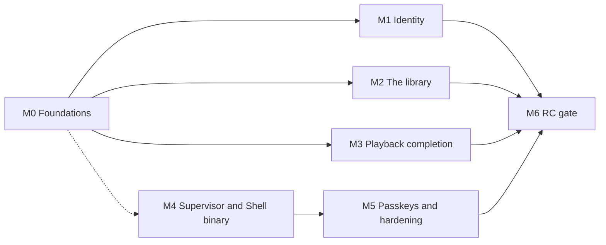

# Roadmap

Derived from the real state of the code, not from a plan written ahead of it.

It is organised by **milestone** — what a person can do when one lands — rather
than by the threads of decisions that produced the build. The threads were
faithful to how the work happened and useless as a plan: six of them, each
correctly deferring to the others, with no shared finish line. What replaces
them is one target, [the first release candidate](#what-the-first-release-must-do),
and the milestones between here and it.

**Built here means the capability landed. It does not always mean a user can
reach it.** Permissions management, configuration versioning and user
administration are all built, all correct, and none of them has a client
surface. [Unreachable capability](unreachable-capability.md) is the register of
that gap, kept separately because nothing in the build or the test suite will
ever report it. Read the two together before concluding Mosaic can do something.

---

## What the first release must do

> Four people in one household, on a clean box, install one thing. The first
> person to open it claims the server and creates the others. Each signs in on
> their own device and stays signed in. An administrator defines the library
> from a few rules that a job keeps current. Anyone searches, plays a remote
> source in about a second, resumes it on another device, and browses by genre
> or by streaming service. When the Platform dies, the Supervisor says so.

Two scope statements, because both have been read the other way. **Debrid
streaming is reached through an aggregator** — AIOStreams resolves the debrid
side and returns a `url`, so no Real-Debrid module is needed and none is
planned; what has been verified live is AIOStreams against TorBox, and
Real-Debrid through the same path is unverified rather than known-good. And
**"without involved setup" applies to browsing, not to streaming**: metadata and
catalogs work on a fresh install with no credential at all (Cinemeta), while any
remote source requires the user to name one.

| # | The release must | State today | Lands in |
|---|---|---|---|
| 1 | Stream remote debrid sources with complete metadata | Built and verified live | — |
| 2 | Support several users, sharing one library | Engine only — no user has ever been created through a client | M1 |
| 2a | Each with their own progress, history and home screen | Progress is already per user; nothing else is | M1, M2 |
| 3 | A Supervisor managing the Platform and the Shell, and fronting both | Nothing on disk | M4 |
| 4 | Sign in with a username and password | Engine built; the screen was built and withdrawn | M0, M1 |
| 5 | Sign in with a passkey | A domain type and two store methods; no ceremony, no surface | M5 |
| 6 | Stay signed in after a long absence | Fixed 24-hour session, no refresh, nothing persisted client-side | M0 |
| 7 | A single-page Shell that never looks like it reloaded | Built | — |
| 8 | Ask-and-receive, plus unprompted server push | Built — the two-lane transport | — |
| 9 | Run asynchronous work to maintain itself | Tables only; no runner, no scheduler, no system principal | M0 |
| 10 | A library an administrator builds from queries and collections | Not built, and not designed | M2 |
| 11 | Search across every provider and the library at once | Built | — |
| 12 | Add an item, or play it without adding | Add built; play-without-adding deferred | M3 |
| 13 | Playing something unowned adds it, so it can be tracked | Not built | M3 |
| 14 | A device declaring what it can physically play | Built — `ClientProfile` on Attach | — |
| 15 | Remote playback that feels instant | Built — 3.75 s cold, 11 ms warm | — |
| 16 | Browse by streaming service or genre without involved setup | Neither is reachable | M2 |
| 17 | Similar and related titles that are not limited to the library | Built on the detail screen; official builds carry the project credential it needs ([ADR 0105](adr/0105-project-credentials-in-official-builds.md)) | — |
| 18 | A Shell that is its own binary, decoupled from the Platform | A Vite bundle with no server | M4 |

Five requirements are not in that list because they were not asked for and the
release is not credible without them: **signing out** (the RPC exists and
nothing calls it), **seek and resume on a remuxed stream** (impossible today —
see M3), **subtitles** (a module fills the role and nothing consumes it), **a
durable metadata cache** (every detail render asks the provider again), and
**backup and restore**.

---

## Where the build is

Twelve repositories: `architecture`, `platform`, `sdk`, `contracts`, `web`,
`registry`, and six modules — three **core**, compiled into the binary
(`module-tmdb`, `module-cinemeta`, `module-remote-playback`), and three
**extension**, installed at runtime and no dependency of the Platform anywhere
(`module-stremio-addons`, `module-aiostreams`, `module-fanart-tv`). The Platform
is AGPL-3.0 with a module-linking exception, the SDK Apache-2.0, optional modules
their authors' choice, this documentation CC-BY-4.0 ([ADR 0022](adr/0022-licensing.md)).

**The content model and the extension thesis.** `nodes`, `parts`, `relations`
and `source_bindings` ([ADR 0013](adr/0013-object-graph.md),
[ADR 0014](adr/0014-storage-authority-and-transaction-scope.md)) under nine
application services that validate, authenticate, authorise and — for writes —
commit state and an outbox event in one transaction. The published surface left
the repository as [`github.com/mosaic-media/sdk`](https://github.com/mosaic-media/sdk)
([ADR 0016](adr/0016-published-contract-surface.md)), and a reference capability
built against it alone proved a third party can extend Mosaic without touching
Platform internals. Boundary tests keep it honest: an external probe module
cannot compile if a public signature leaks an `internal/` type.

**The client transport.** One transport, two lanes
([ADR 0041](adr/0041-cross-client-transport-two-lane-rpc.md),
[ADR 0061](adr/0061-one-client-transport.md)): unary intents
(`Navigate`/`Invoke`/`SubmitInput`/`Attach`) and one server-streaming
`Subscribe` per session, over h2c. A per-session outbound mailbox, a monotonic
`seq` with a bounded replay buffer for resume, and the full `RegionUpdate`
op-set. `AuthService` mints the session; GraphQL was deleted outright. The
Shell reconnects with backoff and jitter, re-declares its route, and has
browser history and deep links. Nine actions are the complete list of what any
client can invoke: `importContent`, `configureModule`, `installExtension`,
`uninstallExtension`, `setPreference`, `playPart`, `reportProgress`,
`recordImpression`, `setWatched`.

**The SDUI vocabulary.** All thirteen slices of the vocabulary overhaul landed
([ADR 0083](adr/0083-one-generated-sdui-vocabulary.md)–[ADR 0095](adr/0095-the-generated-vocabulary-reference.md)):
one `ui.spec.json` generating the Go and TypeScript authoring layers, the
registries and a conformance fixture; negotiation and deliberate degradation;
namespaced module types; bindable props; state scopes; fields, forms and the
retirement of `$value`; validation with a symmetric field-error envelope;
accessibility and focus props; lazy lists; a 76-case cross-client conformance
corpus; and a generated 525-line vocabulary reference. Components are authored
**only** in the contract and the client bundles none
([ADR 0082](adr/0082-components-are-authored-only-in-the-contract.md)); the skin
is served too — 124 token values, both themes, changed without a client build
([ADR 0040](adr/0040-server-delivered-definitions-and-skin.md)).

**The screens.** `home`, `search`, `collections`, `catalog`, `detail`,
`settings`, `extensions`, the expert-mode diagnostics screens, a real 404, and
the Shell's two no-session states. Home rotates a full-viewport hero over rails
that ride its floor, with continue-watching carrying resume progress and time
remaining. Detail emits hero, episodes, cast, a technical-facts grid and
related rails. Settings is one frame with a Platform-owned nav that a module's
own form renders inside ([ADR 0038](adr/0038-module-contributed-settings-ui.md)),
with a drill-down arrangement on a phone carried in the same payload.

**Modules and the two tiers.** Roles, not verbs
([ADR 0027](adr/0027-modules-as-typed-capability-providers.md)): metadata,
search, catalog, stream, subtitles, playback, settings UI and artwork, resolved
through a registry that requires a role be both declared in a signed manifest
and implemented. Stream resolution is decoupled from metadata provenance
([ADR 0073](adr/0073-stream-resolution-is-decoupled-from-metadata-provenance.md)),
so a TMDB import gets Stremio Parts. Artwork is a candidate set
([ADR 0074](adr/0074-artwork-is-a-candidate-set.md)). The extension tier runs
out of process end to end: the gRPC wire, `sdk/host`, the extension host, an
invocation-scoped `Caller` handle, supervised lifecycle with backoff, a
per-module egress proxy that closes the loopback hole `ProxyFromEnvironment`
leaves open, signature and digest verification before a binary runs, a signed
repository index on GitHub Pages the Platform trusts at boot, runtime
install/uninstall with a registry mutable while serving, boot re-adoption from
the on-disk cache, a consent step in front of every install, and a local signed
registry for development ([ADR 0062](adr/0062-two-module-tiers.md)–[ADR 0065](adr/0065-module-distribution-and-trust.md),
[ADR 0077](adr/0077-go-plugin-as-the-extension-harness.md)–[ADR 0081](adr/0081-extension-installation-is-user-initiated-and-persistent.md),
[ADR 0099](adr/0099-the-development-module-repository.md)).

**Playback.** A resolution is `Direct` or `Served`
([ADR 0045](adr/0045-playback-consumer-and-media-origin.md)); the module never
speaks HTTP and the Platform mints a signed, session-bound ticket and serves
`/playback/{ticket}` itself. Import writes the whole candidate set as Parts, and
selection ranks them against the client's declared profile
([ADR 0048](adr/0048-stream-selection-against-a-client-profile.md)) rather than
transcoding a bad pick. ffprobe settles what a release actually is, and the
decision is **per stream** — copy the video, re-encode only the audio the
browser cannot decode ([ADR 0050](adr/0050-probing-and-the-per-stream-playback-decision.md)).
The probe and the resolved URL are both persisted, keyed by capability class,
which is what took a repeat play from 3.75 s to 11 ms
([ADR 0049](adr/0049-resolution-cache-and-capability-classes.md)). Position is
Platform-owned, keyed by (user, node) ([ADR 0046](adr/0046-playback-state-is-platform-owned.md)),
and surfaced as resume, a continue-watching rail, watched marks and a next-episode
control.

**Telemetry.** Ambient in `context.Context`, correlated by the W3C trace id the
Shell mints where the user clicks, instrumented at nine seams, redacted at
construction by class, stored to both a file and PostgreSQL, and readable inside
Mosaic as logs and a trace waterfall behind `telemetry.read`
([ADR 0053](adr/0053-telemetry-is-ambient-in-context.md)–[ADR 0060](adr/0060-the-supervisor-observes-independently.md)).
Modules observe through a dependency-free SDK interface the Platform attributes
and quota-bounds.

**Authorization.** Argon2id password verification, ABAC roles, an `authorized`
value only the boundary can construct with a reflection-enforced conformance
suite ([ADR 0066](adr/0066-authorization-is-carried-in-the-type.md)), and
delegation that intersects with what the granter holds so `role.create` is no
longer "hold every permission" ([ADR 0069](adr/0069-privilege-cannot-escalate.md)).

**The acceptance baseline** — the standing gate every slice passes before the
next begins:

- `go build ./...`, `go vet ./...` and `go test -race ./...` pass
- adapter contract tests pass against real PostgreSQL; migrations run from empty
- import boundary checks pass (the external probe module builds; `capabilities/reference` is parsed)
- the boundary conformance suite passes — every caller-bearing method answers `Unauthenticated` then `PermissionDenied`
- the end-to-end test signs in over `AuthService`, subscribes and navigates over `SessionService`, and asserts the pushed content region
- health probes answer against a running process
- **and the screen was opened in a browser** — see [Findings](#findings-worth-keeping)

---

## The milestones

M4 depends on M0 only for the session model it fronts, so it can run beside
M1–M3. M5 must follow M4: a passkey is bound to an origin, and the origin is
M4's to decide.

### M0 — Foundations

Three things that nothing else lands cleanly without. Each is already waited on
by more than one caller, which is why they come first rather than when the
feature that wants them is scheduled.

1. **The jobs runner, a scheduler, and the system principal — one slice.** The
   `jobs`, `job_attempts` and `job_logs` tables exist with no service, and
   `SELECT … FOR UPDATE SKIP LOCKED` is the intended pattern. Background work
   has no session to forward, so it needs the system principal
   [ADR 0017](adr/0017-how-a-capability-acts.md) reserved — which also fixes a
   live wrong outcome: recording a probe authorises `content.bind`, so a
   read-only viewer plays but never warms the cache and re-probes every time.
   **Six callers are already queued**: telemetry retention deletion and
   partition management ([ADR 0058](adr/0058-telemetry-storage-retention-and-expert-mode.md)),
   the resolution-cache URL refresh ([ADR 0049](adr/0049-resolution-cache-and-capability-classes.md)),
   the watch-provider refresh, library maintenance (M2), and later torrent
   eviction and module-declared cron.
   *Exit: a recurring job runs with no user behind it, retries with backoff,
   dead-letters, appears in expert mode, survives a restart, and telemetry
   retention actually deletes rows.*
2. **The pre-session bootstrap** ([ADR 0101](adr/0101-the-pre-session-bootstrap.md),
   superseding [ADR 0097](adr/0097-the-pre-session-tree.md)). Sign-in and
   onboarding were built and withdrawn on the same day: the Platform served
   exactly the right tree and the browser drew "SignInPanel — not registered in
   this Shell", because **definitions and the token set are pushed on connect**
   and a pre-session client has neither — no components, and no skin. One
   unauthenticated RPC on `AuthService` now answers with the skin, the
   transitively-closed definition subset the tree needs, and the tree, carrying
   the same vocabulary declaration `Attach` carries so negotiation applies
   unchanged. The server picks the tree: setup while unclaimed, sign-in once
   claimed.
   *Exit: an unauthenticated screen renders in a browser, styled, with no
   client-side fallback vocabulary.*
3. **Sessions that survive being away** ([ADR 0102](adr/0102-the-session-credential-is-a-bearer-pair.md)).
   `sessions.Manager` has `Issue`/`Validate`/`Revoke`, a fixed 24-hour lifetime
   and no refresh; the Shell holds the session id in memory and re-authenticates
   on boot from build-time environment variables. A session becomes a **bearer
   pair** — a minutes-long opaque access token on every call, and a long-lived
   refresh token rotated on every use with reuse detection revoking the chain —
   stored in `localStorage` on the web and the platform keystore elsewhere, with
   idle expiry inside absolute expiry and revocation per device. Not a cookie:
   three of the four clients the transport was chosen against have no use for
   one, and the credential must not depend on a front door that does not exist.
   *Exit: close the browser for two weeks, return signed in; revoke that device
   from another and it ends immediately.*

### M1 — Identity, and the doors on multi-user

Mosaic has never had a second account. `bootstrap.EnsureAdmin` seeds exactly one
administrator from environment variables and that is the entire user story. This
is the largest single block in the register and no other row gates as much.

1. **Claiming and onboarding** ([ADR 0098](adr/0098-claiming-an-unclaimed-server.md),
   decided, withdrawn with the pre-session tree). First-to-arrive on a server
   with no administrator, gated on none existing; the audit record of the claim
   and a claim window that closes after start-up are named as later increments
   rather than built. Four steps — server, administrator, a stream source,
   review — with the concept's library and playback steps dropped, because
   Mosaic has no filesystem scanner and decides playback per stream, and with no
   metadata credential to collect: official builds carry project credentials for
   the providers that need one
   ([ADR 0105](adr/0105-project-credentials-in-official-builds.md)) and Cinemeta
   is the floor underneath them, so the only thing a household must name is where
   its streams come from. Instance
   identity is written to a durable file outside PostgreSQL, so a server name
   survives the Platform and the database being down. The environment-variable
   bootstrap stays for automated deployments.
2. **Sign in, sign out, switch account.** `SignOut` is implemented, tested and
   has no caller. A shared device without it is unusable.
3. **User and role administration.** `CreateLocalUser`, `ListUsers`,
   `GetUserByID`, `SetUserStatus`, `CreateRole`, `GrantRole`,
   `GetRolesForUser`, `GetGrantsForUser` and `GetEffectivePermissions` are all
   complete commands whose only callers are tests. Discharging them is a screen,
   a dispatch case and a route each. **Role presets are snapshotted into role
   rows at creation**, so an account created today does not gain an action added
   tomorrow — the owner account is reconciled on every boot and nothing else is.
   Presets need versioning or reconciliation before there is a second account to
   get it wrong for.
4. **The capability set on the session.** `domain.Session.Capabilities` is
   never populated, so [ADR 0036](adr/0036-capability-gated-affordances.md)'s
   affordance gate is currently a server-side omission decision rather than
   something a client can make. This is also the playback thread's unbuilt
   affordance gate: "consumer absent" is testable now that "consumer present"
   exists.
5. **The per-user pass** ([ADR 0103](adr/0103-one-library-many-viewers.md),
   answering the question [ADR 0046](adr/0046-playback-state-is-platform-owned.md)
   opens). **The library is one shared graph; everything about how a person
   experiences it is theirs alone** — position and finished state (already
   keyed by user, node), watch history, and home composition. Watch history is
   this milestone's share of it; home composition is M2's, because it is a
   browse surface. A household never shares a continue-watching rail.

*Exit: four accounts on one box, each signing in on their own device with no
environment variable anywhere, each with their own continue-watching, an
administrator creating and suspending the others.*

**Discharges:** every row of the register's permissions-and-users block, plus
"there is no sign-in UI" and "`SignOut` has no caller".

### M2 — The library becomes a managed thing

Nothing in Mosaic browses what the install owns. Home renders provider catalogs
and a continue-watching rail; `collections` and `catalog` browse a *module's*
collections; search unions the library with providers. `SearchContent` — the
library-only query — has no client path at all. The library is whatever
individual users happened to press Add on.

1. **A Library screen over the materialised graph**, paged, with an item count
   and the real name of what is being shown.
2. **Library rules** ([ADR 0104](adr/0104-the-library-is-built-from-rules.md)).
   A Platform-owned store of rules an administrator manages from settings, where
   a rule is a module collection or a saved provider search, and the library is
   the union of its rules' results plus everything added by hand. **Rules add
   and never remove**: a title that leaves a catalog stays, because a source's
   churn is not a household's decision and silently deleting something somebody
   watched half of is the worst thing this feature could do.
3. **The maintenance job** (needs M0.1): run each rule as the system principal,
   materialise new matches, refresh metadata and artwork, top up Parts — the
   enrichment fan-out is already idempotent and only fills items with none — and
   record what it did where a person can read it. Bounded, and its schedule is
   configuration: rules turn upstream load from bursty and human-triggered into
   continuous, which is a new way to exhaust a rate limit.
4. **Facets: genre and streaming service.** Two independent halves. Provider-side
   browsing by genre needs a filter argument on `CatalogItemsRequest`, which
   carries only `Skip` today; that is an additive SDK bump, a `module.proto`
   field, a line in each direction of the `sdk/host` converter and a change in
   each module. Library-side faceting needs genre to be a stored, indexed
   property of a node — artwork was moved onto the node for exactly this reason
   ([ADR 0071](adr/0071-content-artwork-is-stored-on-the-node.md)) and the same
   question has not been asked of genre.
5. **The watch-provider refresh**, which is what makes grouping by streaming
   service correct rather than confidently wrong. Both halves of the grouping
   are built — `module-tmdb` writes availability at import and
   `SearchContentQuery.AttributesContain` filters on it by containment — and the
   surface was deliberately withheld because nothing refreshes a thing that
   churns monthly. Every record carries a `checkedAt` for the refresh to sort by.
6. **Cache-first rendering** ([ADR 0052](adr/0052-cache-first-rendering-and-source-health.md)).
   Found by restarting the Platform under a live client: every cold catalog call
   failed, the emit-side discards catalog errors, and a full library rendered
   *"Nothing to show yet — try adding an addon in Settings"*. Source-backed
   screens render from a durable snapshot of **items, never trees** — artwork and
   playback URLs are signed with process-scoped keys — revalidate in the
   background, and push the live result as a `RegionUpdate`. A source that stays
   unreachable earns a persistent notification, not a toast.
7. **A durable metadata cache.** A library detail is re-derived from the provider
   on every render. With one user that is freshness; with four on a credential
   shared by every default install it is latency and failure — and the shared
   project credential
   ([ADR 0105](adr/0105-project-credentials-in-official-builds.md)) is what makes
   this a requirement rather than a refinement.
8. **Home composition, per user** ([ADR 0103](adr/0103-one-library-many-viewers.md)).
   Which rows appear, in what order, and which are hidden. It is a **preference,
   not a scope**: a hidden row stays reachable by search and by link, and
   anything that must not be reachable is the content scope, which stays
   unbuilt. A user who has expressed no preference takes the server's default,
   and a newly available row appears for everyone who has not decided about it —
   the trap role presets already fell into.
9. **The project-credential chain, end to end**
   ([ADR 0105](adr/0105-project-credentials-in-official-builds.md)). It works for
   `module-tmdb` and has never worked for `module-fanart-tv`: that module carries
   a `defaultAPIKey` symbol and a doc comment stating the whole policy, the
   comment names `./cmd/mosaic-platform` as its build path,
   [ADR 0081](adr/0081-extension-installation-is-user-initiated-and-persistent.md)
   moved the module out of that binary, and **no workflow anywhere injects the
   key**. So every released binary ships an empty one, artwork enrichment answers
   "API key not set", and nothing goes red — there is no linker-check test on
   that module, which is the guard `module-tmdb` has for exactly this. Inject it
   in the module's own release job, add the guard, and then do the thing this
   thread has never done: **put a fanart clearlogo on a hero and look at it.**

*Exit: an administrator builds the library from two rules, a job keeps it
current, and each user browses by genre and by streaming service, on a home
screen they arranged, having configured nothing beyond their stream source.*

### M3 — Playback completion

Playing works. What is missing is everything around a play that does not go
perfectly, and one thing the release was asked for outright.

1. **Playing something unowned adds it.** Today playback requires a materialised
   Part. This was scoped as materialise-on-*commitment* — play from a
   `ContentRef` and write to the library only past a watch threshold — and
   deferred on a real collision: [ADR 0028](adr/0028-virtual-and-materialized-content.md)
   admits only two crossings while [ADR 0046](adr/0046-playback-state-is-platform-owned.md)
   keys progress by node, and pre-commitment progress has no node to key on.
   **Materialising at play start dissolves that collision instead of solving
   it**, and it is what was actually asked for. The cost is honest and accepted:
   the library gains things people bounced off after ninety seconds.
2. **A source picker and an honest no-candidate state.** The ranking is built
   and reports what it chose out of how many; a user cannot override it, and an
   item with nothing playable presents as a failure rather than as an answer
   with counts and reasons.
3. **Invalidate-on-read** ([ADR 0049](adr/0049-resolution-cache-and-capability-classes.md)).
   A dead cached link fails the play instead of being re-resolved transparently.
   This is the half of the cache that makes it safe rather than merely fast, and
   it needs the ticket to carry the part and the capability class so the origin
   can re-ask. A debrid link dies whenever its torrent leaves the provider's
   cache, so a TTL is a hint and not a mechanism.
4. **Segmented output (HLS).** The origin emits fragmented MP4 off a pipe: no
   index, no length, `Accept-Ranges: none`. **A remuxed stream therefore cannot
   be seeked or resumed** — and remuxing is the normal case, because MSE takes
   only fMP4 and WebM so Matroska cannot pass through a browser whatever codec
   is inside it. Resume is exact only on a directly relayed stream. This is the
   heaviest remaining engineering item in the whole release, and it is **in** the
   release: resume that works only on some releases is not resume.
5. **Subtitles end to end.** `module-aiostreams` fills the `subtitles` role,
   `SubtitlesRequest` gained no coordinates when import was split in two, and
   nothing consumes it. Remote sources without subtitles are a daily-use gap.
6. **Audio and subtitle track selection at play time.** The probe stores the
   whole track list as a versioned document on the Part — it must, because a
   release whose first audio track is Hindi cannot be described by one codec
   column — and the plan picks one. The user cannot.
7. **`StreamLink` cannot say what it knows.** A module parses container, codec,
   resolution and swarm health at its boundary; the link carries neither
   container nor codec, so a Part materialised through the enrichment fan-out
   loses every field selection reads and the probe becomes the only source of
   them. An additive SDK bump plus a pass-through — and, per the lesson below, a
   `module.proto` field and a converter line in each direction, or it is dropped
   silently.

*Exit: press play on anything search returns, from any device profile; resume
anywhere, on a remuxed stream as exactly as on a relayed one; override the
chosen release; and a stale link recovers without the user seeing it.*

### M4 — The Supervisor, the Shell binary and the front door

[ADR 0004](adr/0004-supervisor-as-host-manager.md)–[ADR 0006](adr/0006-supervisor-orchestrates-isolated-builds.md)
have been decided since the beginning and there is no Supervisor on disk. What
it is responsible for has since shrunk a long way: extension modules are the
Platform's throughout ([ADR 0079](adr/0079-the-platform-manages-extension-modules.md)),
and per-install builds were deleted in favour of a CI-built binary
([ADR 0063](adr/0063-platform-binary-built-by-ci.md)). What is left is process
lifecycle, the front door, and the artefact.

1. **`mosaic-shell` as its own binary.** The Shell is a Vite bundle with no
   server, signing in from credentials compiled into it. It becomes a small Go
   binary that embeds the built assets, serves them with a deep-link fallback,
   injects the Platform endpoint **at runtime rather than at build time**,
   answers a health probe and adopts an inbound boot id. It renders; it decides
   nothing; there is no server-side rendering.
2. **The Supervisor.** It manages the Platform and the Shell as processes, and
   is the single front door: TLS, one port, the Shell at the root and the
   Platform's API, `/artwork` and `/playback` behind it. It serves the offline
   and reconnecting states, which are the Shell's only hand-written screens and
   are [ADR 0031](adr/0031-server-owned-app-shell.md)'s stated exception — the
   process still up when the Platform is not is the one that can answer. It
   observes itself file-only and merges into expert mode when the Platform is up
   ([ADR 0060](adr/0060-the-supervisor-observes-independently.md)), and the
   dependency never inverts: the Platform stays observable standalone. It does
   **not** touch extension modules.
3. **The artefact, and activating one.** The CI release matrix already
   cross-compiles five targets with checksums and builds a multi-arch image
   carrying `ffmpeg`. Remaining: signing the binaries and the checksums, which
   waits on key custody Mosaic must operate; and the Supervisor downloading,
   verifying and activating a Generation, with the handover
   ([ADR 0033](adr/0033-supervisor-driven-live-handover.md)) folded into the
   transport's stream resume rather than built as a separate dance.
4. **Configuration versioning gets its door.** Every field declares a reload
   class — Hot, Restart, Generation or Recovery — and only a Hot-only change
   activates without escalation. It is implemented, tested, and no administrator
   can drive it, because escalation is exactly what the Supervisor is for.
   `MOSAIC_MODULES` core-module selection stops being an environment bridge and
   becomes the Generation-class configuration it was designed as.

*Exit: one install, one URL, TLS; kill the Platform and the Supervisor answers
in its place; upgrade in place without the page in front of you dying.*

**Discharges:** the register's configuration-versioning block.

**Decisions owed:** the domain and origin story. The session credential no
longer waits on it ([ADR 0102](adr/0102-the-session-credential-is-a-bearer-pair.md)
is deliberately origin-independent), but the passkey relying-party id in M5
does, and changing it afterwards invalidates every passkey anybody registered.

### M5 — Passkeys and hardening

1. **Passkeys** ([ADR 0068](adr/0068-one-principal-many-credentials.md)).
   `PasskeyCredential`, `SavePasskey` and `ListPasskeys` exist; there is no
   ceremony, no verifier, no RPC and no surface. Deliberately after M4: WebAuthn
   binds a credential to an origin, so registering before the front door is
   settled means every user registers twice. No JWT anywhere — a claims-carrying
   token makes a tightened limit take effect only when the token expires.
2. **Backup and restore.** One PostgreSQL and no documented restore path.
3. **The hardening sweep.** Field-level rejection is routed and nothing calls it
   (`contracts.RejectFields`), so a server refusal cannot yet land on the field
   it belongs to. The redaction-class vet check was decided and not built, which
   leaves the PII boundary as developer discipline
   ([ADR 0056](adr/0056-redaction-classes-are-the-pii-boundary.md)) — an
   arrangement [ADR 0066](adr/0066-authorization-is-carried-in-the-type.md)
   demonstrated does not hold. A module settings write replaces the whole
   document, so an API key rides inside a screen's action payload where redaction
   cannot see it; the fix is a merge semantic or a write-only field in the SDK.
   `verify.yml` is not a required check on `platform`'s `main`, so auto-merge is
   correctly disabled and the real fix is a ruleset. Layer-3 egress containment
   is reported honestly and provided by the deployment, which the shipped
   topology should actually provide. Two decision records are numbered 0095.
4. **Dead code.** The Shell's `mock/` and `gallery/`.

### M6 — The release candidate gate

A written acceptance script, run on a clean box, start to finish: install →
claim → create three accounts → build the library from rules → each account
watches, resumes on a second device, and browses by genre and by service →
upgrade in place → restore from backup. Nothing is ticked off from a passing
test.

---

## Beyond the release candidate

Deferred, named, and not omitted. A trigger is given where one exists.

**Playback and media.** The torrent engine — the `Served` half of
[ADR 0045](adr/0045-playback-consumer-and-media-origin.md), with sequential piece
selection, cache and eviction, forcing module `Start`/`Stop` and a
Platform-granted scratch directory; until it lands a magnet no debrid service
resolves is honestly unplayable rather than silently broken. Full transcoding
with hardware acceleration, deferred rather than rejected — it is the right
answer for local files and the **only** route to true adaptive bitrate, since a
menu of unrelated releases cannot supply an aligned ladder at any level of
effort. Bandwidth-aware selection and stall-triggered reselection are what
Mosaic gets until then. Offline downloads, which no capability declares.

**Clients.** A desktop client with libmpv — the fat profile that makes most of
the browser's limits moot, and what Stremio and Seanime both ship. A second
client at all: the four-client bar the transport was chosen against has only
ever had one behind it, and the capability declaration on `Attach` is the first
thing that stops being optional. A TV client, which the focus and spatial
navigation props exist for and nothing emits. A device registry — a Session
carries a `DeviceID` with no name on it and no role describes a playback
*target*, so the detail screen's "Playing on" and "Change device" are omitted
rather than faked. Casting.

**Multi-user depth.** A content scope for visibility and the child account it
exists for, blocked on two things that are not authorization problems: ratings
arrive in unvalidated JSONB whose correctness belongs to the writing capability,
and the discovery plane returns virtual results with no stored attributes, so
scoping the library does not scope search ([ADR 0067](adr/0067-three-authorization-mechanisms.md)).
Per-user provider credentials — module settings are per module, so one debrid
account serves the whole install; harmless while the Platform relays and no
credential reaches a client. Taste preferences that something actually reads,
which must stay out of the policy engine when it happens.

**Library depth.** Manual library editing — a user cannot correct a wrong title,
attach a local file to an episode or fix a bad source binding; everything arrives
through a module and can only be changed by one. An artwork picker: every
candidate is stored precisely so a user can choose, and `SetContentArtwork`
replaces rather than merges, so a choice will need marking as the user's or the
next enrichment pass overwrites it. Cross-provider Part dedup and a general answer
to provider precedence — for artwork the seam dissolved, because candidates union
rather than compete; for streams it stays open. Search dedup between TMDB-keyed
and IMDb-keyed sources. The relation read (`ListFrom`/`ListTo`), which turned out
not to be load-bearing — next-episode is the containment tree — so it is tidiness
rather than a blocker, but a franchise is re-derived per render until it exists.
The `media_types` registry, waiting on a module that introduces a genuinely new
type. Export formats: NFO for other systems, `.mos` for Mosaic-to-Mosaic
portability. A filesystem scanner and local media, which nothing in the release
assumes.

**Observability and compliance.** The audit store — decided as a store on `Tx`,
append-only by database grant, with an audit write failure failing the command;
there is no migration and nothing writes the table whose retention is already
configured. Metrics. Optional OTLP export and a `docker-compose.obs.yml`
developer profile — instrumentation is architecture and always on, export is
configuration and defaults to nothing. SIEM export, left until a deployment needs
one.

**Extension updates.** An install pins the version it installed and re-adopts
exactly those bytes across restarts
([ADR 0081](adr/0081-extension-installation-is-user-initiated-and-persistent.md)),
so an extension never moves on its own and a rebuilt index does not reach an
already-installed module — the pin working, rather than a gap. The Platform
should be able to update one automatically **when a user turns it on**: opt-in,
never a default, because an automatic update is the Platform downloading and
spawning new third-party code with its own authority on a schedule nobody is
watching. It is also what would let a rotated project credential
([ADR 0105](adr/0105-project-credentials-in-official-builds.md)) reach an install
without every user acting. The **policy** is not designed and is deliberately out
of the release — when it checks, whether it follows a major version, what happens
when a signature or digest fails halfway, whether a failed update rolls back to
the pinned bytes. Shipping the mechanism without the policy is how an install
ends up running a module nobody chose and cannot get back.

**Platform mechanics.** `LISTEN`/`NOTIFY` as an accelerator over the outbox
poll, never a replacement, because notifications drop when no listener is
connected. Module-declared cron. Module-granular permissions distinct from the
invoking user's. Per-module resource limits — lifecycle observes health, it does
not cap consumption. Rate limiting in the egress proxy, deferred rather than
invented without a policy. Layer-3 OS-level egress denial, which is
deployment-provided and privileged.

**The SDUI trailing edge.** Nothing emits a lifecycle trigger, so
`recordImpression` — implemented, authorised, and demonstrated end to end with
fifteen impressions arriving — has nothing that can cause one. Nothing emits an
accessibility prop, a focus prop or an `onDisappear`. Four prop keys carry two
types across primitives, which breaks the contract's own one-key-one-type rule
and renames props on the wire to fix. Catalog paging is built and unreachable
until a provider sets `HasMore`.

**Detail-screen data with nowhere to come from.** A rating scale or attribution
(`ContentMetadata.Rating` is a bare float), a frame rate, a per-track audio
bitrate, and "Refreshed 4h ago" — each omitted rather than filled plausibly.

**Design.** The Mosaic Design Language: the material work is built — a concrete
base with generated noise, glass on it, artwork as the light source — and the
stated language behind it is not written.

---

## Findings worth keeping

Eight failure shapes that recurred, none of which a gate caught.

1. **A screen that has not been rendered has not been verified.** Sign-in was
   verified end to end on the server, declared blocked in the browser, and the
   defect was in the browser. This is now part of the acceptance baseline.
2. **The invisible wrapper.** Three slices shipped code that compiled, passed
   every gate and did nothing — a visibility observer, a focus host and a
   next-focus target, each pointed at a `display: contents` element that
   generates no box and is invisible to every browser API operating on boxes.
   All three were found within minutes of opening a browser.
3. **The gate defeated by its own harness**, four times, every time to a gate
   that worked: a push keyed off `grep`'s exit status instead of the gate's, a
   sentinel version shipped from a drift-guard verification, an HMR artefact
   misdiagnosed, a debt recorded as discharged on the strength of a compile. Run
   them on their exit status, and believe them.
4. **A dropped field is indistinguishable from an absent one.** Three SDK fields
   were added against a `module.proto` with no fields to hold them; `sdk/host`
   dropped all three silently. A field added to the SDK's virtual-content DTOs
   needs a proto field and a line in each direction of the converter, and there
   is no compiler that says so.
5. **Staleness is silent in four different ways.** `docker compose restart` does
   not rebuild `go run` against changed *embedded* files; npm installs a
   published package over a workspace link when a dependency range drifts; a
   `go.work` `use` does not stop resolution reading another member's `go.mod`;
   and minimal version selection silently raises every repository's dependency
   floor, so a per-repository boundary gate can be testing a set that never
   links.
6. **Correctness that cannot be represented is correctness that will be lost.**
   Persisting only `AudioCodec` would have let a second play pick a different
   audio track from the first — a regression the columns could not express — so
   the whole track list is a versioned document and the columns carry the
   summary. Related: a nil store returning an empty answer is indistinguishable
   from "you have not watched this", and role presets snapshotted at creation
   mean a new action never reaches an existing account.
7. **A source checked against a fake is not a source that was checked.**
   Cinemeta answers `200` for ids it does not know, in two different shapes, so
   the obvious emptiness test passes and the Platform materialises a work titled
   `tt99999999`.
8. **"The code has no path for this" is not "the architecture forbids it".** The
   two-chrome app shell was recorded as blocked and was a five-line change.

---

## Working rules

- **One slice at a time**, in order, each passing the acceptance baseline before
  the next begins.
- **A milestone item is done when a human clicked it in a running Mosaic** and
  the [register](unreachable-capability.md) row was struck in the same change.
  Never cite a passing test as evidence.
- **Report blockers, do not force past them.** The reference capability slice was
  stopped twice and reported instead of bodged; that is why the fix was a design
  decision rather than a workaround buried in code.
- **Code is authoritative where code exists.** Documentation describes what is
  built; it does not specify what is not.
- **When implementation contradicts a specification, the specification is
  wrong.** Fix it there, in the same session.
- **A new screen never touches the renderer.** If it cannot be said in the
  vocabulary, that is a finding — answered by a new definition (data, free) or a
  deliberate vocabulary growth with a version bump and an entry here, never by a
  CSS rule smuggled in beside the screen that wanted it.
