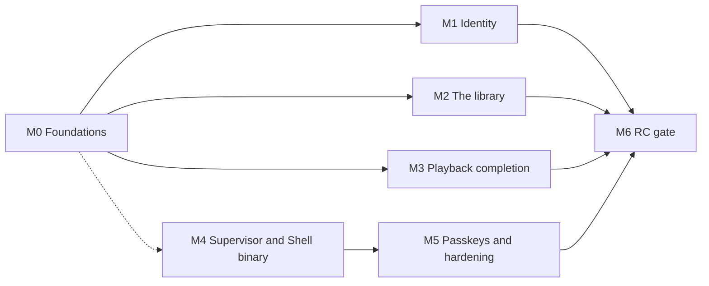

# Roadmap

Derived from the real state of the code, not from a plan written ahead of it.

It is organised by **milestone** — what a person can do when one lands — rather
than by the threads of decisions that produced the build. The threads were
faithful to how the work happened and useless as a plan: six of them, each
correctly deferring to the others, with no shared finish line. What replaces
them is one target, [the first release candidate](#what-the-first-release-must-do),
and the milestones between here and it.

**Built here means the capability landed. It does not always mean a user can
reach it.** Permissions management, configuration versioning and user
administration are all built, all correct, and none of them has a client
surface. [Unreachable capability](unreachable-capability.md) is the register of
that gap, kept separately because nothing in the build or the test suite will
ever report it. Read the two together before concluding Mosaic can do something.

---

## What the first release must do

> Four people in one household, on a clean box, install one thing. The first
> person to open it claims the server and creates the others. Each signs in on
> their own device and stays signed in. An administrator defines the library
> from a few rules that a job keeps current. Anyone searches, plays a remote
> source in about a second, resumes it on another device, and browses by genre
> or by streaming service. When the Platform dies, the Supervisor says so.

Two scope statements, because both have been read the other way. **Debrid
streaming is reached through an aggregator** — AIOStreams resolves the debrid
side and returns a `url`, so no Real-Debrid module is needed and none is
planned; what has been verified live is AIOStreams against TorBox, and
Real-Debrid through the same path is unverified rather than known-good. And
**"without involved setup" applies to browsing, not to streaming**: metadata and
catalogs work on a fresh install with no credential at all (Cinemeta), while any
remote source requires the user to name one.

| # | The release must | State today | Lands in |
|---|---|---|---|
| 1 | Stream remote debrid sources with complete metadata | Built and verified live | — |
| 2 | Support several users, sharing one library | Built — four accounts on one box, created through the People panel | — |
| 2a | Each with their own progress, history and home screen | Progress and watch history are per user; the home screen is not | M2 |
| 3 | A Supervisor managing the Platform and the Shell, and fronting both | Nothing on disk | M4 |
| 4 | Sign in with a username and password | Built — the doorway carries the form, and nothing signs in from a build-time credential | — |
| 5 | Sign in with a passkey | A domain type and two store methods; no ceremony, no surface | M5 |
| 6 | Stay signed in after a long absence | Built — a bearer pair, rotated, with per-device revocation ([ADR 0102](adr/0102-the-session-credential-is-a-bearer-pair.md)) | — |
| 7 | A single-page Shell that never looks like it reloaded | Built | — |
| 8 | Ask-and-receive, plus unprompted server push | Built — the two-lane transport | — |
| 9 | Run asynchronous work to maintain itself | Built — runner, interval scheduler and system principal; two of six queued callers wired | — |
| 10 | A library an administrator builds from queries and collections | Not built, and not designed | M2 |
| 11 | Search across every provider and the library at once | Built | — |
| 12 | Add an item, or play it without adding | Add built; play-without-adding deferred | M3 |
| 13 | Playing something unowned adds it, so it can be tracked | Not built | M3 |
| 14 | A device declaring what it can physically play | Built — `ClientProfile` on Attach | — |
| 15 | Remote playback that feels instant | Built — 3.75 s cold, 11 ms warm | — |
| 16 | Browse by streaming service or genre without involved setup | Neither is reachable | M2 |
| 17 | Similar and related titles that are not limited to the library | Built on the detail screen; official builds carry the project credential it needs ([ADR 0105](adr/0105-project-credentials-in-official-builds.md)) | — |
| 18 | A Shell that is its own binary, decoupled from the Platform | A Vite bundle with no server | M4 |

Five requirements were not in that list because they were not asked for and the
release is not credible without them. **Signing out** landed in M1 — it is on
the account cluster of every screen, it revokes the refresh chain and it ends
the live session, so a shared device can be handed over. The other four stand:
**seek and resume on a remuxed stream** (impossible today — see M3),
**subtitles** (a module fills the role and nothing consumes it) and **backup and
restore**. The fourth, **a durable metadata cache**, landed in M2a
([ADR 0107](adr/0107-the-platform-keeps-what-a-source-told-it.md)): a library
detail now renders from the object graph rather than asking the provider again.

---

## Where the build is

Twelve repositories: `architecture`, `platform`, `sdk`, `contracts`, `web`,
`registry`, and six modules — three **core**, compiled into the binary
(`module-tmdb`, `module-cinemeta`, `module-remote-playback`), and three
**extension**, installed at runtime and no dependency of the Platform anywhere
(`module-stremio-addons`, `module-aiostreams`, `module-fanart-tv`). The Platform
is AGPL-3.0 with a module-linking exception, the SDK Apache-2.0, optional modules
their authors' choice, this documentation CC-BY-4.0 ([ADR 0022](adr/0022-licensing.md)).

**The content model and the extension thesis.** `nodes`, `parts`, `relations`
and `source_bindings` ([ADR 0013](adr/0013-object-graph.md),
[ADR 0014](adr/0014-storage-authority-and-transaction-scope.md)) under nine
application services that validate, authenticate, authorise and — for writes —
commit state and an outbox event in one transaction. The published surface left
the repository as [`github.com/mosaic-media/sdk`](https://github.com/mosaic-media/sdk)
([ADR 0016](adr/0016-published-contract-surface.md)), and a reference capability
built against it alone proved a third party can extend Mosaic without touching
Platform internals. Boundary tests keep it honest: an external probe module
cannot compile if a public signature leaks an `internal/` type.

**The client transport.** One transport, two lanes
([ADR 0041](adr/0041-cross-client-transport-two-lane-rpc.md),
[ADR 0061](adr/0061-one-client-transport.md)): unary intents
(`Navigate`/`Invoke`/`SubmitInput`/`Attach`) and one server-streaming
`Subscribe` per session, over h2c. A per-session outbound mailbox, a monotonic
`seq` with a bounded replay buffer for resume, and the full `RegionUpdate`
op-set. `AuthService` mints the session; GraphQL was deleted outright. The
Shell reconnects with backoff and jitter, re-declares its route, and has
browser history and deep links. Ten actions are the complete list of what any
client can invoke: `importContent`, `configureModule`, `installExtension`,
`uninstallExtension`, `revokeSession`, `setPreference`, `playPart`,
`reportProgress`, `recordImpression`, `setWatched`. Every call on the session
service now authenticates at the transport, and a session's live state is keyed
by session id rather than by the credential, which rotates
([ADR 0102](adr/0102-the-session-credential-is-a-bearer-pair.md)).

**The SDUI vocabulary.** All thirteen slices of the vocabulary overhaul landed
([ADR 0083](adr/0083-one-generated-sdui-vocabulary.md)–[ADR 0095](adr/0095-the-generated-vocabulary-reference.md)), and one
addition since: `visibleWhen` on `Box` took it to **3.1.0**. The prop already
existed on the six field primitives with the same type and meaning; on a
container it hides a branch, which is what makes a multi-step form expressible
at all — without it a wizard is one long page or a round trip per step, and a
round trip per step sends the password the second step collects back down inside
the third step's tree. Three definitions were also found unable to be form
fields: `TextField`, `Select` and `Toggle` each bound the props their label
needs and none of them bound `name`, so the input inside each wrote to local
state nothing collects.
one `ui.spec.json` generating the Go and TypeScript authoring layers, the
registries and a conformance fixture; negotiation and deliberate degradation;
namespaced module types; bindable props; state scopes; fields, forms and the
retirement of `$value`; validation with a symmetric field-error envelope;
accessibility and focus props; lazy lists; a 76-case cross-client conformance
corpus; and a generated 525-line vocabulary reference. Components are authored
**only** in the contract and the client bundles none
([ADR 0082](adr/0082-components-are-authored-only-in-the-contract.md)); the skin
is served too — 124 token values, both themes, changed without a client build
([ADR 0040](adr/0040-server-delivered-definitions-and-skin.md)).

**The screens.** `home`, `search`, `library`, `collections`, `catalog`, `detail`,
`settings`, `extensions`, `history`, the expert-mode diagnostics screens — logs,
traces and now the background-work queue behind its own `job.read` — the
pre-session doorway with its setup wizard and its sign-in form, the People
panels behind `user.read`, a device list on the account panel, a real 404, and
the Shell's one remaining hand-written state (a Platform that could not describe its own door;
the other became the doorway). Home rotates a full-viewport hero over rails
that ride its floor, with continue-watching carrying resume progress and time
remaining. Detail emits hero, episodes, cast, a technical-facts grid and
related rails. Settings is one frame with a Platform-owned nav that a module's
own form renders inside ([ADR 0038](adr/0038-module-contributed-settings-ui.md)),
with a drill-down arrangement on a phone carried in the same payload. `library`
is the one screen over the object graph rather than over a provider, so it is
the only one that can state a real total rather than "128+".

**What the library should contain** ([ADR 0104](adr/0104-the-library-is-built-from-rules.md)).
Rules are Platform state — a table, a contract and its own contract-suite rows —
and a scheduled pass reconciles the library against them as the system principal,
bounded and best-effort, recording created, refreshed, skipped and failed on each
rule. Rules add and never remove: deleting a rule deletes nothing it added, and a
rule outlives its module being uninstalled, degraded and visibly so.

**Modules and the two tiers.** Roles, not verbs
([ADR 0027](adr/0027-modules-as-typed-capability-providers.md)): metadata,
search, catalog, stream, subtitles, playback, settings UI and artwork, resolved
through a registry that requires a role be both declared in a signed manifest
and implemented. Stream resolution is decoupled from metadata provenance
([ADR 0073](adr/0073-stream-resolution-is-decoupled-from-metadata-provenance.md)),
so a TMDB import gets Stremio Parts. Artwork is a candidate set
([ADR 0074](adr/0074-artwork-is-a-candidate-set.md)). The extension tier runs
out of process end to end: the gRPC wire, `sdk/host`, the extension host, an
invocation-scoped `Caller` handle, supervised lifecycle with backoff, a
per-module egress proxy that closes the loopback hole `ProxyFromEnvironment`
leaves open, signature and digest verification before a binary runs, a signed
repository index on GitHub Pages the Platform trusts at boot, runtime
install/uninstall with a registry mutable while serving, boot re-adoption from
the on-disk cache, a consent step in front of every install, and a local signed
registry for development ([ADR 0062](adr/0062-two-module-tiers.md)–[ADR 0065](adr/0065-module-distribution-and-trust.md),
[ADR 0077](adr/0077-go-plugin-as-the-extension-harness.md)–[ADR 0081](adr/0081-extension-installation-is-user-initiated-and-persistent.md),
[ADR 0099](adr/0099-the-development-module-repository.md)).

**Playback.** A resolution is `Direct` or `Served`
([ADR 0045](adr/0045-playback-consumer-and-media-origin.md)); the module never
speaks HTTP and the Platform mints a signed, session-bound ticket and serves
`/playback/{ticket}` itself. Import writes the whole candidate set as Parts, and
selection ranks them against the client's declared profile
([ADR 0048](adr/0048-stream-selection-against-a-client-profile.md)) rather than
transcoding a bad pick. ffprobe settles what a release actually is, and the
decision is **per stream** — copy the video, re-encode only the audio the
browser cannot decode ([ADR 0050](adr/0050-probing-and-the-per-stream-playback-decision.md)).
The probe and the resolved URL are both persisted, keyed by capability class,
which is what took a repeat play from 3.75 s to 11 ms
([ADR 0049](adr/0049-resolution-cache-and-capability-classes.md)). Position is
Platform-owned, keyed by (user, node) ([ADR 0046](adr/0046-playback-state-is-platform-owned.md)),
and surfaced as resume, a continue-watching rail, watched marks and a next-episode
control.

**Telemetry.** Ambient in `context.Context`, correlated by the W3C trace id the
Shell mints where the user clicks, instrumented at nine seams, redacted at
construction by class, stored to both a file and PostgreSQL, and readable inside
Mosaic as logs and a trace waterfall behind `telemetry.read`
([ADR 0053](adr/0053-telemetry-is-ambient-in-context.md)–[ADR 0060](adr/0060-the-supervisor-observes-independently.md)).
Modules observe through a dependency-free SDK interface the Platform attributes
and quota-bounds. Retention is a scheduled job as of M0.1 rather than a
goroutine that only existed while the process did — a Platform down for a month
used to come back with a month of records it had intended to drop.

**Authorization.** Argon2id password verification, ABAC roles, an `authorized`
value only the boundary can construct with a reflection-enforced conformance
suite ([ADR 0066](adr/0066-authorization-is-carried-in-the-type.md)), and
delegation that intersects with what the granter holds so `role.create` is no
longer "hold every permission" ([ADR 0069](adr/0069-privilege-cannot-escalate.md)).
Suspension enforces itself as of M1 — it wrote a column nothing read, so a
suspended account could sign in and one already signed in stayed so for ninety
days — and a session carries the caller's flattened authority at issue time, for
a client to omit affordances from rather than to check against.

**The acceptance baseline** — the standing gate every slice passes before the
next begins:

- `go build ./...`, `go vet ./...` and `go test -race ./...` pass
- adapter contract tests pass against real PostgreSQL; migrations run from empty
- import boundary checks pass (the external probe module builds; `capabilities/reference` is parsed)
- the boundary conformance suite passes — every caller-bearing method answers `Unauthenticated` then `PermissionDenied`
- the end-to-end test signs in over `AuthService`, subscribes and navigates over `SessionService`, and asserts the pushed content region
- health probes answer against a running process
- **and the screen was opened in a browser** — see [Findings](#findings-worth-keeping)

---

## The milestones

M4 depends on M0 only for the session model it fronts, so it can run beside
M1–M3. M5 must follow M4: a passkey is bound to an origin, and the origin is
M4's to decide.

### M0 — Foundations — **landed**

Three things that nothing else lands cleanly without. Each was already waited on
by more than one caller, which is why they came first rather than when the
feature that wants them was scheduled. All three are built; what each left out
is named below.

1. ~~**The jobs runner, a scheduler, and the system principal — one slice.**~~
   **Built.** `internal/platform/jobs` claims with `SELECT … FOR UPDATE SKIP
   LOCKED`, retries with a capped exponential backoff, dead-letters and keeps
   the row, and reclaims a job whose runner died once its lease lapses. The
   scheduler holds no state between ticks: the occurrence a moment belongs to is
   the moment truncated to the interval, and that is the key a partial unique
   index makes the enqueue idempotent on — so every tick, every process and
   every boot enqueue the same row and a restart needs no recovery step. The
   **system principal** is a caller like any other: a per-process reference
   drawn from `crypto/rand`, resolved before any session read, and allowed by
   the policy engine through the one unconditional rule it now carries. That
   also fixed the live wrong outcome — the playback transport records a probe as
   the system principal, so a read-only viewer warms the cache instead of
   re-probing every play.

   **Left out:** it is an *interval* scheduler, not cron — module-declared cron
   is still its own piece of work. Three of the six queued callers are wired
   (telemetry retention, the expired-credential sweep M0.3 added, and library
   maintenance as of M2a); the resolution-cache refresh, the watch-provider
   refresh and torrent eviction are not. `JobStore` is deliberately not on `Tx`, so a job
   enqueued from inside a command would not commit with it; nothing enqueues
   from a command today and the honest fix when one does is an `Enqueue` on
   `Tx`, not one that pretends.
2. ~~**The pre-session bootstrap**~~ ([ADR 0101](adr/0101-the-pre-session-bootstrap.md),
   superseding [ADR 0097](adr/0097-the-pre-session-tree.md)). **Built.**
   `AuthService.Bootstrap` answers with the token set, the definition subset and
   the tree in one response. The subset is transitively closed over the tree and
   nothing more — three definitions for today's doorway out of forty-three — and
   the request carries `mosaic.session.v1.VocabularyProfile` itself, so
   [ADR 0084](adr/0084-vocabulary-negotiation-and-deliberate-degradation.md)'s
   negotiation applies unchanged rather than through a second declaration that
   could drift. The server picks the tree and nothing on the wire says which.
   The Shell renders it in place of a hand-written state, so the client's only
   self-drawn UI is now the one case that is genuinely its own: a Platform that
   could not describe its own door.

   **Left out: the form.** This slice delivered the doorway's *vocabulary*, not
   the doorway. Each state says what it is and offers nothing it cannot do,
   because a control wired to nothing is the dead end
   [ADR 0036](adr/0036-capability-gated-affordances.md) names; sign-in and claim
   are M1. The payload is deliberately not cached, per the ADR.
3. ~~**Sessions that survive being away**~~ ([ADR 0102](adr/0102-the-session-credential-is-a-bearer-pair.md)).
   **Built.** A ten-minute opaque access token on every call and a ninety-day
   refresh token bound to the device, rotated on every use, with reuse detection
   revoking the chain; thirty-day idle expiry sitting inside the absolute
   lifetime; only hashes stored. The Shell holds the pair in `localStorage`,
   refreshes ahead of an expiry and once after an `Unauthenticated`, and a
   device list on the account panel ends any of them. `refreshSession` stops
   being *never worked*.

   **Two defects only the browser found, both recorded because the shape
   recurs.** An expired credential used to reach the screen builders and come
   back as an error *rendered into the content region* — a successful call
   carrying a picture of a failure, with nothing for a client to retry on; the
   transport authenticates now, and live sessions are keyed by session id rather
   than by the rotating value a client presents. And reuse detection revoked the
   chain *inside* the transaction that detected it, which the rollback then
   undid, so a replayed token was refused and the thief's chain survived — found
   by the wire test the first defect motivated, and invisible to any in-memory
   store.

   **Left out:** native keystore storage (there is no native client yet), and
   passkeys, which change what *mints* the pair and not what it is (M5).

### M1 — Identity, and the doors on multi-user — **landed**

Mosaic had never had a second account. `bootstrap.EnsureAdmin` seeded exactly
one administrator from environment variables and that was the entire user story;
this was the largest single block in the register and no other row gated as
much. Four accounts now exist on a box that was claimed through a browser, with
no environment variable set anywhere.

1. ~~**Claiming and onboarding**~~ ([ADR 0098](adr/0098-claiming-an-unclaimed-server.md),
   decided, withdrawn with the pre-session tree, **rebuilt here**). **Built.**
   `ClaimServer` is the one write no caller authorises, and the only one that
   can be: emptiness stands in for authorisation, checked again inside the
   transaction so two people arriving together produce one owner and one
   Conflict. It creates the owner, its Superuser role, the grant and its first
   session together — claiming signs you in — and then does two things allowed
   to fail without failing the claim: writing the server's name, and installing
   the stream source that was chosen. **Four steps rather than the one ADR 0098
   could support:** the jobs runner has landed since, and a server-name field
   and a stream-source connection turned out to be buildable, so three of the
   five steps that record dropped came back. **Instance identity is a durable
   file outside PostgreSQL**, so a server's name outlives its database — which
   is the moment somebody most needs it. The environment-variable bootstrap
   stays for automated deployments and the dev stack no longer sets it, so first
   boot shows the doorway exactly as a household's would.

   **Left out:** the claim audit record and the claim window, both named in
   ADR 0098 as later increments and both still unbuilt — the accepted threat is
   unchanged, and the mitigations for it remain operational. The steps are one
   tree with one State scope, stepped by `visibleWhen`, which costs the
   client-side validation of off-screen fields: a hidden `Box` unmounts its
   inputs and their rules leave the scope, so a multi-step form is validated by
   the server and its rejections have to stand alone in the form-level message.
   That is the price of not sending the password back down inside the next
   step's tree.
2. ~~**Sign in, sign out, switch account.**~~ **Built.** The doorway carries
   both forms, on a pre-session action lane of its own
   ([ADR 0106](adr/0106-the-pre-session-action-lane.md)) — a doorway's controls
   emit ordinary SDUI actions and there is no push lane for the outcome, so it
   rides the unary response as one of three: a minted session, a replacement
   door, or the fields that were refused. **The client interprets none of them**,
   which is what let a four-step wizard be added without a line in the Shell.
   Signing out is on the account cluster of every screen, revokes the refresh
   chain, and ends the live session — without that last part it took ten minutes
   to notice, because the push stream makes no call to be refused. Switching
   account is the same path: sign out, and the door comes back.

   **Left out:** the Shell no longer signs in from `VITE_DEV_USERNAME` /
   `VITE_DEV_PASSWORD`, which is the removal that mattered, and a third doorway
   state was added that ADR 0098 did not name — a server that cannot read its
   own accounts says the lock is broken rather than drawing a form that refuses
   every attempt with "invalid credentials".
3. ~~**User and role administration.**~~ **Built.** Settings › People lists the
   accounts, leads into each one, and adds a viewer or an administrator; a
   person's panel shows their roles, their flattened authority and the two
   things that can be done to them. **The offer is computed from what the caller
   holds** ([ADR 0069](adr/0069-privilege-cannot-escalate.md)) — an
   administrator creating another administrator sees which permissions are
   withheld because they do not hold them. Presets are snapshotted, and
   **a role's name is unique across the install**, so a preset role is an
   install-wide named role that several people hold rather than a copy per
   account; the snapshot belongs to the role.

   **Left out:** `GetGrantsForUser` is the one command in the block still
   without a door — roles and effective permissions answer "what may they do"
   and the grant rows surface nowhere. Creating an account is three commands and
   they do not share a transaction, so a failure between them leaves an account
   holding no role; it cannot sign in, its panel says so, and it offers the step
   that was missed. Nothing edits a role after it is created, so narrowing
   somebody's authority means suspending the account.
4. ~~**The capability set on the session.**~~ **Built.**
   `domain.Session.Capabilities` is populated at issue time and re-resolved on
   every refresh, so a grant changed during a ninety-day session reaches the
   client's gate within a rotation rather than never, and
   `mosaic.auth.v1.Session` carries it. It is a *drawing* decision and never a
   check: every call re-authorises against the grants as they are then.

   **Left out:** the playback thread's "consumer absent" gate. What landed
   instead is the gating the second account made urgent — the settings nav, the
   People affordances and the detail screen's library controls are each drawn
   only for a caller who could use them.
5. ~~**The per-user pass**~~ ([ADR 0103](adr/0103-one-library-many-viewers.md)).
   **Built, for its M1 share.** Watch history is a Platform query and
   deliberately **not** on the SDK's `ContentService`: no module needs to read a
   person's viewing back, and the one list ADR 0103 is most emphatic is private
   should not sit on the surface every installed extension holds. It takes no
   user parameter, so there is no version of the screen that shows somebody
   else's.

   **Left out:** home composition, which is M2's because it is a browse surface.

*Exit, met: four accounts on one box, each signing in on their own device with
no environment variable anywhere, each with their own history over one shared
library, and an administrator who is not the owner suspending another account.*

**Discharges:** the register's whole permissions-and-users block except
`GetGrantsForUser`, plus "there is no sign-in UI" and "`SignOut` has no caller".

**What discharging it cost, because this is the argument for the register.**
Every service behind those doors was complete, tested and transactional, and
putting doors on them found seven defects that no gate could have. An ordinary
account could not sign in (`session.create` was administrator-only), could not
sign itself out (`user.session.revoke` was required of everybody and held by
administrators), and could not read its own name (`GetCurrentUser` required
`user.read`, so the account cluster drew a question mark for every viewer).
Settings would not open for one at all, because the nav reads the module list
and the error took the whole screen. "Add to library" was drawn for people who
cannot import. Creating four accounts produced three with no authority, because
a role name is unique and the fakes had no such index. And a claimed server
never reconciled its owner's role, because that only ran under the
environment-variable bootstrap. Each one is a service that worked perfectly and
a product that did not; each one was found by clicking.

Two more of the same kind, worth naming because the shape recurs: the claim
resolved its stream source's repository *after* committing, from a catalogue
read gated on the server still being claimable, so it answered "Mosaic no longer
offers aiostreams" on the very claim that chose it. And the People list's rows
carried an `action` that `SettingsRow` reads nothing of, so the list could not be
clicked — while a test asserting the prop passed. A test that asserts a prop is
set proves nothing about whether anything reads it.

### M2 — The library becomes a managed thing

Home renders provider catalogs and a continue-watching rail; `collections` and
`catalog` browse a *module's* collections; search unions the library with
providers. Until M2a, nothing browsed what the install owns and nothing anywhere
stated what it should contain — the library was whatever individual users
happened to press Add on. **M2a (1–3) and M2b (4, 5, 9) have landed**; 6 and 8
have not.

1. ~~**A Library screen over the materialised graph**, paged, with an item count
   and the real name of what is being shown.~~ **Built.** `screenLibrary` is the
   first screen that reads the object graph rather than a provider, on a nav row
   of its own beside Collections — the install's shelf and a module's catalogue
   are adjacent and are not the same room. **The count is real**, which is the
   thing a provider-backed screen cannot do: `NodeStore` gained `Count` and
   `NodeQuery` gained `Offset`, so the screen says "81 titles" over rows it can
   count, where the catalog screen has to say "128+". Cards open **by node id,
   not by ref**, so a title still opens when the source that provided it is down.

   **It scrolls rather than pages**, on the lazy-list mechanism
   ([ADR 0093](adr/0093-lazy-lists.md)): the grid states
   `hasMore` and `loadMore`, and the client asks for the next window as the end
   comes into view. `hasMore` is computed from the total rather than from the
   page being full, which is the property that mechanism exists for. Because a
   `query` action *replaces* the content region, each further window re-renders
   everything above it, so the scroll stops at 600 titles and **says so** rather
   than going quiet — a lazy list that silently stops is indistinguishable from
   one that reached the end.

   **Left out, and it is a departure from the plan:** the paged read is a new
   Platform query (`ListLibrary`) and deliberately **not** `SearchContent`. One
   answers "do I already have this?" for a capability about to source something;
   the other is a browse. Paging and a total are what a browse needs and what
   nothing sourcing content has ever asked for, so they did not grow the SDK
   surface every installed extension holds — the same reasoning that kept watch
   history off `ContentService`. `SearchContent` itself therefore still has no
   client path. There is no media-type or genre narrowing on the screen: that is
   faceting, and it is 4.

   **A vocabulary defect this slice found and did not fix.** The screen was
   first built on the vocabulary's `Pagination` definition, which had shipped,
   been drift-guarded and conformance-tested, and been emitted by **nothing**.
   Both its controls are permanently disabled and always have been: the template
   writes `"disabled": {"$ifNot": {"$bind": "hasNext"}}`, but `$if`/`$ifNot` are
   *node guards* that drop a subtree, not value expressions — so the client's
   binding resolver walks the object, resolves the `$bind` inside it, and hands
   `Pressable` the object `{$ifNot: true}`, which is truthy. It is the mirror of
   the failure that has bitten this project twice already: not a prop nothing
   reads, but a prop shape nothing evaluates, and equally silent. Found by
   clicking Next and watching nothing happen. Fixing it is a `contracts` change
   and a release, and nothing emits `Pagination` now.
2. ~~**Library rules**~~ ([ADR 0104](adr/0104-the-library-is-built-from-rules.md)).
   **Built.** A Platform-owned store — its own table, contract and contract-suite
   rows — of rules an administrator manages from Settings › Library. **Rules add
   and never remove** is enforced in three places rather than asserted in one:
   reconciliation only materialises, deleting a rule deletes nothing it added,
   and a rule whose module has been uninstalled is kept and marked degraded on
   its own row and in a banner above the list.

   **Nothing is created before its consequence is shown.** Following a collection
   opens a confirmation that has *evaluated* the rule — matched, already here,
   what the first run will add, the first few titles by name, and the bound as
   chips that re-evaluate — because ADR 0104 calls the first run the one most
   likely to surprise its author. Preview and reconcile walk one implementation,
   so a preview cannot disagree with the run it previews.

   **Left out: the query kind has no client path.** A saved provider search is
   stored, validated, evaluated and run by exactly the same code as a collection
   rule; what is missing is a surface to create one from, because the natural
   place is a "save this search" affordance on the search screen and that is a
   different screen's work. Also left out: editing a rule after it is created —
   the bound and the name are fixed at creation, and changing either means
   deleting and following the collection again.
3. ~~**The maintenance job**~~ (M0.1 landed, so this was only the rule-running
   half). **Built.** `library.maintenance` on the M0.1 runner, six-hourly by
   default. It **acts as the system principal whoever triggered it**: the outer
   boundary authorises the person who pressed the button and every write beneath
   it attributes to the install, so a maintenance write cannot fail because that
   person's authority changed. Bounded per run and per rule, both configuration
   (`library.maintenance.interval_hours` is Restart-class, `items_per_run` is
   Hot). Best-effort per item. Every run records created, refreshed, skipped and
   failed **on the rule itself**, where the administrator managing the rules
   reads it, and a line per rule beside the job, where the trace is.

   **A series that gains a season now grows**, which it did not when this slice
   first landed — see 7 below, where the repair is recorded with the metadata
   cache it shares a decision with.

   **Left out:** "Run maintenance now" is **synchronous**, so the caller waits
   for the pass. Enqueuing the same job kind instead needs an `Enqueue` reachable
   from inside a command, which `JobStore` deliberately does not offer (M0.1
   named the seam rather than pretending), and the schedule is what makes the
   button unnecessary.
4. ~~**Facets: genre and streaming service.**~~ **Built**, both halves, and it
   is the widest cross-repo change in M2: SDK `v0.25.0`, `contracts v0.57.0`,
   `sdk/host v0.7.0` and all three catalog modules, before the Platform saw a
   line of it.

   **Provider-side, the design question was where the *values* come from.**
   `CatalogItemsRequest` grew `Filters`, and `Catalog` grew the declaration a
   consumer builds its control from — `CatalogFilter` with `CatalogFilterOption`
   values. **Declared rather than free text**, so a value sent back is one the
   source named: the same discipline that stops a catalog id being mistyped into
   a rule that matches nothing, and without it a facet produces empty pages
   indistinguishable from an empty catalog. Value and label are separate fields
   because sources address a genre by numeric id and name it in words. A
   provider **declines** a filter it did not declare rather than returning the
   unfiltered page — quietly widening answers a question nobody asked, and the
   answer looks right.

   **Only the catalogs that can honour it declare it.** TMDB's list endpoints do
   not filter at all, so a narrowed catalog is served by a `/discover` query
   reproducing the same ranking; Popular and Top Rated are exactly a discover
   sort and a custom catalog already is one. **Trending declares nothing**,
   because TMDB's trending is a computed popularity-over-time ranking `/discover`
   cannot express and a "Trending · Action" row served by raw popularity would be
   confidently wrong in the way a user cannot see. In Cinemas and On The Air are
   date windows TMDB does not publish the bounds of, and decline for the same
   reason. Cinemeta reads its genre options from its own manifest, and the
   Stremio module reads `extra.options` — an extra declaring *no* options is free
   text and backs no control, and a catalog with a **required** extra is now
   dropped from the catalog list entirely, because it could never be listed by id
   alone.

   **Library-side, genre is a `text[]` column on `nodes` with a partial GIN
   index**, and the reason is ADR 0071's plus one it did not have. Artwork moved
   because it is *rendered* in bulk; genre moves because it is *filtered* in
   bulk, and there is no number of round trips that answers one question asked
   across the whole library. The sharper reason: a facet must be **complete**, and
   a chip that silently omits half the library is an omission from a filtered
   list, which unlike a missing poster nobody can see. The index is partial on
   works — in a library of 37,000 episode nodes under 800 works that is the
   difference between an index over the library and one over a rounding error.

   `NodeStore.Facets` is the honest half: **the chips are read from the library
   rather than from a vocabulary**, so every chip offered returns something and a
   genre nothing carries is never drawn. It ignores its own narrowing and applies
   every other criterion, so pressing a chip cannot empty the row that offered
   it.

   **Left out, and it is a real limit:** genres are stored as each source named
   them and nothing reconciles them, so a library fed by TMDB and Cinemeta offers
   both "Science Fiction" and "Sci-Fi". That is a true statement about the
   library where a synonym table would be a tidy invented one — but it is two
   chips for one idea, and the honest fix is a user-facing merge rather than a
   table shipped in the Platform. Also left out: **one value per facet at a
   time**. The store filter is conjunctive and takes several; a chip row that
   could combine them needs a way to say which are lit and a way to take one
   back, which is a control rather than a param.

   **A definition the vocabulary gained**: `FilterChip`, composed from Pressable
   and Text, so it cost no client release. Its selected and unselected branches
   are two nodes under a `$if`/`$ifNot` Fragment rather than one node with a
   conditional prop — deliberately, because those are node guards and the one
   place this project used them as values was `Pagination`'s disabled prop, which
   shipped two permanently dead controls.
5. ~~**The watch-provider refresh**~~, which is what makes grouping by streaming
   service correct rather than confidently wrong. **Built**, refresh first and
   surface second, which is the order the register asked for.

   **It departed from the plan in one place, and the departure is the slice.**
   The plan was a `Schedule` and a handler over the halves that already existed —
   `module-tmdb` writing availability into the node's *attributes* at import, and
   `SearchContentQuery.AttributesContain` filtering it. Refreshing that would
   have needed the Platform to write into a module's own document, which ADR 0013
   forbids, or a refresh verb on the SDK's `Capability` and a release of every
   module, which is the same change 7 named and left out.

   What landed instead reads the value the **SDK already models**:
   `ContentMetadata.Watch` is a typed contract field that ADR 0107's enrichment
   pass already fetches on every refresh, and the Platform projects it into its
   own indexed `node_watch_availability`. That is not the Platform learning a
   module's key — it is the Platform storing a field the contract defines, as it
   already stores `Artwork` from the same answer. **The facet now works for any
   metadata provider that fills `Watch`** rather than for one named module, and
   `tmdbWatch` stays that module's business with nothing reading it.

   The refresh walks the **library**, oldest answer first, daily and budgeted, as
   the system principal. That is the difference from the maintenance pass beside
   it, which walks the *rules*: anything added by hand from search was never
   revisited at all. **It re-asks using the ref out of the stored document**,
   which answers a problem ADR 0071 wrote down as open — a materialised node
   cannot be turned back into a provider-bearing ref, and ADR 0107 storing the
   provider's whole answer, `Ref` included, is what changed that.

   Two behaviours carry the correctness and both are tested. **An empty answer is
   still an answer**: a title that has left every service must stop matching, and
   the only way it can is for the empty answer to overwrite the old one —
   skipping it freezes the last positive answer forever. **A failed fetch is not
   a check**: counting an unreachable provider as successful would stamp the row
   with a fresh timestamp and a stale answer, which is the confidently-wrong
   outcome arriving through the machinery built to prevent it.

   **The surface it earned was then taken back out, and that is the finding.**
   A streaming-service facet went onto the Library screen, drew correctly against
   a real library, and was wrong on sight: availability answers "what could I
   watch on this service", and that spans what the library holds *and* what it
   does not. Over the shelf alone it hands a user the small half of the answer
   while looking like the whole. Genre stays on that screen because a genre *is*
   a property of what you own; availability is a property of the world.

   The cross-source affordance is 4's work rather than this slice's:
   `module-tmdb` declares a `with_watch_providers` filter on its discover-backed
   catalogs, so "what's on Netflix" is browsed as a source's catalogue with
   library items marked — and it needs none of the stored availability, because
   it asks live.

   **So the refresh maintains something nothing reads.** What would use it is a
   *union* — an "on Netflix" surface showing the source's catalogue and the
   titles you already own on that service together, where the stored projection
   answers the second half without a provider round trip per title. That is the
   one thing a live query cannot do, and it is unbuilt. The register carries the
   row.

   **Also left out:** the region is stored per record but no screen states it,
   and the `checkedAt` the refresh sorts by is not rendered, so a user could not
   tell a fresh answer from one eleven days old if they were shown either.
6. **Cache-first rendering** ([ADR 0052](adr/0052-cache-first-rendering-and-source-health.md)).
   Found by restarting the Platform under a live client: every cold catalog call
   failed, the emit-side discards catalog errors, and a full library rendered
   *"Nothing to show yet — try adding an addon in Settings"*. Source-backed
   screens render from a durable snapshot of **items, never trees** — artwork and
   playback URLs are signed with process-scoped keys — revalidate in the
   background, and push the live result as a `RegionUpdate`. A source that stays
   unreachable earns a persistent notification, not a toast.
7. ~~**A durable metadata cache.**~~ **Built**
   ([ADR 0107](adr/0107-the-platform-keeps-what-a-source-told-it.md)), pulled
   forward into M2a because M2.1 made it urgent: a Library card opens its node by
   **id** and ADR 0034's detail is keyed by a **ref**, so the two never met and
   a library detail rendered a title, a media type and a grid of blank cards.

   What a metadata provider says about a materialised title is stored in
   `node_metadata`, refreshed by the maintenance pass and read back to render, so
   **a library detail opens with no provider installed, no credential and no
   network**. A third enrichment pass beside streams and artwork, so it cost no
   SDK change and no change in any module. A table rather than a column on
   `nodes`: artwork is on the node because it is read on every card of every
   list, and this is read one screen at a time and has a lifecycle — a
   fetched-at, and therefore a staleness question — that the node does not.

   **The same pass grows the tree**, which is the repair for 3's gap. It reads
   the episode preview it was already given and adds the seasons and episodes
   the tree is missing — building a tree, which ADR 0028 gave to the module, on
   ADR 0073's ground that season and episode are facts about television the
   Platform already models. It composes no provider's addressing: it reads two
   integers the SDK carries neutrally. It adds and never removes, so an episode
   that leaves a source's listing stays.

   **A library detail reads one season at a time**, and that is load-bearing
   rather than an optimisation. Following five TMDB catalogs produced 37,365
   episode nodes — which is 16 MB and nothing PostgreSQL minds — but a daily
   news programme among them has 75 seasons and 21,428 episodes, and reading its
   tree whole to draw seven rows measured **1054 ms**. The query takes the season
   and reads the work's children and that season's children: ~360 rows, both
   indexed scans. The season selector is built from the season *containers*, so
   it offers all seventy-five having read one.

   **Left out:** a module rebuilding its own tree, which is the better answer and
   needs a refresh verb on the SDK's `Capability` and a release of every module —
   this reconciles from a projection where a module could reconcile precisely.
   The document is marshalled with Go field names, because a hand-written DTO of
   nineteen fields would be a second copy of `ContentMetadata` that drifts; a
   field renamed in the SDK therefore reads empty until the next run rewrites it,
   which is a cache degrading rather than data lost. And **`module-tmdb` files an
   episode still under `Poster` rather than `Landscape`** — the read takes either,
   and the module filing it correctly is a change in that repository.
8. **Home composition, per user** ([ADR 0103](adr/0103-one-library-many-viewers.md)).
   Which rows appear, in what order, and which are hidden. It is a **preference,
   not a scope**: a hidden row stays reachable by search and by link, and
   anything that must not be reachable is the content scope, which stays
   unbuilt. A user who has expressed no preference takes the server's default,
   and a newly available row appears for everyone who has not decided about it —
   the trap role presets already fell into.
9. ~~**The project-credential chain, end to end**~~
   ([ADR 0105](adr/0105-project-credentials-in-official-builds.md)). **Built for
   the chain; the demonstration is not done** — see below, and it is the half
   this slice was written to force.

   The defect was exactly as described. `module-fanart-tv` carried the symbol,
   the three-state settings screen, the single-reader function and a doc comment
   stating the whole policy — and the comment named `./cmd/mosaic-platform`,
   which ADR 0081 stopped building this module into. No workflow injected the
   key, nothing checked, every released binary shipped an empty one.

   `release.yml`'s `binaries` job now applies the `-X` from a
   `FANART_PROJECT_KEY` secret, in **that** repository because that is the
   workflow building the artefact carrying it (ADR 0105 rule 2) — the inverse of
   `module-tmdb`, whose own workflow says in as many words that `TMDB_RAC` does
   not belong in its secrets. `linkercheck_test.go` is the mandatory guard (rule
   3), asserting the symbol arrives *and* that `resolveKeys` and
   `usingBundledKey` both read it, so the settings screen's middle state is
   covered too; the container gate runs it as a second tagged pass against the
   same symbol path the release uses. **Mistyping that path was checked to fail**
   — the build still succeeds and the test goes red, which is the whole point.
   The dev stack gained the local counterpart: `registry-build` links
   `FANART_PROJECT_KEY` from `platform/.env` into the extension binary it
   publishes to the local signed index.

   **Not done: the clearlogo on a hero.** The chain is built and the key links,
   and nobody has yet looked at fanart artwork on a screen — which is precisely
   the step this slice existed to force, and precisely the step a green build
   cannot stand in for. It stays open until someone has.

*Exit: an administrator builds the library from two rules, a job keeps it
current, and each user browses by genre and by streaming service, on a home
screen they arranged, having configured nothing beyond their stream source.*

*Exit for M2a, met: an administrator creates two rules, the job runs on its
schedule, new matches appear on the Library screen without anyone pressing Add,
a second run adds no duplicates, and the run log says what happened.*

*Exit for M2b, partly met. **Browsing the library by genre is demonstrated** —
a facet row over 82 works, ordered by what the shelf actually carries, with
"Sci-Fi & Fantasy" beside "Action & Adventure" because two sources say so. The
availability refresh runs on its schedule and its answers are stored. **Two
things are not done**: nobody has yet put a fanart clearlogo on a hero, which is
what 9 existed to force; and browsing by streaming service has no surface, having
had one built and removed — see 5. What remains beyond that is 6 (cache-first
rendering) and 8 (home composition).*

### M3 — Playback completion

Playing works. What is missing is everything around a play that does not go
perfectly, and one thing the release was asked for outright.

1. **Playing something unowned adds it.** Today playback requires a materialised
   Part. This was scoped as materialise-on-*commitment* — play from a
   `ContentRef` and write to the library only past a watch threshold — and
   deferred on a real collision: [ADR 0028](adr/0028-virtual-and-materialized-content.md)
   admits only two crossings while [ADR 0046](adr/0046-playback-state-is-platform-owned.md)
   keys progress by node, and pre-commitment progress has no node to key on.
   **Materialising at play start dissolves that collision instead of solving
   it**, and it is what was actually asked for. The cost is honest and accepted:
   the library gains things people bounced off after ninety seconds.
2. **A source picker and an honest no-candidate state.** The ranking is built
   and reports what it chose out of how many; a user cannot override it, and an
   item with nothing playable presents as a failure rather than as an answer
   with counts and reasons.
3. **Invalidate-on-read** ([ADR 0049](adr/0049-resolution-cache-and-capability-classes.md)).
   A dead cached link fails the play instead of being re-resolved transparently.
   This is the half of the cache that makes it safe rather than merely fast, and
   it needs the ticket to carry the part and the capability class so the origin
   can re-ask. A debrid link dies whenever its torrent leaves the provider's
   cache, so a TTL is a hint and not a mechanism.
4. **Segmented output (HLS).** The origin emits fragmented MP4 off a pipe: no
   index, no length, `Accept-Ranges: none`. **A remuxed stream therefore cannot
   be seeked or resumed** — and remuxing is the normal case, because MSE takes
   only fMP4 and WebM so Matroska cannot pass through a browser whatever codec
   is inside it. Resume is exact only on a directly relayed stream. This is the
   heaviest remaining engineering item in the whole release, and it is **in** the
   release: resume that works only on some releases is not resume.
5. **Subtitles end to end.** `module-aiostreams` fills the `subtitles` role,
   `SubtitlesRequest` gained no coordinates when import was split in two, and
   nothing consumes it. Remote sources without subtitles are a daily-use gap.
6. **Audio and subtitle track selection at play time.** The probe stores the
   whole track list as a versioned document on the Part — it must, because a
   release whose first audio track is Hindi cannot be described by one codec
   column — and the plan picks one. The user cannot.
7. **`StreamLink` cannot say what it knows.** A module parses container, codec,
   resolution and swarm health at its boundary; the link carries neither
   container nor codec, so a Part materialised through the enrichment fan-out
   loses every field selection reads and the probe becomes the only source of
   them. An additive SDK bump plus a pass-through — and, per the lesson below, a
   `module.proto` field and a converter line in each direction, or it is dropped
   silently.

*Exit: press play on anything search returns, from any device profile; resume
anywhere, on a remuxed stream as exactly as on a relayed one; override the
chosen release; and a stale link recovers without the user seeing it.*

### M4 — The Supervisor, the Shell binary and the front door

[ADR 0004](adr/0004-supervisor-as-host-manager.md)–[ADR 0006](adr/0006-supervisor-orchestrates-isolated-builds.md)
have been decided since the beginning and there is no Supervisor on disk. What
it is responsible for has since shrunk a long way: extension modules are the
Platform's throughout ([ADR 0079](adr/0079-the-platform-manages-extension-modules.md)),
and per-install builds were deleted in favour of a CI-built binary
([ADR 0063](adr/0063-platform-binary-built-by-ci.md)). What is left is process
lifecycle, the front door, and the artefact.

1. **`mosaic-shell` as its own binary.** The Shell is a Vite bundle with no
   server, signing in from credentials compiled into it. It becomes a small Go
   binary that embeds the built assets, serves them with a deep-link fallback,
   injects the Platform endpoint **at runtime rather than at build time**,
   answers a health probe and adopts an inbound boot id. It renders; it decides
   nothing; there is no server-side rendering.
2. **The Supervisor.** It manages the Platform and the Shell as processes, and
   is the single front door: TLS, one port, the Shell at the root and the
   Platform's API, `/artwork` and `/playback` behind it. It serves the offline
   and reconnecting states, which are the Shell's only hand-written screens and
   are [ADR 0031](adr/0031-server-owned-app-shell.md)'s stated exception — the
   process still up when the Platform is not is the one that can answer. It
   observes itself file-only and merges into expert mode when the Platform is up
   ([ADR 0060](adr/0060-the-supervisor-observes-independently.md)), and the
   dependency never inverts: the Platform stays observable standalone. It does
   **not** touch extension modules.
3. **The artefact, and activating one.** The CI release matrix already
   cross-compiles five targets with checksums and builds a multi-arch image
   carrying `ffmpeg`. Remaining: signing the binaries and the checksums, which
   waits on key custody Mosaic must operate; and the Supervisor downloading,
   verifying and activating a Generation, with the handover
   ([ADR 0033](adr/0033-supervisor-driven-live-handover.md)) folded into the
   transport's stream resume rather than built as a separate dance.
4. **Configuration versioning gets its door.** Every field declares a reload
   class — Hot, Restart, Generation or Recovery — and only a Hot-only change
   activates without escalation. It is implemented, tested, and no administrator
   can drive it, because escalation is exactly what the Supervisor is for.
   `MOSAIC_MODULES` core-module selection stops being an environment bridge and
   becomes the Generation-class configuration it was designed as.

*Exit: one install, one URL, TLS; kill the Platform and the Supervisor answers
in its place; upgrade in place without the page in front of you dying.*

**Discharges:** the register's configuration-versioning block.

**Decisions owed:** the domain and origin story. The session credential no
longer waits on it ([ADR 0102](adr/0102-the-session-credential-is-a-bearer-pair.md)
is deliberately origin-independent), but the passkey relying-party id in M5
does, and changing it afterwards invalidates every passkey anybody registered.

### M5 — Passkeys and hardening

1. **Passkeys** ([ADR 0068](adr/0068-one-principal-many-credentials.md)).
   `PasskeyCredential`, `SavePasskey` and `ListPasskeys` exist; there is no
   ceremony, no verifier, no RPC and no surface. Deliberately after M4: WebAuthn
   binds a credential to an origin, so registering before the front door is
   settled means every user registers twice. No JWT anywhere — a claims-carrying
   token makes a tightened limit take effect only when the token expires.
2. **Backup and restore.** One PostgreSQL and no documented restore path.
3. **The hardening sweep.** The redaction-class vet check was decided and not built, which
   leaves the PII boundary as developer discipline
   ([ADR 0056](adr/0056-redaction-classes-are-the-pii-boundary.md)) — an
   arrangement [ADR 0066](adr/0066-authorization-is-carried-in-the-type.md)
   demonstrated does not hold. A module settings write replaces the whole
   document, so an API key rides inside a screen's action payload where redaction
   cannot see it; the fix is a merge semantic or a write-only field in the SDK.
   `verify.yml` is not a required check on `platform`'s `main`, so auto-merge is
   correctly disabled and the real fix is a ruleset. Layer-3 egress containment
   is reported honestly and provided by the deployment, which the shipped
   topology should actually provide. Two decision records are numbered 0095.
4. **Dead code.** The Shell's `mock/` and `gallery/`.

### M6 — The release candidate gate

A written acceptance script, run on a clean box, start to finish: install →
claim → create three accounts → build the library from rules → each account
watches, resumes on a second device, and browses by genre and by service →
upgrade in place → restore from backup. Nothing is ticked off from a passing
test.

---

## Beyond the release candidate

Deferred, named, and not omitted. A trigger is given where one exists.

**Playback and media.** The torrent engine — the `Served` half of
[ADR 0045](adr/0045-playback-consumer-and-media-origin.md), with sequential piece
selection, cache and eviction, forcing module `Start`/`Stop` and a
Platform-granted scratch directory; until it lands a magnet no debrid service
resolves is honestly unplayable rather than silently broken. Full transcoding
with hardware acceleration, deferred rather than rejected — it is the right
answer for local files and the **only** route to true adaptive bitrate, since a
menu of unrelated releases cannot supply an aligned ladder at any level of
effort. Bandwidth-aware selection and stall-triggered reselection are what
Mosaic gets until then. Offline downloads, which no capability declares.

**Clients.** A desktop client with libmpv — the fat profile that makes most of
the browser's limits moot, and what Stremio and Seanime both ship. A second
client at all: the four-client bar the transport was chosen against has only
ever had one behind it, and the capability declaration on `Attach` is the first
thing that stops being optional. A TV client, which the focus and spatial
navigation props exist for and nothing emits. A device registry — a Session
carries a `DeviceID` with no name on it and no role describes a playback
*target*, so the detail screen's "Playing on" and "Change device" are omitted
rather than faked. Casting.

**Multi-user depth.** A content scope for visibility and the child account it
exists for, blocked on two things that are not authorization problems: ratings
arrive in unvalidated JSONB whose correctness belongs to the writing capability,
and the discovery plane returns virtual results with no stored attributes, so
scoping the library does not scope search ([ADR 0067](adr/0067-three-authorization-mechanisms.md)).
Per-user provider credentials — module settings are per module, so one debrid
account serves the whole install; harmless while the Platform relays and no
credential reaches a client. Taste preferences that something actually reads,
which must stay out of the policy engine when it happens.

**Library depth.** Manual library editing — a user cannot correct a wrong title,
attach a local file to an episode or fix a bad source binding; everything arrives
through a module and can only be changed by one. An artwork picker: every
candidate is stored precisely so a user can choose, and `SetContentArtwork`
replaces rather than merges, so a choice will need marking as the user's or the
next enrichment pass overwrites it. Cross-provider Part dedup and a general answer
to provider precedence — for artwork the seam dissolved, because candidates union
rather than compete; for streams it stays open. Search dedup between TMDB-keyed
and IMDb-keyed sources. The relation read (`ListFrom`/`ListTo`), which turned out
not to be load-bearing — next-episode is the containment tree — so it is tidiness
rather than a blocker, but a franchise is re-derived per render until it exists.
The `media_types` registry, waiting on a module that introduces a genuinely new
type. Export formats: NFO for other systems, `.mos` for Mosaic-to-Mosaic
portability. A filesystem scanner and local media, which nothing in the release
assumes.

**Observability and compliance.** The audit store — decided as a store on `Tx`,
append-only by database grant, with an audit write failure failing the command;
there is no migration and nothing writes the table whose retention is already
configured. Metrics. Optional OTLP export and a `docker-compose.obs.yml`
developer profile — instrumentation is architecture and always on, export is
configuration and defaults to nothing. SIEM export, left until a deployment needs
one.

**Extension updates.** An install pins the version it installed and re-adopts
exactly those bytes across restarts
([ADR 0081](adr/0081-extension-installation-is-user-initiated-and-persistent.md)),
so an extension never moves on its own and a rebuilt index does not reach an
already-installed module — the pin working, rather than a gap. The Platform
should be able to update one automatically **when a user turns it on**: opt-in,
never a default, because an automatic update is the Platform downloading and
spawning new third-party code with its own authority on a schedule nobody is
watching. It is also what would let a rotated project credential
([ADR 0105](adr/0105-project-credentials-in-official-builds.md)) reach an install
without every user acting. The **policy** is not designed and is deliberately out
of the release — when it checks, whether it follows a major version, what happens
when a signature or digest fails halfway, whether a failed update rolls back to
the pinned bytes. Shipping the mechanism without the policy is how an install
ends up running a module nobody chose and cannot get back.

**Platform mechanics.** `LISTEN`/`NOTIFY` as an accelerator over the outbox
poll, never a replacement, because notifications drop when no listener is
connected. Module-declared cron. Module-granular permissions distinct from the
invoking user's. Per-module resource limits — lifecycle observes health, it does
not cap consumption. Rate limiting in the egress proxy, deferred rather than
invented without a policy. Layer-3 OS-level egress denial, which is
deployment-provided and privileged.

**The SDUI trailing edge.** Nothing emits a lifecycle trigger, so
`recordImpression` — implemented, authorised, and demonstrated end to end with
fifteen impressions arriving — has nothing that can cause one. Nothing emits an
accessibility prop, a focus prop or an `onDisappear`. Four prop keys carry two
types across primitives, which breaks the contract's own one-key-one-type rule
and renames props on the wire to fix. Catalog paging is built and unreachable
until a provider sets `HasMore`.

**Detail-screen data with nowhere to come from.** A rating scale or attribution
(`ContentMetadata.Rating` is a bare float), a frame rate, a per-track audio
bitrate, and "Refreshed 4h ago" — each omitted rather than filled plausibly.

**Design.** The Mosaic Design Language: the material work is built — a concrete
base with generated noise, glass on it, artwork as the light source — and the
stated language behind it is not written.

---

## Findings worth keeping

Eleven failure shapes that recurred, none of which a gate caught.

1. **A screen that has not been rendered has not been verified.** Sign-in was
   verified end to end on the server, declared blocked in the browser, and the
   defect was in the browser. This is now part of the acceptance baseline, and
   M1 is its largest demonstration: seven defects in services that were
   complete, tested and green, every one found by clicking.
2. **The invisible wrapper.** Three slices shipped code that compiled, passed
   every gate and did nothing — a visibility observer, a focus host and a
   next-focus target, each pointed at a `display: contents` element that
   generates no box and is invisible to every browser API operating on boxes.
   All three were found within minutes of opening a browser.
3. **The gate defeated by its own harness**, four times, every time to a gate
   that worked: a push keyed off `grep`'s exit status instead of the gate's, a
   sentinel version shipped from a drift-guard verification, an HMR artefact
   misdiagnosed, a debt recorded as discharged on the strength of a compile. Run
   them on their exit status, and believe them.
4. **A dropped field is indistinguishable from an absent one.** Three SDK fields
   were added against a `module.proto` with no fields to hold them; `sdk/host`
   dropped all three silently. A field added to the SDK's virtual-content DTOs
   needs a proto field and a line in each direction of the converter, and there
   is no compiler that says so.
5. **Staleness is silent in four different ways.** `docker compose restart` does
   not rebuild `go run` against changed *embedded* files; npm installs a
   published package over a workspace link when a dependency range drifts; a
   `go.work` `use` does not stop resolution reading another member's `go.mod`;
   and minimal version selection silently raises every repository's dependency
   floor, so a per-repository boundary gate can be testing a set that never
   links.
6. **Correctness that cannot be represented is correctness that will be lost.**
   Persisting only `AudioCodec` would have let a second play pick a different
   audio track from the first — a regression the columns could not express — so
   the whole track list is a versioned document and the columns carry the
   summary. Related: a nil store returning an empty answer is indistinguishable
   from "you have not watched this", and role presets snapshotted at creation
   mean a new action never reaches an existing account.
7. **A source checked against a fake is not a source that was checked.**
   Cinemeta answers `200` for ids it does not know, in two different shapes, so
   the obvious emptiness test passes and the Platform materialises a work titled
   `tt99999999`.
8. **"The code has no path for this" is not "the architecture forbids it".** The
   two-chrome app shell was recorded as blocked and was a five-line change.
9. **A prop nobody reads is exactly as absent as no prop at all**, and a test
   that asserts the prop cannot tell the two apart. `ui.Subtitle` on a `Stack`
   drew nothing for a screen's whole life; M1 added three more in one session —
   an `action` on a `SettingsRow`, and `meta` and `progressLabel` on a
   `PosterCard` — each caught only by looking. Three shipped definitions turned
   out to have the same defect from the other side: `TextField`, `Select` and
   `Toggle` never bound `name`, so no form could collect one. The rule that
   follows is mechanical: assert on the rendered control, never on the prop.
10. **A fake with a weaker constraint than the schema certifies code the
    database will refuse.** The role table's name column is unique; the fakes
    were not, so creating four accounts passed every test and produced three
    with no authority on a real install.
11. **A rollback undoes a security action as readily as a business one.** Reuse
   detection revoked a refresh chain from inside the transaction that detected
   the replay, and the error reporting it rolled that revocation back: the
   replay was correctly refused and the attacker's chain survived. Nothing was
   wrong with the detection, the revocation or the refusal — only with which
   transaction the write landed in. No unit test could see it, because an
   in-memory store has no rollback; it took a test over the real wire, written
   only because [finding 1](#findings-worth-keeping) had just produced the
   defect above it. **A write that must outlive a failure has to happen outside
   the unit of work that fails.**

---

## Working rules

- **One slice at a time**, in order, each passing the acceptance baseline before
  the next begins.
- **A milestone item is done when a human clicked it in a running Mosaic** and
  the [register](unreachable-capability.md) row was struck in the same change.
  Never cite a passing test as evidence.
- **Report blockers, do not force past them.** The reference capability slice was
  stopped twice and reported instead of bodged; that is why the fix was a design
  decision rather than a workaround buried in code.
- **Code is authoritative where code exists.** Documentation describes what is
  built; it does not specify what is not.
- **When implementation contradicts a specification, the specification is
  wrong.** Fix it there, in the same session.
- **A new screen never touches the renderer.** If it cannot be said in the
  vocabulary, that is a finding — answered by a new definition (data, free) or a
  deliberate vocabulary growth with a version bump and an entry here, never by a
  CSS rule smuggled in beside the screen that wanted it.
