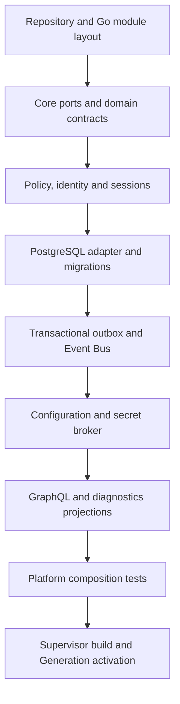

<!--
File: docs/roadmaps/mrm-001-mosaic-platform-foundation/05-platform-implementation-plan.md
Document: MRM-001
Status: Draft
-->

# Platform Implementation Plan

## Build target

The first build target is one statically linked Go Platform binary assembled by Supervisor. The Platform core is a hexagonal application: it owns ports and policy; Modules implement adapters. PostgreSQL is the first mandatory built-in storage adapter, not a user-selected optional Module.

Authoritative boundaries are defined by [MAC-001 — Platform Architecture](../../engineering/architecture/mac-001-platform-architecture/index.md), [MEG-007 — Storage Architecture](../../engineering/guides/meg-007-storage-architecture/index.md), [MEG-002 — Event-Driven Runtime](../../engineering/guides/meg-002-event-driven-runtime/index.md) and [MEG-005 — Runtime Architecture](../../engineering/guides/meg-005-runtime-architecture/index.md). The implementation-grade build path is defined by [MEG-015 — Platform Foundation Implementation](../../engineering/guides/meg-015-platform-foundation-implementation/index.md).

## Implementation sequence



Each step must have contract tests before the next dependent adapter is accepted. The core must compile and test without PostgreSQL; adapter integration tests then prove the port against a real PostgreSQL instance.

## Required packages

The initial repository should separate public contracts from implementations:

```text
platform/
  core/          domain services, ports, policy and lifecycle
  application/   use cases and transaction boundaries
  adapters/      postgres, filesystem, crypto and runtime adapters
  transport/     GraphQL and subscription projection
  diagnostics/   health, logs and support bundle redaction
  composition/   built-in Module registration and validation
```

Package names are an implementation starting point, not a public API promise. Private packages must not leak into Module contracts.

## Platform definition of done

- core ports are documented and covered by contract tests;
- PostgreSQL implements storage, migration and outbox contracts;
- policy is enforced at application boundaries;
- configuration activation is versioned and recoverable;
- GraphQL is a projection, not a storage path;
- component health and redacted diagnostics are available; and
- Supervisor can build, activate, health-check and roll back a Generation.
