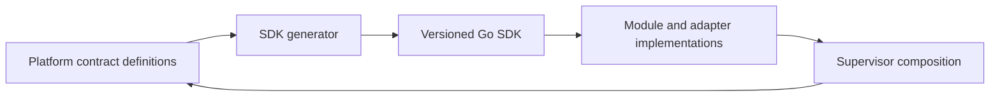

<!--
File: docs/roadmaps/mrm-001-mosaic-platform-foundation/06-sdk-implementation-plan.md
Document: MRM-001
Chapter: 06
Title: SDK Implementation Plan
Status: Draft
Version: 0.1
-->

# SDK Implementation Plan

## SDK role

The SDK is the supported authoring surface for Modules and infrastructure adapters. It bridges Platform ports to implementers without exposing private Platform packages. It provides interfaces, lifecycle hooks, capability context, permissions, events, storage abstractions, configuration declarations and test seams.

## Generated-first strategy

The SDK SHOULD be generated from a versioned Platform contract package wherever practical. Platform-owned interfaces and schemas are the source of truth; a generator emits the public Go SDK, manifest types, capability identifiers, error categories and compatibility metadata. Generated output is committed or reproducibly published so Module builds do not require the full Platform repository.

Handwritten SDK code is limited to ergonomic helpers, adapters and test utilities. Generated and handwritten surfaces MUST be kept in separate packages.

## SDK implementation sequence

1. define a versioned contract package in Platform;
2. generate interfaces, identifiers and manifest schemas;
3. publish the SDK with compatibility checks and a small test harness;
4. implement the PostgreSQL adapter against the SDK contract;
5. implement Supervisor composition and a reference Module;
6. add compile-time and runtime contract tests; and
7. publish SDK documentation and examples from the same contract source.

If generation creates excessive coupling, the fallback is a separately versioned SDK repository whose contracts are checked against Platform in CI. The boundary remains the same; only ownership of generated artifacts changes.

## SDK definition of done

- an external developer can implement an adapter without Platform internals;
- SDK and Platform versions declare compatibility explicitly;
- contract tests run against built-in and optional Modules;
- permissions, configuration and lifecycle declarations are enforced; and
- generated changes are reviewable and reproducible.

