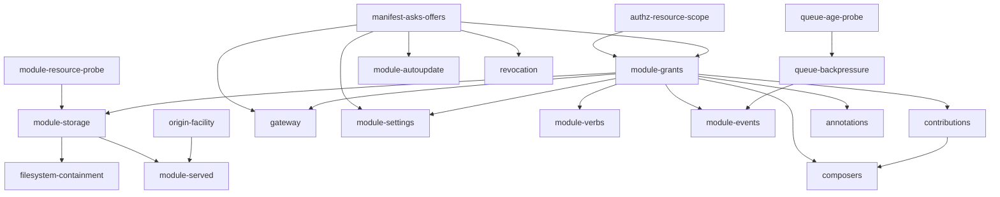
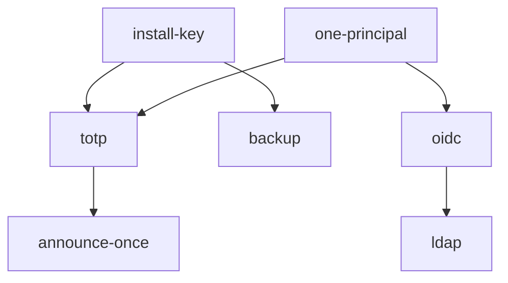

# The work graph

Every decision Mosaic needs is recorded. This page is the other half: what is
left to *build*, decomposed into units an agent can pick up, in the order their
dependencies allow.

## What this page carries, and what it must never carry

**Dependencies and acceptance criteria. Never status.**

[The roadmap](roadmap.md) is the single record of where the build has got to,
across every repository. If this page also tracked what was finished there would
be two answers to that question, and the corpus's most expensive recurring
failure is exactly that — one fact stated in two places, drifting. So a unit here
says what it depends on and what proves it done, and says nothing about whether
anybody has done it. To find out, read the roadmap.

That split is the reason this page exists at all rather than being folded into
one of the others. The roadmap is narrative and changes per slice; a work graph
is a lookup and changes per unit. Neither is a good shape for the other.

**Which agent holds which unit is not written down here either.** That is
operational state with a lifetime of hours, it belongs on the machine doing the
work, and it must not be committed — a claim file in this repository would be
stale within a day and wrong within a week.

## How to read a unit

Each names the decision records it implements, the repositories it touches, the
units that must land first, and — the part that matters most — **what proves it
done.** That is this repository's "demonstrated, not asserted" rule applied to a
unit of work: not "implement X", but the check that fails today and passes
afterwards. A unit whose acceptance criterion is a description rather than a
check is not ready to be picked up.

Read the decision records before starting. A unit is a pointer to them, not a
substitute — the record carries the reasoning, the alternatives that were
rejected, and the costs that were accepted deliberately.

## The shape

The identity chain is separate and shares nothing with the extension surface:

## Where to start

**Every unit above comes from an unbuilt decision record; four more do not, and
are further down.** A graph built only from records omits the
[owed capabilities](unreachable-capability.md) — code that works and nobody can
reach — and M6's acceptance script, which has no record because it is not a
decision. Read to the end before planning.

`authz-resource-scope` and `manifest-asks-offers` have no dependencies, block
almost everything else, and are independent of each other — so they are the two
units that can start at once. `queue-age-probe`, `module-resource-probe` and
`origin-facility` are also unblocked and are small; they are good first units for
an agent that has not worked in this codebase before, because each is a
self-contained measurement or refactor with a sharp acceptance criterion.

**Two units are prerequisites rather than features**, and are easy to skip past
to the decision that wanted them. `queue-age-probe` and `module-resource-probe`
each exist because a record rests on a measurement nothing currently takes. A
decision whose trigger nobody can observe is not implementable as written,
however well decided.

## The units

### `authz-resource-scope` — Authorization takes a resource, everywhere

**Records** [platform#84](https://github.com/mosaic-media/platform/blob/main/docs/adr/0084-authorization-is-scoped-to-the-resource.md) &middot; **Repositories** platform &middot; **Depends on** *none*

**Proves it done:** The boundary conformance suite grows a resource dimension and every caller-bearing method is exercised against it.

The largest and riskiest unit in the graph, and first because everything about module authority is scoped to a resource. Every existing call site gains a resource it was never checked for.

### `manifest-asks-offers` — The manifest separates asks from offers

**Records** [platform#97](https://github.com/mosaic-media/platform/blob/main/docs/adr/0097-a-manifest-names-one-capability-and-separates-asks-from-offers.md) &middot; **Repositories** sdk, platform &middot; **Depends on** *none*

**Proves it done:** `ParseManifest` refuses an unknown *ask* naming the key, and accepts an unknown descriptive field. Both the installer and `modulesign` inherit it from the one function.

Independent of the authorization work and blocks more than it. Do not build a grant into the manifest before this lands or the manifest work is done twice.

### `queue-age-probe` — Measure how far behind a queue is

**Records** [platform#98](https://github.com/mosaic-media/platform/blob/main/docs/adr/0098-a-queue-that-is-behind-raises-an-issue.md) &middot; **Repositories** platform &middot; **Depends on** *none*

**Proves it done:** A test that fills a queue, stops the drain, and asserts the reported age grows.

A prerequisite rather than a feature. The decision it serves cannot be implemented as written until something takes this measurement.

### `module-resource-probe` — Observe per-module memory, CPU and disk

**Records** [platform#92](https://github.com/mosaic-media/platform/blob/main/docs/adr/0092-module-storage-is-granted-not-enforced.md) &middot; **Repositories** platform &middot; **Depends on** *none*

**Proves it done:** A test asserting a running module's usage is reported and attributed to it.

Same shape as the queue probe: a decision resting on a measurement nobody takes. Until it exists nothing may claim the Platform manages module resource use.

### `origin-facility` — One origin facility consumers declare against

**Records** [platform#90](https://github.com/mosaic-media/platform/blob/main/docs/adr/0090-one-origin-facility-consumers-declare-against.md) &middot; **Repositories** platform &middot; **Depends on** *none*

**Proves it done:** The existing artwork and playback origins are expressed through it with no behaviour change, proven by their current tests still passing.

A refactor before a feature. Doing it after the things that would use it means three origins to reconcile instead of one.

### `graph-ordering` — Renumber ordering in the transaction that exhausts it

**Records** [platform#102](https://github.com/mosaic-media/platform/blob/main/docs/adr/0102-two-orderings-and-a-confidence.md) &middot; **Repositories** platform &middot; **Depends on** *none*

**Proves it done:** A test that inserts repeatedly between one pair until the gap is exhausted, and asserts the ordering still totally orders. Plus a scheduled hygiene pass.

The transactional renumber is the guarantee; the nightly pass is hygiene. The code should say which is which so the wrong one is not deleted later.

### `precedence-order` — Operator-ordered precedence, exact dedup

**Records** [platform#101](https://github.com/mosaic-media/platform/blob/main/docs/adr/0101-precedence-is-ordered-by-the-operator-and-dedup-is-exact.md) &middot; **Repositories** platform &middot; **Depends on** *none*

**Proves it done:** A test with two providers answering one role, asserting order is honoured; and one asserting two Parts with the same content hash merge while two without do not.

Retires the composition root's fallback tier, which is the current unrecorded workaround.

### `module-output-telemetry` — A module's stderr reaches telemetry

**Records** [platform#103](https://github.com/mosaic-media/platform/blob/main/docs/adr/0103-module-output-is-telemetry-and-containment-stays-one-mechanism.md) &middot; **Repositories** platform &middot; **Depends on** *none*

**Proves it done:** A test that a module writing to stderr produces a telemetry record carrying its identity, classified as unclassified payload.

Small and independent. `plugincontainer` is the same record's other half and is a decision not to build anything.

### `module-grants` — A module's authority is declared and consented

**Records** [platform#85](https://github.com/mosaic-media/platform/blob/main/docs/adr/0085-a-modules-authority-is-declared-and-consented.md) &middot; **Repositories** platform &middot; **Depends on** `authz-resource-scope`, `manifest-asks-offers`

**Proves it done:** A module declaring a grant it was not consented to is refused; `policy.Subject` carries the module the same way it carries `System`.

The gate for the rest of the extension surface. Verbs, storage, gateways and composers each need authority a user does not have.

### `queue-backpressure` — A queue that is behind raises an Issue

**Records** [platform#98](https://github.com/mosaic-media/platform/blob/main/docs/adr/0098-a-queue-that-is-behind-raises-an-issue.md) &middot; **Repositories** platform &middot; **Depends on** `queue-age-probe`

**Proves it done:** A test that a queue past the age threshold raises the Issue once, with `FirstSeen` preserved across re-raises, and that nothing refuses an enqueue.

Also fixes the module event batch at fifty and one second, which are the outbox's existing numbers rather than a second pair.

### `module-autoupdate` — A module updates itself until it asks for more

**Records** [platform#100](https://github.com/mosaic-media/platform/blob/main/docs/adr/0100-a-module-updates-itself-until-it-asks-for-more.md) &middot; **Repositories** platform &middot; **Depends on** `manifest-asks-offers`

**Proves it done:** Tests for all four cases: minor with unchanged asks auto-applies; minor with grown asks raises an Issue; major raises an Issue; reduced asks auto-apply.

The reduced-asks case is the one most likely to be got wrong — a version asking for less must not be blocked.

### `selection-in-generation` — A Generation carries its selection

**Records** [supervisor#14](https://github.com/mosaic-media/supervisor/blob/main/docs/adr/0014-a-generation-carries-its-selection.md) &middot; **Repositories** supervisor, platform &middot; **Depends on** *none*

**Proves it done:** Activating a Generation with a different selection changes which core modules are wired in, and rolling back restores the previous selection with the previous binaries.

The Platform keeps reading a selection from its environment; what changes is that the Supervisor writes it.

### `version-panel` — Activate is the only verb

**Records** [supervisor#15](https://github.com/mosaic-media/supervisor/blob/main/docs/adr/0015-activate-is-the-only-verb.md) &middot; **Repositories** supervisor, platform &middot; **Depends on** `selection-in-generation`

**Proves it done:** A test that activating a named older version succeeds through the same request path, and that an impossible selection is refused in the panel rather than at boot.

Shares one panel and one request path with the unit above. Build them together; separately means building the path twice.

### `module-storage` — Module storage is granted and quota-bounded

**Records** [platform#92](https://github.com/mosaic-media/platform/blob/main/docs/adr/0092-module-storage-is-granted-not-enforced.md) &middot; **Repositories** platform &middot; **Depends on** `module-grants`, `module-resource-probe`

**Proves it done:** A module exceeding its consented quota is refused the write, and uninstalling reclaims what it wrote.

The backup argument in the record is not cashable while the restore path is unwritten — do not claim it.

### `filesystem-containment` — Containment where the OS allows, reported where it does not

**Records** [platform#93](https://github.com/mosaic-media/platform/blob/main/docs/adr/0093-filesystem-containment-is-applied-where-the-os-allows.md) &middot; **Repositories** platform &middot; **Depends on** `module-storage`

**Proves it done:** On Linux, a module reaching outside its grant is refused by Landlock. On macOS and Windows the reported posture says enforcement is absent.

The posture must report honestly rather than claiming enforcement it does not have.

### `module-verbs` — A verb is declared and dispatched by name

**Records** [platform#86](https://github.com/mosaic-media/platform/blob/main/docs/adr/0086-a-module-verb-is-declared-and-dispatched-by-name.md) &middot; **Repositories** platform &middot; **Depends on** `module-grants`

**Proves it done:** An undeclared verb is refused by name; a declared verb's input is validated before the module is invoked.

### `module-events` — A module is called for events, in batches

**Records** [platform#87](https://github.com/mosaic-media/platform/blob/main/docs/adr/0087-module-lifecycle-events-progress-and-schedules.md) &middot; **Repositories** platform, sdk &middot; **Depends on** `module-grants`, `queue-backpressure`

**Proves it done:** A subscribing module receives a bounded batch per invocation, ordered within the subscriber, at-least-once — proven across a real process boundary.

Rides the outbox, so it inherits the batch numbers fixed by the backpressure unit.

### `module-settings` — Settings are written by merge, secrets sealed

**Records** [platform#96](https://github.com/mosaic-media/platform/blob/main/docs/adr/0096-module-settings-are-merged-and-secret-fields-are-sealed.md) &middot; **Repositories** platform, sdk &middot; **Depends on** `module-grants`, `manifest-asks-offers`

**Proves it done:** A control changing one field does not echo any other field to the client, and a declared secret never appears in an action payload.

Breaking: replaces the whole-document write, so the SDK, the Platform and every module release move together.

### `contributions` — A contribution composes from published definitions

**Records** [platform#88](https://github.com/mosaic-media/platform/blob/main/docs/adr/0088-a-contribution-composes-from-published-definitions.md) &middot; **Repositories** platform, contracts &middot; **Depends on** `module-grants`

**Proves it done:** A module contributing to a slot renders through published definitions only; a module cannot draw chrome.

### `annotations` — Annotations are facts and documents, operator-ordered

**Records** [platform#89](https://github.com/mosaic-media/platform/blob/main/docs/adr/0089-annotations-are-facts-and-documents-ordered-by-the-operator.md) &middot; **Repositories** platform &middot; **Depends on** `module-grants`

**Proves it done:** Two modules annotating the same node resolve by the operator's order, and a module-supplied rating never reaches an authorization decision.

The last clause is load-bearing: annotations inform, only Platform-validated fields decide.

### `module-served` — A module's bulk output served from the origin

**Records** [platform#91](https://github.com/mosaic-media/platform/blob/main/docs/adr/0091-module-served-resources.md) &middot; **Repositories** platform &middot; **Depends on** `origin-facility`, `module-storage`

**Proves it done:** Bytes a module produced are served through the Platform's origin, signed and relayed, with the module never speaking HTTP.

### `gateway` — A gateway is invoked from outside

**Records** [platform#94](https://github.com/mosaic-media/platform/blob/main/docs/adr/0094-a-gateway-is-invoked-from-outside-and-holds-no-authority.md) &middot; **Repositories** platform &middot; **Depends on** `module-grants`, `manifest-asks-offers`

**Proves it done:** A gateway declaring a path prefix is mounted there, a colliding prefix refuses the install, and a gateway holds no authority of its own.

The gateway converts a foreign client's authentication into something the Platform can act on, through a Platform-provided interface.

### `composers` — A composer supplies an expression; a provider attests

**Records** [platform#95](https://github.com/mosaic-media/platform/blob/main/docs/adr/0095-composers-supply-expressions-and-identity-providers-attest.md) &middot; **Repositories** platform, sdk &middot; **Depends on** `module-grants`, `contributions`

**Proves it done:** A composer's expression is evaluated by the Platform and the rows never reach module code; an identity assertion carries no authority.

Two modes for identity providers, fixed at establishment: during onboarding an assertion provisions, afterwards an operator links by hand.

### `revocation` — Revocation is a signed list, checked on a schedule

**Records** [platform#99](https://github.com/mosaic-media/platform/blob/main/docs/adr/0099-revocation-is-a-signed-list-checked-on-a-schedule.md) &middot; **Repositories** platform &middot; **Depends on** `manifest-asks-offers`

**Proves it done:** A revoked key stops a module and raises an Issue; a yanked version does not stop it; an older sequence number is refused; unreachable raises a staleness Issue rather than a verdict.

Needs the release-key verifier in the Platform, which it does not carry today.

### `install-key` — The install key

**Records** [platform#81](https://github.com/mosaic-media/platform/blob/main/docs/adr/0081-the-install-key.md) &middot; **Repositories** platform &middot; **Depends on** *none*

**Proves it done:** A key generated on first run, stored beside the instance, and read by the sealing envelope that already exists.

The first durable key in the repository. The telemetry salt is a second consumer already waiting on it.

### `one-principal` — One principal, many credentials

**Records** [platform#43](https://github.com/mosaic-media/platform/blob/main/docs/adr/0043-one-principal-many-credentials.md) &middot; **Repositories** platform &middot; **Depends on** *none*

**Proves it done:** Every credential kind resolves to one `Principal` through a single constructor.

### `totp` — TOTP as the second factor

**Records** [platform#79](https://github.com/mosaic-media/platform/blob/main/docs/adr/0079-totp-is-the-second-factor-that-works-everywhere.md) &middot; **Repositories** platform &middot; **Depends on** `install-key`, `one-principal`

**Proves it done:** An enrolled user's password path becomes two-step; a recovery factor is single-use and consumed.

The secret is encrypted rather than hashed, which is why the install key gates it. **[platform#105](https://github.com/mosaic-media/platform/blob/main/docs/adr/0105-authentication-is-delegated-and-the-floor-is-password-and-totp.md) promoted this unit**: it is now the only second factor Mosaic offers on its own, so `install-key` gates the only MFA in the product rather than being first in a chain.

### `oidc` — Authentication delegated to an identity provider

**Records** [platform#105](https://github.com/mosaic-media/platform/blob/main/docs/adr/0105-authentication-is-delegated-and-the-floor-is-password-and-totp.md) &middot; **Repositories** platform, web &middot; **Depends on** `one-principal`

**Proves it done:** an assertion from a configured provider signs a user in, under
both of [platform#95](https://github.com/mosaic-media/platform/blob/main/docs/adr/0095-composers-supply-expressions-and-identity-providers-attest.md)'s modes — provisioning during onboarding, linking to an existing
account afterwards — and the module never issues a session.

Native rather than a module, because the login path must work when things are
broken and a module can be absent. What Mosaic gains transitively is the point: the
provider brings its own passkeys, MFA and lockout policy.

**This unit also removes what the reversed decision left behind.**
`domain.PasskeyCredential` and its two store methods are the whole of what was
ever built for passkeys, and they are dead once this lands — `architecture.md`
lists that type today because it is genuinely there, and the page follows the
source rather than leading it.

### `ldap` — Accounts and groups from a directory

**Records** [platform#106](https://github.com/mosaic-media/platform/blob/main/docs/adr/0106-ldap-is-a-directory-integration-not-an-authentication-one.md) &middot; **Repositories** platform &middot; **Depends on** `oidc`

**Proves it done:** a directory entry links to a Mosaic account through
[platform#95](https://github.com/mosaic-media/platform/blob/main/docs/adr/0095-composers-supply-expressions-and-identity-providers-attest.md)'s linking mode, and the interface states that a bind is not a second
factor.

Depends on `oidc` for sequencing rather than for code — the linking surface is
built once and both use it. **It strengthens no authentication**, which its record
exists to keep findable.

### `announce-once` — An optional capability is announced once

**Records** [platform#80](https://github.com/mosaic-media/platform/blob/main/docs/adr/0080-an-optional-capability-is-announced-once-when-it-becomes-possible.md) &middot; **Repositories** platform, web &middot; **Depends on** `totp`

**Proves it done:** The announcement appears once when the capability becomes possible and never again.

Its subject list shrank to one when [platform#105](https://github.com/mosaic-media/platform/blob/main/docs/adr/0105-authentication-is-delegated-and-the-floor-is-password-and-totp.md) dropped passkeys. Its record also carries a same-day correction: the modal it rejected is expressible after all, so the banner stands on the interruption argument alone and is worth revisiting on those terms.

### `backup` — The Supervisor takes the backup

**Records** [supervisor#13](https://github.com/mosaic-media/supervisor/blob/main/docs/adr/0013-the-supervisor-takes-the-backup.md) &middot; **Repositories** supervisor, platform &middot; **Depends on** `install-key`

**Proves it done:** A backup taken by the Supervisor restores to a working install, with the Platform contributing its half.

Several records lean on a restore path existing. Until this lands, do not claim any of them.

## Units the records do not produce

Every unit above comes from an unbuilt decision record. Three pieces of work do
not, and are here because a graph built only from records would silently omit
them.

**Four of them are [owed capabilities](unreachable-capability.md)** — code that
works, is tested, and that nobody can reach. That document is the register; these
are the entries that are a client path rather than something else.

### `artwork-picker` — a screen for the candidates already stored

**Records** [platform#47](https://github.com/mosaic-media/platform/blob/main/docs/adr/0047-artwork-is-a-candidate-set.md) &middot; **Repositories** platform, web &middot; **Depends on** *none*

**Proves it done:** a detail screen renders the poster, logo and backdrop
alternatives a source offered, and choosing one persists through
`SetContentArtwork`.

The command is implemented, validated, authorised and transactional, and the
artwork enrichment pass already calls it — so the server half is exercised. What
nobody can press is the half it was designed for: candidates are stored
*specifically* so a user can choose among them.

### `library-rule-saved-search` — the rule kind the settings surface cannot create

**Records** [platform#60](https://github.com/mosaic-media/platform/blob/main/docs/adr/0060-the-library-is-built-from-rules.md) &middot; **Repositories** platform &middot; **Depends on** *none*

**Proves it done:** a saved provider search can be created as a library rule from
the settings surface, and the maintenance pass evaluates it.

`domain.LibraryRuleQuery` is validated by `CreateLibraryRule`, evaluated by
`evaluateQueryRule` and run by the maintenance pass. The settings surface creates
collection rules only.

### `audio-track-selection` — a screen for an override the player already accepts

**Records** [platform#29](https://github.com/mosaic-media/platform/blob/main/docs/adr/0029-probing-and-the-per-stream-playback-decision.md) &middot; **Repositories** platform, web &middot; **Depends on** *none*

**Proves it done:** the player offers the item's audio tracks and the choice
reaches `playEnvelope.AudioIndex`.

A client that sends the index today gets it. No screen offers the tracks.

### `acceptance-script` — M6, and it is a document

**Records** *none* &middot; **Repositories** architecture &middot; **Depends on** everything it exercises

**Proves it done:** the script exists and has been run start to finish on a clean
box — install, claim, three accounts, library from rules, each account watches and
resumes on a second device and browses by genre and by service, upgrade in place,
restore from backup.

This is the release-candidate gate and it has no record because it is not a
decision. **Nothing is ticked off from a passing test**, which is the whole point
of it: it is the one check in the project that a green gate cannot substitute for.

## What is not a unit, and must not become one

**The release key does not exist, and no agent can create it.** [platform#76](https://github.com/mosaic-media/platform/blob/main/docs/adr/0076-the-signing-key-hierarchy.md) settles
the hierarchy and says so plainly. Generating it, holding it offline, and putting
it where CI can reach it is a custody act by a person. Until it happens,
artefact signing ([platform#38](https://github.com/mosaic-media/platform/blob/main/docs/adr/0038-platform-binary-built-by-ci.md)) and revocation ([platform#99](https://github.com/mosaic-media/platform/blob/main/docs/adr/0099-revocation-is-a-signed-list-checked-on-a-schedule.md)) cannot be finished — the
decisions are complete and the work is blocked on something that is not code.

**Three things need somebody to watch a screen.** The subtitles provider role and
the segmented playback origin are written on both sides and have never been
exercised by a human; M3's fourth slice is written and has never been played. None of these is
implementable work. Each is a question a person answers by looking, and the first
finding in the roadmap is that a screen which has not been rendered has not been
verified.

**Grouping the library by streaming service has no client path deliberately.** It
is in the owed register as a decision already taken, not as work waiting.

## Units that are decisions not to build

Three records are settled and produce no work, recorded here so nobody schedules
them: a person stays an attribute rather than becoming a node kind; `plugincontainer`
stays something an operator assembles rather than a supported deployment; and the
MPL-2.0 reading changes no code. Their records say why, and each says what would
reopen it.
