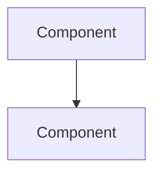

<!--
File: docs/engineering/architecture/mac-nnn-subject-slug/03-architectural-model.md
Document: MAC-NNN
Status: Draft
-->

<!--
Guidance
- The model is the structural heart of a MAC. Use Mermaid for every relationship, hierarchy,
  dependency and flow. Never ASCII arrows.
- Keep the model implementation independent. Naming a language, library or product here is usually
  a sign the material belongs in an MEG.
-->

# 03 — Architectural Model

---

# Model

Explain what the model establishes.

---

# Elements

| Element | Responsibility |
|---------|----------------|
| element | what it owns |
