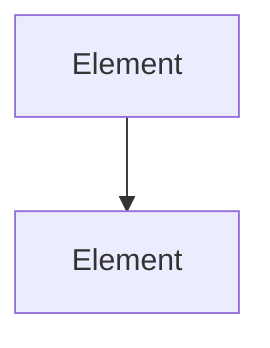

<!--
File: docs/engineering/architecture/mac-nnn-subject-slug/05-relationships.md
Document: MAC-NNN
Status: Draft
-->

<!--
Guidance
- Relationships describe how the elements of this architecture depend upon one another, and how this
  specification relates to the rest of the Canon.
- Dependency direction is always downward: higher-level documents define principles, lower-level
  documents realise them. Record any exception explicitly.
-->

# 05 — Relationships

---

# Internal Relationships

---

# Relationship To Other Specifications

| Specification | Relationship |
|---------------|--------------|
| ID — Canonical Title | how the two relate |
