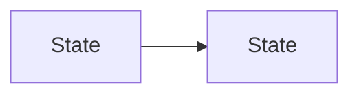

<!--
File: docs/design/language/mdl-nnn-subject-slug/03-experience-model.md
Document: MDL-NNN
Status: Draft
-->

<!--
Guidance
- The experience model describes how the design behaves over time: states, transitions and
  continuity.
- Use Mermaid for state and transition. Never ASCII arrows.
-->

# 03 — Experience Model

---

# Model

Explain what the model establishes.

---

# Behaviour

| Situation | Expected Behaviour |
|-----------|--------------------|
| situation | how the experience should respond |
