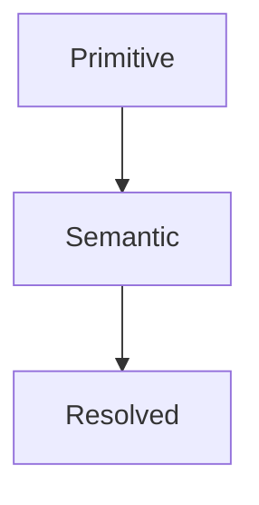

<!--
File: docs/design/system/mds-nnn-subject-slug/02-asset-model.md
Document: MDS-NNN
Status: Draft
-->

<!--
Guidance
- The asset model shows the hierarchy: what derives from what, and in which direction.
- Use Mermaid for hierarchy and derivation. Never ASCII arrows.
-->

# 02 — Asset Model

---

# Hierarchy

Explain what each level owns.

---

# Levels

| Level | Contains | Consumed By |
|-------|----------|-------------|
| level | what it holds | who uses it |
