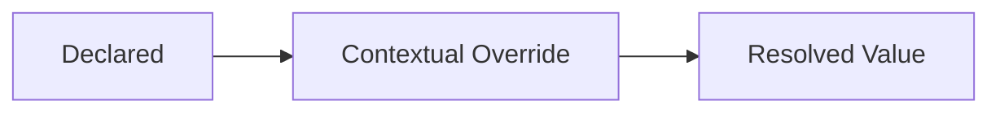

<!--
File: docs/design/system/mds-nnn-subject-slug/04-runtime-resolution.md
Document: MDS-NNN
Status: Draft
-->

<!--
Guidance
- Resolution describes how an abstract asset becomes a concrete value at runtime: inheritance,
  overrides, context and fallback.
- State the fallback behaviour explicitly. Unspecified fallback is where design systems fracture
  across platforms.
-->

# 04 — Runtime Resolution

---

# Resolution Order

---

# Fallback

What happens when an asset cannot be resolved.
