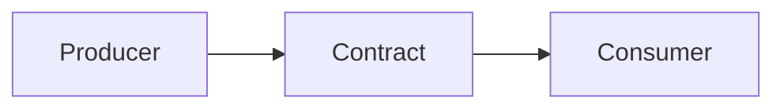

<!--
File: docs/engineering/protocols/mip-nnn-subject-protocol/01-protocol-model.md
Document: MIP-NNN
Status: Draft
-->

<!--
Guidance
- The model chapter establishes the vocabulary and the shape of the contract before any field-level
  detail. Every later chapter depends on the terms defined here.
- Use Mermaid for flow, ownership and lifecycle. Never ASCII arrows.
-->

# 01 — Protocol Model

---

# Definition

What the protocol governs, defined precisely.

---

# Ownership

<!-- Who owns which part of the contract. Ownership disputes are what protocols exist to prevent. -->

| Element | Owner |
|---------|-------|
| element | Platform, Module or SDK |

---

# Flow

