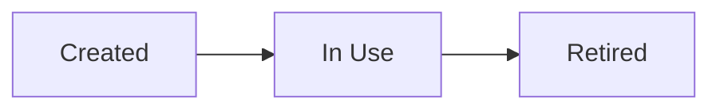

<!--
File: docs/engineering/protocols/mip-nnn-subject-protocol/03-protocol-semantics.md
Document: MIP-NNN
Status: Draft
-->

<!--
Guidance
- Semantics are the rules a structurally valid message must also obey: ordering, identity,
  uniqueness, naming, lifecycle.
- A contract that defines structure but not semantics will be implemented inconsistently.
-->

# 03 — Protocol Semantics

---

# Rules

- The semantic rules a conforming implementation must obey.

---

# Naming

<!-- If the contract carries names or identifiers, define the rule and who owns each namespace. -->

The naming rule, and namespace ownership.

---

# Lifecycle

<!-- How a contract instance comes into existence, changes state and ends. -->

