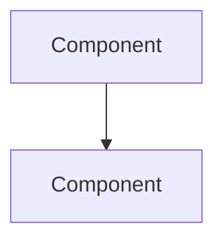

<!--
File: docs/engineering/operations/mop-nnn-subject-operations/01-operational-model.md
Document: MOP-NNN
Status: Draft
-->

<!--
Guidance
- The operational model is the mental picture an operator needs before running any procedure:
  what the components are, what healthy looks like and what the failure modes are.
- Use Mermaid for topology and state. Never ASCII arrows.
-->

# 01 — Operational Model

---

# What Is Being Operated

The components in scope, and how they relate.

---

# Healthy State

What normal looks like, in observable terms.

---

# Failure Modes

| Failure | Symptom | First Response |
|---------|---------|----------------|
| failure | what an operator sees | what to do first |
