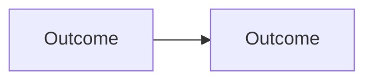

<!--
File: docs/roadmaps/mrm-nnn-subject-slug/04-dependency-sequence.md
Document: MRM-NNN
Status: Draft
-->

<!--
Guidance
- Show the sequence as a graph. Use Mermaid, never ASCII arrows.
- Record external dependencies too. A dependency nobody owns is the usual cause of a missed horizon.
-->

# 04 — Dependency Sequence

---

# Sequence

---

# External Dependencies

| Dependency | Owner | Needed By |
|------------|-------|-----------|
| what is depended upon | who owns it | which horizon |
